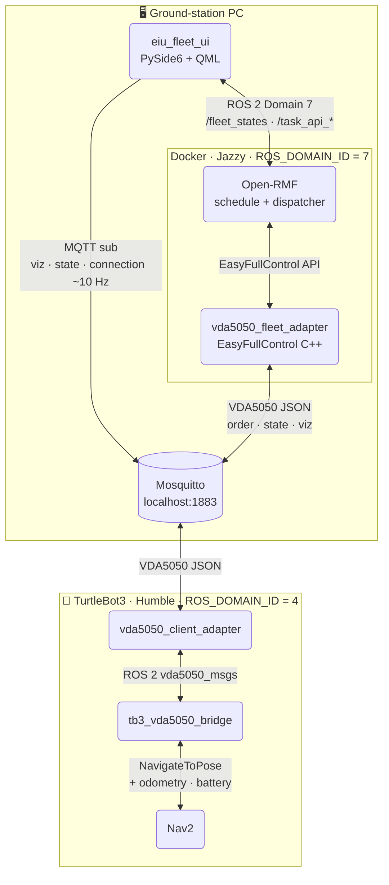
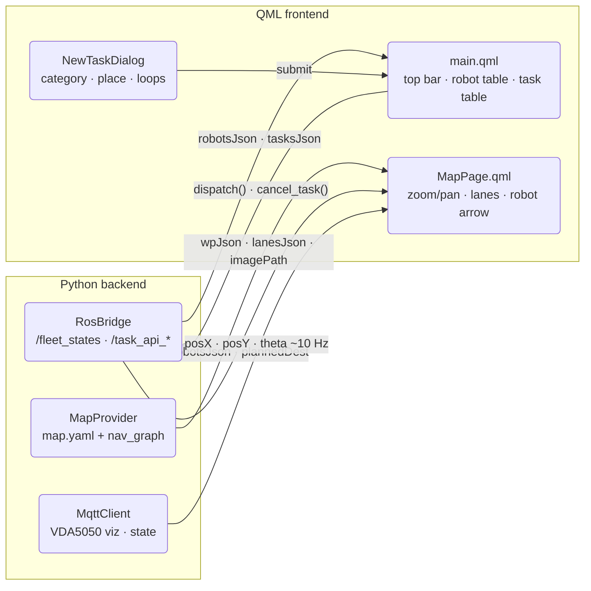

# EIU VDA5050 Open-RMF Integration

A ROS 2 Jazzy implementation of the VDA5050 v2.1.0 protocol connecting
**Open-RMF** (fleet management) to a **TurtleBot3 / Nav2** robot stack via MQTT.

## Demo


▶️ [Watch the full demo on YouTube](https://www.youtube.com/watch?v=yxOD5KHLECk)

## Overview

The repository contains three layers:

- **Dashboard UI** — PySide6 + QML desktop app for monitoring robots and dispatching tasks.
- **Fleet adapter** — Open-RMF EasyFullControl adapter that issues VDA5050 orders.
- **Robot side** — VDA5050 client adapter and TurtleBot3 bridge that execute those orders via Nav2.

The fleet adapter and dashboard run on the ground-station PC (Jazzy Docker, domain 7). The robot side runs on the physical TurtleBot3 (Humble, domain 4). All PC ↔ robot communication goes over MQTT.

## Packages

| Package | Layer | Description |
|---------|-------|-------------|
| `eiu_fleet_ui` | Dashboard | PySide6 + QML desktop app. Monitors robot status via `/fleet_states`, tracks tasks via `/task_api_responses`, dispatches and cancels tasks via `/task_api_requests`. Renders SLAM map + nav-graph with realtime robot arrow from MQTT (~10 Hz). |
| `vda5050_fleet_adapter` | Fleet adapter | Open-RMF EasyFullControl C++ adapter. Registers robots with RMF, converts RMF navigation goals into VDA5050 orders, publishes them over MQTT, and feeds VDA5050 state back into RMF. |
| `vda5050_client_adapter` | Robot | Receives VDA5050 MQTT orders, exposes them as ROS 2 `vda5050_msgs` topics, and publishes robot state / connection back to MQTT. |
| `tb3_vda5050_bridge` | Robot | Converts `vda5050_client_adapter` order topics into Nav2 `NavigateToPose` goals, and feeds odometry, battery, and navigation progress back to the client adapter. |
| `vda5050_msgs` | Shared | ROS 2 message definitions shared between `vda5050_client_adapter` and robot-side bridge nodes. |

## Repository layout

```
ros2_ws/src/
  eiu_fleet_ui/              # Dashboard UI (PySide6 + QML)
  vda5050_fleet_adapter/     # Fleet adapter (Jazzy Docker)
  vda5050_client_adapter/    # Robot side (Humble Docker)
  tb3_vda5050_bridge/        # Robot side — Nav2 bridge
  vda5050_msgs/              # Shared VDA5050 ROS 2 message interfaces
```

## Architecture

### System overview



### Dashboard UI — eiu_fleet_ui



The robot side exposes two interfaces:

| Interface | Protocol | Direction | Description |
|-----------|----------|-----------|-------------|
| **Northbound** | MQTT — VDA5050 v2.1.0 | Fleet adapter ↔ `vda5050_client_adapter` | order, instantActions, state, visualization, connection, factsheet |
| **Southbound** | ROS 2 topics (`vda5050_msgs`) | `vda5050_client_adapter` ↔ bridge/driver | order dispatch, action feedback, AGV position, battery, node/edge progress |

If an external VDA5050 master control system is used instead of Open-RMF, it can
publish orders directly to the MQTT broker and the robot-side stack consumes them
unchanged.

## MQTT topics (VDA5050 v2.1.0)

Topic pattern: `{interface_name}/v2/{manufacturer}/{serial_number}/{topic}`

| Topic | Direction | Description |
|-------|-----------|-------------|
| `.../order` | MC → Robot | Navigation order |
| `.../instantActions` | MC → Robot | Instant commands (pause, cancel…) |
| `.../state` | Robot → MC | Full robot state (every 30 s) |
| `.../visualization` | Robot → MC | Real-time position (every 1 s) |
| `.../connection` | Robot → MC | Online / Offline (LWT) |
| `.../factsheet` | Robot → MC | Robot specifications |

## Setup

### Clone

```bash
mkdir -p ~/ros2_ws/src && cd ~/ros2_ws/src
git clone https://github.com/NhatTran-97/eiu-vda5050-support-open-rmf.git .
```

### Fleet adapter (ground-station PC)

```bash
# Build image (once) and open an interactive shell:
cd ~/ros2_ws
src/vda5050_fleet_adapter/docker/run.sh

# Inside the container — build and run:
colcon build --packages-select vda5050_fleet_adapter
source install/setup.bash
ros2 run rmf_traffic_ros2 rmf_traffic_schedule &
ros2 run rmf_task_ros2 rmf_task_dispatcher &
ros2 launch vda5050_fleet_adapter fleet_adapter.launch.py

# Dispatch a patrol task (same container):
python3 src/vda5050_fleet_adapter/scripts/dispatch_patrol.py wp6
```

### Robot side (TurtleBot3)

```bash
# Build and start client adapter + broker via Docker Compose:
cd ~/ros2_ws/src/vda5050_client_adapter
docker compose up -d --build

# Build and run TurtleBot3 bridge:
cd ~/ros2_ws
colcon build --packages-select vda5050_msgs tb3_vda5050_bridge
source install/setup.bash
ros2 launch tb3_vda5050_bridge bridge.launch.py
```

## Configuration

Fleet adapter: [`vda5050_fleet_adapter/config/config.yaml`](vda5050_fleet_adapter/config/config.yaml)

Client adapter: [`vda5050_client_adapter/config/vda5050_params.yaml`](vda5050_client_adapter/config/vda5050_params.yaml)

```yaml
mqtt:
  broker_url: "tcp://localhost:1883"

vda5050:
  interface_name: "TB3"
  manufacturer:   "ROBOTIS"
  serial_number:  "0001"
```

The `interface_name`, `manufacturer`, and `serial_number` must match on both
sides so both ends share the same MQTT topics.

## Documentation

- [EIU Fleet UI](eiu_fleet_ui/README.md)
- [VDA5050 Fleet Adapter](vda5050_fleet_adapter/README.md)
- [VDA5050 Client Adapter Architecture](vda5050_client_adapter/docs/architecture.md)
- [TB3 VDA5050 Bridge Architecture](tb3_vda5050_bridge/docs/architecture.md)
- [MQTT Test Guide](vda5050_client_adapter/docs/mqtt_test_guide.md)
