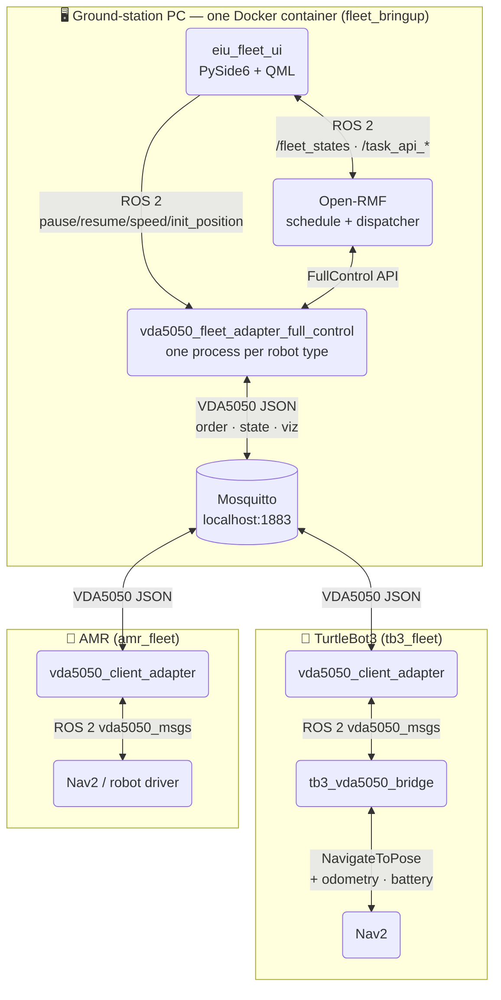

# EIU VDA5050 Open-RMF Integration

A ROS 2 Jazzy implementation of the VDA5050 v2.1.0 protocol connecting
**Open-RMF** (fleet management) to a heterogeneous robot fleet — a
**TurtleBot3** line and a custom **AMR** line — via MQTT. Open-RMF core,
the fleet adapter, and the operator dashboard all run together in one
Docker container (`fleet_bringup`); each robot runs its own client
adapter + Nav2 stack and talks to that container over MQTT.

## Robots

### AMR (EIU-FABLAB)

**Hardware**

<p align="center">
  
</p>

**Software — Nav2 navigation stack**

<p align="center">
  
</p>

| Property | Value |
|---|---|
| Manufacturer | `EIU-FABLAB` |
| Kinematics | Differential drive |
| Footprint | 0.6 m × 0.4 m (rectangular body) |
| Max linear / angular speed | 0.30 m/s / 0.60 rad/s |
| Compute | SOM-RK3399 — 2× Cortex-A72 + 4× Cortex-A53 (hexa-core) |
| Perception | LR-1BS 2D LiDAR (270°) + Orbbec DaBai Pro 3D depth camera |
| Inertial | BNO055 9-axis IMU |
| Drive | Servo hub motors + SD-21007 servo driver, closed-loop |
| Networking | TL-SF1005 industrial Ethernet switch + industrial Wi-Fi (teleop/monitoring) |
| Power | Onboard battery, 29V/14A power distribution board |
| Navigation stack | Nav2: Theta* planner → Simple Smoother → MPPI controller, global/local costmap |
| RMF fleet | `amr_fleet` — [`config_amr.yaml`](vda5050_fleet_adapter_full_control/config/config_amr.yaml) |
| Robots in this repo's demos | 1 (`amr_1`) |

### TurtleBot3 Burger

<p align="center">
  
</p>

| Property | Value |
|---|---|
| Manufacturer | `ROBOTIS` |
| Kinematics | Differential drive |
| Dimensions | 138 mm × 178 mm × 192 mm (L×W×H) |
| Max linear speed | 0.22 m/s |
| Onboard compute | SOM-RK3399v2 |
| RMF fleet | `tb3_fleet` — [`config_tb3.yaml`](vda5050_fleet_adapter_full_control/config/config_tb3.yaml) |
| Robots in this repo's demos | 2 (`tb3_1`, `tb3_2`) |

## Demo

### All demo videos

> Click a thumbnail to watch on YouTube (GitHub doesn't allow embedded/playable
> video from external sites, only a static preview).

<table>
<tr>
<td colspan="2" align="center">

**Milestone 2 demos — pending review**

</td>
</tr>
<tr>
<td align="center" width="50%">

**`tb3_fleet`** — 1 × TurtleBot3 (real hardware)
Real-robot patrol/delivery over VDA5050

[](https://www.youtube.com/watch?v=yxOD5KHLECk)

</td>
<td align="center" width="50%">

**`tb3_fleet`** — 1 × TurtleBot3 (simulation)
Same integration in Gazebo

[](https://youtu.be/A1GAbyzlPng?si=dFzA2t3dVjSpfh_C)

</td>
</tr>
<tr>
<td colspan="2" align="center">

**Milestone 2 demos — updated after review round 1**
Improvements made in response to round 1 feedback — see the
[Reviewer recommendations](vda5050_fleet_adapter_full_control/README.md#reviewer-recommendations)
checklist for what was addressed.

</td>
</tr>
<tr>
<td align="center" width="50%">

**`amr_fleet`** — 1 × AMR
Single-robot demo on the AMR line

[](https://www.youtube.com/watch?v=6eLXi1PXubU&t=290s)

</td>
<td align="center" width="50%">

**`tb3_fleet`** — 2 × TurtleBot3
Multi-robot demo — two robots deconflicting via RMF

[](https://www.youtube.com/watch?v=UslfKM7a148)

</td>
</tr>
</table>

## Packages

| Package | Layer | Description |
|---------|-------|-------------|
| `eiu_fleet_ui` | Dashboard | PySide6 + QML desktop app. Monitors robot status, dispatches/cancels tasks, draws no-go zones, and gives direct per-robot control (pause/resume/speed/re-localize). Supports multiple fleet adapters at once. |
| `vda5050_fleet_adapter_full_control` | Fleet adapter | Open-RMF fleet adapter built on `RobotCommandHandle`/`FleetUpdateHandle` (full control, not EasyFullControl) — sends a planned multi-waypoint route as one VDA5050 order. Different robot types (TB3/AMR) run as separate config files and processes. |
| `fleet_bringup` | Ground-station bringup | One launch file for the whole ground-station side: `rmf_traffic_schedule`, `rmf_task_dispatcher`, the fleet adapter, mock dispenser/ingestor, and `eiu_fleet_ui` — all in one process group. |
| `vda5050_client_adapter` | Robot | Receives VDA5050 MQTT orders, exposes them as ROS 2 `vda5050_msgs` topics, and publishes robot state/connection back to MQTT. |
| `tb3_vda5050_bridge` | Robot | Converts `vda5050_client_adapter` order topics into Nav2 `NavigateToPose` goals for the TurtleBot3, and feeds odometry, battery, and navigation progress back. |
| `tb3_simulation` | Simulation | TurtleBot3 Gazebo (Harmonic) + Nav2 simulation, world generated from the traffic-editor `.building.yaml`. |
| `vda5050_msgs` | Shared | ROS 2 message definitions shared between the client adapter and robot-side bridge nodes. |

## Repository layout

```
ros2_ws/src/
  eiu_fleet_ui/                        # Dashboard UI (PySide6 + QML)
  vda5050_fleet_adapter_full_control/  # Fleet adapter (one process per robot type)
  fleet_bringup/                       # Ground-station bringup (single launch file)
  vda5050_client_adapter/              # Robot side — VDA5050 <-> ROS 2
  tb3_vda5050_bridge/                  # Robot side — Nav2 bridge (TurtleBot3)
  tb3_simulation/                      # TurtleBot3 Gazebo + Nav2 simulation
  vda5050_msgs/                        # Shared VDA5050 ROS 2 message interfaces
  assets/                              # Images/GIFs used by these READMEs
```

## Architecture

### System overview

Open-RMF core, the fleet adapter, and the dashboard all run in the same
Docker container and process group (`fleet_bringup`) — no cross-domain ROS 2
setup needed on the ground-station side. Only the MQTT broker crosses to
the robot side.


```mermaid
flowchart TB
    subgraph pc ["🖥️  Ground-station PC — one Docker container (fleet_bringup)"]
        ui("eiu_fleet_ui\nPySide6 + QML")
        rmf("Open-RMF\nschedule + dispatcher")
        fa("vda5050_fleet_adapter_full_control\none process per robot type")
        broker[("Mosquitto\nlocalhost:1883")]
    end

    subgraph robot_tb3 ["🤖  TurtleBot3 (tb3_fleet)"]
        ca1("vda5050_client_adapter")
        br1("tb3_vda5050_bridge")
        nav2a("Nav2")
    end

    subgraph robot_amr ["🤖  AMR (amr_fleet)"]
        ca2("vda5050_client_adapter")
        nav2b("Nav2 / robot driver")
    end

    ui   <-->|"ROS 2\n/fleet_states · /task_api_*"| rmf
    ui   -->|"ROS 2\npause/resume/speed/init_position"| fa
    rmf  <-->|"FullControl API"| fa
    fa   <-->|"VDA5050 JSON\norder · state · viz"| broker
    broker <-->|"VDA5050 JSON"| ca1
    broker <-->|"VDA5050 JSON"| ca2
    ca1  <-->|"ROS 2 vda5050_msgs"| br1
    br1  <-->|"NavigateToPose\n+ odometry · battery"| nav2a
    ca2  <-->|"ROS 2 vda5050_msgs"| nav2b
```

The robot side exposes two interfaces:

| Interface | Protocol | Direction | Description |
|-----------|----------|-----------|-------------|
| **Northbound** | MQTT — VDA5050 v2.1.0 | Fleet adapter ↔ `vda5050_client_adapter` | order, instantActions, state, visualization, connection, factsheet |
| **Southbound** | ROS 2 topics (`vda5050_msgs`) | `vda5050_client_adapter` ↔ bridge/driver | order dispatch, action feedback, AGV position, battery, node/edge progress |

If an external VDA5050 master control system is used instead of Open-RMF, it can
publish orders directly to the MQTT broker and the robot-side stack consumes them
unchanged.

## MQTT topics (VDA5050 v2.1.0)

Topic pattern: `{interface_name}/v2/{manufacturer}/{serial_number}/{topic}`

| Topic | Direction | Description |
|-------|-----------|-------------|
| `.../order` | MC → Robot | Navigation order |
| `.../instantActions` | MC → Robot | Instant commands (pause, cancel…) |
| `.../state` | Robot → MC | Full robot state (every 30 s, plus on movement) |
| `.../visualization` | Robot → MC | Real-time position (every 1 s) |
| `.../connection` | Robot → MC | Online / Offline (LWT) |
| `.../factsheet` | Robot → MC | Robot specifications |

## Setup

### Clone

```bash
mkdir -p ~/ros2_ws/src && cd ~/ros2_ws/src
git clone https://github.com/NhatTran-97/eiu-vda5050-support-open-rmf.git .
```

### Ground station (fleet adapter + RMF core + dashboard)

```bash
# Build image (once) and open an interactive shell:
cd ~/ros2_ws
src/vda5050_fleet_adapter_full_control/docker/run.sh

# Inside the container — build and run everything in one process group:
colcon build --packages-select fleet_bringup
source install/setup.bash
ros2 launch fleet_bringup fleet_bringup.launch.py

# Dispatch a patrol task (same container, another shell):
python3 src/vda5050_fleet_adapter_full_control/scripts/dispatch_patrol.py charger_1
```

`fleet_bringup` starts one `vda5050_fleet_adapter_full_control` process for
the TB3 fleet by default. Running a second robot type (e.g. the AMR) at the
same time means launching a second fleet adapter process against its own
config file — see [that package's README](vda5050_fleet_adapter_full_control/README.md#multiple-robot-types-heterogeneous-fleets).

### Robot side (TurtleBot3)

```bash
# Build and start client adapter + broker via Docker Compose:
cd ~/ros2_ws/src/vda5050_client_adapter
docker compose up -d --build

# Build and run TurtleBot3 bridge:
cd ~/ros2_ws
colcon build --packages-select vda5050_msgs tb3_vda5050_bridge
source install/setup.bash
ros2 launch tb3_vda5050_bridge bridge.launch.py
```

The AMR line runs its own client adapter + robot driver stack the same way,
against the `amr_fleet` identity — not included in this repo since it lives
on that robot's own workspace.

## Configuration

Fleet adapter (one file per robot type — see [Robots](#robots) above):

- [`vda5050_fleet_adapter_full_control/config/config_tb3.yaml`](vda5050_fleet_adapter_full_control/config/config_tb3.yaml)
- [`vda5050_fleet_adapter_full_control/config/config_amr.yaml`](vda5050_fleet_adapter_full_control/config/config_amr.yaml)

Client adapter (on the robot): [`vda5050_client_adapter/config/vda5050_params.yaml`](vda5050_client_adapter/config/vda5050_params.yaml)

```yaml
mqtt:
  broker_url: "tcp://localhost:1883"

vda5050:
  interface_name: "AMR"
  manufacturer:   "ROBOTIS"
  serial_number:  "0001"
```

The `interface_name`, `manufacturer`, and `serial_number` must match on both
sides (fleet adapter's `vda5050.robots.<name>` and the robot's own client
adapter) so both ends share the same MQTT topics. `mqtt.client_id` must be
unique per robot connected to the broker.

## Documentation

- [EIU Fleet UI](eiu_fleet_ui/README.md)
- [VDA5050 Fleet Adapter (Full Control)](vda5050_fleet_adapter_full_control/README.md) · [Architecture](vda5050_fleet_adapter_full_control/docs/architecture.md)
- [Fleet Bringup](fleet_bringup/README.md)
- [VDA5050 Client Adapter](vda5050_client_adapter/README.md) · [Architecture](vda5050_client_adapter/docs/architecture.md)
- [TB3 VDA5050 Bridge](tb3_vda5050_bridge/README.md) · [Architecture](tb3_vda5050_bridge/docs/architecture.md)
- [MQTT Test Guide](vda5050_client_adapter/docs/mqtt_test_guide.md)
