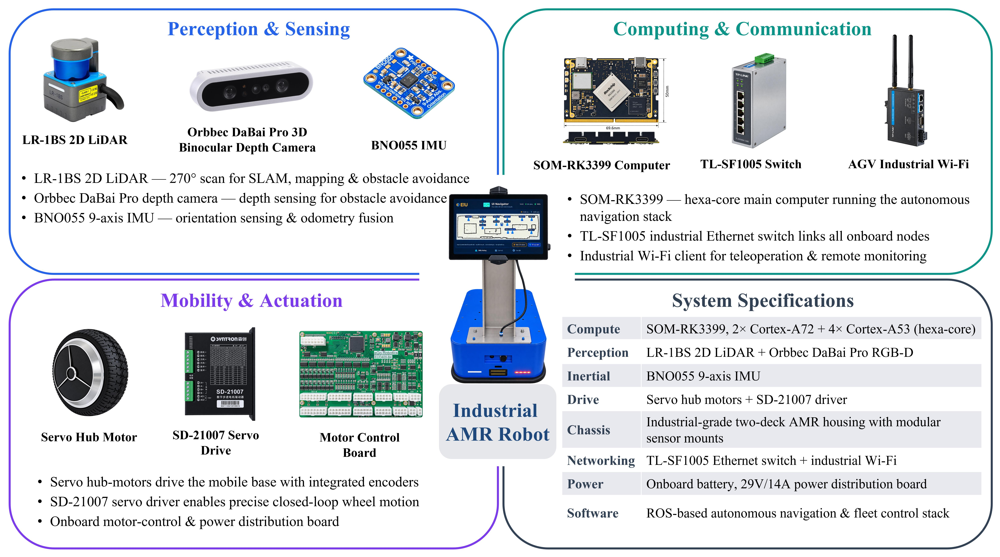
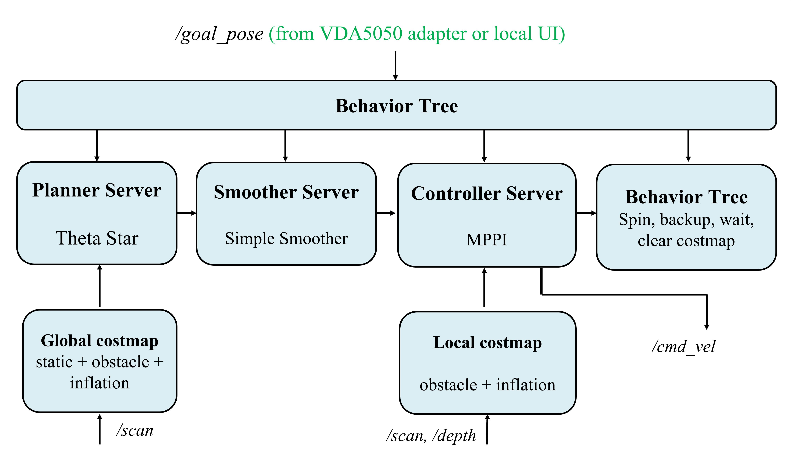
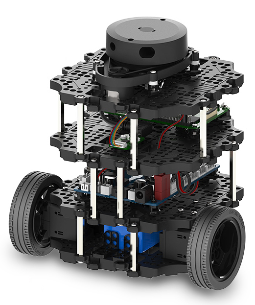
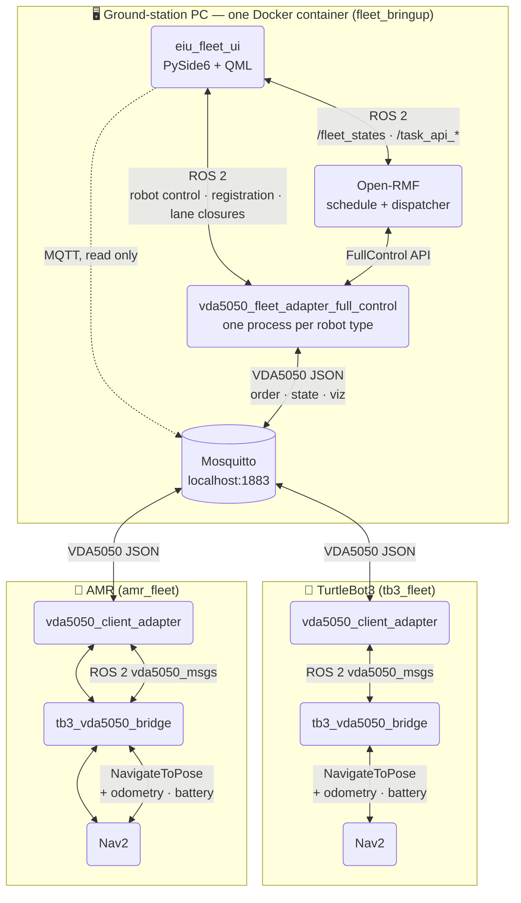

# EIU VDA5050 Open-RMF Integration

<div style="text-align: justify">

This is a ROS 2 Jazzy implementation of the VDA5050 v2.1.0 protocol. It connects **Open-RMF** to two robot lines, **TurtleBot3** and a custom **AMR**, over MQTT.
Open-RMF core, the fleet adapter and the operator dashboard run together in one Docker container (`fleet_bringup`) on the ground station.
Each robot runs its own client adapter and Nav2 stack, and connects to that container over MQTT.

</div>

## Robots

### AMR (EIU-FABLAB)

**Hardware**

<p align="center">
  
</p>

**Software — Nav2 navigation stack**

<p align="center">
  
</p>

<table width="100%" style="width:100%; table-layout:fixed">
<tr><th width="30%">Property</th><th>Value</th></tr>
<tr><td>Manufacturer</td><td><code>EIU-FABLAB</code></td></tr>
<tr><td>Kinematics</td><td>Differential drive</td></tr>
<tr><td>Footprint</td><td>0.6 m × 0.4 m (rectangular body)</td></tr>
<tr><td>Max linear / angular speed</td><td>0.30 m/s / 0.60 rad/s</td></tr>
<tr><td>Compute</td><td>SOM-RK3399 — 2× Cortex-A72 + 4× Cortex-A53 (hexa-core)</td></tr>
<tr><td>Perception</td><td>LR-1BS 2D LiDAR (270°) + Orbbec DaBai Pro 3D depth camera</td></tr>
<tr><td>Inertial</td><td>BNO055 9-axis IMU</td></tr>
<tr><td>Drive</td><td>Servo hub motors + SD-21007 servo driver, closed-loop</td></tr>
<tr><td>Networking</td><td>TL-SF1005 industrial Ethernet switch + industrial Wi-Fi (teleop/monitoring)</td></tr>
<tr><td>Power</td><td>Onboard battery, 29V/14A power distribution board</td></tr>
<tr><td>Navigation stack</td><td>Nav2: Theta* planner → Simple Smoother → MPPI controller, global/local costmap</td></tr>
<tr><td>RMF fleet</td><td><code>amr_fleet</code> — <a href="vda5050_fleet_adapter_full_control/config/config_amr.yaml"><code>config_amr.yaml</code></a></td></tr>
<tr><td>Robots in this repo's demos</td><td>1 (<code>amr_1</code>)</td></tr>
</table>

### TurtleBot3 Burger

<p align="center">
  
</p>

<table width="100%" style="width:100%; table-layout:fixed">
<tr><th width="30%">Property</th><th>Value</th></tr>
<tr><td>Manufacturer</td><td><code>ROBOTIS</code></td></tr>
<tr><td>Kinematics</td><td>Differential drive</td></tr>
<tr><td>Dimensions</td><td>138 mm × 178 mm × 192 mm (L×W×H)</td></tr>
<tr><td>Max linear speed</td><td>0.22 m/s</td></tr>
<tr><td>Onboard compute</td><td>SOM-RK3399v2</td></tr>
<tr><td>RMF fleet</td><td><code>tb3_fleet</code> — <a href="vda5050_fleet_adapter_full_control/config/config_tb3.yaml"><code>config_tb3.yaml</code></a></td></tr>
<tr><td>Robots in this repo's demos</td><td>2 (<code>tb3_1</code>, <code>tb3_2</code>)</td></tr>
</table>

## Demo

### All demo videos

> Click a thumbnail to watch on YouTube (GitHub doesn't allow embedded/playable
> video from external sites, only a static preview), or watch the
> [full playlist](https://www.youtube.com/playlist?list=PL7WgDt1mGvJZdPyar7xpHH4HDRZpteAp4)
> on YouTube.

<table>
<tr>
<td colspan="2" align="center">

**Milestone 2 demos — pending review**

</td>
</tr>
<tr>
<td align="center" width="50%">

**`tb3_fleet`** — 1 × TurtleBot3 (real hardware)
Real-robot patrol/delivery over VDA5050

[](https://www.youtube.com/watch?v=yxOD5KHLECk)

</td>
<td align="center" width="50%">

**`tb3_fleet`** — 1 × TurtleBot3 (simulation)
Same integration in Gazebo

[](https://youtu.be/A1GAbyzlPng?si=dFzA2t3dVjSpfh_C)

</td>
</tr>
<tr>
<td colspan="2" align="center">

**Milestone 2 demos — updated after review round 1**
Improvements made in response to round 1 feedback. The [Reviewer recommendations](vda5050_fleet_adapter_full_control/README.md#reviewer-recommendations) checklist lists what was addressed.

</td>
</tr>
<tr>
<td align="center" width="50%">

**`amr_fleet`** — 1 × AMR
Single-robot demo on the AMR line

[](https://www.youtube.com/watch?v=6eLXi1PXubU&t=290s)

</td>
<td align="center" width="50%">

**`tb3_fleet`** — 2 × TurtleBot3
Multi-robot demo — two robots deconflicting via RMF

[](https://www.youtube.com/watch?v=ODSLt2Ox0S8)

</td>
</tr>
<tr>
<td colspan="2" align="center">

**Milestone 2 demos — updated after review round 2**
Round 2 feedback addressed: factsheet request and gating, hard and soft order validation, and multi-node order stitching on replan. See the [Reviewer recommendations](vda5050_fleet_adapter_full_control/README.md#reviewer-recommendations) checklist for details. The dashboard now also shows the live VDA5050 order and traffic ([`eiu_fleet_ui`](eiu_fleet_ui/README.md#key-features)).

</td>
</tr>
<tr>
<td align="center" width="50%">

**3 robots — `amr_fleet` + `tb3_fleet`** (simulation)
Same multi-fleet demo in Gazebo

[](https://www.youtube.com/watch?v=vPeb_fctu0k)

</td>
<td align="center" width="50%">

**3 robots — `amr_fleet` + `tb3_fleet`**
Multi-robot fleet demo — both fleets running together

[](https://www.youtube.com/watch?v=w_28pgbwSe8)

</td>
</tr>
<tr>
<td colspan="2" align="center">

**Third-party VDA5050 client — 3 virtual AGVs**
Tests the fleet adapter against a client other than `vda5050_client_adapter`: 3 simulated AGVs built on [vda-5050-lib](https://github.com/coatyio/vda-5050-lib.js)

[](https://youtu.be/L0Zu4yaiQOU)

</td>
</tr>
</table>

## Packages

<table width="100%" style="width:100%; table-layout:fixed">
<tr><th width="22%">Package</th><th width="13%">Layer</th><th>Description</th></tr>
<tr><td><code>eiu_fleet_ui</code></td><td>Dashboard</td><td style="text-align: justify">A PySide6 and QML desktop app. It monitors robot status, dispatches and cancels tasks for a chosen robot or for RMF to assign, draws no-go zones, edits the nav graph, and gives direct per-robot control: pause, resume, speed limit and re-localize. It shows each robot's live VDA5050 order and message traffic, and each fleet adapter's health and metrics. It reports a new robot found on the broker, and registers or restores it into a fleet once the fleet adapter has checked it. It can follow several fleet adapters at once.</td></tr>
<tr><td><code>vda5050_fleet_adapter_full_control</code></td><td>Fleet adapter</td><td style="text-align: justify">Open-RMF fleet adapter built on <code>RobotCommandHandle</code> and <code>FleetUpdateHandle</code> (full control, not EasyFullControl). It sends a planned multi-waypoint route as one VDA5050 order. Each robot type, TB3 or AMR, runs as its own config file and process. A robot can be added to, removed from and restored to a running fleet, checked against the fleet's type, limits, nav graph and chargers, and saved for the next start.</td></tr>
<tr><td><code>vda5050_fleet_adapter</code></td><td>Fleet adapter</td><td style="text-align: justify">Open-RMF fleet adapter built on <code>EasyFullControl</code>, sending one VDA5050 order per destination. It handles the factsheet, commissioning, pause and resume, re-localizing and lane closures the same way as the full-control adapter, but without multi-node orders, horizon release or stitching. TB3 and AMR run as separate config files and processes.</td></tr>
<tr><td><code>fleet_bringup</code></td><td>Ground-station bringup</td><td style="text-align: justify">One launch file for the whole ground-station side. It starts <code>rmf_traffic_schedule</code>, <code>rmf_task_dispatcher</code>, the fleet adapter, the mock dispenser and ingestor, and <code>eiu_fleet_ui</code> in one process group.</td></tr>
<tr><td><code>vda5050_client_adapter</code></td><td>Robot</td><td style="text-align: justify">It receives VDA5050 orders over MQTT and exposes them as ROS 2 <code>vda5050_msgs</code> topics. It publishes the robot's state and connection status back to MQTT.</td></tr>
<tr><td><code>tb3_vda5050_bridge</code></td><td>Robot</td><td style="text-align: justify">It converts the order topics of <code>vda5050_client_adapter</code> into Nav2 <code>NavigateToPose</code> goals for the TurtleBot3. It reports odometry, battery and navigation progress back to the client adapter.</td></tr>
<tr><td><code>tb3_simulation</code></td><td>Simulation</td><td style="text-align: justify">It simulates the TurtleBot3 in Gazebo (Harmonic) with Nav2, in a world generated from the traffic editor's <code>.building.yaml</code>.</td></tr>
<tr><td><code>vda5050_msgs</code></td><td>Shared</td><td style="text-align: justify">It defines the ROS 2 messages shared between the client adapter and the robot-side bridge nodes.</td></tr>
</table>

## Repository layout

```
ros2_ws/src/
  eiu_fleet_ui/                        # Dashboard UI (PySide6 + QML)
  vda5050_fleet_adapter_full_control/  # Fleet adapter (one process per robot type)
  vda5050_fleet_adapter/              # Fleet adapter (EasyFullControl, one destination per order)
  fleet_bringup/                       # Ground-station bringup (single launch file)
  vda5050_client_adapter/              # Robot side — VDA5050 <-> ROS 2
  tb3_vda5050_bridge/                  # Robot side — Nav2 bridge (TurtleBot3)
  tb3_simulation/                      # TurtleBot3 Gazebo + Nav2 simulation
  vda5050_msgs/                        # Shared VDA5050 ROS 2 message interfaces
  assets/                              # Images/GIFs used by these READMEs
```

## Architecture

### System overview

The system has one ground station and one process per robot. The ground station runs Open-RMF core, the fleet adapter and the dashboard together in one Docker container and process group (`fleet_bringup`), so the ground-station side needs no cross-domain ROS 2 setup: everything on it shares one ROS domain. Each robot runs its own client adapter and navigation stack. Only the MQTT broker crosses over to the robot side.

<div align="center">


```mermaid
flowchart TB
    subgraph pc ["🖥️  Ground-station PC — one Docker container (fleet_bringup)"]
        ui("eiu_fleet_ui\nPySide6 + QML")
        rmf("Open-RMF\nschedule + dispatcher")
        fa("vda5050_fleet_adapter_full_control\none process per robot type")
        broker[("Mosquitto\nlocalhost:1883")]
    end

    subgraph robot_tb3 ["🤖  TurtleBot3 (tb3_fleet)"]
        ca1("vda5050_client_adapter")
        br1("tb3_vda5050_bridge")
        nav2a("Nav2")
    end

    subgraph robot_amr ["🤖  AMR (amr_fleet)"]
        ca2("vda5050_client_adapter")
        br2("tb3_vda5050_bridge")
        nav2b("Nav2")
        ca2 <--> br2
        br2 <--> nav2b
    end

    ui   <-->|"ROS 2\n/fleet_states · /task_api_*"| rmf
    ui   <-->|"ROS 2\nrobot control · registration · lane closures"| fa
    ui   -.->|"MQTT, read only"| broker
    rmf  <-->|"FullControl API"| fa
    fa   <-->|"VDA5050 JSON\norder · state · viz"| broker
    broker <-->|"VDA5050 JSON"| ca1
    broker <-->|"VDA5050 JSON"| ca2
    ca1  <-->|"ROS 2 vda5050_msgs"| br1
    br1  <-->|"NavigateToPose\n+ odometry · battery"| nav2a
    ca2  <-->|"ROS 2 vda5050_msgs"| br2
    br2  <-->|"NavigateToPose\n+ odometry · battery"| nav2b
```

</div>

This diagram shows the real-robot setup. To try the system without hardware, see [Gazebo simulation](vda5050_fleet_adapter_full_control/README.md#gazebo-simulation) or [Demo with virtual AGVs](vda5050_fleet_adapter_full_control/README.md#demo-with-virtual-agvs).

The robot side exposes two interfaces:

| Interface | Protocol | Direction | Description |
|:---:|:---:|:---:|---|
| **Northbound** | MQTT — VDA5050 v2.1.0 | Fleet adapter ↔ `vda5050_client_adapter` | order, instantActions, state, visualization, connection, factsheet |
| **Southbound** | ROS 2 topics (`vda5050_msgs`) | `vda5050_client_adapter` ↔ bridge/driver | order dispatch, action feedback, AGV position, battery, node/edge progress |

A VDA5050 master control other than Open-RMF can also drive this robot-side stack: it publishes orders directly to the MQTT broker, and the robot-side stack consumes them unchanged.

## MQTT topics (VDA5050 v2.1.0)

Topic pattern: `{interface_name}/v2/{manufacturer}/{serial_number}/{topic}`

| Topic | Direction | Description |
|:---:|:---:|---|
| `.../order` | MC → Robot | Navigation order |
| `.../instantActions` | MC → Robot | Instant commands (pause, cancel…) |
| `.../state` | Robot → MC | Full robot state (every 30 s, plus on movement) |
| `.../visualization` | Robot → MC | Real-time position (every 1 s) |
| `.../connection` | Robot → MC | Online / Offline (LWT) |
| `.../factsheet` | Robot → MC | Robot specifications |

## Setup

### Clone

```bash
mkdir -p ~/ros2_ws/src && cd ~/ros2_ws/src
git clone https://github.com/NhatTran-97/eiu-vda5050-support-open-rmf.git .
```

### Ground station (fleet adapter + RMF core + dashboard)

```bash
# Build the image (once) and open an interactive shell
cd ~/ros2_ws
src/vda5050_fleet_adapter_full_control/docker/run.sh

# Inside the container: build and run everything in one process group
colcon build --packages-select fleet_bringup
source install/setup.bash
ros2 launch fleet_bringup fleet_bringup.launch.py

# From another shell in the same container: dispatch a patrol task
python3 src/vda5050_fleet_adapter_full_control/scripts/dispatch_patrol.py charger_1
```

By default, `fleet_bringup` starts one `vda5050_fleet_adapter_full_control` process for the TB3 fleet.
To run a second robot type, such as the AMR, at the same time, launch a second fleet adapter process against its own config file.
See [that package's README](vda5050_fleet_adapter_full_control/README.md#build--run).

### Robot side (TurtleBot3 / AMR)

Both robot lines run the same client adapter and bridge software, each on its own onboard computer. These commands build and run them from source; the AMR build lives in that robot's own workspace and is not included in this repository.

```bash
# Docker Compose: build and start the client adapter and its MQTT broker
cd ~/ros2_ws/src/vda5050_client_adapter
docker compose up -d --build

# Or from source: build and run the client adapter
cd ~/ros2_ws
colcon build --packages-select vda5050_msgs vda5050_client_adapter
source install/setup.bash
ros2 launch vda5050_client_adapter vda5050_adapter.launch.py

# Build and run the TurtleBot3 bridge
colcon build --packages-select vda5050_msgs tb3_vda5050_bridge
source install/setup.bash
ros2 launch tb3_vda5050_bridge bridge.launch.py
```

## Configuration

Fleet adapter, one config file per robot type (see [Robots](#robots) above):

- [`vda5050_fleet_adapter_full_control/config/config_tb3.yaml`](vda5050_fleet_adapter_full_control/config/config_tb3.yaml)
- [`vda5050_fleet_adapter_full_control/config/config_amr.yaml`](vda5050_fleet_adapter_full_control/config/config_amr.yaml)

Client adapter (on the robot): [`vda5050_client_adapter/config/vda5050_params.yaml`](vda5050_client_adapter/config/vda5050_params.yaml)

```yaml
mqtt:
  broker_url: "tcp://localhost:1883"

vda5050:
  interface_name: "AMR"
  manufacturer:   "ROBOTIS"
  serial_number:  "0001"
```

The fleet adapter identifies a robot by `vda5050.robots.<name>`, and the robot's own client adapter identifies itself by `interface_name`, `manufacturer` and `serial_number`. These values must match on both sides, because they form the MQTT topic each side publishes and subscribes to. Each robot connected to the broker must also use a unique `mqtt.client_id`.

## Documentation

- [EIU Fleet UI](eiu_fleet_ui/README.md)
- [VDA5050 Fleet Adapter (Full Control)](vda5050_fleet_adapter_full_control/README.md) · [Architecture](vda5050_fleet_adapter_full_control/docs/architecture.md)
- [VDA5050 Fleet Adapter (EasyFullControl)](vda5050_fleet_adapter/README.md) · [Architecture](vda5050_fleet_adapter/docs/architecture.md)
- [Fleet Bringup](fleet_bringup/README.md)
- [VDA5050 Client Adapter](vda5050_client_adapter/README.md) · [Architecture](vda5050_client_adapter/docs/architecture.md)
- [TB3 VDA5050 Bridge](tb3_vda5050_bridge/README.md) · [Architecture](tb3_vda5050_bridge/docs/architecture.md)
- [MQTT Test Guide](vda5050_client_adapter/docs/mqtt_test_guide.md) · [Docker Guide](vda5050_client_adapter/docs/docker_guide.md)
