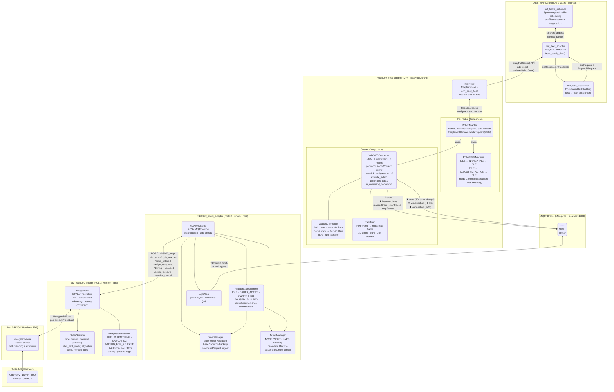
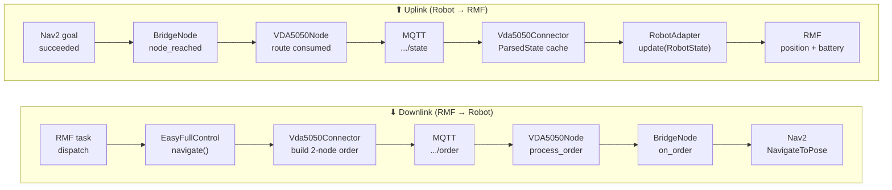
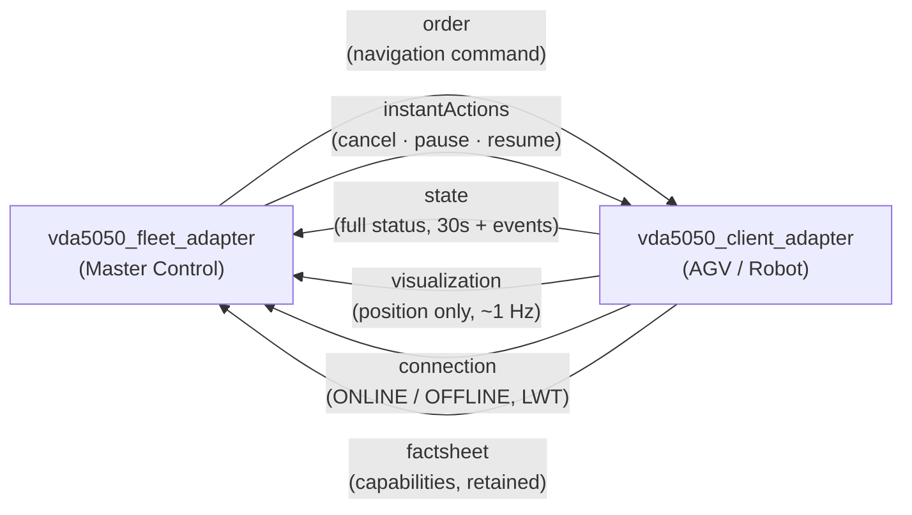

# Option B — Detailed Architecture Diagram

Render file này trong VS Code preview (Ctrl+Shift+V) hoặc paste vào https://mermaid.live để xem diagram.

## Full System Architecture (Open-RMF Core → TB3)

## Data Flow Summary

## VDA5050 MQTT Topics

