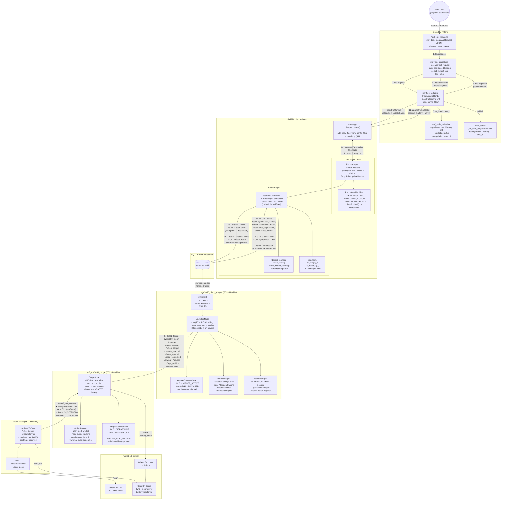
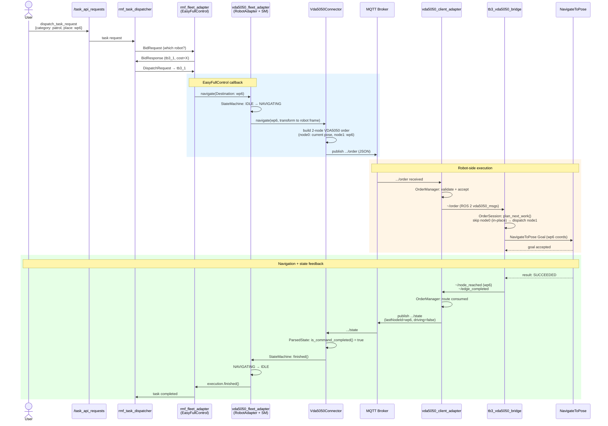
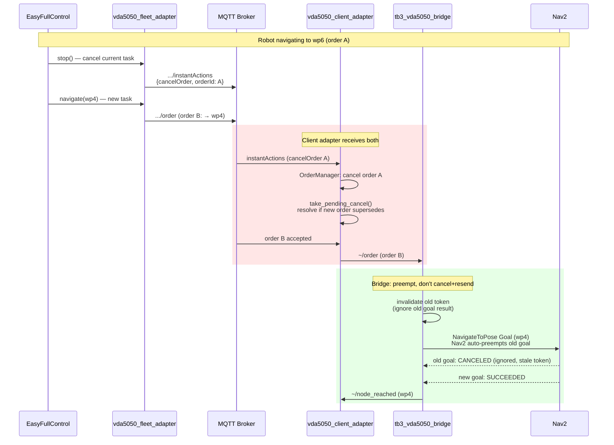

# Option B — Detailed Architecture with Data Flow

Paste từng diagram vào https://mermaid.live để render.

## 1. Detailed Component Architecture + Data Flow

## 2. Task Dispatch Sequence (numbered flow)

## 3. Cancel + Replace Order Flow (the race we fixed)

