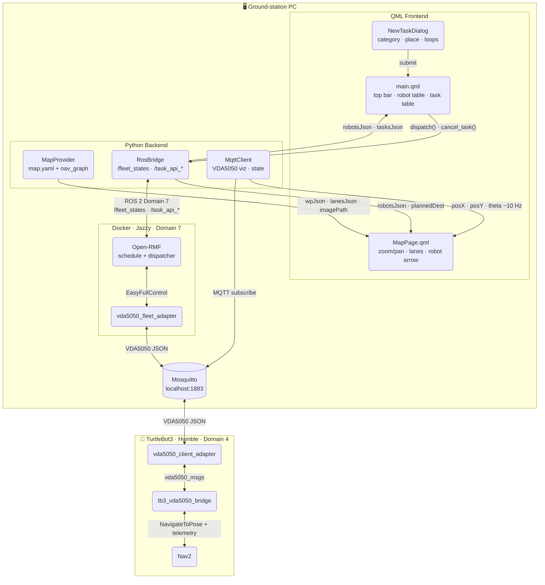

# EIU Fleet UI

A real-time fleet management dashboard for [Open-RMF](https://github.com/open-rmf/rmf) built with **PySide6 + QML**. Monitors robot status, visualizes the navigation map, and dispatches / cancels patrol tasks — all from a single desktop window.


---

## Features

| Feature | Details |
|---|---|
| Live robot map | SLAM map + nav-graph overlay with waypoint pins and lane direction arrows |
| Realtime robot marker | Arrow marker updated at ~10 Hz from MQTT VDA5050 visualization topic |
| Active Robots panel | Name, fleet, estimated finish time, level, battery %, last-update time, status |
| Tasks panel | Full task history — date, requester, destination, assigned robot, start/end time, state |
| Dispatch task | Create patrol tasks (destination + loop count) sent to Open-RMF dispatcher |
| Cancel task | One-click × button on any queued / underway task row |
| RMF + Broker status | Status indicators in the top bar for RMF and MQTT broker connectivity |

---

## Architecture



### Python backend modules

| Module | Role |
|---|---|
| `main.py` | Entry point — creates Qt app, QML engine, wires context properties, starts backends. Also installs an fd-level stderr filter to suppress rcutils DDS deserialization noise from cross-distro domain sharing. |
| `map_provider.py` | Reads `map.yaml` (SLAM origin + resolution) and `nav_graph.yaml` (waypoints + lanes). Converts the grayscale PGM map to ARGB32 PNG for QML rendering. Exposes `wpJson` and `lanesJson` for the map canvas. Detects bidirectional lanes for dual-arrow rendering. |
| `ros_bridge.py` | Subscribes to `/fleet_states` (robot position / battery / status / path) and `/task_api_responses` (task state updates). Publishes to `/task_api_requests` for `dispatch()` and `cancel_task()`. Maintains a local task list with rmf_id mapping and a grace-period miss counter to avoid false-completed states during task transitions. |
| `mqtt_client.py` | Connects to the local MQTT broker. Subscribes to three VDA5050 topics: `visualization` (position + heading, ~10 Hz), `state` (battery, driving, orderId), and `connection` (online/offline). Emits `vizChanged` for the realtime robot arrow and `stateChanged` for slower status updates. |
| `colors.py` | Single source of truth for the dark-theme color palette exposed as QML context property `C`. |

### QML frontend files

| File | Role |
|---|---|
| `qml/main.qml` | Root window. Top bar with connectivity indicators and "+ New Task" button. Left panel: Active Robots table + Tasks table with cancel button. Right panel: MapPage loader. |
| `qml/pages/MapPage.qml` | Zoomable / pannable map. `z:1` Canvas draws lanes (yellow) with blue direction triangles and the RMF planned path (green dashed). `z:2` Repeater draws waypoint pins. `z:3` MQTT arrow marker rotates in realtime via `mqtt.theta` binding. |
| `qml/components/NewTaskDialog.qml` | Modal dialog to create a patrol task: category (patrol), destination waypoint, loop count. Calls `ros.dispatch()` on submit. |
| `qml/components/RobotCard.qml` | Compact robot card component (used in status page). |

---

## Data flow

### Robot position (realtime)
```
TB3 OpenCR → nav2 → vda5050_client_adapter → MQTT visualization topic
    → MqttClient.vizChanged → mqtt.posX/Y/theta → QML binding → arrow marker rotates
```
Update rate: ~10 Hz.

### Robot fleet state (1 Hz)
```
vda5050_fleet_adapter (Jazzy) → /fleet_states (ROS 2 domain 7)
    → RosBridge._on_fleet_state() → robotsJson → QML Active Robots table
```
Includes: position, battery, mode (IDLE/WORKING/MOVING…), task_id, planned path.

### Task lifecycle
```
User clicks Submit → ros.dispatch() → /task_api_requests
    → RMF dispatcher → /task_api_responses (dispatch_task_response) → rmf_id mapped
    → /task_api_responses (task_state_update) → state: queued → underway → completed
    → /fleet_states cross-reference (fallback if response delayed)
```

### Task cancellation
```
User clicks × → ros.cancel_task(rmf_id) → /task_api_requests (cancel_task_request)
    → local state updated to "cancelled" immediately (optimistic)
    → RMF confirms via task_state_update
```

### Patrol loops (> 1)
When `loops > 1`, `dispatch()` automatically finds the robot's nearest waypoint and builds a round-trip route `[current_wp, destination]` with `rounds = loops`. This ensures each round involves real travel instead of a no-op at the destination.

---

## Prerequisites

| Dependency | Version | Notes |
|---|---|---|
| ROS 2 | Humble | Host machine (rclpy, rmf_fleet_msgs, rmf_task_msgs) |
| PySide6 | ≥ 6.4 | `pip install PySide6` or `apt install python3-pyside6` |
| paho-mqtt | ≥ 1.6 | `pip install paho-mqtt` |
| PyYAML | any | `pip install pyyaml` |
| Open-RMF | Jazzy | Running in Docker on domain 7 (see fleet adapter README) |
| MQTT broker | Mosquitto | `localhost:1883` |

> **ROS domain:** The UI subscribes on `ROS_DOMAIN_ID=7` (configurable via env var `EIU_ROS_DOMAIN_ID`). Open-RMF must run on the same domain.

---

## Build & Run

```bash
# 1. Build
cd ~/ros2_ws
colcon build --packages-select eiu_fleet_ui
source install/setup.bash

# 2. Make sure Open-RMF (Jazzy Docker) and MQTT broker are running
#    See: vda5050_fleet_adapter/README.md

# 3. Run
ros2 run eiu_fleet_ui eiu_fleet_ui

# Optional: override ROS domain
EIU_ROS_DOMAIN_ID=7 ros2 run eiu_fleet_ui eiu_fleet_ui
```

---

## Map & nav-graph configuration

All map files live in `eiu_fleet_ui/maps/`:

| File | Format | Purpose |
|---|---|---|
| `map.yaml` | ROS map_server YAML | SLAM map metadata (origin, resolution, image path) |
| `map.pgm` / `map.png` | PGM / PNG | SLAM occupancy grid image |
| `nav_graph.yaml` | Open-RMF traffic editor | Waypoints (vertices) and lanes (edges) |
| `tb3_world.building.yaml` | Open-RMF building | Building definition used by rmf_traffic_schedule |

To use a different map, replace the files in `maps/` and rebuild.

---

## MQTT topics (VDA5050)

| Topic | Direction | Content |
|---|---|---|
| `TB3/v2/ROBOTIS/0001/visualization` | Robot → UI | `agvPosition: {x, y, theta}` — realtime pose |
| `TB3/v2/ROBOTIS/0001/state` | Robot → UI | `driving`, `orderId`, `batteryState.batteryCharge` |
| `TB3/v2/ROBOTIS/0001/connection` | Robot → UI | `connectionState: ONLINE/OFFLINE` |

---

## ROS 2 topics

| Topic | Type | Direction | Purpose |
|---|---|---|---|
| `/fleet_states` | `rmf_fleet_msgs/FleetState` | RMF → UI | Robot position, battery, mode, path |
| `/task_api_requests` | `rmf_task_msgs/ApiRequest` | UI → RMF | Dispatch and cancel tasks |
| `/task_api_responses` | `rmf_task_msgs/ApiResponse` | RMF → UI | Task state updates, rmf_id mapping |

---

## Task states

| State | Color | Meaning |
|---|---|---|
| `queued` | Yellow | Dispatched, waiting for a robot to pick up |
| `underway` | Blue | Robot actively executing the task |
| `completed` | Green | Task finished successfully |
| `cancelled` | Red | Cancelled by user or system |
| `failed` | Red | Task failed (obstacle, timeout, etc.) |

---

## Known limitations

- Only one robot fleet (`tb3_fleet`) is configured in the current nav-graph. Adding more robots requires only updating `nav_graph.yaml` and the fleet adapter config.
- `loops > 1` dispatch requires the robot to already be visible in `/fleet_states` so that `_nearest_wp_name` can find the current position.
- Resume / interrupt is not yet implemented (Open-RMF supports `interrupt_task_request` / `resume_task_request`).
