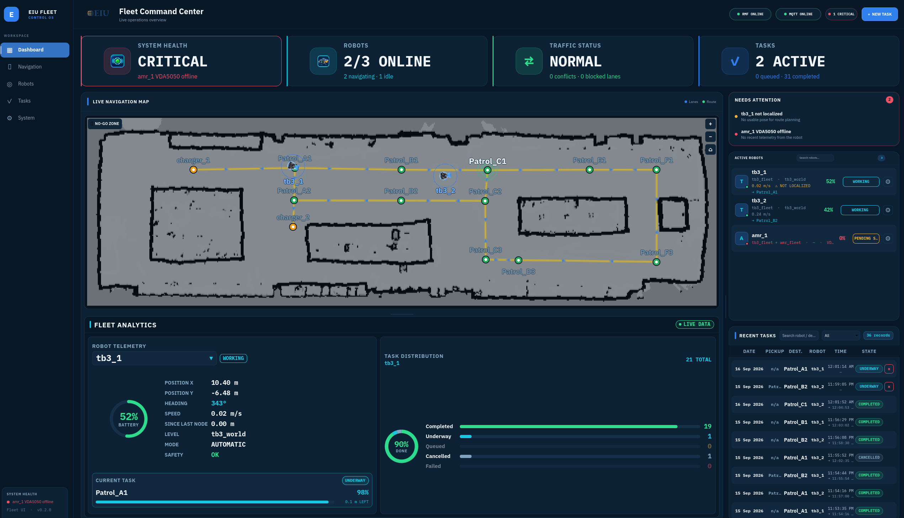

# EIU Fleet UI

A real-time fleet management dashboard for [Open-RMF](https://github.com/open-rmf/rmf) built with **PySide6 + QML**. Monitors robot status, visualizes the navigation map, and dispatches / cancels tasks across one or more robot fleets — all from a single desktop window.

<p align="center">
  
</p>



> See [docs/architecture.md](docs/architecture.md) for system design, component diagrams, and data-flow sequence diagrams.

---

## Features

| Area | What it does |
|---|---|
| Live navigation map | Occupancy grid + nav-graph overlay, lane direction arrows, blocked-lane highlighting from live RMF traffic state, multi-robot markers (per-robot-type icon) with heading/pulse, planned-path overlay, click-to-pick a pose or waypoint |
| Fleet Command dashboard | KPI cards (system health, fleet + VDA5050-connected count, traffic status, tasks), RMF/MQTT online indicators, a Needs Attention panel listing every active issue |
| Active Robots panel | Search/filter, battery, round progress, live telemetry badges (not-localized, no-recent-data, safety/eStop/fatal-error) |
| Robot Control dialog | Pause/resume, speed-limit override, re-localize (click-on-map or typed pose), direct "go to waypoint" pinned to that one robot |
| Recent Tasks table | Search/filter, underway-first sort, cancel button, dispatch confirmed synchronously with error feedback and a server-side timeout for a dispatcher that never responds |
| New Task dialog | Fleet-wide patrol or delivery dispatch (destinations, handlers, loop count) — RMF bids it to whichever robot it picks; draggable |
| Fleet Analytics | Battery/task-distribution gauges, current task progress, live distance-since-last-node, eStop/safety status per robot, delivery pickup/dropoff wait countdown, AGV-reported load while a delivery is underway |
| Traffic awareness | Blocked lanes and active negotiation/conflict counts, read from real RMF topics, not inferred |
| No-go zones | Drag a rectangle on the map; every lane it crosses is closed via RMF's own lane-closure mechanism. Multiple zones at once, click to select, delete to reopen |
| Multi-fleet | Point the UI at several fleet adapter processes at once (e.g. one robot type per fleet) — see `EIU_FLEET_ADAPTERS` under Build & Run |
| Resilience | VDA5050 telemetry staleness detection, malformed-MQTT-payload hardening, dispatch/cancel confirmation with timeout |

---

## Python backend modules

| Module | Role |
|---|---|
| `main.py` | Entry point — creates the Qt app, QML engine, wires context properties, starts backends. |
| `config.py` | Reads the fleet adapter's own config file(s) (one or more, see Multi-fleet) for broker/robot/task-category settings. |
| `map_provider.py` | Reads `map.yaml` (SLAM origin + resolution) and `nav_graph.yaml` (waypoints + lanes). Converts the grayscale PGM map to ARGB32 PNG for QML rendering. Exposes `wpJson` and `lanesJson`. |
| `ros_bridge.py` | Subscribes to `/fleet_states`, `/task_api_responses`, `/lane_states`, `/rmf_traffic/negotiation_statuses`. Publishes task dispatch/cancel and lane-closure requests. Tracks per-fleet state so multi-fleet setups address the right fleet. |
| `ros_control.py` | Direct per-robot control: pause/resume (services), speed-limit override (ROS param), re-localize (`init_position` topic) — wired to each robot's own fleet adapter node. |
| `mqtt_client.py` | Connects to the MQTT broker; subscribes to each robot's `connection` and `state` topics. Parsing lives in `vda5050/state.py`; this class owns the paho connection and Qt-side throttling. |
| `vda5050/state.py` | Pure VDA5050 `state` message parsing — no Qt, no I/O. Mirrors `vda5050_fleet_adapter_full_control`'s own `ParsedState` field-for-field. |
| `task_websocket.py` | Optional `TaskEventServer` — receives `task_state_update`/`task_log_update` events from the fleet adapter over a WebSocket, when `vda5050.ui_websocket_uri` is configured. |
| `colors.py` | Single source of truth for the dark-theme color palette exposed as QML context property `C`. |

## QML frontend files

| File | Role |
|---|---|
| `qml/main.qml` | Root window. KPI row, Active Robots table, Tasks table, map panel. |
| `qml/pages/MapPage.qml` | Zoomable/pannable map: lanes, waypoints, robot markers, planned path, no-go zone drawing. |
| `qml/pages/StatusPage.qml` | Placeholder page (not yet implemented). |
| `qml/components/NewTaskDialog.qml` | Modal dialog to dispatch a fleet-wide patrol or delivery task. |
| `qml/components/RobotControlDialog.qml` | Modal dialog for direct per-robot control (pause/resume, speed limit, re-localize, go-to-waypoint). |
| `qml/components/FleetAnalytics.qml` | Battery/task gauges, per-robot delivery/task progress detail. |
| `qml/components/RobotCard.qml` | Compact robot summary card. |
| `qml/components/MetricCard.qml` | Generic KPI card used by the dashboard's metric row. |

---

## Prerequisites

| Dependency | Version | Notes |
|---|---|---|
| ROS 2 | Jazzy | Runs in the same Docker container class as the fleet adapter (rclpy, rmf_fleet_msgs, rmf_task_msgs) |
| PySide6 | ≥ 6.4 | `pip install PySide6` or `apt install python3-pyside6` |
| paho-mqtt | ≥ 1.6 | `pip install paho-mqtt` |
| PyYAML | any | `pip install pyyaml` |
| Open-RMF | Jazzy | Runs in the same Docker container/process group as this UI — see `fleet_bringup` |
| MQTT broker | Mosquitto | `localhost:1883` |

> **ROS domain:** normally nothing to configure — `eiu_fleet_ui`, Open-RMF core,
> and the fleet adapter all run in the same container via `fleet_bringup`, so
> they share whatever `ROS_DOMAIN_ID` that container already has (see
> `vda5050_fleet_adapter_full_control/docker/run.sh`). `EIU_ROS_DOMAIN_ID`
> only matters if you run this UI against an Open-RMF instance in a
> *different* process/container than usual.

---

## Build & Run

```bash
# 1. Build
cd ~/ros2_ws
colcon build --packages-select eiu_fleet_ui
source install/setup.bash

# 2. Make sure Open-RMF (Jazzy Docker) and MQTT broker are running
#    See: vda5050_fleet_adapter_full_control/README.md

# 3. Run
ros2 run eiu_fleet_ui eiu_fleet_ui

# Optional: only if Open-RMF runs on a different domain than this shell's default
EIU_ROS_DOMAIN_ID=10 ros2 run eiu_fleet_ui eiu_fleet_ui
```

### Multiple fleets (heterogeneous robot types)

Each robot type runs its own `vda5050_fleet_adapter_full_control` process
(different config file, different ROS node name — see that package's
README). By default the UI only looks for a single fleet adapter node named
`vda5050_fleet_adapter_full_control`. To have it control robots across
several fleet adapters at once, set `EIU_FLEET_ADAPTERS` to a comma-separated
list of `config_file=node_name`:

```bash
EIU_FLEET_ADAPTERS="/path/to/config_tb3.yaml=vda5050_fleet_adapter_tb3,/path/to/config_amr.yaml=vda5050_fleet_adapter_amr" \
  ros2 run eiu_fleet_ui eiu_fleet_ui
```

The UI merges the robot lists, task categories, and nav graph from every
fleet listed; broker connection is assumed shared (same MQTT broker) and
taken from the first fleet. Each robot's pause/resume/speed/init_position
controls, and its no-go-zone lane closures, are addressed to its own real
fleet name/node — so this only works if every fleet adapter was actually
launched with the matching `node_name` (see `fleet_adapter.launch.py`'s
`node_name` arg).

Single-fleet setups don't need this — the UI auto-discovers one config file
and defaults its node name to `vda5050_fleet_adapter_full_control`. Override
either half individually with `EIU_FLEET_CONFIG=/path/to/config.yaml` and/or
`EIU_FLEET_ADAPTER_NODE=my_node_name`.

---

## Map & nav-graph configuration

All map files live in `eiu_fleet_ui/maps/`:

| File | Format | Purpose |
|---|---|---|
| `map.yaml` | ROS map_server YAML | SLAM map metadata (origin, resolution, image path) |
| `map.pgm` / `map.png` | PGM / PNG | SLAM occupancy grid image |
| `nav_graph.yaml` | Open-RMF traffic editor | Waypoints (vertices) and lanes (edges) |
| `tb3_world.building.yaml` | Open-RMF building | Building definition used by rmf_traffic_schedule |

To use a different map, replace the files in `maps/` and rebuild.

---

## MQTT topics (VDA5050)

Topic prefix per robot is `<interface_name>/v2/<manufacturer>/<serial>/`, read
from the fleet adapter's config file(s) — never hardcoded (see `config.py`).

| Topic (leaf) | Direction | Content |
|---|---|---|
| `state` | Robot → UI | Full `ParsedState`-equivalent: `driving`, `paused`, `orderId`/`orderUpdateId`, `batteryState`, `velocity`, `safetyState`, `errors[]`, `operatingMode`, `nodeStates`/`edgeStates`/`actionStates`, `loads`, `maps`. Parsed by `vda5050/state.py`. |
| `connection` | Robot → UI | `connectionState: ONLINE/OFFLINE/CONNECTIONBROKEN` |

Not yet subscribed: `visualization` (10 Hz pose refinement — `/fleet_states`
already covers the map's needs) and `factsheet` (robot capabilities/limits).

---

## ROS 2 topics

| Topic | Type | Direction | Purpose |
|---|---|---|---|
| `/fleet_states` | `rmf_fleet_msgs/FleetState` | RMF → UI | Robot position, battery, mode, path |
| `/task_api_requests` | `rmf_task_msgs/ApiRequest` | UI → RMF | Dispatch and cancel tasks |
| `/task_api_responses` | `rmf_task_msgs/ApiResponse` | RMF → UI | Task state updates, rmf_id mapping |
| `/lane_states` | `rmf_fleet_msgs/LaneStates` | RMF → UI | Which lanes are currently closed, per fleet |
| `/lane_closure_requests` | `rmf_fleet_msgs/LaneRequest` | UI → RMF | Close/reopen lanes for a no-go zone |

See [docs/architecture.md](docs/architecture.md#process-boundaries-at-a-glance)
for the full protocol boundary table, including per-robot control topics.

---

## Task states

| State | Color | Meaning |
|---|---|---|
| `queued` | Yellow | Dispatched, waiting for a robot to pick up |
| `underway` | Blue | Robot actively executing the task |
| `completed` | Green | Task finished successfully |
| `cancelled` | Red | Cancelled by user or system |
| `failed` | Red | Task failed (obstacle, timeout, etc.) |
