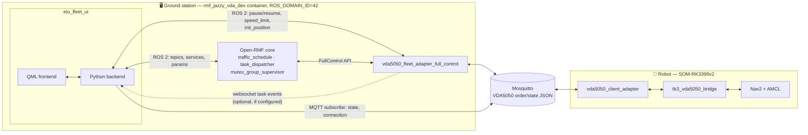
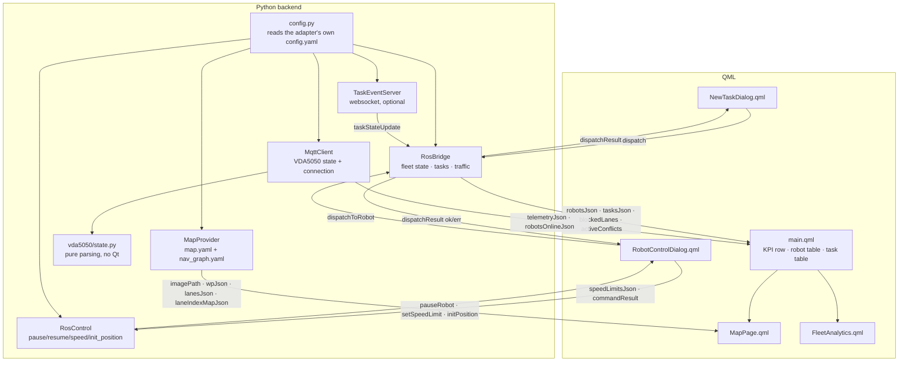
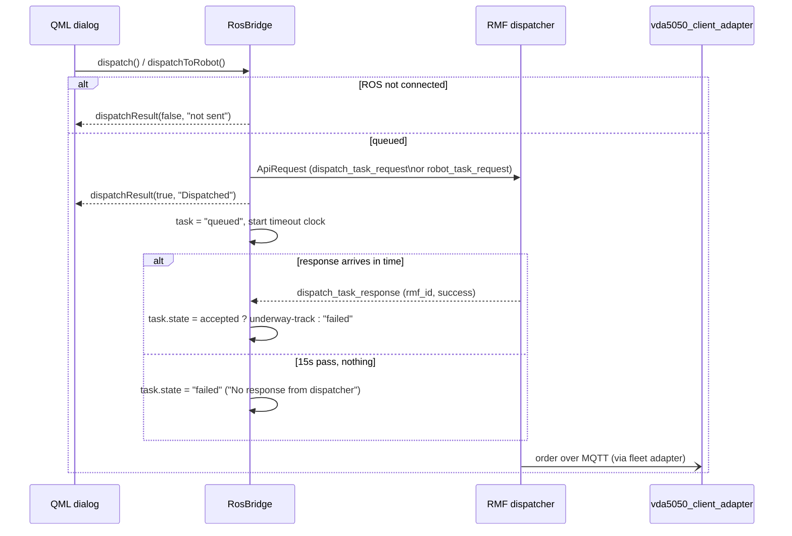
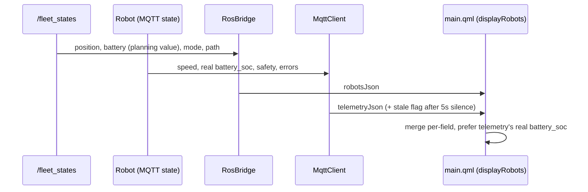

# EIU Fleet UI — Architecture

A PySide6 + QML desktop dashboard for an Open-RMF fleet running the VDA5050
protocol. It watches RMF's own topics for fleet-level truth (position, task
state, traffic) and the robot's MQTT `state` topic for everything RMF doesn't
carry (speed, safety, battery detail, order progress) — then dispatches,
cancels, and directly controls robots through the same channels.

## Features

| Area | What it does |
|---|---|
| Live navigation map | Occupancy grid + nav-graph overlay, lane direction arrows, blocked-lane highlighting from live RMF traffic state, multi-robot markers with heading/pulse, planned-path overlay, click-to-pick a pose or waypoint |
| Fleet Command dashboard | KPI cards (system status, fleet + VDA5050-connected count, traffic status, active tasks), RMF/MQTT online indicators, critical/warning alert badges |
| Active Robots panel | Search/filter, battery, round progress, live telemetry badges (not-localized, no-recent-data, safety/eStop/fatal-error) |
| Robot Control dialog | Pause/resume, speed-limit override, re-localize (click-on-map or typed pose), direct "go to waypoint" pinned to that one robot |
| Recent Tasks table | Search/filter, underway-first sort, cancel button, dispatch confirmed synchronously with error feedback and a server-side timeout for a dispatcher that never responds |
| New Task dialog | Fleet-wide patrol dispatch (category, destination, loop count) — RMF bids it to whichever robot it picks |
| Fleet Analytics | Battery/task-distribution gauges, current task progress, live distance-since-last-node |
| Traffic awareness | Blocked lanes and active negotiation/conflict counts, read from real RMF topics, not inferred |
| Resilience | VDA5050 telemetry staleness detection, malformed-MQTT-payload hardening, dispatch/cancel confirmation with timeout |

## System architecture

Two machines, three ROS graphs meeting at one MQTT broker:

RMF's own frame (`/fleet_states`) and the robot's VDA5050 frame (MQTT
`state`) are two independent sources of truth about the same robot; the UI
never lets one silently overwrite the other — it merges them per field (see
`displayRobots` in `main.qml`).

## Component view

## Key flows

### Dispatch a task

### Live telemetry (two independent sources)

## Process boundaries, at a glance

| Boundary | Crossed by | Protocol |
|---|---|---|
| UI ↔ RMF core | `/fleet_states`, `/task_api_requests`, `/task_api_responses`, `/dispatch_states`, `/lane_states`, `/rmf_traffic/negotiation_statuses` | ROS 2, domain 42 |
| UI ↔ fleet adapter | `<robot>/pause`, `<robot>/resume` (services), `speed_limit.<robot>` (param), `<robot>/init_position` (+ `_result`) | ROS 2, domain 42 |
| UI ↔ robot | `<interface>/v2/<mfr>/<serial>/state`, `.../connection` | MQTT (Mosquitto) |
| Fleet adapter ↔ robot | VDA5050 `order`, `state`, `connection`, `instantActions` | MQTT (Mosquitto) |
| Fleet adapter → UI | `task_state_update`, `task_log_update` | WebSocket, optional |
| Bridge ↔ Nav2 | `NavigateToPose` action, `/odom` | ROS 2, on-robot |

Everything under "UI ↔ RMF core" and "UI ↔ fleet adapter" only works because
the UI and the fleet adapter share `ROS_DOMAIN_ID=42` — the UI process is
just another node on that graph, not a separate integration layer.
