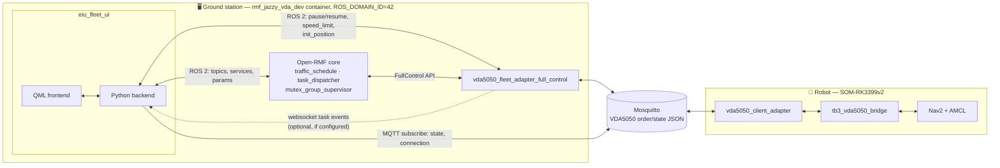
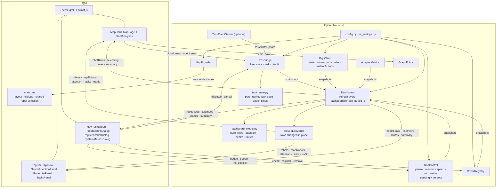
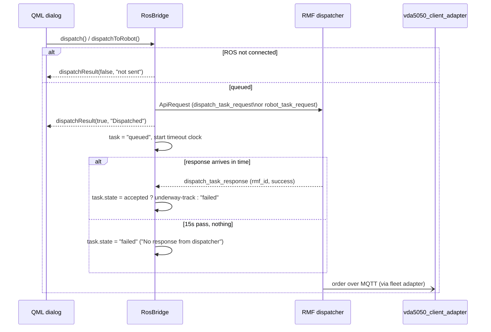
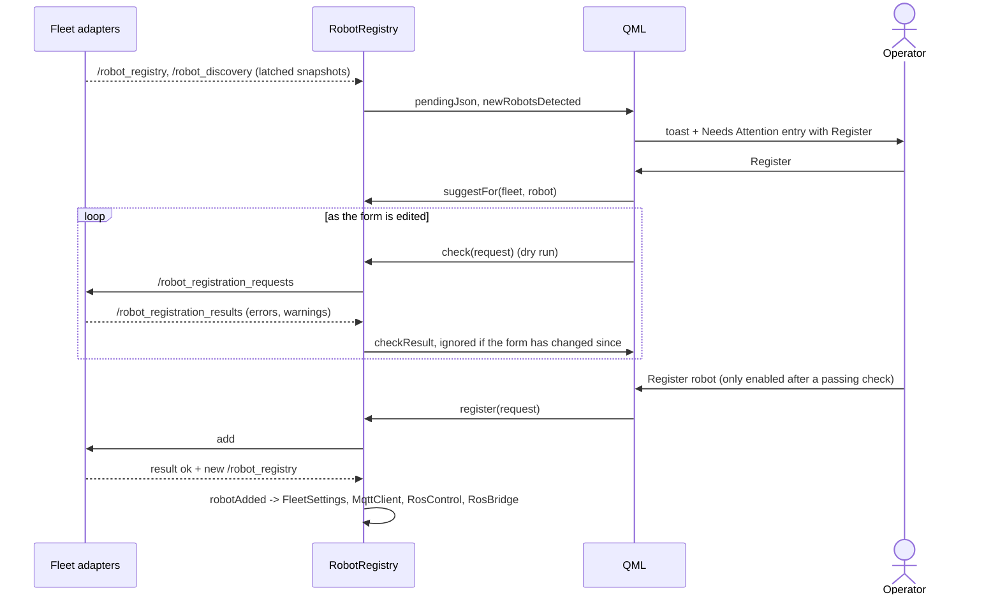
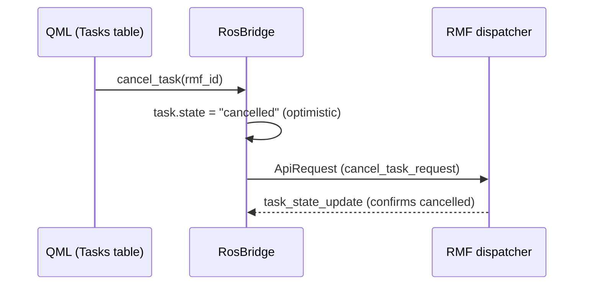
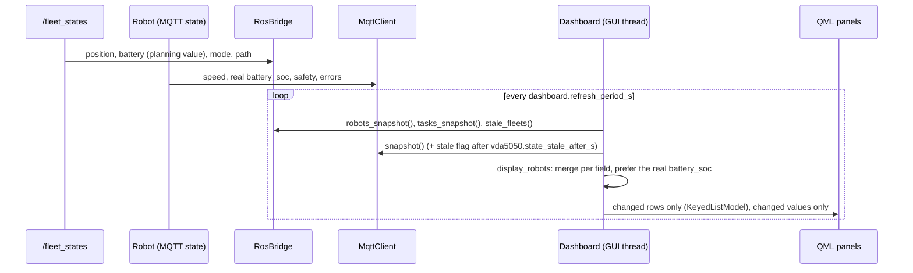

# EIU Fleet UI — Architecture

A PySide6 + QML desktop dashboard for an Open-RMF fleet running the VDA5050
protocol. It watches RMF's own topics for fleet-level truth (position, task
state, traffic) and the robot's MQTT `state` topic for everything RMF doesn't
carry (speed, safety, battery detail, order progress) — then dispatches,
cancels, and directly controls robots through the same channels.

## Features

| Area | What it does |
|:---:|---|
| Live navigation map | Occupancy grid + nav-graph overlay, lane direction arrows, blocked-lane highlighting from live RMF traffic state, multi-robot markers with heading/pulse that glide between updates, each robot's route and task destination, click-to-pick a pose or waypoint |
| Fleet Command dashboard | KPI cards (system health: Healthy/Degraded/Critical/Offline, fleet + VDA5050-connected count, traffic status, tasks), RMF/MQTT online indicators, a Needs Attention panel listing every active issue |
| Active Robots panel | Search/filter, battery, round progress, live telemetry badges (not-localized, no-recent-data, safety/eStop/fatal-error) |
| Robot Control dialog | Pause/resume, speed-limit override, re-localize (click-on-map or typed pose), direct "go to waypoint" pinned to that one robot; a command shows as waiting until the adapter answers and fails after `commands.timeout_s` |
| Recent Tasks table | Search/filter, underway-first sort, cancel button, dispatch confirmed synchronously with error feedback and a server-side timeout for a dispatcher that never responds |
| New Task dialog | Fleet-wide patrol or delivery dispatch (destinations, handlers, loop count) — RMF bids it to whichever robot it picks; draggable |
| Fleet Analytics | Battery/task-distribution gauges, current task progress, live distance-since-last-node, eStop/safety status per robot, delivery pickup/dropoff wait countdown, AGV-reported load while a delivery is underway |
| System view | Per fleet adapter: robots online, oldest state age against the adapter's own offline limit, messages per second, drops, MQTT link, update-loop time, and charts of the last reports; the problems an adapter reports about itself also join Needs Attention |
| Traffic awareness | Blocked lanes and active negotiation/conflict counts, read from real RMF topics, not inferred |
| No-go zones | Drag a rectangle on the map; every lane it crosses is closed via RMF's own lane-closure mechanism. Multiple zones at once, click to select, delete to reopen |
| Robot registration | Unregistered broker robots raise a Needs Attention entry; Register dialog shows the adapter's live checks; a removed-but-still-online robot is offered again to be restored |
| Nav graph editor | Add/move waypoints and lanes on the map, *Save as* writes an `nav_graph.yaml`; nothing written until saved |
| VDA5050 order & traffic | Selected robot's live order as route tiles + per-action blocking; filterable log of order/instantAction/state/connection messages with raw JSON |
| Resilience | VDA5050 telemetry staleness detection, malformed-MQTT-payload hardening, dispatch/cancel confirmation with timeout |

## System architecture

Two machines, three ROS graphs meeting at one MQTT broker:

RMF's own frame (`/fleet_states`) and the robot's VDA5050 frame (MQTT
`state`) are two independent sources of truth about the same robot; the UI
never lets one silently overwrite the other — it merges them per field (see
`display_robots` in `dashboard_model.py`).

## Component view

### Refresh pipeline

The ROS executor thread and the paho thread only record what arrives: `RosBridge` keeps
the robots of each fleet and the task records, `MqttClient` the parsed state per robot and
the message log. Nothing is serialised per message.

On the GUI thread, `Dashboard.refresh()` runs every `dashboard.refresh_period_s` (0.2 s by
default). It takes one snapshot of every backend, derives what the panels show with the pure
functions of `dashboard_model.py`, and hands it over as

- `KeyedListModel`s for every list (robots, map markers, Needs Attention, tasks, traffic log):
  a row that changed emits `dataChanged` for itself only, new rows are inserted, gone rows
  removed, reordered rows moved — the model is never reset, so delegates, scroll position,
  hover and running animations survive every update;
- values (`robotRows`, `telemetry`, `routes`, the KPI summary, …) that notify only when they
  actually changed.

Needs Attention items carry a stable key (`robot:tb3_1:offline`) and the time an issue
started; the "last seen … ago" text ticks in the delegate itself. Robot markers glide to each
new pose over one refresh period. The map draws the graph (lanes, arrows, zones, editor)
and the routes on two canvases, so only the route layer is repainted as robots move.

## Key flows

### Dispatch a task

`loops > 1` builds a round-trip route instead of a single leg: `dispatch()`
finds the robot's nearest waypoint via `/fleet_states` and requests
`[current_wp, destination]` with `rounds = loops`, so each round is real
travel rather than a no-op at the destination.

### Register a robot found on the broker

The dashboard holds no registration rules: it shows the adapter's verdict, so
a rule changed in the adapter is changed everywhere at once. Suggestions
(fleet by matching type, a name continuing the fleet's numbering, the first
free charger) only prefill the form. A request that gets no answer within
`REPLY_TIMEOUT_SEC` ends in a failure the dialog shows.

A robot removed from a fleet but still online is offered again. `removed_as`
tells the dialog its old fleet, name and charger, so it can prefill them —
registering it unchanged restores it instead of creating a new one.

### Task cancellation

### Live telemetry (two independent sources)

### Task state from several sources

`/task_api_responses`, the websocket task events, `/dispatch_states` and the robots' task ids
in `/fleet_states` all say something about a task, in any order. `task_state.set_state` ranks
them — task events and API answers, then the dispatcher, then a robot picking up or dropping a
task id, then the dashboard's own timeouts. A better-informed source may change the state
either way; an equal or weaker one only moves it forward (queued, underway, finished). So a
late `/dispatch_states` "queued" cannot undo "underway", and "completed because the robot
dropped the task id" is replaced by RMF's "failed" when that is what happened. A finished
task gets its real end time; while it runs, the end RMF expects is shown with `~`.

## Process boundaries, at a glance

| Boundary | Crossed by | Protocol |
|:---:|---|:---:|
| UI ↔ RMF core | `/fleet_states`, `/task_api_requests`, `/task_api_responses`, `/dispatch_states`, `/lane_states`, `/lane_closure_requests`, `/rmf_traffic/negotiation_statuses`, `/dispenser_states`, `/ingestor_states` | ROS 2, domain 42 |
| UI ↔ fleet adapter | `<robot>/pause`, `<robot>/resume` (services), `speed_limit.<robot>` (param), `<robot>/init_position` (+ `_result`) | ROS 2, domain 42 |
| UI ↔ fleet adapter (metrics) | `/<adapter node>/metrics` (JSON in `std_msgs/String`, one report per `vda5050.metrics_period_s`) | ROS 2, domain 42 |
| UI ↔ fleet adapter (registration) | `/robot_registry`, `/robot_discovery`, `/robot_registration_requests`, `/robot_registration_results` (JSON in `std_msgs/String`) | ROS 2, domain 42 |
| UI ↔ robot | `<interface>/v2/<mfr>/<serial>/state`, `.../connection` | MQTT (Mosquitto) |
| Fleet adapter ↔ robot | VDA5050 `order`, `state`, `connection`, `instantActions` | MQTT (Mosquitto) |
| Fleet adapter → UI | `task_state_update`, `task_log_update` | WebSocket, optional |
| Bridge ↔ Nav2 | `NavigateToPose` action, `/odom` | ROS 2, on-robot |

Everything under "UI ↔ RMF core" and "UI ↔ fleet adapter" only works because
the UI and the fleet adapter share `ROS_DOMAIN_ID=42` — the UI process is
just another node on that graph, not a separate integration layer.
