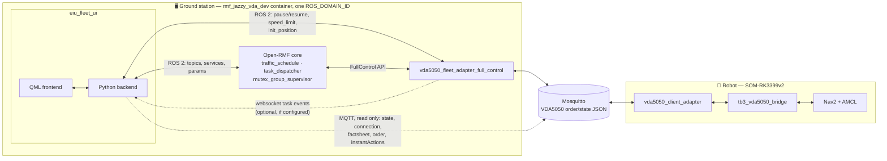
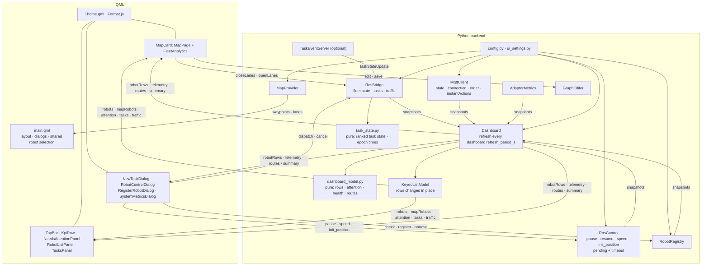
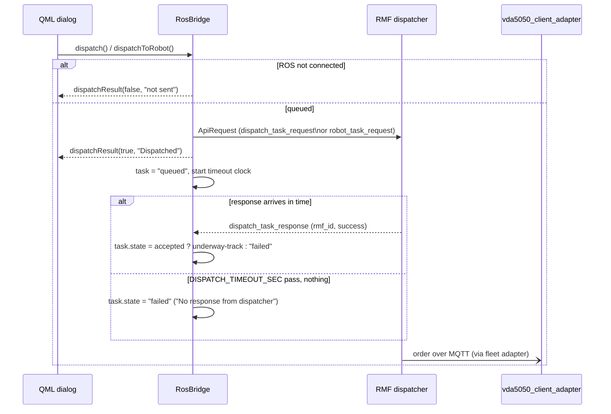
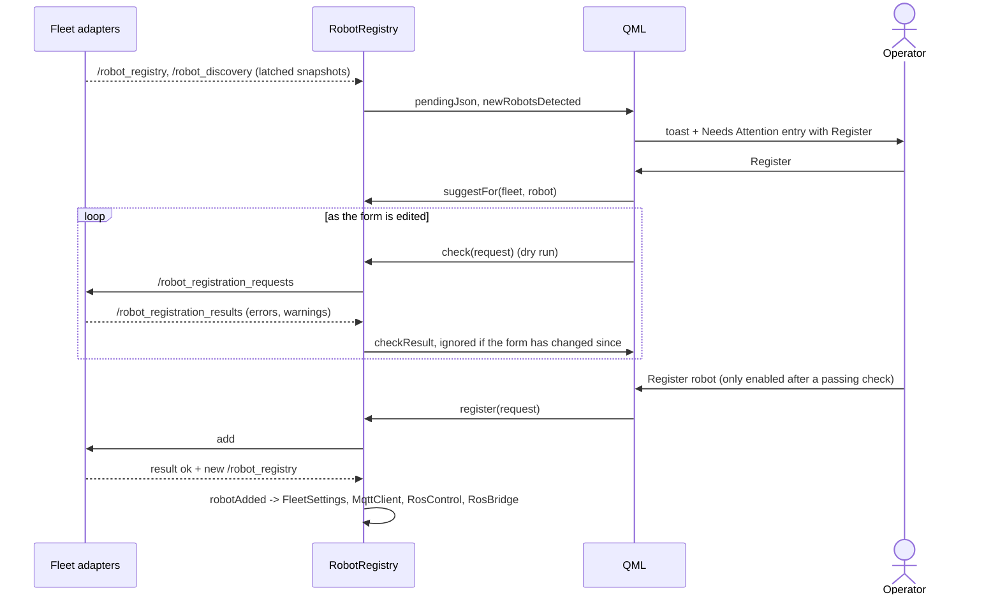
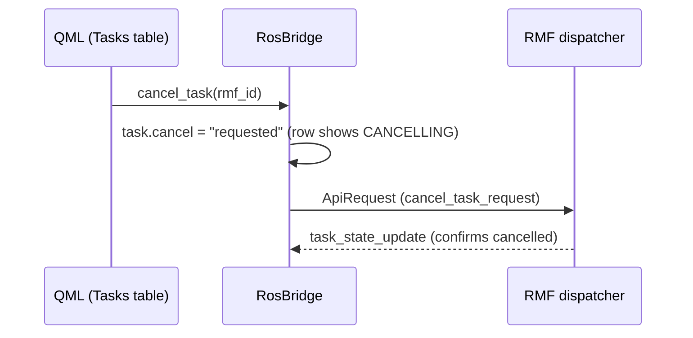
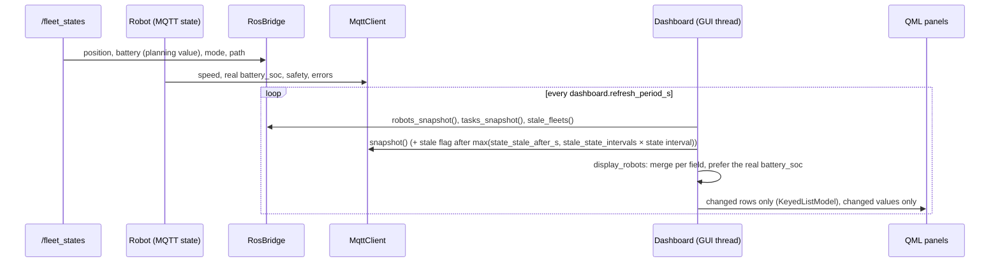

# EIU Fleet UI — Architecture

EIU Fleet UI is a PySide6 and QML desktop dashboard for Open-RMF fleets that use VDA5050. It supports the operation and the development of the VDA5050 fleet adapter.

The dashboard reads fleet data from two sources. RMF topics give the position of each robot, the task states and the traffic. The VDA5050 `state` messages on MQTT give what RMF does not carry: speed, safety, battery details and order progress. The dashboard sends tasks and cancels to RMF, and robot commands to the fleet adapters.

## System architecture

This section shows where the dashboard sits in the system and which parts it talks to.

The system runs on two machines:
- The ground station runs the dashboard, Open-RMF and the fleet adapter in one container, on one ROS domain.
- Each robot runs its VDA5050 client, the TurtleBot3 bridge and Nav2.

The MQTT broker connects them. The dashboard talks to Open-RMF and the fleet adapter over ROS 2, reads the VDA5050 messages from the broker, and receives task events from the fleet adapter over an optional WebSocket. The dashboard merges two views of each robot: RMF's view from `/fleet_states`, and the robot's own view from its VDA5050 `state`. It combines them field by field, so neither view replaces the other (`display_robots` in `dashboard_model.py`).

## Component view

This section shows the source files of the dashboard and which file uses which.

The code has two layers. The QML frontend renders the panels, dialogs and the map, and reads its data from context properties exposed by the backend. The Python backend connects to ROS and MQTT, and turns the raw fleet, task and VDA5050 data into what the panels show; `dashboard_model.py` and `task_state.py` do this without Qt, so they have plain unit tests. An arrow points from a file to a file it uses.

### Refresh pipeline

This section explains how the dashboard updates its panels without blocking on ROS or MQTT.

Three threads are involved. The ROS thread and the MQTT thread only store the latest data: `RosBridge` stores the robots and tasks of each fleet, `MqttClient` stores the state of each robot and the message log. They do not process this data further.

The GUI thread does the processing. Every `dashboard.refresh_period_s` (0.2 s by default), `Dashboard.refresh()` takes a snapshot of both threads' data and builds what the panels show, using the pure functions of `dashboard_model.py`.

The panels then update in one of two ways. A list, such as robots or tasks, uses a `KeyedListModel`: only the rows that changed are updated, added, removed or moved. A single value, such as the KPI summary, updates only when it changes. Neither way rebuilds the whole panel, so scroll position, hover state and running animations stay as they were.

## Key flows

The key flows show, step by step, how the dashboard handles its main situations:
- [Dispatch a task](#dispatch-a-task): sending a patrol or delivery task to RMF, for the fleet or for one robot.
- [Register a robot found on the broker](#register-a-robot-found-on-the-broker): adding an unregistered robot to a fleet.
- [Task cancellation](#task-cancellation): cancelling a task and showing RMF's confirmation.
- [Live telemetry](#live-telemetry-two-independent-sources): merging RMF's view of a robot with its VDA5050 state.
- [Task state from several sources](#task-state-from-several-sources): keeping one task state from several RMF sources that answer in any order.

### Dispatch a task

The operator creates a patrol or delivery task from the New Task dialog, for the whole fleet or for one robot. The dialog calls `dispatch()` or `dispatchToRobot()`; `RosBridge` sends the request to RMF and tracks its state until RMF answers.

A multi-round patrol (`loops > 1`) adds the robot's current waypoint, read from `/fleet_states`, as the first stop. Without it, every round after the first would end where it started, so the robot would not move.

### Register a robot found on the broker

A robot online on the broker but registered with no fleet appears in Needs Attention. The operator opens the Register dialog, which checks the request against the fleet adapters as the operator fills it in, and only allows registering once a check passes.

The dashboard holds no registration rules: it shows the adapter's verdict, so a rule changed in the adapter is changed everywhere at once. Suggestions (fleet by matching type, a name continuing the fleet's numbering, the first free charger) only prefill the form. A request that gets no answer within `REPLY_TIMEOUT_SEC` ends in a failure the dialog shows.

A robot removed from a fleet but still online is offered again. `removed_as` tells the dialog its old fleet, name and charger, so it can prefill them. Registering it unchanged restores it instead of creating a new one.

### Task cancellation

The dashboard does not cancel a task by itself: it asks RMF to cancel it, and shows the task as cancelling until RMF answers.

### Live telemetry (two independent sources)

RMF and the robot each report only part of a robot's state, on their own schedule. RMF gives the position, the planning battery and the task path from `/fleet_states`; the robot gives its real telemetry over MQTT. On every refresh, the dashboard merges the two into one row per robot, and marks a robot stale once its VDA5050 state is older than its offline limit.

### Task state from several sources

RMF reports the state of a task through four sources: task API responses, the websocket task events, `/dispatch_states`, and the robot's task id in `/fleet_states`. These sources answer in any order, and a message can arrive late. `task_state.set_state` ranks the sources by how well informed they are: events and API responses first, then the dispatcher, then a robot picking up or dropping a task id, then the dashboard's own timeouts.

A higher-ranked source can change the task's state in either direction. An equal or lower-ranked source can only move it forward, from queued to underway to finished. A late `/dispatch_states` message reporting "queued" cannot undo "underway" for the same reason. If the dashboard marks a task "completed" because the robot dropped its task id, and RMF later reports "failed" for it, RMF's report replaces the dashboard's guess.

A finished task shows its real end time. A task still running shows the end time RMF expects, marked with `~`.

## Interfaces

The dashboard reads the AGVs over MQTT and talks to Open-RMF and the fleet adapters over ROS 2. An optional WebSocket receives task events from the fleet adapter (`task_state_update`, `task_log_update`).

#### MQTT topics (VDA5050)

The dashboard reads the VDA5050 messages of every robot directly from the broker and never publishes to it. The topic prefix of a robot is `<interface_name>/v2/<manufacturer>/<serial>/`; the dashboard takes it from the fleet adapter configs and, for robots added at runtime, from `/robot_registry`.

| Topic | Sent by | Used for |
|:---:|:---:|---|
| `connection` | Robot | Online state of the robot (`ONLINE`, `OFFLINE`, `CONNECTIONBROKEN`) |
| `state` | Robot | Telemetry: position, battery, speed, safety, errors, order progress and action states (parsed by `vda5050/state.py`) |
| `factsheet` | Robot | `defaultStateInterval`, for the offline limit of the robot |
| `order` | Fleet adapter | Active order of the robot and the VDA5050 traffic log |
| `instantActions` | Fleet adapter | Blocking type of each action and the VDA5050 traffic log |

The dashboard does not subscribe to `visualization`; the robot positions on the map come from `/fleet_states`.

#### ROS 2 topics

The dashboard talks to Open-RMF and to the fleet adapters over ROS 2, in the same `ROS_DOMAIN_ID`. It reads the state of the robots, tasks and traffic from RMF, sends tasks and lane closures to RMF, and sends robot commands and registration requests to the fleet adapters.

Open-RMF:

| Topic | Type | Direction | Purpose |
|:---:|:---:|:---:|---|
| `/fleet_states` | `rmf_fleet_msgs/FleetState` | RMF → UI | Position, battery, mode and path of each robot |
| `/task_api_requests` | `rmf_task_msgs/ApiRequest` | UI → RMF | Dispatch and cancel tasks |
| `/task_api_responses` | `rmf_task_msgs/ApiResponse` | RMF → UI | Answers to task requests and task state updates |
| `/dispatch_states` | `rmf_task_msgs/DispatchStates` | RMF → UI | Bidding and assignment result of each task |
| `/lane_states` | `rmf_fleet_msgs/LaneStates` | RMF → UI | Closed lanes of each fleet |
| `/lane_closure_requests` | `rmf_fleet_msgs/LaneRequest` | UI → RMF | Close and open lanes for a no-go zone |
| `/rmf_traffic/negotiation_statuses` | `rmf_traffic_msgs/NegotiationStatuses` | RMF → UI | Active traffic conflicts |
| `/dispenser_states`, `/ingestor_states` | `rmf_dispenser_msgs`, `rmf_ingestor_msgs` | RMF → UI | Workcells of delivery tasks and their wait time |

Fleet adapters (`<adapter node>` is the node name given in `fleet_adapters`):

| Topic or service | Type | Direction | Purpose |
|:---:|:---:|:---:|---|
| `/<adapter node>/<robot>/pause`, `/resume` | `std_srvs/Trigger` service | UI → adapter | Pause and resume a robot |
| `/<adapter node>/<robot>/init_position` | `geometry_msgs/PoseWithCovarianceStamped` | UI → adapter | Set the position of a robot |
| `/<adapter node>/<robot>/init_position_result` | `std_msgs/String` | adapter → UI | Result of `init_position` |
| `speed_limit.<robot>` | ROS parameter of `<adapter node>` | UI → adapter | Speed limit of a robot |
| `/robot_registry` | `std_msgs/String` (JSON, latched) | adapter → UI | Robots, chargers, type and limits of each fleet |
| `/robot_discovery` | `std_msgs/String` (JSON, latched) | adapter → UI | Robots on the broker that no fleet has registered |
| `/robot_registration_requests` | `std_msgs/String` (JSON) | UI → adapter | Add, check and remove requests |
| `/robot_registration_results` | `std_msgs/String` (JSON) | adapter → UI | Result of each request, with errors and warnings |
| `/<adapter node>/metrics` | `std_msgs/String` (JSON) | adapter → UI | Metrics report of the adapter |

