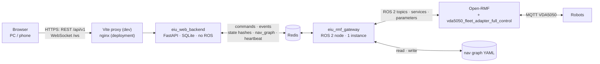
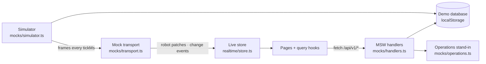

# EIU Robot Services — Web Dashboard

The web dashboard is the centralized robot operations platform of EIU. Operators run the robot services an administrator assigned to them (delivery, cleaning, patrol, and services added later); the orchestrator (Open-RMF) chooses the robot of each task. Administrators also manage accounts and their access, locations, integrations and settings.

| Role | Access |
|---|---|
| `operator` | The services, zones and permissions an admin granted (for example Operator A: delivery and cleaning; Operator B: delivery; Operator C: patrol). Robots, tasks and alerts of other services stay hidden unless the operator holds `fleet.view_all` |
| `admin` | Every enabled service, every zone, every permission, and the pages under `/admin` |

Robot types are filters inside the pages (Fleet, Tasks, Schedule, Analytics, task creation), never sections of their own. Services come from a configuration file, so a new service of an existing RMF task category needs no code.

The frontend runs against one of two backends that implement the same contract, [`frontend/src/api/types.ts`](frontend/src/api/types.ts):

| Backend | Command | Data |
|---|---|---|
| Demo, in the browser | `npm run dev` | MSW, a simulator that drives three robots along the real nav graph, a JSON document in `localStorage`, an in-memory stand-in for the fleet adapter's operator interfaces |
| Real, [`backend/`](backend/README.md) | `npm run dev:backend` | FastAPI + SQLite, connected to Open-RMF and `vda5050_fleet_adapter_full_control` through `eiu_rmf_gateway` and Redis |

## Folder layout

```
web_dashboard/
  COLCON_IGNORE        colcon does not build this folder
  frontend/            React + TypeScript single-page app
  docs/interfaces.md   Redis contract, ROS 2 interfaces, task events, REST API and WebSocket
  notes/               architecture proposal, integration diagrams and user guide, in Vietnamese
  backend/             FastAPI service (no ROS), reaches Open-RMF through eiu_rmf_gateway; see backend/README.md
```

```
frontend/src/
  app/            router, query client, build switches (env.ts)
  layout/         AppShell, Sidebar, TopBar, BottomNav, PageHeader, GlobalSearch
  pages/          one file per route; admin/ holds the admin-only pages (lazy chunks)
  domain/         authorization hooks (useCan, useAllowedServices, ...), service icons and names, status badges
  features/       admin, auth, charts, fleet, locations, map, notifications, operations, overview, tasks
  components/ui/  Button, Card, Tabs, Dialog, Menu, Field, Switch, States, Toaster
  api/            HTTP client, query hooks, data contract (types.ts)
  realtime/       transport interface, live robot store, provider
  mocks/          demo backend: handlers, simulator, demo database, seed
  i18n/           vi.json, en.json
  lib/            formatting, text folding, toasts, errors
  styles/         Tailwind theme tokens and map styles
```

## System architecture

The browser talks only to the backend. The backend is plain Python with no ROS 2 node; it reaches Open-RMF through [`eiu_rmf_gateway`](../../eiu_rmf_gateway/README.md), the only ROS 2 node of the web stack, over Redis ([contract](../../eiu_rmf_gateway/docs/contract.md)). Neither the browser nor the backend connects to ROS 2 or MQTT.



The deployment target adds nginx (TLS, rate limit), PostgreSQL instead of SQLite, sessions in Redis and several backend replicas. The gateway stays one instance.

In demo mode (`npm run dev`), MSW and the simulator take the place of the backend, Redis and the gateway:



## Installation

The frontend needs Node.js 20.19 or newer and npm. It does not need ROS, Open-RMF or the fleet adapter.

### Option A: Node.js on the host

Ubuntu 22.04 ships Node.js 12 in apt, which is too old. Install Node.js 22 LTS with nvm; nvm installs into the user's home folder and does not need sudo:

```bash
curl -o- https://raw.githubusercontent.com/nvm-sh/nvm/v0.40.3/install.sh | bash
source ~/.bashrc
nvm install 22
node --version          # v20.19 or newer

cd ~/ros2_ws/src/eiu_fleet_ui/web_dashboard/frontend
npm ci                  # installs the exact versions of package-lock.json into node_modules/
```

### Option B: Docker

The official `node:20-alpine` image contains Node.js and npm. No image is built; the container mounts `frontend/` at `/app`, so the code and `node_modules/` stay on the host.

```bash
cd ~/ros2_ws/src/eiu_fleet_ui/web_dashboard/frontend
docker run --rm -u $(id -u):$(id -g) -e HOME=/tmp -v $PWD:/app -w /app node:20-alpine npm ci
```

`node_modules/` holds the native builds of Vite and Tailwind for both glibc (Ubuntu) and musl (Alpine), so one installation serves both options.

## Run

Step-by-step commands for the demo and for the full stack (broker, Open-RMF, fleet adapter, Redis, gateway, backend, frontend) are in [docs/running.md](docs/running.md).

### On the host

```bash
cd ~/ros2_ws/src/eiu_fleet_ui/web_dashboard/frontend
npm run dev             # dev server on http://127.0.0.1:5173, Ctrl+C stops it
```

| Command | Effect |
|---|---|
| `npm run dev` | Dev server; the browser reloads when a source file changes |
| `npm test` | Unit tests (Vitest) |
| `npm run typecheck` | TypeScript check |
| `npm run build` | Type check and production build into `dist/` |
| `npm run preview` | Serves `dist/` on http://127.0.0.1:4173 |
| `npm run export-site` | Regenerates the map data, see [Map data](#map-data) |

### In Docker

```bash
cd ~/ros2_ws/src/eiu_fleet_ui/web_dashboard/frontend
docker run -d --name eiu_web_dev --network host -u $(id -u):$(id -g) -e HOME=/tmp \
  -v $PWD:/app -w /app node:20-alpine npx vite --host 127.0.0.1 --port 5173 --strictPort
```

| Command | Effect |
|---|---|
| `docker logs -f eiu_web_dev` | Dev server log |
| `docker exec -it eiu_web_dev sh` | Shell in `/app`, for `npm test` and other npm commands |
| `docker stop eiu_web_dev` / `docker start eiu_web_dev` | Stop and restart the container |
| `docker rm -f eiu_web_dev` | Remove the container |

The host dev server and the container use the same port 5173; run one of them at a time.

### Access from other devices

`--host 0.0.0.0` (Docker) or `npm run dev -- --host 0.0.0.0` (host) opens the dev server on the local network at `http://<host IP>:5173`. The demo backend runs in a service worker, which the browser allows only on `localhost` or over HTTPS; on another device the pages load but the demo data does not. With the real backend, `npm run dev:lan` opens the dev server on the local network: other devices open `http://<host IP>:5173` (or `http://<hostname>.local:5173` where mDNS works), and `/api` and `/ws` still reach the backend on `127.0.0.1:8000` through the proxy, so the backend port stays closed to the network. The phone layout can be checked on the development machine with the browser's device mode (F12, then Ctrl+Shift+M).

### Configuration

| Variable (`.env`) | Default | Effect |
|:---:|:---:|---|
| `VITE_USE_MOCKS` | `true` (`.env`), `false` (`.env.backend`) | Start the demo backend in the browser |
| `VITE_API_PROXY` | `http://127.0.0.1:8000` | Backend for `/api` and `/ws` when `VITE_USE_MOCKS=false` |

`npm run dev:backend` reads `.env.backend`. The backend's own installation and settings are in [backend/README.md](backend/README.md).

The demo backend's timings and limits (robot speed, loading and collection times, open-delivery limit, support contact) are in `src/mocks/settings.ts`.

## Usage

### Sign in

The sign-in page lists the demo accounts under **Demo accounts**; **Use** fills the form.

| Account | Role | Services | Zones |
|---|---|---|---|
| `admin@eiu.edu.vn` / `admin1234` | `admin` | All | All |
| `operator.a@eiu.edu.vn` / `demo1234` | `operator` | Delivery, cleaning | Building A, Building B |
| `operator.b@eiu.edu.vn` / `demo1234` | `operator` | Delivery | Building A |
| `operator.c@eiu.edu.vn` / `demo1234` | `operator` | Patrol | All |

### Demo data

The first visit creates the demo data, with times relative to the current time:

| Data | Content |
|---|---|
| Fleets | `eiu_delivery` (DEL-01..03, capability `transport`), `eiu_cleaning` (CLN-01, CLN-02, `cleaning`), `eiu_patrol` (PAT-01, `patrol`) |
| Zones | Building A (FABLAB, Library, Student Center, Cafeteria), Building B (Rooms 204, 118, 312, Admin Office); cleaning areas Hall A, Library reading area, Building B corridor; patrol routes Building A corridor, Building B rooms |
| Running task | D-1048, FABLAB → Room 204, DEL-01, high priority |
| Scheduled tasks | D-1049, C-1050 (repeats daily), P-1053 (repeats on weekdays) |
| Alerts | CLN-02 battery low, CLN-01 brush replacement due, one fleet adapter event |
| Maintenance | CLN-01 brush replacement (overdue), PAT-01 camera inspection (window tomorrow) |

The data is kept in the browser's `localStorage`. **Account → Demo data → Reset demo data** creates it again. Demo robots report simulated telemetry (water tank, brush, camera); the real backend shows only what a robot reports and "Not reported" otherwise.

### Navigation

| Section | Route | Content |
|---|---|---|
| Overview | `/overview` | KPIs (robots online, active tasks, robots available, needs attention); left column: live map with a short legend (**More** opens the full one) above robot services; right column, as tall as the left one: needs attention (4 alerts, about 58 %) above today's schedule (about 42 %, opens at the next event), each scrolling inside; without alerts the schedule takes the rest of the column; below: today's activity (four totals, each centered in a quarter of the card) |
| Live Operations | `/live-operations` | Header with the live status on the right (time the robot list last arrived, from sm); large map with every visible robot colored by status, needs attention above the robot list, service filter; from 1280 px the page fills the viewport: the map takes the height under the header (`LiveMap fill`, floor fitted and centred) and the right column matches it, its lists scrolling inside |
| Tasks | `/tasks` | Tasks of the visible services, filters by service and status, search, "only mine"; a row opens the task drawer |
| Fleet | `/fleet`, `/fleet/:name` | Robot table (type, status, battery, task, location, runtime, connection; one line per row, an offline connection in red), filters by service and status with zero counts muted; robot page (cards 20 × 16 px padding, 16 px apart, 12 px from title to content; the top row keeps each card at its content height, the middle row (technical, battery, utilization) and the bottom row (recent tasks, events) share their row's height on desktop: summary with operational state first and metadata quieter below; service section reduced to "No active task" and the persistent rows while idle; technical status with operational keys visible and adapter, interface, identity, charger and path under a collapsed "Advanced details"; recent tasks scroll inside). Admins: tab **Fleets & registration**: discovered robots (identifier, a "New" chip, discovery metadata, Register), then one card per fleet whose blocks sit in two independent columns (general, robots, integration · limits, chargers) at their own height |
| Schedule | `/schedule` | Day, week or month: tasks, charging sessions, maintenance windows; filters by service, robot, zone. The item open in a drawer is marked; week items show time, service icon and route (6 per day), month items time, icon and service (3 per day); "+N more" opens that day; today is tinted; open maintenance windows use the warning hue. The task drawer (standard width, a bottom sheet on phones) has Overview, Parameters and Activity sections, priority listed once |
| Maintenance | `/maintenance` | Health, maintenance status, next service, operating hours, issue per robot; admins plan, start and finish items. The plan form takes a maintenance task, a due date and/or a maintenance window (start, end) and a note; the robot is read-only when the form is opened from its row; problems show under their field (task missing, no due date or window, end not after start, window ending after the due date) and the submit button stays disabled until the form is valid |
| Analytics | `/analytics` | Range, service, robot and zone filters; overall figures (the alerts figure with its critical count) and figures per service ("No data yet" where no robot reports the figure); charts of tasks per day, fleet utilization, most requested places, battery distribution, alerts per day and alert types; the two charts of a row share its height on desktop and keep their natural height when stacked |
| Notifications | `/notifications` | **Alerts** of the visible robots and services; **My tasks** updates Alert rows show severity and source (robot name or System), the title, a short description and the time; Acknowledge is the row action and Close a lighter one. Task notification rows share one size (40 px icon, 14 px vertical padding) with a natural-width "View task" |
| Users & Access | `/admin/users` | Accounts, **Edit Access** drawer (role, services, zones, task and fleet permissions), **New Operator** |
| Locations | `/admin/locations` | Zones (open or closed to tasks), places, cleaning areas, patrol routes; map and lanes; infrastructure |
| Integrations | `/admin/integrations` | Open-RMF, ROS 2 gateway, VDA5050 adapters, MQTT, vendor APIs: status, last update, fleets, configuration, logs. Cards keep their content height; configuration values are monospace, an object value shows one "key value" line per field; an empty log is one muted line; the fleet adapter section is as wide as its 22rem cards |
| Settings | `/admin/settings` | Services on or off, fleets and capabilities, effective configuration (auto-fill grid of content-height cards), audit log (actions in words with the raw code as tooltip; a maintenance status change reads "Maintenance #id → status") |
| Account | `/account` | Profile, granted access, language, theme, notifications, password |

Routes of the first release (`/deliveries`, `/tracking/:id`, `/admin/robots/:name`, `/admin/maps`, ...) redirect to their new place. An operator who opens `/admin/*` sees the 403 page.

### Create a task

**+ Create Task** (top bar, page headers, the **+** of a service card) opens **Create Robot Task**:

1. **Select Service** lists only the enabled services the user may operate. A service without a capable fleet is marked "No fleet connected".
2. The form is built from the service's `taskFormSchema` (`DynamicTaskForm`): delivery (pickup, drop-off, item type, priority), cleaning (area, mode, expected duration), patrol (patrol area, route, rounds). Templates of the service fill the form.
3. **When**: as soon as possible, or a start time; services with `repeat` offer daily, weekdays or weekly.
4. With `fleet.assign`, **Advanced: choose a robot** sends the task to one robot (`robot_task_request`); otherwise the orchestrator chooses.

The created task opens in the task drawer. The server repeats every check; a refusal shows its reason, for example "You do not have permission to create cleaning tasks."

### Robots and tasks

Clicking a robot on a map, in a table or in an alert selects it (the marker gets a ring and the selected robot's pickup and destination are pinned) and opens the **robot drawer**: type, fleet, status, battery, location, current task with ETA, connection, runtime, last update, health, then the section of its service (delivery: payload, compartment, pickup, drop-off, QR/PIN, route; cleaning: water tank, waste tank, brush, mode, coverage, area; patrol: route, checkpoint, rounds, camera, area).

The **task drawer** shows status, priority, creator, robot, created, scheduled, started and completed times, the parameters and the activity timeline. Actions follow the server's verdict: **Cancel** (`task.cancel`), **Pause** and **Resume** (`task.pause`, through RMF interrupt and resume requests), **Reassign** (`task.reassign`, cancels a task that has not started and sends it to the chosen robot).

Robot status: Idle, Navigating, Executing task, Charging, Paused, Maintenance, Offline, Error. Task status: Scheduled, Queued, Assigned, Executing, Paused, Completed, Cancelled, Failed.

### Overview design

Layout: header, four KPIs, two columns, then today's activity across the page. The columns use `minmax(0,7fr) minmax(400px,3fr)` (70 / 30, at least 400 px on the right). The left column holds live operations above robot services and sets the height; the right column holds needs attention above today's schedule and splits that height about 58 / 42 (flex grow 58 / 42), each card scrolling inside when it holds more; without alerts, needs attention keeps its natural height and the schedule takes the rest. Below 1280 px the blocks stack as live operations, needs attention, robot services, today's schedule, today's activity. A KPI card has 16 px vertical and 20 px horizontal padding and the icon in the top-right corner, level with the label. Every card follows the same rhythm from the top: label, value (its row as tall as an alert value), context line 14 px below, bar or second line 4 px under that, so the parts line up across the four cards. **Robots available** counts robots that are online and `IDLE` (backend `overview.robots.available`): a charging, busy, paused, maintenance, error or offline robot is not available. The top bar's "Platform healthy" chip covers the backend, the gateway and the integrations only; robot and task problems are under **Needs attention**. Task creation is the top bar's **+ Create Task** and the **+** of a service card.


After login the product identity leads (robot icon, EIU Robot Services, Robot Operations Platform in the sidebar and the phone top bar); the university is named once, in the account menu under the user's name and role (EIU Robot Services / Eastern International University, `app.institution`; on phones only the university line, each line truncating). The login page shows the EIU campus photo (`src/assets/login-campus.webp`, made from `frontend/images/background-login.png`) beside the form (split 54/46 from lg, stacked below; the controls, sign-in card and demo accounts form one group set slightly above the vertical centre by two flexible spacers), the same picture in both themes: in the light theme a soft white wash with navy copy, in the dark theme a navy overlay (about 40 %, slightly desaturated) with white copy; top left is the EIU emblem and wordmark (`src/assets/eiu-mark.png`, the top row of `frontend/images/eiu-logo.png`, colors unchanged, on a light plate in the dark theme since no white variant exists), then the product name; a scrim on the copy side keeps the text readable, and on phones the photo is a compact banner above the form. Every quick drawer (robot, task, user access) is as tall as its content, its body scrolling beyond the maximum while the header stays, with its actions right after the content behind a divider (no footer without an action). From md it is a floating panel below the top bar (at least 24rem tall, at most down to 1rem above the bottom) whose width does not follow the viewport: `width` compact 18.5rem, standard 20rem (default, robot and task), wide 22rem, form 32rem (user access); below md it is a bottom sheet with rounded top corners, at most 24rem wide and 85 % of the screen tall, centred. Drawers use 16 px horizontal padding and `Facts` a 7.5rem label column with a 1rem gap. These are the `Drawer` defaults (`size="fit"`, `footerPlacement="inline"`); `size="full"` and `footerPlacement="pinned"` remain for a panel that needs them. The top bar height is the CSS variable `--topbar-h` (65 px below lg, 73 px from lg). Every page uses the Hybrid Light operations workspace of the EIU design brief: light neutral page (`ops-bg` #F5F7F9), white cards with a 1px border and 12px radius, EIU navy sidebar, technology blue for interaction, cyan for live data, green for availability and charging, amber for warnings, red for critical states. The colors are the `ops-*` tokens of `styles/index.css`, with dark-theme values. Surfaces step up in lightness: page `ops-bg` < card `ops-card` < nested item `ops-raised` (alert rows) < hover and neutral fill `ops-subtle`; in the light theme cards and nested items are both white. In the dark theme primary text is near-white (`ops-text`, 14:1 on a card) and secondary text `ops-muted` stays above 7:1 on cards and nested items. The blueprint map's line and label colors are the `--bp-line` and `--bp-label` variables. Status colors have one meaning each and are shared by charts, legends and dots through the `--color-status-*` tokens (active blue, live cyan, success and charging green, idle gray-blue, offline slate, warning orange, critical red, cancelled muted purple); map markers use the same values from `robotStatusColor` in `domain/status.tsx`. Warning text uses one orange hue in both themes (`ops-amber`, Tailwind `amber-700`); red is reserved for critical states. Battery bars follow the backend's alert steps (`alerts.battery_low_pct` 20 %, `battery_critical_pct` 10 %, mirrored in `BatteryIndicator`): orange when low, red only when critical, always with the number. Maintenance "due soon" and "due" are orange (due stronger); active navigation, tabs and primary buttons carry no colored glow. Type scale of the workspace: `clamp()` tokens in `@theme` that grow linearly from a 1366 px to a 1920 px viewport and stay fixed outside that range: `text-page-title` 26–32 px, `text-section` 16–19 px, `text-card-title` 14–16 px, `text-kpi-critical` 34–40 px (a KPI that needs action), `text-kpi` 30–36 px (core KPIs), `text-kpi-secondary` 24–30 px (today's activity totals), `text-kpi-unit` 17–20 px, `text-body` 13–15 px, `text-meta` 12–14 px, `text-control` 13–15 px; map labels `--map-label-poi` 11–13 px and `--map-label-robot` 12–14 px. Values that need action stand out only while they are above zero: the needs-attention KPI turns bold amber (red with a critical alert), offline, critical and unacknowledged counts turn semibold amber or red, and the failed total of today's activity turns red; at zero they stay neutral. The sidebar and `FilterTabs` use `text-control` and `text-meta` on every page. The other pages share the frame through `PageHeader` (page title, short subtitle, primary actions, with the Overview's type tokens), `Card` and `CardHeader` (the Overview card and section title, a subtle 20 px icon) and `StatCard` (the Overview KPI in its `compact` form: 12 px vertical padding, bold value; a `warning` or `critical` tone marks a value that needs action). The Tasks KPIs carry one supporting line each from the task list (executing and paused counts, oldest waiting task, latest late task, average duration and failures today); its filter rows are labelled Service and Status, with "Only my tasks" beside the search box, and status chips with a count of 0 are muted (`FilterTabs muteZero`). "Create Task" shows once per screen: in the top bar from the `sm` breakpoint, in the page header (Tasks, Schedule, Live Operations) below it (`createTaskInTopBar` / `createTaskInHeader`). Filter bars use `Select compact` (40 px). On Live Operations, needs attention sits above the robot list.

### Live operations map

The live map (Overview, Live Operations) is a blue-gray technical blueprint whose tokens are in `features/map/blueprint.ts` (the CSS side uses the `--bp-*` variables of `styles/index.css`). An SVG filter built from those tokens turns the occupancy image into the blueprint: free space `#30475E`, walls `#B8C6D3`, unknown space the map background `#283D52`; robot discs, label chips and map controls stay darker so markers and labels stand out. The view fits the mapped floor (the walls and free space of the occupancy image, measured in the browser, stray noise trimmed) with 24 px on every side. On the Overview the panel's height follows its width so that margin stays even; on Live Operations (`fill`) the panel takes the page height and the floor is centred. The map legend is one wrapping list (`MapLegend`): robot states, then routes, destination, charging stations and warning.

| Element | Encoding |
|---|---|
| Robot | Round marker `#24364D`; service as the icon (package, sparkles, shield); status as the outer ring: idle `#94A3B8`, navigating `#3B82F6`, executing `#22B8CF`, charging `#22C55E`, paused `#F59E0B`, maintenance `#D97706`, offline `#64748B`, error `#EF4444` (slow ring pulse); amber dot for a warning; hover scales 1.05 and shows name, status and battery |
| Selected robot | White ring outside the status ring, white-bordered label, its route solid `#3B82F6` with a dark casing and a faint glow, its pickup and destination (`#22C55E`) pinned |
| Other robots' routes | Dashed `rgba(59,130,246,0.45)`, `#60A5FA` on hover |
| Places | Dot `#E2EAF2`, label `#21344D` / `#D7E2EE` / border `#314A66`; robot labels `#1A2C42`, white, semibold |
| Charging station | Square facility tile `#1E3326`, bolt `#84CC16`, border `#4D7C0F` |

The route data is the remaining path the fleet reports; the travelled part is not reported, so no "completed route" segment is drawn.

### Theme

The sun or moon button in the top bar chooses **Light**, **Dark** or **System**; the choice is kept on the device (`localStorage` key `eiu-theme`). Charts are inline SVG (`features/charts/Charts.tsx`); each has a legend, a hover tooltip and a **Table** view; their colors are the `chart-*` tokens, validated for color-vision deficiency in both themes.

## Map data

`scripts/export_site.py` reads `eiu_fleet_ui/maps/map.yaml` and `nav_graph.yaml`, and writes `src/mocks/data/site.json` and `public/demo/maps/<level>.png`. Run it again after the map or the nav graph changes:

```bash
python3 scripts/export_site.py [--map-yaml PATH] [--nav-graph PATH] [--level NAME]
```

Campus location names (`Phòng 204`, `Library`, …) are rows of the location catalog in `mocks/seed.ts`; each row names a nav graph waypoint. The seed refuses to start when a waypoint is missing from the graph.

## Pages and layout

| Width | Navigation | Layout |
|:---:|---|---|
| < 1024 px | Top bar and bottom tab bar (Overview, Live, Tasks, Fleet, Menu) | KPI cards stacked; map keeps its height; tables scroll sideways |
| ≥ 1024 px | Fixed sidebar; admin items under **Administration** for admins only | Grids of 2 to 4 columns; map and side panel side by side from 1280 px |

Shared components: `AppShell`, `Sidebar`, `TopBar`, `StatCard`, `ServiceCard`, `RobotMarker`, `RobotStatusBadge`, `TaskStatusBadge`, `BatteryIndicator`, `AlertCard`, `TaskTimeline`, `ScheduleTimeline`, `PermissionGuard`, `ServicePermissionGuard`, `RobotDetailsDrawer`, `TaskDetailsDrawer`, `UserAccessDrawer`, `DynamicTaskForm`, `DataTable`, `FilterTabs`, `EmptyState`, `ErrorState`, `Skeleton`. Hooks: `useCurrentUser`, `usePermissions`, `useCan`, `useAllowedServices`, `useCanAccessService` (`domain/access.ts`).

## Data contract

All endpoints are under `/api/v1`; the full list is in [docs/interfaces.md](docs/interfaces.md). Times are epoch milliseconds in UTC. Errors are `{"error": {"code", "message"}}`: validation codes are `<area>.<reason>`; authorization codes are `PERMISSION_DENIED`, `ADMIN_ONLY`, `SERVICE_NOT_ALLOWED`, `SERVICE_DISABLED`, `ZONE_NOT_ALLOWED`, `ZONE_DISABLED`, `NO_CAPABLE_FLEET`, `ROBOT_NOT_CAPABLE`, with a message in the user's language.

| Method and path | Purpose |
|---|---|
| `GET /auth/me` | Role, effective permissions, `allowedServices`, `allowedZones` / `allZones` |
| `GET /services`, `GET /catalog` | Services with their form schema, `allowed` and `available`; zones, cleaning areas, patrol routes |
| `GET /overview` | KPIs, cards per service, open alerts, today's schedule (admins: health) |
| `GET /tasks`, `POST /tasks`, `GET /tasks/{id}`, `POST /tasks/{id}/{cancel\|pause\|resume\|reassign}` | Tasks of the visible services |
| `GET /schedule?start=&end=`, `GET /analytics/activity?range=`, `GET /analytics` | Schedule, task activity, analytics |
| `GET /maintenance`, `POST /maintenance`, `PATCH /maintenance/{id}` | Maintenance table and items |
| `GET /alerts`, `GET /search?q=` | Visible alerts; search of robots, tasks, places, zones (admins: users) |
| `GET /fleet/robots`, `GET /fleet/robots/{name}` | Visible robots with status, service, task, telemetry; robot details |
| `GET /admin/access-catalog`, `/admin/users`, `/admin/integrations`, `/admin/settings`, `PUT /admin/toggles/{service\|zone}/{id}` | Administration |

The first release's `/deliveries` and `/fleet/tasks` endpoints still answer.

### Realtime stream

| Message | Content |
|---|---|
| `patch` (topic `robots`) | `seq`, `periodMs`, `upsert`, `remove`; only robots of the services the viewer may see |
| `event` | `topics` whose REST data changed: `deliveries`, `notifications`, `fleet`, `alerts`, `access` (the account's access changed; the page refetches everything) |

## Demo backend

| Part | File | Behavior |
|---|---|---|
| Services and access | `mocks/access.ts`, `mocks/permissions.ts` | Services, fleets and capabilities; the same authorization rules as `backend/eiu_web_backend/access.py` |
| Platform endpoints | `mocks/platform.ts` | Task creation from the form schema, task actions, overview, schedule, activity, maintenance, search, integrations, settings |
| Demo database | `mocks/db.ts`, `mocks/schema.ts` | One JSON document in `localStorage` (`eiu-demo-db`, version 3) |
| Seed | `mocks/seed.ts` | Four accounts, two zones, three fleets, past, running and scheduled tasks, maintenance items |
| Simulator | `mocks/simulator.ts` | Assigns the nearest idle robot with the service's capabilities, plans deliveries, patrols and cleaning loops, pause and resume, next task of a repeat series |
| Operations | `mocks/operations.ts` | Robot views (status, health, telemetry), tasks, alerts (battery, waiting task, maintenance due), accounts, audit log, registration, lanes, nav graph |

## Security model

| Concern | Rule |
|---|---|
| Accounts | Created by an administrator; no self sign-up |
| Session | Opaque session cookie (`HttpOnly`, `Secure`, `SameSite`) |
| CSRF | Every write sends `X-CSRF-Token` with the value of the `csrf_token` cookie |
| Authorization | Role + service access + optional zone access + action permissions, checked by the server on every endpoint; the page only hides what is not allowed |
| Task creation | Session, account active, role valid, service enabled, service allowed, zones allowed and open, `task.create`, capable fleet configured or reporting |
| Robot data | Robots of the viewer's services (all with `fleet.view_all` or role admin), on REST and on the stream |
| Admin pages | `/admin/*` only for role admin, in the router and on every `/admin` endpoint |

## Tests

| File | Covers |
|---|---|
| `mocks/geometry.test.ts` | Nav graph connectivity, routing, polyline walking |
| `mocks/plan.test.ts` | Stage times, stages and poses over time |
| `mocks/views.test.ts` | Timeline states, allowed actions, seed consistency |
| `lib/text.test.ts` | Accent-insensitive search folding |
| `features/operations/graph.test.ts` | Corridors, vertex removal, lane adding, area select |
| `i18n/keys.test.ts` | Same keys and placeholders in Vietnamese and English |
