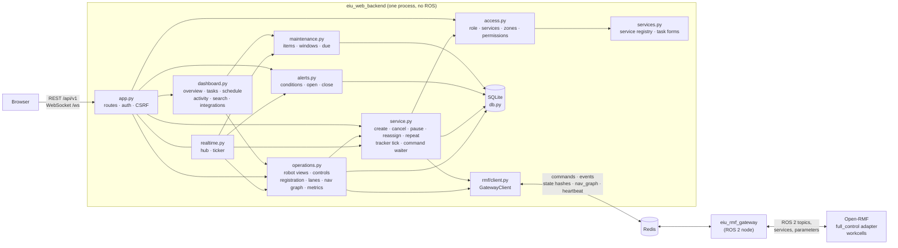

# EIU Robot Services — Web Backend

The web backend serves the REST API and the realtime stream of the EIU robot operations platform. Two roles: `operator` runs the robot services (delivery, cleaning, patrol, ...) an admin assigned, within the assigned zones and permissions; `admin` has every service and permission plus accounts, locations, integrations and settings. It is plain Python (FastAPI, SQLAlchemy, SQLite) and has no ROS 2 node: it reaches Open-RMF and the fleet adapters through [`eiu_rmf_gateway`](../../../eiu_rmf_gateway/README.md) over Redis. The browser never talks to ROS 2, MQTT or Redis.

Every topic, key, endpoint and message is listed in [../docs/interfaces.md](../docs/interfaces.md). The API follows the contract in [`../frontend/src/api/types.ts`](../frontend/src/api/types.ts), the same contract as the frontend's demo backend.

## Architecture



| Module | Role |
|---|---|
| `settings.py` | Reads `config/settings.yaml` over the defaults; rejects unknown keys and wrong types |
| `site.py` | Campus catalog `config/site.yaml` (floors, zones, locations, cleaning areas, patrol routes, templates), checked against the nav graph; map image; lane routes; RMF lane numbering of each level; follows nav graph edits |
| `services.py` | Service registry `config/services.yaml`: services, their RMF category, required capabilities and task form; fleets and their capabilities; validation of task parameters against the form |
| `access.py` | Authorization: visibility of robots, tasks and alerts per viewer; the checks of a new task; admin switches of services and zones |
| `db.py` | Tables: users (with services, zones, permissions), sessions, saved locations, deliveries (tasks of every service), delivery events, notifications, alerts, robot samples, maintenance items, toggles, audit log; migration of earlier databases |
| `security.py` | Argon2id passwords, server-side sessions, CSRF token, sign-in lockout, permission catalog (operator-grantable and admin-only) |
| `rmf/client.py` | `GatewayClient`: writes commands to the gateway's command stream; reads its events, fleet, workcell and operations states, nav graph and heartbeat |
| `rmf/requests.py` | Open-RMF task request envelopes: `delivery`, `patrol`, `clean` (dispatch or robot task request, priority), `cancel_task_request`, `interrupt_task_request`, `resume_task_request` |
| `rmf/shared.py` | `eiu_fleet_ui.task_state` (source ranks), `eiu_fleet_ui.metrics_model` (adapter health) and RMF's state labels |
| `service.py` | Creates tasks from a service and its parameters, cancels, pauses, resumes and reassigns them, queues the next task of a repeat series; the tracker merges the RMF sources each tick; `CommandWaiter` hands command answers to the waiting requests |
| `operations.py` | Robot views (status, service, current task, health, runtime, telemetry), system health, robot controls, registration (with suggestions for discovered robots), lane closures, nav graph view and save, adapter metrics |
| `dashboard.py` | Per-viewer views: overview, tasks, task details, schedule, task activity, service and place catalog, integrations |
| `maintenance.py` | Maintenance items, robots in a maintenance window, items past due, the maintenance table with operating hours |
| `admin.py` | Administration: accounts with their access, access catalog, service and zone switches, effective settings, audit log, system overview, chargers, doors and lifts of the nav graph |
| `history.py` | A sample of every robot (battery, mode, whether it has a task) every `history.sample_s`, kept `history.keep_days`; battery series, utilization per day, operating hours, charging sessions |
| `analytics.py` | Analytics over 1, 7 or 30 days from the task records, their events, the alerts and the robot history, narrowed to the viewer's tasks and a service, robot or zone; figures per service |
| `alerts.py` | Operations alerts: conditions of the RMF link, fleets, robots, adapters and tasks evaluated each tick; open, update, acknowledge and close |
| `realtime.py` | Per-viewer keyed robot patches, change events, RMF link status |
| `views.py` | Rows to API DTOs, timeline, allowed actions |
| `__main__.py` | `serve` and account commands |

## Tasks on Open-RMF

| Task | RMF request | Places |
|---|---|---|
| Delivery | `category: delivery`, pickup at a dispenser, drop-off at an ingestor | Waypoint and handlers of the catalog locations; handlers default to `delivery.pickup_handler` and `delivery.dropoff_handler` |
| Patrol | `category: patrol`, `places` in order, `rounds` | Waypoints of the route's stops (or of the `stops` of the first release's request) |
| Cleaning | `category: clean`, `description.zone`, labels `cleaningMode=`, `duration=` | `rmf_zone` of the cleaning area |

A scheduled task sets `unix_millis_earliest_start_time`; priority `high` sets `priority: {type: binary, value: 1}`. A task with a chosen robot is a `robot_task_request` (`fleet`, `robot`), otherwise a `dispatch_task_request`. Pause and resume are `interrupt_task_request` and `resume_task_request` with the token of the interruption. Reassignment cancels a task that has not started and sends a copy as a `robot_task_request`. A repeating task (`daily`, `weekdays`, `weekly`) queues its next occurrence when the current one becomes due. The gateway publishes the request unchanged.

### Task state

The tracker runs every `realtime.period_s`. It reads the gateway's events and state, and merges the sources with the ranks of `eiu_fleet_ui/task_state.py`: a stronger source may change a state in any direction, an equal or weaker one may only move it forward.

| Source (through the gateway) | Gives |
|---|---|
| `/task_api_responses` | RMF task id of a request; refusal; cancel answer |
| `/dispatch_states` | Queued, failed, cancelled; the assigned robot |
| `/fleet_states` | A robot carrying the task id (underway) or dropping it (completed); position, battery, path, ETA |
| `/dispenser_states`, `/ingestor_states` | The robot waits at the pickup or at the drop-off |
| Task events WebSocket | Status, assigned robot, active phase, completed phases (patrol rounds), finish time |
| Gateway `command_result` | A command refused or not published (`gateway.<error>`) |

| Delivery status | Condition |
|---|---|
| `scheduled` / `queued` | RMF state queued, before or after the pickup time |
| `to_pickup` | Underway, before the pickup |
| `at_pickup` | The pickup dispenser is busy |
| `in_transit` | The dispenser finished, or the active phase is 2 or later |
| `arrived` | The drop-off ingestor is busy |
| `completed` / `cancelled` / `failed` | RMF state |

A patrol is `underway` between queued and its final state. A final state reached only from `/fleet_states` stays open to correction by a stronger source for `rmf.correction_window_s`. A request without an RMF task id after `rmf.dispatch_timeout_s` fails with `dispatch.no_response`; a request that cannot reach Redis fails at once with `gateway.unreachable`.

When `/fleet_states` carries no path, the backend draws the shortest lane route from the robot to its current delivery target (pickup, then drop-off) and reports its length as the remaining distance.

## Roles and access

| Role | Services | Zones | Permissions |
|---|---|---|---|
| `operator` | `allowed_services` set by an admin | `allowed_zones`; empty = every zone | `permissions` set by an admin, from the grantable list |
| `admin` | Every enabled service | Every zone | Every permission, including the admin-only ones |

| Group | Permissions |
|---|---|
| Task (grantable) | `task.create`, `task.cancel`, `task.schedule`, `task.pause`, `task.reassign` |
| Fleet (grantable) | `fleet.view`, `fleet.view_all` (robots and alerts of other services, read-only), `fleet.assign` (choose the robot of a new task), `fleet.control` (pause, resume, speed limit, position), `alerts.ack` |
| Insight (grantable) | `analytics.view`, `maintenance.view` |
| Admin only | `users.manage`, `robots.manage`, `locations.manage`, `maintenance.manage`, `integrations.manage`, `settings.manage`, `system.diagnostics` |

A new operator gets `task.create`, `task.cancel`, `task.schedule`, `fleet.view`, `alerts.ack`, `analytics.view`, `maintenance.view` unless the admin chooses others. Accounts of the former `user` role become operators of `delivery` and `patrol` with `task.create`, `task.cancel`, `fleet.view` when the database is opened.

Visibility: an operator sees the robots of fleets whose capabilities cover one of the operator's services, the tasks of those services in the allowed zones (and the operator's own tasks), and the alerts about those robots and tasks. `fleet.view_all` and the admin role see everything.

A new task (`POST /tasks`) passes, in order: session, account active, role valid, service enabled (409 `SERVICE_DISABLED`), service allowed (403 `SERVICE_NOT_ALLOWED`), parameters valid against the form (422 `task.<reason>`, the field in `message`), every zone allowed (403 `ZONE_NOT_ALLOWED`) and open (409 `ZONE_DISABLED`), `task.create` (403 `PERMISSION_DENIED`), a configured or reporting fleet with the service's capabilities (409 `NO_CAPABLE_FLEET`). A chosen robot also needs `fleet.assign` and a capable fleet (409 `ROBOT_NOT_CAPABLE`). Authorization errors carry a `message` in the user's language. An admin endpoint answers 403 `ADMIN_ONLY` to an operator.

## Services

`config/services.yaml` (`site.services`) lists the services and the fleets.

| Service key | Meaning |
|---|---|
| `id`, `name`, `description` | Identifier; names in Vietnamese and English |
| `icon` | `package`, `sparkles`, `shield`, `bot`, `truck`, `camera`, `wrench` |
| `enabled` | Default state; admins switch it in Settings (table `toggles`) |
| `category` | RMF task category: `delivery`, `patrol` or `clean`; its request builder reads `pickup` and `dropoff` (delivery), `route` or `stops` and `rounds` (patrol), `area` (clean) |
| `capabilities` | Capabilities a fleet's robots need for the service |
| `form` | The task form, in order |

| Field type | Value | Options |
|---|---|---|
| `location` | Catalog location id | `differs_from` |
| `locations` | Ordered list of location ids | `max_items` |
| `area` | Cleaning area id | `filter` (zone field) |
| `route` | Patrol route id | `filter` (zone field) |
| `zone` | Zone id | |
| `select` | One of `options` | `default` |
| `number` | Number in `[min, max]` | `default`, `unit` |
| `text` | Text up to `max` characters | |
| `schedule` | The shared start time control | `repeat` (the service allows a repeat) |

Every field has `key`, `type` and optional `required` and `label` (Vietnamese and English). Location, area, route and zone values give the zones of the task. The frontend labels fields and options by key (`taskForm.field.<key>`, `taskForm.option.<key>.<value>`); a new key without a translation shows `label` or the key. `fleets` maps an RMF fleet name to its primary service (the robot type shown) and its capabilities; a fleet missing there is listed as "Other" for admins. A new service of an existing category needs only configuration; a new category needs a builder in `rmf/requests.py`.

## Administration

| Endpoint | Permission | Does |
|---|---|---|
| `GET /admin/overview` | `system.diagnostics` | `/fleet/overview` plus fleets configured and healthy, maps, integrations healthy, active accounts and admins, the last audit entries |
| `GET /admin/infrastructure` | `locations.manage` | Chargers (with the robot using each, from the registries), doors and lifts of the nav graph the gateway serves, or of `map.nav_graph` |
| `GET /admin/audit?q=&action=&limit=` | `system.diagnostics` | Audit entries, newest first, with the actor's name; the list of action names |
| `GET` / `POST /admin/users`, `PATCH /admin/users/{id}`, `POST /admin/users/{id}/password` | `users.manage` | List, create (email, name, department, role, password, services, zones, permissions, active), change any of these, set a password. A change of access reaches the user's open pages at once (event `access`). A role change, disabling or a new password ends the user's sessions; an admin cannot change the role of or disable their own account (409 `users.self`) |
| `GET /admin/roles`, `GET /admin/access-catalog` | `users.manage` | Permissions of each role; services, zones, grantable permission groups and defaults for the access editor |
| `PUT /admin/toggles/{service\|zone}/{id}` `{enabled}` | `settings.manage` | Switch a service or a zone on or off; a closed zone refuses new tasks |
| `GET /admin/settings` | `settings.manage` | Effective settings (without secrets), services, zones, fleets, templates, source files |
| `GET /admin/integrations` | `integrations.manage` | Cards for Open-RMF, the ROS 2 gateway, VDA5050 adapters, MQTT and vendor APIs: status, last update, fleets, configuration, recent alerts and changes |
| `GET /fleet/robots/{name}?hours=24` (also `/admin/robots/{name}`) | `fleet.view`, robot visible | Live robot, technical status (RMF mode and task, nearest waypoint, adapter, controls, pause state, speed limit, age of the last `/fleet_states`, interface, manufacturer, serial, charger), last 10 tasks, battery samples of the last `hours`, utilization of 7 days, events (task events, alerts, audit entries of the robot) |
| `GET /analytics?days=1\|7\|30&service_type=&robot=&zone=` (also `/admin/analytics`) | `analytics.view` | Over the viewer's tasks: tasks created, completed, failed, cancelled; success rate (completed / (completed + failed)); average completion time (request to done) and wait for a robot (request to assigned); utilization (active hours / online hours); tasks, utilization and alerts per day; busiest places; battery levels now; most frequent alerts; `byService` figures (deliveries and delivery time; cleanings and areas; patrol rounds, zones covered and round time; distance, area and coverage stay null until a robot reports them) |

Utilization: each sample counts as `history.sample_s` in one state — active (has a task, or moving, docking, going home, cleaning), charging, offline (RMF or the adapter's report lost the robot), otherwise idle.

Health rows (`/fleet/overview`, `/admin/overview`) carry `details`: database engine; gateway heartbeat age, uptime, ROS domain, nav graph file; fleets reporting and robots known to RMF; per fleet the age of its last `/fleet_states`, robots online, adapter node, interface; per adapter the last report, period, uptime, robots heard, messages received and dropped, publish failures; per MQTT link the connection and connections lost.

## Platform views

| Endpoint | Permission | Does |
|---|---|---|
| `GET /services`, `GET /catalog` | session | Services the viewer may use (admins: all, with `enabled`), with form, `allowed`, `available`, capable fleets; zones (`enabled`, `allowed`), areas, routes |
| `GET /overview` | session | Robots (total, online, available, average battery), tasks (active, executing, scheduled, completed and failed today, success rate), open alerts, one card per service (robots by state, tasks today, active tasks, rounds today for patrols), today's schedule; admins also health |
| `GET /tasks?service_type=&state=&q=&group=&mine=` | session | Visible tasks with counts per state and group, summary, unassigned and late lists |
| `POST /tasks` `{serviceType, parameters, scheduledAt, repeat, robot}` | `task.create` | New task, see Roles and access |
| `GET /tasks/{id}` | visible | Task with its activity (events and audit entries) |
| `POST /tasks/{id}/cancel\|pause\|resume\|reassign` | `task.cancel`, `task.pause`, `task.reassign` | Actions allowed by the task's `actions` |
| `GET /schedule?start=&end=&service_type=&robot=&zone=` | session | Tasks by start time, maintenance windows and due dates, charging sessions from the robot history (at most 62 days) |
| `GET /analytics/activity?range=today\|week\|month&service_type=` | session | Created, running, completed and failed tasks per hour or day |
| `GET /maintenance`, `POST /maintenance`, `PATCH /maintenance/{id}` | `maintenance.view`; writes `maintenance.manage` | Table per robot (health, status none/scheduled/due_soon/due/in_progress, next item, operating hours since the last finished item) and items; an item in progress or inside its window takes the robot out of service (status `MAINTENANCE`); an overdue item opens `maintenance.due` |
| `GET /alerts?state=open\|all` | `fleet.view` | Alerts the viewer may see |
| `GET /search?q=` | session | Visible robots and tasks, places, zones; admins also users |

Robot status: `OFFLINE` (stale), `ERROR` (emergency or adapter error), `MAINTENANCE`, `PAUSED`, `CHARGING`, `EXECUTING` (a patrol or cleaning underway, or a delivery waiting at a workcell), `NAVIGATING` (moving), `IDLE`. Health: `critical` (offline, error or a critical alert), `warning` (a warning alert or maintenance), `healthy`. Task state: `SCHEDULED`, `QUEUED`, `ASSIGNED`, `EXECUTING`, `PAUSED`, `COMPLETED`, `CANCELLED`, `FAILED`. A robot's `telemetry` holds what its fleet state reports under `telemetry`; the gateway does not send any yet.

## Operations

Robot controls need `fleet.control`, registration `robots.manage`, lanes and the nav graph `locations.manage`, adapter health `system.diagnostics`. Every request becomes one gateway command (see [the contract](../../../eiu_rmf_gateway/docs/contract.md)); the backend waits for the answer and returns the fleet adapter's verdict. The adapter owns the rules: the backend checks only the shape of a request.

| Feature | Endpoint | Gateway command | Waits for |
|---|---|---|---|
| Pause, resume | `POST /fleet/robots/{robot}/pause`, `/resume` | `robot_pause`, `robot_resume` | `command_result`, `operations.command_timeout_s` |
| Speed limit | `POST /fleet/robots/{robot}/speed-limit` `{mps}` | `robot_speed_limit` | `command_result` |
| Set position | `POST /fleet/robots/{robot}/init-position` `{waypoint, yaw}` or `{x, y, yaw}` | `robot_init_position`; a waypoint becomes its nav graph position on the robot's level | `command_result` |
| Check, add, remove a robot | `POST /fleet/registration` | `registration_request` (`dry_run` for a check) | `registration_result`, `operations.registration_timeout_s` |
| Close, open lanes | `POST /fleet/lanes` | `lane_request` for the given fleet, or for every fleet | `command_result` per fleet |
| Save the nav graph | `PUT /fleet/nav-graph` | `nav_graph_save` with the SHA-256 the editor started from | `command_result` |
| Adapter health | `GET /fleet/system` | — | — |
| Overview | `GET /fleet/overview` | — | — |
| Tasks of every user | `GET /fleet/tasks`, `POST /fleet/tasks/{id}/cancel` | `task_request` (`cancel_task_request`) | — |
| Alerts | `GET /fleet/alerts`, `POST /fleet/alerts/{id}/ack`, `/ack-all`, `/{id}/resolve` | — | — |

Answers: the result when the command succeeded; 409 `command.<error>` with the adapter's message when it was refused; 504 `command.no_answer` without an answer in time; 503 `rmf.unavailable` without a gateway. Every change is written to the audit log with the user, the target and the request.

Registration. `GET /fleet/registration` merges the discovery snapshots of all adapters and suggests, for each unregistered robot, its earlier place when it was removed in this adapter session, otherwise a fleet of the same series, the next free name in that fleet's numbering and a free charger. A check runs the adapter's rules without changing anything.

Lanes. Lane indices are RMF's: the nav graph's lanes, level after level in file order, each direction separately. `GET /fleet/lanes` returns each fleet's closed lanes and each level's first index (`offsets`).

Nav graph. With the gateway parameter `nav_graph_path` set, `GET /fleet/nav-graph` returns one level of that file (vertices with name, position, charger flag and their other attributes; directed lanes with attributes) and its SHA-256. `PUT` rebuilds the level, keeps the other levels and keys, and refuses duplicate names, bad positions, lanes to missing vertices, duplicate lanes, a removed or renamed waypoint of a campus location, and a stale SHA-256. When the gateway reports a new nav graph, the backend updates the level graph and moves the catalog locations to their waypoints. The fleet adapter loads the new graph when it restarts.

Overview. Robot counts by state, task counts (running, waiting for a robot, scheduled, done and failed today), open alert counts and the health of each link of the chain: database, gateway, Open-RMF, task events, each fleet, each adapter and its MQTT connection.

Tasks. `GET /fleet/tasks` lists the tasks of every user by group (running, scheduled, finished, all), type and text, with a summary of today, the queued tasks without a robot and the running tasks past their ETA by `operations.late_after_s`. Cancelling needs `task.cancel` and a visible task. The list is built from the data, so a new task type needs no new page.

Alerts. `alerts.py` evaluates its conditions after each tracker tick and keeps the alerts in the `alerts` table (code and parameters, so the text follows the reader's language). A condition alert opens after its condition held for `alerts.open_after_s` and closes when the condition ends; a failed task is an event alert that an operator closes. A fleet whose robots are all silent gives one `fleet.offline` alert, not one per robot. RMF keeps reporting a robot whose AGV went silent, so the adapter's metrics (robots online against registered, the longest silent robot and its state age) give `adapter.robots_offline` and mark that robot `offline` in `/fleet/robots` and the overview. The list of conditions is in [../docs/interfaces.md](../docs/interfaces.md).

Pause state. The fleet adapter does not publish whether a robot is paused; `/fleet/robots` returns `paused` from the gateway, the result of the last pause or resume sent through it (`null` when unknown).

Health. Each tick folds the adapters found by the gateway and their `~/metrics` reports into `eiu_fleet_ui.metrics_model`, the model of the desktop dashboard: status per adapter, items needing attention, and the history of message rate and update loop time.

A change of the operations state or of any task sends `{"type": "event", "topics": ["fleet"]}`, and a change of the alerts `{"type": "event", "topics": ["alerts"]}`, to the connections with `fleet.view`. A change of an account's access, or of a service or zone switch, sends `access` to the affected connections and updates which robots they receive.

### RMF link status

| `/status` | Condition |
|---|---|
| `online` | Gateway heartbeat present and at least one fleet reported within `rmf.fleet_offline_s` |
| `offline` | Gateway heartbeat present, no fleet reporting |
| `unavailable` | No gateway heartbeat, or Redis unreachable; new tasks answer 503 `rmf.unavailable` |
| `disabled` | `rmf.enabled: false` |

## Run

The backend needs Redis and a running [`eiu_rmf_gateway`](../../../eiu_rmf_gateway/README.md) on the same Redis. It does not need ROS 2, the ROS domain or the IPC namespace of Open-RMF.

### In the fleet stack container

The Jazzy development image of the fleet adapter (`vda5050_fleet_adapter_full_control/docker`, image `rmf_jazzy_vda`) has the backend's libraries, Redis and the gateway's dependencies. Inside its container (`docker/run.sh`):

```bash
redis-server --bind 127.0.0.1 --port 6379 --daemonize yes
colcon build --packages-select eiu_rmf_gateway && source install/setup.bash
ros2 launch eiu_rmf_gateway gateway.launch.py &

cd /ros2_ws/src/eiu_fleet_ui/web_dashboard/backend
python3 -m eiu_web_backend create-user --email admin@eiu.edu.vn --name "Admin Name" --role admin
python3 -m eiu_web_backend create-user --email op@eiu.edu.vn --name "Operator" --services delivery,cleaning --zones building_a
python3 -m eiu_web_backend serve
```

### On the host

Use a virtual environment so the backend's libraries stay apart from other Python packages of the machine (a package named `argon2`, for example, hides `argon2-cffi`):

```bash
cd ~/ros2_ws/src/eiu_fleet_ui/web_dashboard/backend
python3 -m venv .venv
.venv/bin/pip install -r requirements.txt          # requirements-dev.txt for the tests
.venv/bin/python -m eiu_web_backend serve
```

### In its own container

The image is `python:3.12-slim` with the libraries of `requirements.txt` (runtime) and, with `--build-arg WITH_TESTS=true`, `requirements-dev.txt` (pytest, httpx); the code is mounted, not copied. The Jazzy image `rmf_jazzy_vda` installs the same `requirements.txt`.

```bash
cd ~/ros2_ws/src/eiu_fleet_ui/web_dashboard/backend
docker build -t eiu_web_backend .                                # --build-arg WITH_TESTS=true adds pytest and httpx

docker run --rm -it -v ~/ros2_ws/src/eiu_fleet_ui:/eiu_fleet_ui eiu_web_backend \
    create-user --email admin@eiu.edu.vn --name "Admin Name" --role admin

docker run -d --name eiu_web_backend --network host \
    -e EIU_WEB_REDIS_URL=redis://127.0.0.1:6379/0 \
    -v ~/ros2_ws/src/eiu_fleet_ui:/eiu_fleet_ui eiu_web_backend
```

Account commands: `create-user`, `set-password`, `disable-user`, `list-users`. Changing a password or disabling a user ends that user's sessions. No default account exists.

The frontend reaches the backend through the Vite proxy: `npm run dev:backend` in `../frontend` (reads `.env.backend`, backend at `http://127.0.0.1:8000`). `npm run dev:lan` does the same and also opens the dev server to the local network; the backend keeps listening on `127.0.0.1` only.

The catalog's waypoints must exist in the nav graph the fleet adapter uses: point `map.nav_graph` (or `EIU_WEB_NAV_GRAPH`) at that graph.

## Settings

`config/settings.yaml`; `EIU_WEB_SETTINGS` selects another file. Relative paths are relative to the file's folder.

| Key | Variable | Default | Effect |
|:---:|:---:|:---:|---|
| `server.host`, `server.port` | `EIU_WEB_HOST`, `EIU_WEB_PORT` | `127.0.0.1`, 8000 | Listen address |
| `server.database` | `EIU_WEB_DATABASE` | `../data/eiu_web.sqlite3` | SQLite file |
| `server.secure_cookies` | — | false | `Secure` cookies; true behind HTTPS |
| `server.session_hours` | — | 12 | Session lifetime |
| `site.name`, `site.time_zone`, `site.default_locale` | — | | Shown by `/config` |
| `site.catalog` | — | `site.yaml` | Floors, zones, locations, cleaning areas, patrol routes, templates |
| `site.services` | — | `services.yaml` | Services, task forms, fleets and capabilities |
| `map.map_yaml`, `map.nav_graph` | `EIU_WEB_NAV_GRAPH` | `eiu_fleet_ui/maps` | Occupancy map and nav graph |
| `map.level` | — | the only level | Nav graph level of `map_yaml` |
| `map.rmf_levels` | — | {} | RMF level name → nav graph level |
| `rmf.enabled` | `EIU_WEB_RMF` | true | Connect to the gateway |
| `rmf.requester` | — | `eiu_web_dashboard` | Requester of task requests |
| `rmf.dispatch_timeout_s`, `rmf.cancel_timeout_s` | — | 15 s | Time to wait for RMF's answer |
| `rmf.fleet_offline_s` | — | 5 s | Time without fleet state before a fleet is stale |
| `rmf.correction_window_s` | — | 600 s | Time a weakly finished task stays open to correction |
| `redis.url` | `EIU_WEB_REDIS_URL` | `redis://127.0.0.1:6379/0` | Redis of the gateway |
| `redis.prefix` | — | `eiu:rmf` | Key prefix of the gateway |
| `redis.cursor_key` | — | `eiu:web:events_cursor` | Where the backend keeps its last event id |
| `delivery.max_open` | — | 20 | Open tasks per user, running and scheduled |
| `delivery.arriving_soon_s` | — | 30 s | ETA left when "arriving soon" is reported |
| `delivery.pickup_handler`, `dropoff_handler` | — | `mock_dispenser_1`, `mock_ingestor_1` | Default workcells |
| `delivery.schedule_min_lead_s`, `schedule_max_ahead_days`, `note_max` | — | 60 s, 14 d, 200 | Request limits |
| `patrol.max_stops`, `patrol.max_rounds` | — | 8, 10 | Patrol limits |
| `realtime.period_s` | — | 0.5 s | Tracker and stream period |
| `operations.command_timeout_s` | — | 12 s | Wait for the answer of a robot, lane or nav graph command |
| `operations.registration_timeout_s` | — | 15 s | Wait for a fleet adapter's registration verdict |
| `operations.tasks_limit` | — | 200 | Finished tasks listed by `/fleet/tasks` |
| `operations.late_after_s` | — | 120 s | A running task past its ETA by more than this is listed as late |
| `history.sample_s`, `history.keep_days` | — | 60 s, 30 | Robot sample period and retention |
| `maintenance.due_soon_days` | — | 3 | A maintenance item due within this many days is "due soon" |
| `alerts.open_after_s` | — | 5 s | Time a condition must hold before its alert opens |
| `alerts.battery_low_pct`, `alerts.battery_critical_pct` | — | 20, 10 | Battery alert thresholds (warning, critical) |
| `alerts.task_waiting_s` | — | 600 s | Time a task may wait for a robot before an alert |
| `alerts.failed_window_s` | — | 86400 s | Failed tasks younger than this open an alert |
| `alerts.history_limit` | — | 200 | Alerts listed by `/fleet/alerts?state=all` |
| `metrics.history_samples` | — | 120 | Reports kept per adapter for the history |
| `metrics.silent_factor`, `metrics.grace_s` | — | 3, 10 s | An adapter is silent after this many report intervals; absent adapters are reported after the grace time |
| `auth.min_password_length`, `lock_failures`, `lock_s` | — | 8, 5, 60 s | Password and lockout |
| `support.*` | — | | Support contact shown to users |

## Security

| Concern | Rule |
|---|---|
| Accounts | Created with the CLI; Argon2id hashes |
| Session | Random id in an `HttpOnly`, `SameSite=Lax` cookie; data in the `sessions` table |
| CSRF | Writes need `X-CSRF-Token` equal to the session's token, and a same-host `Origin` |
| Sign-in | Lockout after `auth.lock_failures` failures per email and client address |
| Authorization | Role, services, zones and permissions checked on every endpoint (`access.py`); a task the viewer may not see answers 404 |
| WebSocket `/ws` | Session cookie and same-host `Origin`; robots of the viewer's services only (all with `fleet.view_all` or role admin) |
| Operator commands | Permission per endpoint (`fleet.control`, `robots.manage`, `locations.manage`); the gateway accepts only the command types of the contract with checked bodies; the fleet adapter decides each request |
| Nav graph | Written only by the gateway, to the one file `nav_graph_path`, after a stale check, with a `.bak` copy and an atomic replace |
| Redis | Bound to `127.0.0.1`; across machines only with a password on a private network |
| Audit | Sign-ins, failed sign-ins, account and access changes, service and zone switches, task creation, cancellation, pause, resume, maintenance items, every operator command, alert acknowledgements and closures |

## Tests

```bash
cd ~/ros2_ws/src/eiu_fleet_ui/web_dashboard/backend
docker run --rm -u "$(id -u):$(id -g)" -e PYTHONDONTWRITEBYTECODE=1 -v ~/ros2_ws/src/eiu_fleet_ui:/eiu_fleet_ui \
    --entrypoint python3 eiu_web_backend -m pytest -q -p no:cacheprovider tests
# or inside rmf_jazzy_vda_dev: python3 -m pytest -q tests
```

The tests use a fake gateway link and an in-memory Redis stand-in; they need neither ROS nor a Redis server.

| File | Covers |
|---|---|
| `test_settings_site.py` | Settings validation, catalog against the nav graph, image header, lane routes |
| `test_service.py` | Status derivation; a delivery through every RMF source; events outranking the fleet guess; patrol rounds; dispatch timeout; refused command; unreachable gateway |
| `test_gateway_client.py` | Command format; event reading from the stored cursor; fleets, workcells and heartbeat |
| `test_api.py` | Session, lockout, CSRF and origin checks, task creation and validation, per-user isolation, open-task limit, site endpoints |
| `test_admin.py` | Users without operations or admin access, account creation, update, self-protection, password, roles, audit entries and search, admin overview, infrastructure |
| `test_history_analytics.py` | Utilization buckets, one sample per period, battery series, robot details, analytics figures, unassigned and late task lists |
| `test_alerts.py` | Alert lifecycle (open, escalate, close by itself), the open delay, one alert for a silent fleet, the adapter hearing fewer robots and the robot marked offline, task alerts, acknowledge and close rules, overview counts, tasks of every user with search and operator cancel |
| `test_operations.py` | Registration suggestions and discovery merge, nav graph checks, robot controls with answers and refusals, waypoint positions, registration check, lanes with offsets, nav graph view and save (stale base, catalog waypoints), metrics and nav graph updates in the tick, requests without a gateway |
