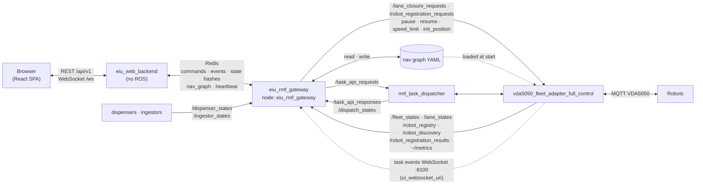

# Web Dashboard — Interfaces

This document lists every interface of the web stack: the Redis link between the web backend (`backend/eiu_web_backend`) and `eiu_rmf_gateway`, the ROS 2 topics, services and parameters the gateway uses with Open-RMF and `vda5050_fleet_adapter_full_control`, the nav graph file, the task events WebSocket of the fleet adapter, and the REST API and WebSocket used by the browser.



The browser and the backend have no ROS 2 or MQTT connection. The gateway is the only ROS 2 node of the web stack. Tasks go to the RMF dispatcher; operator commands go to the fleet adapter through the ROS 2 interfaces the adapter offers to operators (the same ones `eiu_fleet_ui` uses). The gateway does not use MQTT and never talks to robots: the fleet adapter decides every request and answers with its verdict.

## 1. Backend ↔ gateway (Redis)

Defined in [eiu_rmf_gateway/docs/contract.md](../../../eiu_rmf_gateway/docs/contract.md) (contract v1). Prefix `eiu:rmf` (`redis.prefix` in the backend, `redis_prefix` in the gateway).

| Key | Type | Writer → reader | Content |
|---|---|---|---|
| `eiu:rmf:commands` | Stream | backend → gateway | `task_request` (Open-RMF task API request), `robot_pause`, `robot_resume`, `robot_speed_limit`, `robot_init_position`, `registration_request`, `lane_request`, `nav_graph_save` |
| `eiu:rmf:events` | Stream | gateway → backend | `task_api_response`, `dispatch_states`, `task_state`, `command_result`, `registration_result` |
| `eiu:rmf:fleets` | Hash | gateway → backend | Latest state of each fleet: robots and `received_ms` |
| `eiu:rmf:workcells` | Hash | gateway → backend | Busy state of each dispenser and ingestor |
| `eiu:rmf:adapters` | Hash | gateway → backend | Fleet adapter nodes, their robots, whether they publish metrics |
| `eiu:rmf:controls` | Hash | gateway → backend | Per robot: adapter node, speed limit, whether controls are available |
| `eiu:rmf:metrics` | Hash | gateway → backend | Latest `~/metrics` report of each adapter |
| `eiu:rmf:lanes` | Hash | gateway → backend | Closed lanes of each fleet |
| `eiu:rmf:registry` | Hash | gateway → backend | Registered robots and chargers of each fleet |
| `eiu:rmf:discovery` | Hash | gateway → backend | Unregistered robots seen on the broker, per reporting adapter |
| `eiu:rmf:nav_graph` | String | gateway → backend | Nav graph file: path, SHA-256, YAML text |
| `eiu:rmf:gateway` | String, 3 s expiry | gateway → backend | Heartbeat; missing = RMF `unavailable` |
| `eiu:web:events_cursor` | String | backend | Last event read, to resume after a restart |

| Backend (`rmf/client.py`) | Reads or writes |
|---|---|
| `send(request_id, envelope)` | `XADD eiu:rmf:commands` (`task_request`) |
| `command(type, id, body)` | `XADD eiu:rmf:commands` (any command type) |
| `drain()` | `XREAD eiu:rmf:events` from the cursor; maps events to the tracker's sources and to the waiting operator commands |
| `snapshot(offline_s)` | Heartbeat, fleets, workcells, the operations hashes and the nav graph in one pipeline; a fleet older than `rmf.fleet_offline_s` is stale |

An operator request waits for its command's answer (`operations.command_timeout_s`, `operations.registration_timeout_s` for registrations): a robot command for its `command_result`, a registration for its `registration_result`.

## 2. ROS 2 interfaces (gateway ↔ Open-RMF and the fleet adapter)

Node `eiu_rmf_gateway` (`eiu_rmf_gateway/ros_io.py`), in the `ROS_DOMAIN_ID` of Open-RMF. The tables also give how the backend uses each item after it arrives through Redis.

### Overview

| Topic | Type | Direction | Peer | QoS |
|---|---|:---:|---|---|
| `/task_api_requests` | `rmf_task_msgs/ApiRequest` | publish | `rmf_task_dispatcher` | RELIABLE, TRANSIENT_LOCAL, KEEP_LAST 10 |
| `/task_api_responses` | `rmf_task_msgs/ApiResponse` | subscribe | `rmf_task_dispatcher` | RELIABLE, TRANSIENT_LOCAL, KEEP_LAST 10 |
| `/dispatch_states` | `rmf_task_msgs/DispatchStates` | subscribe | `rmf_task_dispatcher` | RELIABLE, VOLATILE, KEEP_LAST 1 |
| `/fleet_states` | `rmf_fleet_msgs/FleetState` | subscribe | `vda5050_fleet_adapter_full_control` | default, KEEP_LAST 10 |
| `/dispenser_states` | `rmf_dispenser_msgs/DispenserState` | subscribe | dispensers (`mock_dispenser_1`) | default, KEEP_LAST 10 |
| `/ingestor_states` | `rmf_ingestor_msgs/IngestorState` | subscribe | ingestors (`mock_ingestor_1`) | default, KEEP_LAST 10 |
| `/lane_closure_requests` | `rmf_fleet_msgs/LaneRequest` | publish | fleet adapters | RELIABLE, TRANSIENT_LOCAL, KEEP_LAST 10 |
| `/lane_states` | `rmf_fleet_msgs/LaneStates` | subscribe | fleet adapters | RELIABLE, TRANSIENT_LOCAL, KEEP_LAST 10 |
| `/robot_registration_requests` | `std_msgs/String` (JSON) | publish | fleet adapters | RELIABLE, VOLATILE, KEEP_LAST 20 |
| `/robot_registration_results` | `std_msgs/String` (JSON) | subscribe | fleet adapters | RELIABLE, VOLATILE, KEEP_LAST 20 |
| `/robot_registry` | `std_msgs/String` (JSON) | subscribe | fleet adapters | RELIABLE, TRANSIENT_LOCAL, KEEP_LAST 1 |
| `/robot_discovery` | `std_msgs/String` (JSON) | subscribe | fleet adapters | RELIABLE, TRANSIENT_LOCAL, KEEP_LAST 1 |
| `/<adapter>/metrics` | `std_msgs/String` (JSON) | subscribe | each fleet adapter | default, KEEP_LAST 10 |
| `/<adapter>/<robot>/init_position` | `geometry_msgs/PoseWithCovarianceStamped` | publish | fleet adapter | default, KEEP_LAST 1 |
| `/<adapter>/<robot>/init_position_result` | `std_msgs/String` | subscribe | fleet adapter | default, KEEP_LAST 1 |

| Service or parameter | Type | Peer | Used for |
|---|---|---|---|
| `/<adapter>/<robot>/pause`, `/<adapter>/<robot>/resume` | `std_srvs/Trigger` | fleet adapter | Pause and resume one robot; the gateway also finds adapters and robots by these services |
| Parameter `speed_limit.<robot>` | double, m/s, 0 = none | fleet adapter node | Read at discovery, set by `robot_speed_limit` |

### `/task_api_requests` (gateway → dispatcher)

The backend builds the request (`rmf/requests.py`) and sends it as a `task_request` command; the gateway publishes it with `ApiRequest.request_id` = the command id (`eiu-web-<12 hex>` for tasks, `eiu-web-cancel-<10 hex>` for cancels) and `ApiRequest.json_msg` = the request. RMF answers with the same id on `/task_api_responses`.

Delivery:

```json
{"type": "dispatch_task_request", "request": {
  "category": "delivery",
  "description": {
    "pickup":  {"place": "Patrol_A2", "handler": "mock_dispenser_1", "payload": {"sku": "documents", "quantity": 1}},
    "dropoff": {"place": "Patrol_F3", "handler": "mock_ingestor_1",  "payload": {"sku": "documents", "quantity": 1}}
  },
  "unix_millis_earliest_start_time": 0,
  "requester": "eiu_web_dashboard"}}
```

Patrol:

```json
{"type": "dispatch_task_request", "request": {
  "category": "patrol",
  "description": {"places": ["Patrol_B1", "Patrol_E1"], "rounds": 2},
  "unix_millis_earliest_start_time": 0,
  "requester": "eiu_web_dashboard"}}
```

Cleaning (`clean` category; `zone` is the area's `rmf_zone`):

```json
{"type": "dispatch_task_request", "request": {
  "category": "clean",
  "description": {"zone": "Patrol_C1"},
  "unix_millis_earliest_start_time": 0,
  "requester": "eiu_web_dashboard",
  "labels": ["cleaningMode=spot"]}}
```

A high priority adds `"priority": {"type": "binary", "value": 1}` to `request`. A task with a chosen robot (manual assignment, reassignment) is sent as `{"type": "robot_task_request", "fleet": "tb3_fleet", "robot": "tb3_1", "request": {...}}`.

Cancel, pause, resume (`eiu-web-cancel-`, `eiu-web-interrupt-`, `eiu-web-resume-` request ids; the interrupt answer carries the `token` the resume sends back):

```json
{"type": "cancel_task_request", "task_id": "delivery.dispatch-0", "requester": "eiu_web_dashboard", "labels": []}
{"type": "interrupt_task_request", "task_id": "delivery.dispatch-0", "labels": ["requester=eiu_web_dashboard"]}
{"type": "resume_task_request", "for_task": "delivery.dispatch-0", "for_tokens": ["<token>"], "labels": ["requester=eiu_web_dashboard"]}
```

| Field | Source |
|---|---|
| `place` | `waypoint` of the location in `config/site.yaml` |
| `handler` | `dispenser` / `ingestor` of the location, else `delivery.pickup_handler` / `delivery.dropoff_handler` |
| `sku` | Item type chosen by the operator (`itemType`) |
| `unix_millis_earliest_start_time` | Scheduled pickup time, 0 for "as soon as possible" |
| `requester` | `rmf.requester` |

### `/task_api_responses` (dispatcher → gateway → backend)

| Answer | Fields read | Effect |
|---|---|---|
| Task accepted | `success`, `state.booking.id` (or `type: dispatch_task_response`, `task_id`) | The task's RMF id is stored |
| Task refused | `success: false`, `errors[].detail` | Task `failed`, error text stored |
| Cancel answer (matched by the cancel request id) | `success`, `errors[]` | `cancelled`, or the error `cancel.refused` |

### `/dispatch_states` (dispatcher → gateway → backend)

| Field | Use |
|---|---|
| `active[]`, `finished[]` → `task_id` | Match the task |
| `status` | 1, 2 → queued; 4 → failed; 5 → cancelled |
| `assignment.is_assigned`, `expected_robot_name`, `fleet_name` | Robot and fleet of the task; timeline event "assigned" |
| `errors[]` | Error text of a task that failed to be assigned |

### `/fleet_states` (fleet adapter → gateway → backend)

| Field | Use |
|---|---|
| `name` | Fleet; a fleet silent for `rmf.fleet_offline_s` makes RMF "offline" |
| `robots[].name` | Robot |
| `robots[].location.x`, `y`, `yaw`, `level_name` | Position on the map (level mapped by `map.rmf_levels`) |
| `robots[].battery_percent` | Battery |
| `robots[].mode.mode` | Activity: idle, moving, waiting (mapped by the backend) |
| `robots[].task_id` | A robot carrying a task id makes it underway; dropping it makes it completed (weakest source) |
| `robots[].path[]` and `path[-1].t` | Route drawn on the map, remaining distance, ETA; an empty path is replaced by the nav graph route to the current target |

### `/dispenser_states`, `/ingestor_states` (workcells → gateway → backend)

| Field | Use |
|---|---|
| `guid` | Matched with the pickup handler (dispenser) or drop-off handler (ingestor) of an underway delivery |
| `request_guid_queue` (non-empty = busy) | Dispenser busy → `at_pickup`; then free → `in_transit`; ingestor busy → `arrived` |
| `seconds_remaining` | Recorded |

### Operator interfaces (backend → gateway → fleet adapter)

| Operator action (REST) | Gateway command | ROS 2 interface | Answer |
|---|---|---|---|
| Pause, resume a robot | `robot_pause`, `robot_resume` | `Trigger` service `/<adapter>/<robot>/pause` or `/resume` | `command_result` with the service's `success` and `message` |
| Speed limit | `robot_speed_limit` | parameter `speed_limit.<robot>` | `command_result`; the new value shows in `eiu:rmf:controls` |
| Set position | `robot_init_position` | `/<adapter>/<robot>/init_position`; the backend turns a waypoint name into its nav graph position | `command_result` from `init_position_result` |
| Check, add or remove a robot | `registration_request` (`dry_run: true` for a check) | `/robot_registration_requests` | `registration_result` from `/robot_registration_results`; the registry and discovery follow on `/robot_registry`, `/robot_discovery` |
| Close or open lanes | `lane_request`, one per fleet | `/lane_closure_requests` | `command_result` once published; the closures show in `eiu:rmf:lanes` from `/lane_states` |
| Save the nav graph | `nav_graph_save` | none: the gateway writes the file `nav_graph_path` | `command_result` with the new SHA-256; the adapter uses the file after a restart |
| Adapter health | none | `/<adapter>/metrics` | `eiu:rmf:metrics`, folded by `eiu_fleet_ui.metrics_model` in the backend |

Lane indices are RMF's lane numbers: the lanes of the nav graph, level after level in file order, each direction counted separately. `GET /fleet/lanes` gives the index of each level's first lane (`offsets`); the frontend shows the two directions of a corridor as one line and closes or opens both.

## 3. Task events WebSocket (fleet adapter → gateway → backend)

| Item | Value |
|---|---|
| Endpoint | `ws://127.0.0.1:8100` on the gateway (`task_events_host`, `task_events_port`; port 0 turns it off) |
| Enabled by | `vda5050.ui_websocket_uri: "ws://127.0.0.1:8100"` in the fleet adapter config |
| Messages read | `{"type": "task_state_update", "data": {...}}`, forwarded as `task_state` events; other types are ignored |

| `data` field | Use |
|---|---|
| `booking.id` | Match the task |
| `status` | queued, underway, completed, failed, cancelled (`rmf/shared.py` maps RMF's labels) |
| `assigned_to.name`, `assigned_to.group` | Robot and fleet |
| `active` | Active phase; phase 2 or later of a delivery means the item is picked up |
| `completed[]`, `pending[]` | Patrol rounds done |
| `unix_millis_finish_time` | ETA |

A fleet adapter sends its events to one address: the desktop dashboard (`eiu_fleet_ui`) and the gateway cannot both receive them.

### Ranks of the sources

The backend merges the task state with `eiu_fleet_ui/task_state.py`. A higher rank changes a state in any direction; an equal or lower rank only moves it forward.

| Source | Rank |
|---|:---:|
| Backend timeout (no answer within `rmf.dispatch_timeout_s`), unreachable gateway | 0 |
| `/fleet_states` task id | 1 |
| `/dispatch_states` | 2 |
| `/task_api_responses` | 3 |
| Task events WebSocket | 3 |
| Gateway `command_result` refusal | 3 |

## 4. REST API (browser ↔ backend)

Base path `/api/v1`. JSON bodies and answers; times in epoch milliseconds (UTC); positions in map metres. The DTOs are defined in `frontend/src/api/types.ts`. OpenAPI: `/api/v1/docs`.

| Column | Meaning |
|---|---|
| Session | Needs the `eiu_session` cookie |
| CSRF | Needs `X-CSRF-Token` equal to the `csrf_token` cookie and a same-host `Origin` |

### Site and session

| Method and path | Session | CSRF | Body | Answer |
|---|:---:|:---:|---|---|
| `GET /config` | – | – | – | `SiteConfig`: name, time zone, locales, limits, support contact |
| `GET /status` | – | – | – | `{"rmf": "online" \| "offline" \| "unavailable" \| "disabled"}`: online = gateway heartbeat and a fleet reporting; offline = gateway up, no fleet reporting; unavailable = no gateway heartbeat or no Redis |
| `POST /auth/login` | – | – | `{email, password}` | `Me`; sets `eiu_session` (HttpOnly) and `csrf_token` |
| `POST /auth/logout` | – | – | – | 204; ends the session, clears the cookies |
| `GET /auth/me` | ✓ | – | – | `Me` |
| `PUT /me/preferences` | ✓ | ✓ | `{locale?, notificationPrefs?}` | `Me` |
| `POST /me/password` | ✓ | ✓ | `{currentPassword, newPassword}` | 204 |

### Map and locations

| Method and path | Session | CSRF | Body | Answer |
|---|:---:|:---:|---|---|
| `GET /levels` | ✓ | – | – | `Level[]`: label, image URL, origin, resolution, size |
| `GET /levels/{id}/graph` | ✓ | – | – | `LevelGraph`: vertices, lanes |
| `GET /levels/{id}/image?v=<hash>` | ✓ | – | – | Map image; `immutable` cache when `v` matches |
| `GET /locations` | ✓ | – | – | `Location[]` from `site.yaml`, with waypoint and position |
| `GET /templates` | ✓ | – | – | `DeliveryTemplate[]` |
| `GET /me/saved-locations` | ✓ | – | – | `SavedLocation[]` |
| `PUT /me/saved-locations` | ✓ | ✓ | `SavedLocation[]` | `SavedLocation[]` |
| `GET /me/recent-destinations` | ✓ | – | – | `RecentDestination[]` (4) |

### Tasks

| Method and path | Session | CSRF | Body | Answer | RMF effect |
|---|:---:|:---:|---|---|---|
| `GET /deliveries?group=all\|active\|upcoming\|completed` | ✓ | – | – | `DeliveryList`: own tasks, counts per group | – |
| `GET /deliveries/{id}` | ✓ | – | – | `Delivery` (visible to the viewer) | – |
| `POST /deliveries` | ✓ | ✓ | `NewDelivery` (below) | 201 `Delivery` | `task_request` command → gateway → `dispatch_task_request` on `/task_api_requests` |
| `POST /deliveries/{id}/cancel` | ✓ | ✓ | – | `Delivery` | `task_request` command → gateway → `cancel_task_request` on `/task_api_requests` |

```json
{"kind": "delivery", "pickupId": "fablab", "dropoffId": "room_204", "packageType": "documents", "note": "", "scheduledAt": null}
{"kind": "patrol", "stops": ["library", "cafeteria"], "rounds": 2, "note": "", "scheduledAt": null}
```

The `/deliveries` endpoints are those of the first release (own tasks; delivery and patrol). The platform uses the endpoints below.

| Method and path | Permission | CSRF | Body | Answer | RMF effect |
|---|---|:---:|---|---|---|
| `GET /services` | session | – | – | `ServiceDef[]`: services with `taskFormSchema`, `allowed`, `available`, capable `fleets` | – |
| `GET /catalog` | session | – | – | `{zones, areas, routes}`; zones with `enabled` and `allowed` | – |
| `GET /overview` | session | – | – | `OperationsOverview` | – |
| `GET /tasks?service_type=&state=&q=&group=&mine=` | session | – | – | `TaskListView`: visible tasks, `counts` per state, `groups`, `summary`, `unassigned`, `late` | – |
| `POST /tasks` | `task.create` | ✓ | `NewTask` (below) | 201 `TaskDetail` | `dispatch_task_request` or `robot_task_request` |
| `GET /tasks/{id}` | visible | – | – | `TaskDetail`: task and its `activity` | – |
| `POST /tasks/{id}/cancel` | `task.cancel` | ✓ | – | `TaskDetail` | `cancel_task_request` |
| `POST /tasks/{id}/pause`, `/resume` | `task.pause` | ✓ | – | `TaskDetail` | `interrupt_task_request`, `resume_task_request` |
| `POST /tasks/{id}/reassign` | `task.reassign` | ✓ | `{robot}` | `TaskDetail` of the new task | `cancel_task_request`, then `robot_task_request` |
| `GET /schedule?start=&end=&service_type=&robot=&zone=` | session | – | – | `ScheduleView` | – |
| `GET /analytics/activity?range=today\|week\|month&service_type=` | session | – | – | `ActivityView` | – |
| `GET /analytics?days=&service_type=&robot=&zone=` | `analytics.view` | – | – | `AnalyticsReport` with `byService` | – |
| `GET /maintenance` | `maintenance.view` | – | – | `MaintenanceView` | – |
| `POST /maintenance`, `PATCH /maintenance/{id}` | `maintenance.manage` | ✓ | `{robot, title, dueAt?, windowStart?, windowEnd?, note?}`; `{status?, ...}` | `MaintenanceItem` | – |
| `GET /alerts?state=open\|all` | `fleet.view` | – | – | `AlertList` of the visible alerts | – |
| `GET /search?q=` | session | – | – | `SearchResults` | – |

```json
{"serviceType": "cleaning", "parameters": {"area": "hall_a", "cleaningMode": "spot", "duration": 30},
 "scheduledAt": 1791457200000, "repeat": "daily", "robot": null}
```

### Notifications

| Method and path | Session | CSRF | Body | Answer |
|---|:---:|:---:|---|---|
| `GET /notifications` | ✓ | – | – | `NotificationList`: items, unread count |
| `POST /notifications/read-all` | ✓ | ✓ | – | 204 |
| `POST /notifications/{id}/read` | ✓ | ✓ | – | `AppNotification` |

### Fleet

Only role `admin` (Master Control) has these permissions; role `user` uses Robot Services only. Each change is written to the audit log.

| Method and path | Permission | CSRF | Body | Answer | Gateway command |
|---|---|:---:|---|---|---|
| `GET /fleet/overview` | `fleet.view` | – | – | `Overview`: robot counts (online, moving, idle, charging, paused, offline), task counts (running, waiting, scheduled, done and failed today), open alert counts, system health | – |
| `GET /fleet/tasks?group=active\|scheduled\|finished\|all&kind=&q=` | session | – | – | `{items, counts, summary, unassigned, late}`: visible tasks, filtered by service and text; `counts` per group | – |
| `POST /fleet/tasks/{id}/cancel` | `task.cancel` | ✓ | – | `FleetTask` | `task_request` (`cancel_task_request`) |
| `GET /fleet/alerts?state=open\|all` | `fleet.view` | – | – | `{items, counts}`: open alerts (unacknowledged first, then by severity) or the history | – |
| `POST /fleet/alerts/{id}/ack`, `POST /fleet/alerts/ack-all` | `alerts.ack` | ✓ | – | `{acknowledged}` | – |
| `POST /fleet/alerts/{id}/resolve` | `alerts.ack` | ✓ | – | 204 | – |
| `GET /fleet/robots` | `fleet.view` | – | – | `FleetRobot[]` of the visible fleets: `status`, `health`, `serviceType`, `services`, `capabilities`, `connection`, `onlineSince`, `lastUpdateAt`, `locationId`, `task` (`LiveTask`), `maintenance`, `telemetry`; pose, battery, activity, RMF `mode` (`offline` when RMF or the adapter's report lost it), task, adapter node, `controls`, `speedLimit`, `paused` (last pause or resume through the gateway; `null` = unknown) | – |
| `POST /fleet/robots/{robot}/pause` | `fleet.control` | ✓ | – | `{ok, message}` | `robot_pause` |
| `POST /fleet/robots/{robot}/resume` | `fleet.control` | ✓ | – | `{ok, message}` | `robot_resume` |
| `POST /fleet/robots/{robot}/speed-limit` | `fleet.control` | ✓ | `{mps}` | `{ok, message}` | `robot_speed_limit` |
| `POST /fleet/robots/{robot}/init-position` | `fleet.control` | ✓ | `{waypoint, yaw}` or `{x, y, yaw}` | `{ok, message}` | `robot_init_position` |
| `GET /fleet/registration` | `robots.manage` | – | – | `{fleets, pending}`: registries, unregistered robots with a suggested fleet, name and charger | – |
| `POST /fleet/registration` | `robots.manage` | ✓ | `{action: check \| add \| remove, fleet, name, manufacturer?, serial?, charger?, responsiveWait?, confirmUnverified?}` | `{ok, dryRun, persisted, needsConfirmation, errors, warnings}` (the adapter's verdict) | `registration_request` |
| `GET /fleet/lanes` | `fleet.view` | – | – | `{fleets: {fleet: [closed lane]}, offsets: {level: first lane}}` | – |
| `POST /fleet/lanes` | `locations.manage` | ✓ | `{close?: [int], open?: [int], fleet?}`; no `fleet` = every fleet | `{ok, fleets}` | `lane_request` per fleet |
| `GET /fleet/nav-graph?level=` | `locations.manage` | – | – | `{available, path, sha256, levels, levelId, vertices, lanes}`; `available: false` without `nav_graph_path` | – |
| `PUT /fleet/nav-graph` | `locations.manage` | ✓ | `{levelId, baseSha256, vertices, lanes}` | `{ok, sha256}` | `nav_graph_save` |
| `GET /fleet/system` | `system.diagnostics` | – | – | `{rmf, gateway, summary, attention, adapters}`: link state, gateway info, adapter metrics and their history | – |

Alerts. The backend evaluates conditions every tick and keeps alerts in the `alerts` table. A condition alert opens when its condition has held for `alerts.open_after_s` and closes by itself when the condition ends; an event alert (a failed task) stays open until an operator closes it. Operators acknowledge alerts; closing an alert whose condition still holds answers 409 `alert.still_active`.

| Code | Severity | Condition |
|---|---|---|
| `rmf.unavailable` | critical | No gateway heartbeat, or Redis unreachable |
| `rmf.offline` | warning | Gateway up, no fleet reporting, no robot known |
| `fleet.offline` | critical | Every robot of a fleet is stale (one alert for the fleet instead of one per robot) |
| `robot.offline` | critical | One robot stale on `/fleet_states` while others of its fleet report |
| `robot.emergency`, `robot.adapter_error` | critical | RMF robot mode 5 or 8 |
| `robot.battery_low` | warning, critical below `alerts.battery_critical_pct` | Battery below `alerts.battery_low_pct` and not charging |
| `adapter.robots_offline` | warning | The adapter's metrics count fewer robots online than registered; names the longest silent robot |
| `adapter.attention` | warning or critical | An item of `eiu_fleet_ui.metrics_model.attention` (adapter silent or absent, MQTT lost, dropped messages, update loop overruns, publish failures) |
| `task.waiting` | warning | A task queued longer than `alerts.task_waiting_s` |
| `task.failed` | warning (event) | A task failed within `alerts.failed_window_s` |
| `maintenance.due` | warning | A planned maintenance item is past its due date |

RMF keeps reporting a robot whose AGV went silent. When a fresh adapter report counts fewer robots online than registered and names a robot silent for longer than its `state_timeout_s`, `/fleet/robots` and `/fleet/overview` show that robot as `offline`.

`PUT /fleet/nav-graph` rebuilds the level from the edited vertices (`name`, `x`, `y`, `charger`, other attributes kept) and directed lanes, keeps the other levels and keys of the file, and refuses duplicate names, lanes to missing vertices, duplicate lanes and the removal or renaming of a waypoint that a campus location uses.

### Administration

| Method and path | Permission | CSRF | Body | Answer |
|---|---|:---:|---|---|
| `GET /admin/overview` | `system.diagnostics` | – | – | `AdminOverview`: `Overview` + fleets, maps, integrations, users, recent changes |
| `GET /admin/infrastructure` | `locations.manage` | – | – | `{source, chargers, doors, lifts}` |
| `GET /admin/audit?q=&action=&limit=` | `system.diagnostics` | – | – | `{items: AuditEntry[], actions}` |
| `GET /admin/users` | `users.manage` | – | – | `AdminUser[]` |
| `POST /admin/users` | `users.manage` | ✓ | `{email, fullName, role, password, department?, active?, allowedServices?, allowedZones?, permissions?, locale?}` | 201 `AdminUser` |
| `PATCH /admin/users/{id}` | `users.manage` | ✓ | `{fullName?, role?, active?, department?, allowedServices?, allowedZones?, permissions?}` | `AdminUser` |
| `POST /admin/users/{id}/password` | `users.manage` | ✓ | `{password}` | 204 |
| `GET /admin/roles` | `users.manage` | – | – | `[{role, permissions}]` |
| `GET /admin/access-catalog` | `users.manage` | – | – | `AccessCatalog`: services, zones, grantable permission groups, defaults |
| `PUT /admin/toggles/{service\|zone}/{id}` | `settings.manage` | ✓ | `{enabled}` | `{kind, id, enabled}` |
| `GET /admin/settings` | `settings.manage` | – | – | `SystemSettings` |
| `GET /admin/integrations` | `integrations.manage` | – | – | `IntegrationCard[]` |
| `GET /fleet/robots/{name}?hours=24` (also `/admin/robots/{name}`) | `fleet.view` | – | – | `RobotDetailView`: robot, technical status, tasks, events, battery samples, utilization |
| `GET /admin/analytics?days=1\|7\|30` | `analytics.view` | – | – | `AnalyticsReport` (same as `/analytics`) |

### Error codes

Errors are `{"error": {"code": "<area>.<reason>"}}`; the frontend shows `errors.<code>` from its translations. Authorization errors use upper-case codes and carry a `message` in the user's language.

| HTTP | Codes |
|:---:|---|
| 401 | `auth.required`, `auth.invalid_credentials` |
| 403 | `auth.csrf`, `PERMISSION_DENIED`, `ADMIN_ONLY`, `SERVICE_NOT_ALLOWED`, `ZONE_NOT_ALLOWED` |
| 404 | `delivery.not_found`, `notification.not_found`, `level.not_found`, `robot.not_found`, `robot.unknown_action`, `alert.not_found`, `users.not_found` |
| 409 | `SERVICE_DISABLED`, `ZONE_DISABLED`, `NO_CAPABLE_FLEET`, `ROBOT_NOT_CAPABLE`, `task.not_pausable`, `task.not_resumable`, `task.not_reassignable`, `maintenance.closed`, `delivery.limit_reached`, `delivery.not_cancellable`, `delivery.not_dispatched_yet`, `command.<error>` (the gateway's or adapter's refusal, see the contract's command results; `message` carries the adapter's text), `lanes.no_fleet`, `nav_graph.unavailable`, `nav_graph.stale`, `alert.resolved`, `alert.still_active`, `users.email_taken`, `users.self` |
| 422 | `request.invalid`, `task.unknown_service`, `task.field_required`, `task.unknown_location`, `task.unknown_area`, `task.unknown_route`, `task.unknown_zone`, `task.invalid_option`, `task.invalid_number`, `task.text_too_long`, `task.same_location`, `task.not_in_zone`, `task.invalid_repeat`, `task.schedule_not_allowed` (the field key in `message`), `users.invalid_service`, `users.invalid_zone`, `users.invalid_permission`, `maintenance.invalid`, `maintenance.invalid_time`, `maintenance.invalid_window`, `settings.invalid`, `schedule.invalid_range`, `activity.invalid_range`, `tasks.invalid_state`, `task.invalid_kind`, `delivery.unknown_location`, `delivery.same_location`, `delivery.invalid_package`, `delivery.invalid_schedule`, `delivery.note_too_long`, `patrol.invalid_stops`, `patrol.repeated_stop`, `patrol.invalid_rounds`, `patrol.needs_two_stops`, `saved.unknown_location`, `prefs.invalid_locale`, `auth.wrong_password`, `auth.password_too_short`, `robot.invalid_speed`, `robot.invalid_pose`, `robot.unknown_waypoint`, `registration.invalid`, `lanes.invalid`, `nav_graph.invalid`, `nav_graph.duplicate_name`, `nav_graph.bad_position`, `nav_graph.bad_lane`, `nav_graph.duplicate_lane`, `nav_graph.catalog_waypoint_missing`, `tasks.invalid_group`, `alerts.invalid_state`, `users.invalid`, `analytics.invalid_range` |
| 429 | `auth.too_many_attempts` |
| 503 | `rmf.unavailable` (no gateway heartbeat, or Redis unreachable) |
| 504 | `command.no_answer` (no answer from the gateway within the operations timeout) |

An error may carry `message` with details (`{"error": {"code", "message"}}`), for example the adapter's reason or the duplicate names.

Codes stored in `Delivery.error` by the tracker: `dispatch.no_response`, `dispatch.refused`, `cancel.no_response`, `cancel.refused`, `gateway.unreachable`, `gateway.<error>` (a `command_result` refusal: `bad_body`, `expired`, `publish_failed`…), or RMF's own error text.

## 5. Browser WebSocket `/ws` (backend → browser)

| Item | Value |
|---|---|
| Endpoint | `ws(s)://<host>/ws` (same origin as the page) |
| Authentication | `eiu_session` cookie at the handshake; same-host `Origin` |
| Period | `realtime.period_s` (0.5 s) |
| Client messages | None are needed; the connection only receives |

| Message | Content | Sent when |
|---|---|---|
| `{"type": "system", "rmf": "online"}` | Link between the backend and Open-RMF | On connect and on change |
| `{"type": "patch", "topic": "robots", "seq": 12, "periodMs": 500, "upsert": [RobotLive...], "remove": ["tb3_2"]}` | Robots whose values changed since the last patch, by name | A robot changed, appeared or left |
| `{"type": "event", "topics": ["deliveries", "notifications"]}` | REST data of this user changed | A task of this user changed |
| `{"type": "event", "topics": ["fleet"]}` | Operations data changed (controls, lanes, registry, discovery, metrics, nav graph, maintenance) or any task changed | To connections with `fleet.view` |
| `{"type": "event", "topics": ["alerts"]}` | An alert opened, changed or closed | To connections with `fleet.view` |
| `{"type": "event", "topics": ["access"]}` | The account's services, zones, permissions or role changed, or a service or zone was switched | To the affected connections |

`RobotLive`: `name`, `fleet`, `levelId`, `x`, `y`, `yaw`, `battery`, `activity` (idle, moving, waiting, offline), `deliveryId`, `remainingM`, `path` ([x, y] points). A connection with `fleet.view` receives the robots of the fleets whose capabilities cover one of the viewer's services (every robot with `fleet.view_all` or role admin); without `fleet.view`, only the robots of own running tasks.

## 6. Not used by the web stack

| Interface | Used by |
|---|---|
| MQTT VDA5050 topics (`order`, `instantActions`, `state`, `connection`, `factsheet`) | Fleet adapter and robots; `eiu_fleet_ui` reads them |
