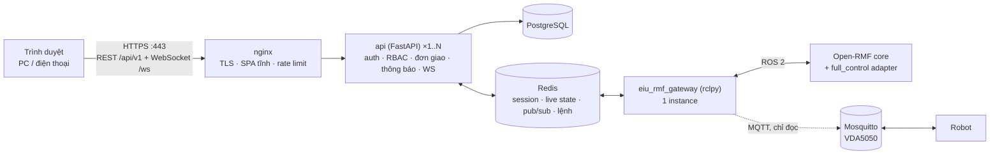
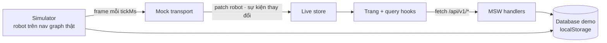
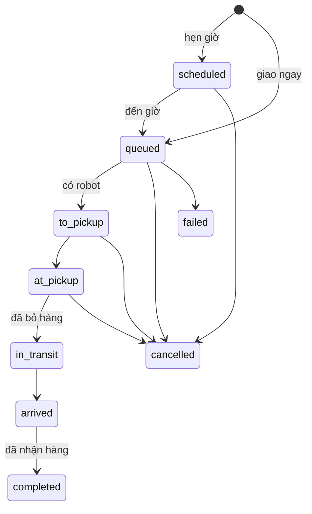

# Web Dashboard — Đề xuất kiến trúc frontend và backend

Tài liệu này ghi kiến trúc đề xuất cho web dashboard nhiều người dùng của EIU: phạm vi, công nghệ, tổ chức frontend và backend, triển khai, bảo mật, đa ngôn ngữ, cơ sở dữ liệu và lộ trình. Trạng thái của từng phần được ghi trong mục [Lộ trình](#11-lộ-trình).

Hướng dẫn cài đặt và chạy: [huong_dan_cai_dat_va_su_dung.md](huong_dan_cai_dat_va_su_dung.md). Sơ đồ tích hợp hiện tại với Open-RMF: [kien_truc_tich_hop.md](kien_truc_tich_hop.md). Tài liệu kỹ thuật của frontend: [../README.md](../README.md).

---

## 1. Phạm vi và giả định

| Hạng mục | Giá trị |
|---|---|
| Môi trường | Trường đại học, mạng Wi-Fi của trường |
| Số người dùng đồng thời | Khoảng 20 |
| Thiết bị | Máy tính và điện thoại; giao diện responsive từ 390 px |
| Ngôn ngữ | Tiếng Việt (mặc định) và tiếng Anh |
| Vai trò | `operator`: vận hành các dịch vụ robot (giao vận, vệ sinh, tuần tra, ...) mà admin cấp, trong các khu vực và với các quyền được cấp. `admin`: mọi dịch vụ, quyền và các trang quản trị (người dùng & quyền, địa điểm, tích hợp, cài đặt) |
| Tài khoản | Do admin tạo; không cho tự đăng ký |
| Nguồn dữ liệu robot | Open-RMF + `vda5050_fleet_adapter_full_control` (ROS 2 Jazzy), VDA5050 qua MQTT |
| Mở rộng sau | Trang quản trị, cơ sở dữ liệu đầy đủ, digital twin |

Dashboard PySide6/QML hiện có vẫn là công cụ trên ground station. Web dashboard là nền tảng vận hành robot tập trung: dịch vụ → nhiệm vụ → hệ thống điều phối (Open-RMF) chọn robot. Loại robot là bộ lọc trong các trang, không phải mục riêng; dịch vụ khai báo trong `backend/config/services.yaml`.

---

## 2. Tóm tắt lựa chọn công nghệ

| Lớp | Lựa chọn | Lý do |
|---|---|---|
| Frontend | React + TypeScript + Vite (SPA) | Hệ sinh thái lớn; rmf-web cũng dùng React; không cần SSR |
| UI | Tailwind CSS + component tự viết | Bám theo mockup; design token trong một file CSS |
| Dữ liệu REST | TanStack Query | Cache, refetch, invalidate theo key |
| Dữ liệu realtime | Zustand, entity theo id | Chỉ cập nhật phần thay đổi |
| Bản đồ 2D | Leaflet `CRS.Simple` | Ảnh occupancy và nav graph theo mét, nhiều tầng |
| 3D / digital twin (sau) | three.js / react-three-fiber | Dùng chung luồng world-state với bản đồ 2D |
| Đa ngôn ngữ | react-i18next | vi mặc định, en dự phòng |
| Backend API | FastAPI (Python) + Pydantic + uvicorn | Cùng ngôn ngữ với rclpy; dùng lại module thuần của eiu_fleet_ui; tự sinh OpenAPI |
| ORM và migration | SQLAlchemy 2 (async) + Alembic | |
| Cơ sở dữ liệu | PostgreSQL | Người dùng, đơn, thông báo, nhật ký |
| Cache và bus | Redis | Session, trạng thái realtime, pub/sub, hàng đợi lệnh |
| Cầu nối ROS | `eiu_rmf_gateway` (rclpy), một instance | Thành phần duy nhất có node ROS 2 (đã làm) |
| Reverse proxy | nginx | TLS, file tĩnh, rate limit, chia tải |
| Triển khai | Docker Compose | Không cần Kubernetes ở quy mô này |

---

## 3. Kiến trúc tổng thể



Nguyên tắc:

1. **Trình duyệt không bao giờ kết nối trực tiếp ROS 2 hoặc MQTT.** DDS không có xác thực; máy nào vào được domain là điều khiển được robot.
2. **`eiu_rmf_gateway` là tiến trình riêng, luôn đúng một instance (đã làm, contract: `eiu_rmf_gateway/docs/contract.md`):**
   - chỉ gateway cần môi trường ROS Jazzy; container api chỉ cần Python;
   - nhiều replica api cùng chạy rclpy sẽ dispatch trùng task;
   - lỗi ở tầng web không ảnh hưởng tới điều khiển robot.
3. **api không giữ trạng thái**: session và trạng thái realtime nằm trong Redis, nên chạy được nhiều replica sau nginx.
4. **Server quyết định mọi quy tắc** (được hủy không, timeline, giới hạn đơn); giao diện chỉ hiển thị kết quả.
5. **Gateway dùng lại các module không phụ thuộc Qt của eiu_fleet_ui** (`dashboard_model.py`, `task_state.py`, `vda5050/*`), nên luật gộp dữ liệu robot và xếp hạng trạng thái task chỉ có một nguồn. `config.py` còn import PySide6, cần tách phần đọc YAML trước khi dùng lại.

### Giai đoạn hiện tại

Backend giả chạy trong trình duyệt thay cho nginx, api, PostgreSQL, Redis và gateway, theo cùng contract:



Khi có backend thật, đặt `VITE_USE_MOCKS=false`; các trang không phải sửa.

---

## 4. Frontend

### 4.1 Cấu trúc thư mục

```
web_dashboard/frontend/src/
  app/            router, query client, biến build (env.ts)
  layout/         AppShell, Sidebar, TopBar, BottomNav, PageHeader, GlobalSearch
  pages/          mỗi route một file; admin/ là chunk tải lười
  features/       admin, auth, charts, fleet, locations, map, operations, overview, tasks
  components/ui/  Button, Card, Tabs, Dialog, Menu, Field, Switch, States, Toaster
  api/            HTTP client, query hooks, contract dữ liệu (types.ts)
  realtime/       interface transport, live store, provider
  mocks/          backend giả: handlers, simulator, database demo, seed
  i18n/           vi.json, en.json
  lib/            định dạng ngày giờ, tìm kiếm không dấu, toast, lỗi
  styles/         token Tailwind, style bản đồ
```

### 4.2 Các trang

| Route | Trang | Nội dung |
|---|---|---|
| `/login` | Đăng nhập | Ảnh khuôn viên EIU, logo EIU, form, chọn ngôn ngữ và giao diện, tài khoản demo |
| `/overview`, `/live-operations`, `/tasks`, `/fleet`, `/fleet/:tên`, `/schedule`, `/maintenance`, `/analytics`, `/notifications` | Vận hành | Mọi vai trò, nội dung lọc theo dịch vụ, khu vực và quyền |
| `/account` | Tài khoản | Ngôn ngữ, giao diện, loại thông báo, mật khẩu, dữ liệu demo |
| `/admin/users`, `/admin/locations`, `/admin/integrations`, `/admin/settings` | Quản trị | Chỉ vai trò `admin` |

Các route cũ (`/deliveries`, `/tracking/:id`, `/settings`, `/admin/robots/:tên`, ...) chuyển sang trang mới tương ứng.

### 4.3 Bố cục responsive

```
Desktop (≥ 1024 px)                                   Điện thoại (< 1024 px)
┌──────────────┬───────────────────────────────────┐  ┌───────────────────────────┐
│ EIU Robot    │ [Tìm kiếm…]  ● Nền tảng  + Tạo  👤 │  │ EIU Robot Services 🔍 🔔 👤│
│ Services     ├───────────────────────────────────┤  ├───────────────────────────┤
│ Tổng quan    │ Tiêu đề + mô tả        [hành động] │  │ Tiêu đề        [+ Tạo]    │
│ Vận hành …   ├───────────────────────────────────┤  │ Khối xếp chồng            │
│ Nhiệm vụ     │ Nội dung: KPI, card, bảng, bản đồ  │  │ Bảng cuộn ngang trong thẻ │
│ …            │                                   │  ├───────────────────────────┤
│ QUẢN TRỊ     │                                   │  │ Tổng quan Trực tiếp Nhiệm │
│ …            │                                   │  │ vụ  Đội robot  Menu       │
└──────────────┴───────────────────────────────────┘  └───────────────────────────┘
```

| Chiều rộng | Điều hướng | Bố cục |
|:---:|---|---|
| < 768 px | Thanh trên + thanh tab dưới | Một cột; ngăn chi tiết trượt lên từ đáy |
| 768–1023 px | Như trên; ô tìm kiếm trên thanh trên | Khối xếp chồng; ngăn chi tiết là panel nổi bên phải |
| 1024–1279 px | Sidebar cố định | Khối xếp chồng, bảng đầy đủ |
| ≥ 1280 px | Sidebar cố định | Bố cục nhiều cột: Tổng quan 70/30, Vận hành trực tiếp bản đồ cao hết màn hình + cột phải |

Mọi trang dùng cùng khung: tiêu đề, dòng mô tả, hành động chính, rồi nội dung. Chữ dùng thang `clamp()` theo độ rộng màn hình (1366 → 1920 px).

### 4.4 Dữ liệu và trạng thái

| Loại dữ liệu | Cách giữ |
|---|---|
| Dữ liệu REST (đơn, địa điểm, thông báo) | TanStack Query; key theo tài nguyên; sự kiện realtime gọi `invalidate` đúng key |
| Robot realtime | Zustand, map theo tên robot; mỗi patch chỉ thay robot có trong patch |
| Phiên đăng nhập | Query `me`; mã 401 ở bất kỳ request nào đặt `me = null` và chuyển về `/login` |
| Ngôn ngữ | Hồ sơ người dùng; `localStorage` chỉ dùng cho trang đăng nhập |

---

## 5. Backend

### 5.1 Thành phần

| Thành phần | Chạy ở đâu | Việc |
|---|---|---|
| nginx | Web server | TLS, phục vụ `dist/`, chuyển `/api` và `/ws` tới api, rate limit, header bảo mật |
| api (FastAPI) | Web server, 1..N replica | Xác thực, phân quyền, đơn giao, thông báo, WebSocket tới trình duyệt |
| PostgreSQL | Web server | Dữ liệu bền vững |
| Redis | Web server | Session, snapshot robot mới nhất, pub/sub sự kiện, stream lệnh tới gateway |
| eiu_rmf_gateway | Ground station, container Jazzy | Subscribe RMF, ghi sự kiện và trạng thái vào Redis, nhận lệnh từ Redis, gửi task tới RMF |

### 5.2 Gateway

- Callback ROS và MQTT chỉ ghi dữ liệu mới nhất.
- Một vòng tick (chu kỳ đặt trong YAML) dựng snapshot, so với lần trước và chỉ publish phần thay đổi lên Redis.
- Nhận server_uri của fleet adapter để lấy `task_state_update` và `task_log_update`, như `TaskEventServer` của eiu_fleet_ui.
- Ánh xạ **đơn giao** (khái niệm của backend: ai yêu cầu, từ đâu đến đâu) sang **task RMF** (khái niệm thực thi); trạng thái task được gộp bằng `task_state.set_state`.
- Chỉ nhận một tập lệnh cố định: tạo task từ địa điểm đã duyệt, hủy task. Không có lệnh publish topic tùy ý.
- Là ROS package riêng ở cấp workspace (ví dụ `eiu_rmf_gateway`); colcon không quét package nằm bên trong package khác.

### 5.3 API REST

Tất cả dưới `/api/v1`. Thời gian là epoch ms (UTC); vị trí là mét trong hệ tọa độ bản đồ của từng tầng. Lỗi trả dạng `{"error": {"code": "<vùng>.<lý do>"}}`, giao diện dịch theo mã.

| Endpoint | Việc |
|---|---|
| `GET /config` | Tên site, múi giờ, ngôn ngữ, giới hạn, liên hệ hỗ trợ |
| `POST /auth/login`, `POST /auth/logout`, `GET /auth/me` | Phiên đăng nhập |
| `PUT /me/preferences`, `POST /me/password` | Ngôn ngữ, loại thông báo, mật khẩu |
| `GET /levels`, `GET /levels/{id}/graph` | Tầng, ảnh bản đồ, nav graph |
| `GET /locations`, `GET`/`PUT /me/saved-locations`, `GET /me/recent-destinations`, `GET /templates` | Danh mục địa điểm và lối tắt |
| `GET /deliveries?group=…`, `GET /deliveries/{id}` | Đơn của mình, số lượng theo nhóm, timeline, thao tác được phép |
| `POST /deliveries`, `POST /deliveries/{id}/cancel` | Tạo và hủy đơn |
| `GET /notifications`, `POST /notifications/read-all`, `POST /notifications/{id}/read` | Thông báo |
| `GET /fleet/robots`, `POST /fleet/robots/{robot}/{pause\|resume\|speed-limit\|init-position}` | Danh sách robot, điều khiển từng robot |
| `GET`/`POST /fleet/registration` | Registry, robot chờ đăng ký; kiểm tra, thêm, gỡ |
| `GET`/`POST /fleet/lanes` | Lane đóng theo fleet, offset lane theo tầng; đóng, mở |
| `GET`/`PUT /fleet/nav-graph` | Một tầng của file nav graph; lưu |
| `GET /fleet/system` | Kết nối RMF, gateway, chỉ số fleet adapter |
| `/admin/*` (sau) | Cài đặt hệ thống, tài khoản và vai trò, nhật ký |

Contract đầy đủ: `frontend/src/api/types.ts`. Khi có FastAPI, sinh type TypeScript từ OpenAPI để hai phía không lệch nhau.

### 5.4 Realtime

| Thông điệp | Nội dung |
|---|---|
| `patch` (topic `robots`) | `seq`, `periodMs`, `upsert` (robot thay đổi), `remove` (tên) |
| `event` | Danh sách topic có dữ liệu REST đổi: `deliveries`, `notifications`, `fleet` (dữ liệu vận hành) |

- Một kết nối WebSocket mỗi tab; REST cho truy vấn và lệnh.
- Khi kết nối lại, client gửi `seq` cuối; server trả phần thiếu nếu còn trong buffer, nếu không thì gửi snapshot đầy đủ.
- Kết nối có quyền `fleet:read` (vai trò `admin`) nhận mọi robot; không có quyền này chỉ nhận robot của đơn đang chạy của mình.

### 5.5 Trạng thái đơn giao



Timeline hiển thị 5 bước: đã nhận yêu cầu → đã lấy hàng → đang đến nơi → sắp đến nơi → đã giao. Việc xác nhận "đã bỏ hàng" và "đã nhận hàng" (nút trên app hay trên robot) chốt ở giai đoạn gateway; bản demo tự xác nhận sau thời gian chờ.

---

## 6. Áp dụng kỹ thuật cache từ PySide6/QML

| Trong eiu_fleet_ui | Phiên bản web |
|---|---|
| Thread ROS/MQTT chỉ ghi; `Dashboard.refresh()` chụp snapshot theo `refresh_period_s` | Gateway tick theo chu kỳ, so sánh, chỉ gửi phần đổi; tần số web (2–5 Hz) tách khỏi tần số ROS |
| `KeyedListModel.set_rows`: diff theo key, cập nhật tại chỗ | WS gửi `upsert`/`remove` theo key; store theo id; danh sách giữ scroll và hover; không bao giờ thay cả mảng |
| `_tasks_version`, `traffic_version` | `seq` theo topic để resync; REST dùng ETag/304 |
| `_set()` chỉ phát tín hiệu khi đổi | Server không gửi khi không đổi; component đọc selector hẹp |
| `task_state.set_state` xếp hạng nguồn | Chạy trong tracker của backend; gateway chỉ chuyển dữ liệu; client chỉ hiển thị |
| `DebouncedWriter` cho `tasks_cache.json` | Ghi PostgreSQL khi đơn chuyển trạng thái; telemetry lịch sử ghi theo lô |
| `map_provider` chuyển ảnh bản đồ một lần | Chuyển một lần khi khởi động, phục vụ ảnh có hash trong tên với `Cache-Control: immutable` |
| `offline_after_s`, FreshnessTag | Server gắn `updated_at` và `stale`; WS có heartbeat |
| Marker robot trượt giữa hai lần refresh | Client nội suy vị trí trong `periodMs` |
| `ui_settings.yaml` có kiểm tra, env ghi đè | pydantic-settings: YAML + env, có kiểm tra và mặc định |
| `tools/load_check.py` | k6 hoặc Locust: 50 người dùng ảo + WS, đo p95 và CPU |

---

## 7. Triển khai và chia tải

### 7.1 Ước lượng tải

20 người dùng tương ứng khoảng 20–40 kết nối WebSocket. Mỗi patch vài KB, 2–5 lần mỗi giây, tổng dưới 1 Mbit/s. Một process uvicorn xử lý dư; **không cần chia tải để tăng thông lượng.**

### 7.2 Những gì cần

| Mục tiêu | Cách làm |
|---|---|
| TLS, file tĩnh, rate limit | nginx làm reverse proxy |
| Không gián đoạn khi một replica lỗi hoặc khi deploy | 2 replica api sau `upstream` của nginx |
| Tự khởi động lại | `restart: unless-stopped` và healthcheck trong Compose |
| Thêm replica không sửa code | api không giữ trạng thái; session trong Redis; WS fan-out qua Redis pub/sub nên không cần sticky session; job nền dùng lock Redis; migration chạy một lần trước rollout |
| Không dispatch trùng | Gateway đúng một instance; muốn dự phòng thì dùng leader lock trong Redis |

### 7.3 Hai cấu hình triển khai

| Cấu hình | Mô tả |
|---|---|
| A — Thử nghiệm | Toàn bộ chạy trên ground station bằng Docker Compose |
| B — Chính thức | Ground station chạy ROS và gateway; VM của trường chạy nginx, api, PostgreSQL, Redis; hai bên nối qua Redis trong mạng nội bộ hoặc VLAN riêng |

Digital twin (Gazebo, Isaac) là phần tốn tài nguyên nhất và chạy trên máy có GPU riêng, không phải web server.

---

## 8. Bảo mật

### 8.1 Xác thực

- Admin tạo tài khoản (email, tên, vai trò), hệ thống gửi link mời dùng một lần hoặc cấp mật khẩu tạm bắt đổi ở lần đăng nhập đầu. Thời hạn link nằm trong config.
- Admin đầu tiên được tạo bằng lệnh CLI; không có tài khoản mặc định.
- Mật khẩu băm Argon2id; có độ dài tối thiểu; khóa tạm sau N lần sai, đếm theo tài khoản và IP.
- Session phía server: cookie `HttpOnly; Secure; SameSite=Lax` chứa session id ngẫu nhiên, dữ liệu trong Redis. Admin khóa user hoặc đổi vai trò thì session bị thu hồi ngay. Không lưu token trong `localStorage`.
- Chống CSRF: mọi request ghi gửi `X-CSRF-Token` bằng giá trị cookie `csrf_token`; server kiểm tra thêm `Origin`.
- Sau này cắm SSO của trường (OIDC: Microsoft Entra, Google hoặc Keycloak) vào cùng chỗ; vẫn giữ bảng users để gán vai trò.

### 8.2 Phân quyền

- Phân quyền = vai trò + dịch vụ được phép + khu vực được phép (tùy chọn) + quyền thao tác. Quyền cấp được cho operator: `task.create`, `task.cancel`, `task.schedule`, `task.pause`, `task.reassign`, `fleet.view`, `fleet.view_all`, `fleet.assign`, `fleet.control`, `alerts.ack`, `analytics.view`, `maintenance.view`. Chỉ admin: `users.manage`, `robots.manage`, `locations.manage`, `maintenance.manage`, `integrations.manage`, `settings.manage`, `system.diagnostics`.
- Backend kiểm tra ở mọi endpoint (`access.py`); frontend chỉ ẩn những gì không được dùng. Tài khoản vai trò `user` cũ tự chuyển thành operator (giao vận, tuần tra).
- Backend kiểm tra theo từng đối tượng: đơn chỉ chủ đơn hoặc người có quyền `:any` xem được, trả 404 thay vì 403 để chống dò id.
- WebSocket xác thực bằng cookie khi handshake, kiểm tra `Origin`, kiểm tra quyền mỗi lần subscribe.
- Frontend ẩn menu chỉ để tiện dùng, không phải lớp bảo mật.

### 8.3 Mạng và vận hành

- Chỉ cổng 443 của nginx mở ra mạng trường. PostgreSQL, Redis, api không mở cổng ra ngoài. DDS và MQTT không ra mạng trường.
- Chứng chỉ TLS do IT trường cấp hoặc CA nội bộ; bật HSTS, CSP, `frame-ancestors`, `nosniff`.
- Giới hạn nghiệp vụ trong config: số đơn mở tối đa mỗi người, rate limit tạo đơn.
- Nhật ký kiểm tra: đăng nhập, thay đổi tài khoản và vai trò, lệnh robot, hủy đơn.
- Secret trong `.env` hoặc Docker secrets, không commit; backup PostgreSQL hằng ngày; `pip-audit` và `npm audit` trong CI.
- Dữ liệu cá nhân lưu tối thiểu, có thời hạn lưu; đối chiếu quy định bảo vệ dữ liệu cá nhân hiện hành (Nghị định 13/2023/NĐ-CP).

---

## 9. Đa ngôn ngữ

| Quy tắc | Cách làm |
|---|---|
| Backend trả mã, không trả câu chữ | Trạng thái `in_transit`, lỗi `delivery.limit_reached`; frontend dịch |
| Thông báo theo ngôn ngữ người đọc | DB lưu `type + params`, dịch lúc hiển thị |
| Tên địa điểm | Cột `name_vi`, `name_en` trong danh mục do admin quản lý, gắn với waypoint của nav graph |
| Ngày giờ | Lưu UTC; hiển thị bằng `Intl.DateTimeFormat` theo múi giờ của site (`Asia/Ho_Chi_Minh`) |
| Tìm kiếm | Không phân biệt dấu: chuẩn hóa NFD ở client, `unaccent` ở PostgreSQL |
| Font | Inter, có đủ dấu tiếng Việt |
| Chữ trong ảnh | Không dùng; slogan là text để dịch được |
| Kiểm tra | Test bắt buộc vi và en có cùng key và cùng placeholder |

---

## 10. Cơ sở dữ liệu

Database demo hiện tại là một tài liệu JSON trong `localStorage`; các bảng của nó (`frontend/src/mocks/schema.ts`) là điểm xuất phát của schema PostgreSQL. Thiết kế chi tiết làm ở giai đoạn backend.

| Bảng | Cột chính |
|---|---|
| `users` | id, email (unique), full_name, password_hash, role, locale, notification_prefs, is_active, must_change_password, created_by, created_at, last_login_at |
| `locations` | id, name_vi, name_en, building, category, level_id, waypoint, is_active |
| `saved_locations` | user_id, location_id, starred, sort_order |
| `delivery_templates` | id, owner_id (null = dùng chung), name, subtitle, pickup_id, dropoff_id, package_type, available |
| `deliveries` | id, requester_id, pickup_id, dropoff_id, package_type, note, scheduled_at, status, rmf_task_id, robot_name, fleet_name, created_at, finished_at |
| `delivery_events` | id, delivery_id, type, source, at, payload (jsonb) — timeline và lịch sử trạng thái |
| `notifications` | id, user_id, type, delivery_id, params (jsonb), created_at, read_at |
| `audit_log` | id, actor_id, action, target, ip, at, details (jsonb) |
| `robot_telemetry` (sau) | robot, at, level, x, y, yaw, battery — time-series cho replay và digital twin; phân vùng theo ngày hoặc TimescaleDB |

---

## 11. Lộ trình

| Giai đoạn | Nội dung | Trạng thái |
|---|---|---|
| 0 | Frontend người dùng, responsive, i18n vi/en, route guard theo quyền, backend giả (MSW + simulator + database demo) | Xong (2026-10-02) |
| 1 + 2 (bản gọn) | Một service FastAPI + rclpy + SQLite: đăng nhập, session, tài khoản qua CLI; task delivery và patrol (nhiều vòng) gửi lên Open-RMF; theo dõi robot thật qua `/fleet_states`, dispatch, workcell và task events | Xong (2026-10-02), kiểm thử trên sandbox |
| 1 + 2 (tách gateway) | ROS package riêng `eiu_rmf_gateway` (node ROS 2 duy nhất), Redis làm kênh trung gian theo contract v1; backend không còn ROS, chạy được trên `python:3.12-slim` | Xong (2026-10-02), kiểm thử trên sandbox |
| 1 + 2 (triển khai đích) | PostgreSQL, session trong Redis, nhiều replica backend, nginx | Chưa làm |
| 3a | Tính năng vận hành ở giao diện **user**: điều khiển robot (pause/resume, tốc độ, đặt lại vị trí), đăng ký robot vào fleet (`/robot_registration_*`), đóng/mở lane (`/lane_closure_requests`), tạo/sửa/lưu nav graph, chỉ số fleet adapter. Mỗi tính năng là một loại lệnh (và sự kiện) trong contract gateway v1 | Xong (2026-10-02), kiểm thử trên sandbox |
| 3a+ | Theo đánh giá UI: Vận hành có Tổng quan, Nhiệm vụ của mọi người, Cảnh báo vận hành (xác nhận, tự đóng), robot dạng bảng, Pause/Resume theo trạng thái, thao tác nguy hiểm trong menu, lớp bản đồ; bản đồ người dùng gọn hơn; giao diện sáng/tối | Xong (2026-10-02), kiểm thử trên sandbox |
| 3b | Master Control (đánh giá UI vòng 2): tách portal theo vai trò; cấu hình robot (bảng, mục mở dần), fleet, bản đồ (xem/lane/sửa, thanh chưa lưu, hỏi khi rời trang), hạ tầng, tích hợp (chi tiết từng thành phần), người dùng, vai trò, chẩn đoán, nhật ký thay đổi; thông báo theo nhóm; 4 mức bề mặt tối; màu theo ngữ nghĩa | Xong (2026-10-02), kiểm thử trên sandbox |
| 3c | Nền tảng vận hành đa dịch vụ: vai trò operator/admin, phân quyền theo dịch vụ, khu vực, quyền thao tác; danh mục dịch vụ và form schema; vệ sinh; điều hướng mới; nhiệm vụ (tạm dừng, gán lại, lặp); bảo trì; lịch; tích hợp; Tổng quan Hybrid Light | Xong (2026-10-07): backend 57 test, frontend 22 test, demo kiểm bằng Chrome headless; chưa chạy với robot thật |
| 3c | Tham khảo mockup vận hành, chỉ với dữ liệu thật: lịch sử trạng thái robot (`robot_samples`), trang chi tiết robot, trang Phân tích, số liệu + danh sách Chưa có robot / Trễ cho Nhiệm vụ. Không làm phần không có nguồn dữ liệu (CPU, camera, firmware, IP, tải trọng, tốc độ, order VDA5050, nhiều tầng, vùng cấm, mức ưu tiên) | Xong (2026-10-04), kiểm thử trên sandbox |
| 4 | Digital twin: view 3D, replay lịch sử, chuyển giữa robot thật và mô phỏng | Chưa làm |

### Quyết định giữ từ bây giờ cho digital twin

- API dùng tọa độ mét + `level`, không dùng pixel; server cấp origin và resolution. Bản đồ 2D và 3D dùng chung dữ liệu.
- Mỗi thực thể có trường nguồn (`real` | `sim`) để chuyển giữa robot thật và Gazebo mà không đổi API.
- Gateway phát một luồng world-state chung (robot, lộ trình, lane đóng, sau này có cửa và thang máy); bản đồ 2D chỉ là một bên đọc.
- Mô hình tòa nhà 3D dựng từ `tb3_world.building.yaml`.

---

## 12. Đánh giá UI (2026-10-02) và cách xử lý

Một reviewer đánh giá giao diện: phần người dùng 8.5–9/10, phần "Master Control" khoảng 7/10 vì vận hành còn mỏng. Bảng dưới ghi từng đề xuất và quyết định.

| Đề xuất | Quyết định | Lý do / cách làm |
|---|---|---|
| Tách giao diện người dùng dịch vụ và giao diện vận hành theo vai trò (RBAC), hai shell "Robot Services" / "Master Control" | Áp dụng ở vòng đánh giá thứ hai | `user` chỉ dùng Robot Services; `admin` dùng Master Control (cấu hình + vận hành) |
| Đổi tên "Robot Delivery" | Áp dụng ở vòng thứ hai | "EIU Robot Services" cho người dùng, "EIU Master Control · Quản trị" cho admin |
| Trang Tổng quan cho người vận hành: số robot, task, cảnh báo, bản đồ, Needs Attention, System Health | Áp dụng | Tab **Tổng quan** của Vận hành |
| Task-centric thay vì delivery-centric | Áp dụng phần dữ liệu | Tab **Nhiệm vụ** liệt kê mọi loại task từ dữ liệu; loại mới không cần trang mới |
| Alerts có mức độ, Acknowledge/Resolve, tách khỏi Notifications | Áp dụng | Bảng `alerts`, tự đóng khi sự cố hết, gộp theo nguyên nhân (một cảnh báo cho cả fleet), mở sau 5 s để tránh chập chờn |
| Fleet dạng thẻ và dạng bảng | Áp dụng | Lựa chọn lưu trên thiết bị |
| Chỉ hiện Pause hoặc Resume; thao tác nguy hiểm vào menu ⋯ | Áp dụng | Fleet adapter không báo trạng thái tạm dừng lên ROS 2, nên gateway nhớ kết quả lệnh gần nhất; chưa biết thì hiện cả hai |
| Emergency Stop trên web | Không áp dụng | Fleet adapter không có interface E-stop riêng; web không thay thế an toàn phần cứng; Pause là dừng có kiểm soát |
| Map người dùng trừu tượng; map kỹ thuật có layer | Áp dụng một phần | Bản đồ người dùng: ảnh sàn mờ, bỏ đồ thị lane. Bản đồ vận hành: bật/tắt robot, lane, tên waypoint. Cửa, thang máy, footprint, costmap chưa có dữ liệu (full_control chưa có lift) |
| Notifications phân loại (Action required / Important / Update) | Áp dụng ở vòng thứ hai | Tab Tất cả / Cần xử lý / Đơn giao / Sự cố |
| Tăng tương phản và cỡ chữ phụ | Áp dụng | slate-400 đậm hơn; nhãn bản đồ và thời gian 12 px |
| Demo Data chỉ ở chế độ demo | Đã đúng | Mục chỉ hiện khi backend là demo |
| Global search tìm robot, task, fleet | Áp dụng ở vòng thứ hai | Ô tìm của Master Control: trang, robot, fleet, người dùng, số nhiệm vụ |
| Mô hình Campus → Building → Floor → Location | Một phần sẵn có | Địa điểm có `building` và `levelId`; nhiều tòa nhà làm khi có bản đồ tòa thứ hai |
| Analytics, Infrastructure | Để sau | Analytics là trang riêng; Infrastructure cần dữ liệu cửa/thang máy |
| Giao diện tối (yêu cầu của user) | Áp dụng | Sáng / Tối / Theo hệ thống; khung navy giữ nguyên, thẻ và chữ đổi màu |

### Vòng đánh giá thứ hai (Admin = cấu hình)

Reviewer đánh giá lại với giả định tách User Portal và Admin Portal: User Portal ~8.7/10, Admin ~7.5/10 vì còn thiên về trung tâm vận hành. Đã áp dụng: tách hai portal; Admin theo cấu trúc Tổng quan / Cấu hình / Truy cập / Hệ thống; Tasks và Alerts vào Chẩn đoán; tổng quan admin ưu tiên cấu hình, cảnh báo và thay đổi gần đây, bản đồ nhỏ; bảng cấu hình robot với nút Cấu hình và các mục mở dần; fleet là đối tượng riêng; bản đồ có chế độ xem mặc định, sửa phải chủ động; thanh thay đổi chưa lưu và hỏi khi rời trang; gỡ robot phải gõ tên; tình trạng hệ thống bấm xem chi tiết; nhật ký thay đổi; tên sản phẩm theo portal; thông báo theo nhóm; 4 mức bề mặt khi tối; chữ phụ 13 px; màu theo ngữ nghĩa. Chưa áp dụng: sửa thông số robot/fleet ngoài giới hạn tốc độ (nằm trong file cấu hình adapter, cần khởi động lại), loại robot, cửa/thang máy (nav graph chưa khai báo), mạng, log hệ thống.

### Vòng ba (2026-10-07): nền tảng vận hành đa dịch vụ

Yêu cầu mới: một nền tảng vận hành robot tập trung cho nhiều dịch vụ, chỉ hai vai trò Operator / Admin. Đã áp dụng: phân quyền theo dịch vụ, khu vực, quyền thao tác (backend trả 403 `SERVICE_NOT_ALLOWED`, `ZONE_NOT_ALLOWED`, ...); danh mục dịch vụ có form nhiệm vụ dạng schema; dịch vụ vệ sinh (RMF `clean`, bị từ chối `NO_CAPABLE_FLEET` khi chưa có đội robot có năng lực `cleaning`); điều hướng Tổng quan, Vận hành trực tiếp, Nhiệm vụ, Đội robot, Lịch, Bảo trì, Phân tích, Thông báo và nhóm Quản trị; trạng thái robot và nhiệm vụ thống nhất; ngăn chi tiết robot và nhiệm vụ; tạm dừng/tiếp tục qua RMF interrupt/resume; gán lại robot; nhiệm vụ lặp; bảo trì; lịch; tích hợp; bật/tắt dịch vụ và khu vực. Tổng quan dùng giao diện sáng (Hybrid Light) theo design brief; sau khi được duyệt, giao diện này áp dụng cho mọi trang (vòng bốn). Telemetry riêng theo dịch vụ (bình nước, chổi, camera) chỉ hiện khi robot báo; không bịa số liệu.

### Vòng bốn (2026-10-07 → 08): đánh bóng giao diện

Áp dụng trên toàn bộ trang, không đổi kiến trúc thông tin hay API:

| Hạng mục | Cách làm |
|---|---|
| Khung trang | Mọi trang dùng giao diện sáng của Tổng quan (nền xám nhạt, thẻ trắng viền mảnh, sidebar navy); giao diện tối có các lớp nền tách bậc (trang < thẻ < mục lồng) |
| Chữ | Thang `clamp()` dùng chung (tiêu đề trang, tiêu đề mục, tiêu đề thẻ, KPI, nội dung, metadata); KPI có ba mức: cần xử lý, vận hành, theo ngày |
| Màu ngữ nghĩa | Token `--color-status-*`: xanh dương đang chạy, cyan trực tiếp, xanh lá hoàn thành/đang sạc, xám xanh rảnh, cam cảnh báo, đỏ chỉ cho nghiêm trọng; biểu đồ dùng cùng token |
| Ngăn chi tiết | Panel nổi cao theo nội dung, nút ngay sau nội dung; bottom sheet trên điện thoại; độ rộng compact/standard/wide/form |
| Bản đồ | Blueprint xanh xám sáng hơn; Vận hành trực tiếp: bản đồ cao hết màn hình, chú thích một dòng chảy |
| Thẻ | Cao theo nội dung; các thẻ cùng hàng chức năng (hàng biểu đồ, hàng dưới của trang robot) cao bằng nhau |
| Trang đăng nhập | Ảnh khuôn viên EIU, logo EIU (phần biểu tượng + chữ EIU của logo chính thức), chia 54/46; sau đăng nhập tên trường chỉ ở menu tài khoản |

## 13. Câu hỏi cần chốt

| Câu hỏi | Ảnh hưởng tới |
|---|---|
| Đăng nhập bằng tài khoản nội bộ hay SSO của trường (Microsoft / Google)? | Giai đoạn 1 |
| Hosting trên ground station hay VM của trường? Chỉ trong mạng trường/VPN hay cả Internet? IT có cấp domain và chứng chỉ không? | Giai đoạn 1, cấu hình triển khai |
| Xác nhận bỏ hàng và nhận hàng bằng nút trên app hay trên robot? | Giai đoạn 2, trạng thái đơn |
| Có cần QR/PIN cho người nhận và khóa ngăn hàng trên robot? | Giai đoạn 2, phần cứng robot |
| Liên hệ hỗ trợ gửi tới đâu (email, nhóm chat, ticket)? | Giai đoạn 1 |
