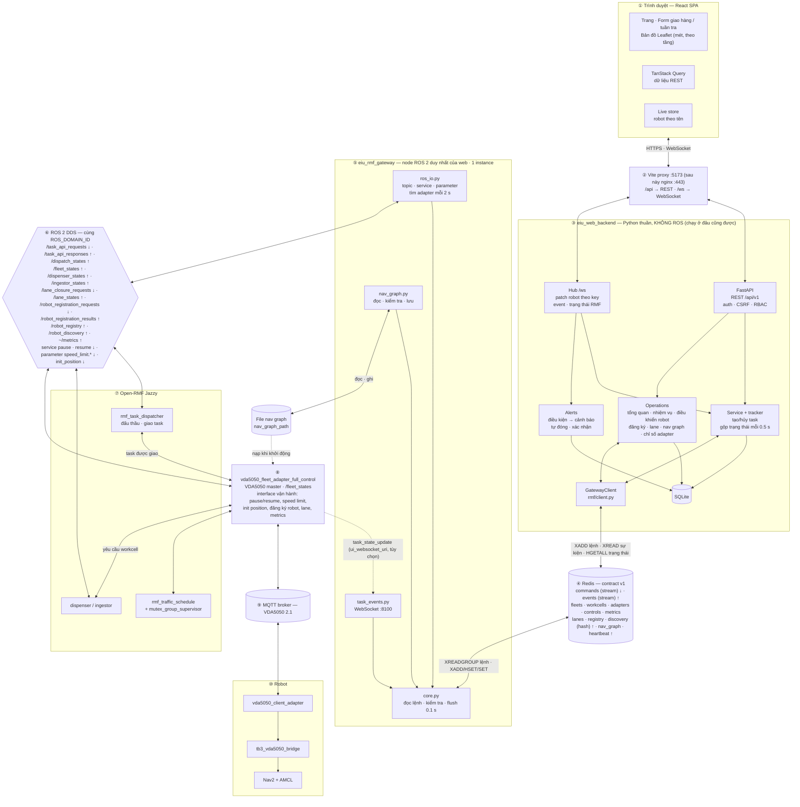
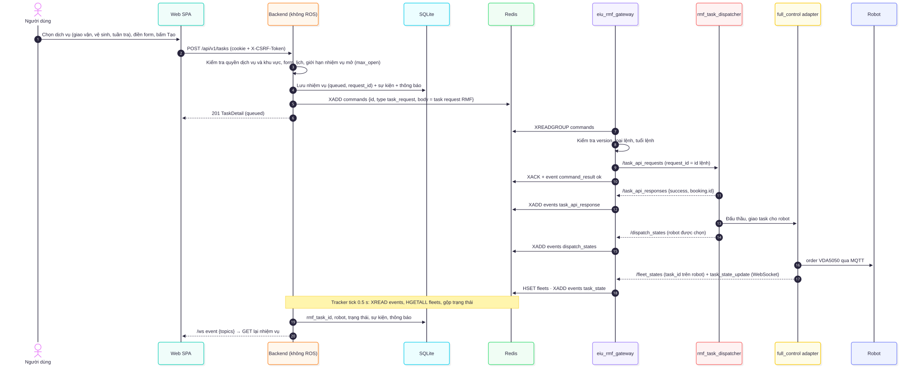
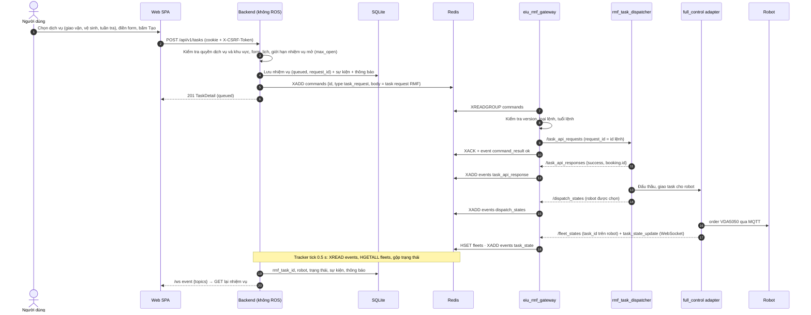
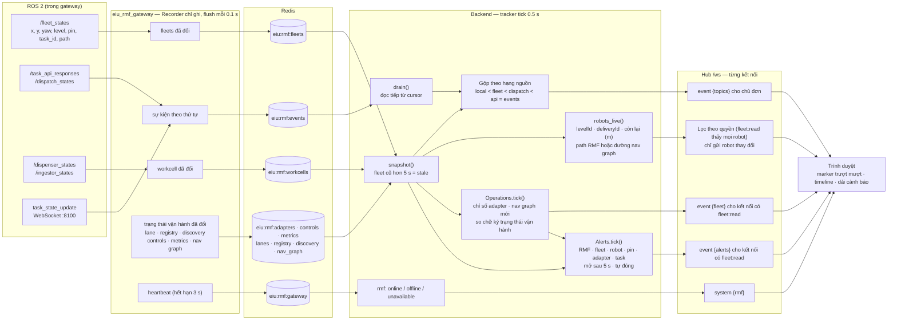
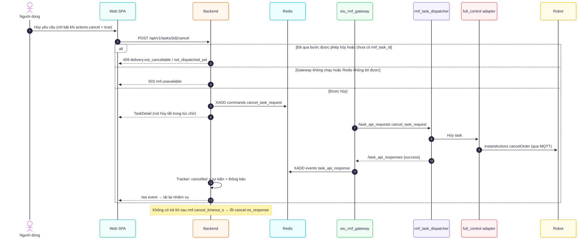
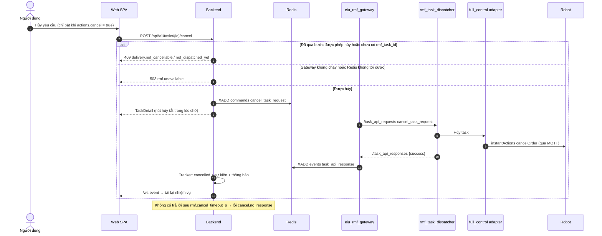
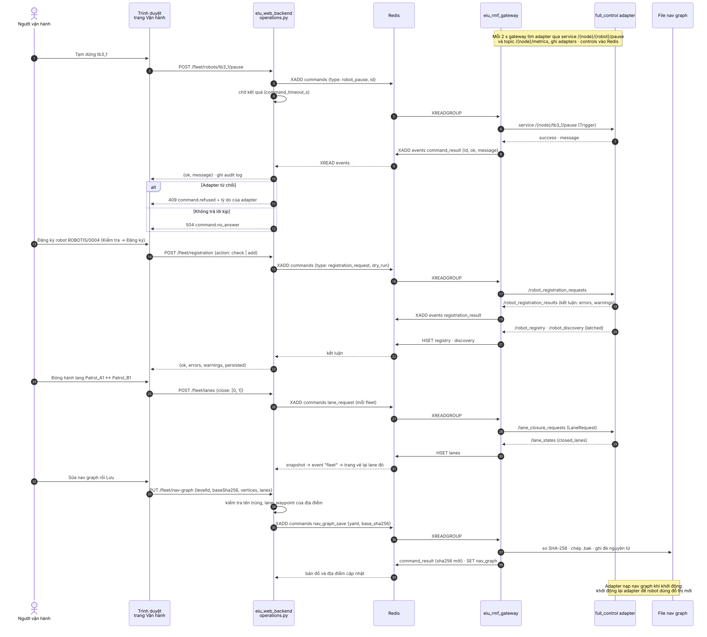
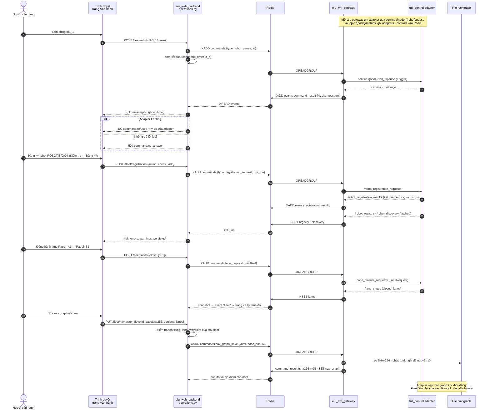

# Web Dashboard — Kiến trúc tích hợp với Open-RMF và full_control

Tài liệu này mô tả cách web dashboard giao tiếp với Open-RMF Jazzy và `vda5050_fleet_adapter_full_control` ở trạng thái hiện tại (2026-10-02), gồm cả các lệnh vận hành của nền tảng (điều khiển robot cần quyền `fleet.control`, đăng ký robot `robots.manage`, lane và nav graph `locations.manage`): backend **không có ROS**, mọi giao tiếp với ROS 2 đi qua `eiu_rmf_gateway` và Redis. Ảnh SVG nằm trong `img/`; mã mermaid đặt ngay dưới ảnh.

Liên quan: [de_xuat_kien_truc.md](de_xuat_kien_truc.md) (kiến trúc đích), [huong_dan_cai_dat_va_su_dung.md](huong_dan_cai_dat_va_su_dung.md) (cài đặt, chạy), [../backend/README.md](../backend/README.md), [eiu_rmf_gateway](../../../eiu_rmf_gateway/README.md) và [contract](../../../eiu_rmf_gateway/docs/contract.md), danh sách đầy đủ: [../docs/interfaces.md](../docs/interfaces.md).

---

## 1. Tổng quan thành phần

Mã mermaid

| Tầng | Thành phần | Có ROS 2? | Giao tiếp với tầng dưới |
|:---:|---|:---:|---|
| ① | React SPA: trang, form, bản đồ Leaflet, TanStack Query, live store | Không | REST `/api/v1`, WebSocket `/ws` |
| ② | Vite proxy khi phát triển; nginx khi triển khai | Không | Chuyển `/api`, `/ws` tới backend |
| ③ | `eiu_web_backend`: FastAPI, Hub `/ws`, service + tracker, operations, SQLite, `GatewayClient` | **Không** | Redis |
| ④ | Redis: stream lệnh, stream sự kiện, hash trạng thái (fleet, workcell, adapter, điều khiển, chỉ số, lane, registry, discovery), nav graph, heartbeat | Không | |
| ⑤ | `eiu_rmf_gateway`: node ROS 2 duy nhất của web, 1 instance | Có | Topic, service, parameter ROS 2; WebSocket task events :8100; file nav graph |
| ⑥ | ROS 2 DDS, cùng `ROS_DOMAIN_ID` với Open-RMF | | |
| ⑦–⑧ | Open-RMF (dispatcher, schedule, mutex, workcell) và `vda5050_fleet_adapter_full_control` | Có | MQTT VDA5050 2.1 |
| ⑨–⑩ | MQTT broker, robot (client adapter, bridge, Nav2) | | |

Backend gửi hai nhóm lệnh: **task request của Open-RMF** (`dispatch_task_request`, `cancel_task_request`) và **lệnh vận hành** (`robot_pause`, `robot_resume`, `robot_speed_limit`, `robot_init_position`, `registration_request`, `lane_request`, `nav_graph_save`). Gateway chỉ nhận các loại lệnh trong contract, kiểm tra nội dung từng lệnh và từ chối phần còn lại. Fleet adapter quyết định mọi yêu cầu vận hành; backend và gateway chỉ chuyển yêu cầu và trả lại kết luận của adapter. Dashboard QML `eiu_fleet_ui` vẫn chạy song song, dùng cùng các interface vận hành của adapter.

---

## 2. Gửi một nhiệm vụ tới robot

Mã mermaid

Điểm chính:

- Backend lưu nhiệm vụ **trước**, rồi đặt lệnh vào stream `eiu:rmf:commands` với `id` = `request_id` của nhiệm vụ. Gateway publish với đúng id đó, nên câu trả lời của RMF khớp lại được với nhiệm vụ.
- Giao diện tạo nhiệm vụ qua `POST /api/v1/tasks`; các endpoint `/api/v1/deliveries` của bản phát hành đầu vẫn còn, cùng luồng phía sau.
- Gateway chỉ chuyển tiếp: không đổi nội dung task request, chỉ kiểm tra version, loại lệnh, tuổi lệnh (`command_max_age_s`) rồi `XACK`.
- Không có trả lời trong `rmf.dispatch_timeout_s` (15 s) → `failed` (`dispatch.no_response`); không ghi được vào Redis → `failed` ngay (`gateway.unreachable`); gateway từ chối → `failed` (`gateway.<lỗi>`).

---

## 3. Dữ liệu thời gian thực về giao diện

Mã mermaid

| Nguồn | Hạng | Cho biết |
|---|:---:|---|
| Backend tự kết luận (hết giờ chờ, không tới được gateway) | 0 | Đơn không được RMF nhận |
| `/fleet_states` | 1 | Robot đang mang `task_id` (underway) hoặc bỏ nó (đoán completed); vị trí, pin, path |
| `/dispatch_states` | 2 | queued, failed, cancelled; robot được giao |
| `/task_api_responses` | 3 | `task_id` của yêu cầu; RMF từ chối; trả lời hủy |
| Task events (`ui_websocket_uri` → gateway :8100) | 3 | Trạng thái, robot, phase, số vòng tuần tra, giờ dự kiến xong |
| `command_result` của gateway | 3 | Lệnh bị từ chối hoặc không publish được |
| `/dispenser_states`, `/ingestor_states` | — | Robot đang chờ bỏ hàng hoặc chờ người nhận |

Cảnh báo vận hành được backend tính mỗi tick từ trạng thái RMF, robot, chỉ số adapter và nhiệm vụ; lưu trong bảng `alerts`; đổi thì gửi `event {topics: ["alerts"]}`. Một fleet mất kết nối toàn bộ chỉ sinh một cảnh báo `fleet.offline`. RMF vẫn báo robot có AGV đã im lặng, nên backend dùng báo cáo metrics của adapter (số robot đang nghe được, robot im lặng lâu nhất) để sinh `adapter.robots_offline` và hiện robot đó là "Mất kết nối".

Trạng thái vận hành (lane, robot đã/chờ đăng ký, điều khiển, chỉ số adapter, nav graph) đi cùng đường: khi nó đổi, backend gửi `event {topics: ["fleet"]}` và trang Vận hành tải lại dữ liệu qua REST.

Gateway ghi Redis mỗi `flush_period_s` (0,1 s), chỉ phần đã đổi; backend đọc mỗi `realtime.period_s` (0,5 s). Sự kiện đọc tiếp từ cursor lưu trong Redis, nên backend khởi động lại không mất sự kiện. Heartbeat của gateway hết hạn sau 3 s: không có heartbeat → `unavailable`; có heartbeat nhưng không fleet nào gửi dữ liệu → `offline`.

---

## 4. Hủy nhiệm vụ

Mã mermaid

| Loại | Được hủy khi |
|---|---|
| Giao hàng | Đã hẹn giờ, chờ robot, đang đến lấy hàng, chờ bỏ hàng |
| Tuần tra | Đã hẹn giờ, chờ robot, đang thực hiện |
| Vệ sinh | Đã hẹn giờ, chờ robot, đang thực hiện |

Server quyết định (`actions.cancel` trong DTO); giao diện chỉ bật/tắt nút theo kết quả đó.

---

## 5. Lệnh vận hành (quyền `fleet.control`, `robots.manage`, `locations.manage`)

Mã mermaid

| Tính năng | REST | Lệnh gateway | Interface ROS 2 của adapter | Kết quả |
|---|---|---|---|---|
| Tạm dừng, tiếp tục | `POST /fleet/robots/{robot}/pause`, `/resume` | `robot_pause`, `robot_resume` | Service `std_srvs/Trigger` `/<adapter>/<robot>/pause`, `/resume` | `command_result` |
| Giới hạn tốc độ | `POST /fleet/robots/{robot}/speed-limit` | `robot_speed_limit` | Parameter `speed_limit.<robot>` | `command_result`; giá trị mới trong hash `controls` |
| Đặt lại vị trí | `POST /fleet/robots/{robot}/init-position` | `robot_init_position` | Topic `/<adapter>/<robot>/init_position` → `init_position_result` | `command_result` |
| Đăng ký, gỡ robot | `POST /fleet/registration` | `registration_request` | `/robot_registration_requests` → `/robot_registration_results` | `registration_result` |
| Đóng, mở lane | `POST /fleet/lanes` | `lane_request` | `/lane_closure_requests` → `/lane_states` | Hash `lanes` |
| Sửa nav graph | `PUT /fleet/nav-graph` | `nav_graph_save` | Không: gateway ghi file `nav_graph_path` | `command_result` với SHA-256 mới |
| Chỉ số adapter | `GET /fleet/system` | Không | `/<adapter>/metrics` | Hash `metrics`, gộp bằng `eiu_fleet_ui.metrics_model` |
| Tổng quan | `GET /fleet/overview` | Không | Dữ liệu đã có trong Redis | Số robot/nhiệm vụ/cảnh báo, tình trạng hệ thống |
| Nhiệm vụ của mọi người | `GET /fleet/tasks`, `POST /fleet/tasks/{id}/cancel` | `task_request` (`cancel_task_request`) | `/task_api_requests` | Như đơn của người dùng |
| Cảnh báo | `GET /fleet/alerts`, `POST /fleet/alerts/{id}/ack`, `/ack-all`, `/{id}/resolve` | Không | Không (backend tự tính) | Bảng `alerts`, sự kiện `alerts` trên `/ws` |

Chỉ số lane là chỉ số của RMF: các lane trong nav graph, đánh số liên tục qua các tầng theo thứ tự trong file, mỗi chiều một chỉ số. Giao diện vẽ hai chiều của một hành lang thành một đường và đóng/mở cả hai.

---

## 6. Bảng interface

Danh sách đầy đủ (QoS, trường dữ liệu, JSON mẫu, mã lỗi, message WebSocket): [../docs/interfaces.md](../docs/interfaces.md).

| Interface | Giữa | Dùng để |
|---|---|---|
| REST `/api/v1/*`, WebSocket `/ws` | Trình duyệt ↔ backend | Tài khoản, đơn, thông báo, bản đồ; robot thời gian thực |
| Redis `eiu:rmf:commands` | Backend → gateway | Task request của Open-RMF; lệnh vận hành |
| Redis `eiu:rmf:events` | Gateway → backend | `task_api_response`, `dispatch_states`, `task_state`, `command_result`, `registration_result` |
| Redis `eiu:rmf:fleets`, `eiu:rmf:workcells` | Gateway → backend | Trạng thái fleet, robot, workcell mới nhất |
| Redis `eiu:rmf:adapters`, `controls`, `metrics`, `lanes`, `registry`, `discovery` | Gateway → backend | Adapter tìm thấy, điều khiển từng robot, chỉ số, lane đóng, robot đã đăng ký, robot chờ đăng ký |
| Redis `eiu:rmf:nav_graph` | Gateway → backend | File nav graph: đường dẫn, SHA-256, nội dung |
| Redis `eiu:rmf:gateway` | Gateway → backend | Heartbeat |
| `/task_api_requests` | Gateway → RMF | `dispatch_task_request`, `cancel_task_request` |
| `/task_api_responses`, `/dispatch_states` | RMF → gateway | Trả lời, đấu thầu, robot được giao |
| `/fleet_states` | full_control → gateway | Vị trí, tầng, pin, `task_id`, path |
| `/dispenser_states`, `/ingestor_states` | Workcell → gateway | Chờ bỏ hàng / chờ nhận hàng |
| Service `pause`, `resume`; parameter `speed_limit.<robot>`; topic `init_position` | Gateway → full_control | Điều khiển từng robot; gateway nhớ kết quả tạm dừng/tiếp tục gần nhất (`controls.paused`) |
| `/robot_registration_requests` / `_results`, `/robot_registry`, `/robot_discovery` | Gateway ↔ full_control | Đăng ký, gỡ robot; robot chờ đăng ký |
| `/lane_closure_requests`, `/lane_states` | Gateway ↔ full_control | Đóng, mở lane |
| `/<adapter>/metrics` | full_control → gateway | Chỉ số sức khỏe adapter |
| File nav graph (`nav_graph_path`) | Gateway ↔ đĩa | Đọc, lưu nav graph; adapter nạp khi khởi động |
| WebSocket `ws://127.0.0.1:8100` | full_control → gateway | `task_state_update` (tùy chọn, `ui_websocket_uri`) |

Web **không** dùng MQTT và không gửi lệnh trực tiếp cho robot: task đi qua dispatcher của RMF, lệnh vận hành đi qua interface vận hành của fleet adapter.

---

## 7. Hướng mở rộng

| Hướng | Cách làm trên kiến trúc này |
|---|---|
| Trang admin (cài đặt hệ thống, quản lý tài khoản) | Chỉ ở backend và frontend; không đổi contract gateway |
| Áp dụng nav graph mà không khởi động lại adapter | Cần interface nạp lại nav graph ở fleet adapter; gateway thêm một loại lệnh |
| Nhiều replica backend, PostgreSQL | Backend không có ROS nên nhân bản được; tracker chạy ở một instance hoặc dùng consumer group cho stream sự kiện |
| View 3D / digital twin (three.js) | Dùng chung luồng `/ws` (mét + `levelId`), metadata bản đồ và nav graph từ `/levels`; thêm mô hình tòa nhà, model robot, nút 2D/3D, lịch sử telemetry, nguồn `real`/`sim` |
| Đổi sang rmf-web api-server | Contract dùng JSON task của Open-RMF, nên có thể thay gateway bằng một adapter gọi api-server mà backend không đổi |
