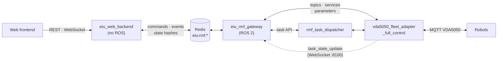

# eiu_rmf_gateway

ROS 2 ↔ Redis gateway between the EIU web dashboard and Open-RMF. It is the only ROS 2 node of the web stack: applications write commands to Redis and read events and state from Redis, with no ROS dependency.

- **Commands in:** task requests (dispatch, direct, cancel, interrupt, resume), robot controls (pause, resume, speed limit, initial position), robot registration, lane closures, nav graph edits.
- **Data out:** RMF task API responses, dispatch and task states, fleet, workcell, lane, registry and discovery states, adapter metrics, the nav graph, a heartbeat.

Task payloads are Open-RMF task API JSON, forwarded unchanged. The fleet adapters decide every operator request (registration rules, lane validity, control limits); the gateway checks message shape only and returns the adapter's verdict.

## System overview



| Document | Content |
|---|---|
| [docs/architecture.md](docs/architecture.md) | System context, gateway threads, command and state paths, sequences, deployment |
| [docs/contract.md](docs/contract.md) | Redis keys, command and event messages (contract v1) |

## Modules

| Module | Role |
|---|---|
| `contract.py` | Keys, message version, command types, body checks |
| `core.py` | `Gateway`: reads, checks, executes and acknowledges commands; flushes events, changed state and heartbeat. `Recorder`: data held between flushes |
| `ros_io.py` | ROS 2 node: subscriptions, publishers, discovery of adapters and robot controls, robot command calls |
| `task_events.py` | WebSocket server for adapter task events |
| `nav_graph.py` | Nav graph read, check and save (stale check, `.bak`, atomic replace) |
| `main.py` | ROS executor thread; asyncio loops for commands, flushes and nav graph watch |

`contract.py`, `core.py` and `nav_graph.py` have no ROS dependency.

## ROS 2 interfaces

| Topic | Type | Direction | QoS |
|---|---|:---:|---|
| `/task_api_requests` | `rmf_task_msgs/ApiRequest` | publish | RELIABLE, TRANSIENT_LOCAL, depth 10 |
| `/task_api_responses` | `rmf_task_msgs/ApiResponse` | subscribe | RELIABLE, TRANSIENT_LOCAL, depth 10 |
| `/dispatch_states` | `rmf_task_msgs/DispatchStates` | subscribe | RELIABLE, VOLATILE, depth 1 |
| `/fleet_states` | `rmf_fleet_msgs/FleetState` | subscribe | default, depth 10 |
| `/dispenser_states` | `rmf_dispenser_msgs/DispenserState` | subscribe | default, depth 10 |
| `/ingestor_states` | `rmf_ingestor_msgs/IngestorState` | subscribe | default, depth 10 |
| `/lane_closure_requests` | `rmf_fleet_msgs/LaneRequest` | publish | RELIABLE, TRANSIENT_LOCAL, depth 10 |
| `/lane_states` | `rmf_fleet_msgs/LaneStates` | subscribe | RELIABLE, TRANSIENT_LOCAL, depth 10 |
| `/robot_registration_requests` | `std_msgs/String` (JSON) | publish | RELIABLE, VOLATILE, depth 20 |
| `/robot_registration_results` | `std_msgs/String` (JSON) | subscribe | RELIABLE, VOLATILE, depth 20 |
| `/robot_registry` | `std_msgs/String` (JSON) | subscribe | RELIABLE, TRANSIENT_LOCAL, depth 1 |
| `/robot_discovery` | `std_msgs/String` (JSON) | subscribe | RELIABLE, TRANSIENT_LOCAL, depth 1 |
| `/<adapter>/metrics` | `std_msgs/String` (JSON) | subscribe, per discovered adapter | default, depth 10 |
| `/<adapter>/<robot>/init_position` | `geometry_msgs/PoseWithCovarianceStamped` | publish, per robot | default, depth 1 |
| `/<adapter>/<robot>/init_position_result` | `std_msgs/String` | subscribe, per robot | default, depth 1 |

| Service or parameter | Type | Use |
|---|---|---|
| `/<adapter>/<robot>/pause`, `/<adapter>/<robot>/resume` | `std_srvs/Trigger` | `robot_pause`, `robot_resume` |
| Parameter `speed_limit.<robot>` of `<adapter>` | double, m/s | read at discovery, set by `robot_speed_limit` |

Adapter discovery: every `discovery_period_s` the gateway scans the ROS graph. A node offering `/<node>/<robot>/pause` controls `<robot>`; a topic `/<node>/metrics` is its health report. Robots whose services disappear are marked `available: false`.

Pause state: the adapter does not publish it on ROS 2; the gateway stores the last successful pause or resume in `controls.paused`.

Task events: set `vda5050.ui_websocket_uri: "ws://127.0.0.1:8100"` in the fleet adapter config. Without it, no `task_state` events (task phase progress) reach Redis. An adapter sends task events to one address only.

## Parameters

`config/gateway.yaml`:

| Parameter | Default | Effect |
|---|---|---|
| `redis_url` | `redis://127.0.0.1:6379/0` | Redis server |
| `redis_prefix` | `eiu:rmf` | Key prefix |
| `flush_period_s` | 0.1 | Period of the writes to Redis |
| `heartbeat_period_s`, `heartbeat_ttl_s` | 1.0, 3.0 | Heartbeat key renewal and expiry |
| `events_maxlen` | 10000 | Events kept in the event stream |
| `command_max_age_s` | 30.0 | Older commands are refused (`expired`) |
| `command_block_ms` | 500 | Wait of one command read |
| `task_events_host`, `task_events_port` | `127.0.0.1`, 8100 | Task events WebSocket; port 0 turns it off |
| `discovery_period_s` | 2.0 | Period of the scan for adapters, robot controls and metrics topics |
| `robot_command_timeout_s` | 10.0 | A robot command without an answer after this time gets `no_answer` |
| `nav_graph_path` | `""` | Nav graph file of the fleet adapter; empty = no nav graph editing |

`nav_graph_path` must name the file the fleet adapter loads (its `nav_graph` launch argument). A saved graph takes effect when the adapter restarts.

## Build and run

Dependencies: Open-RMF Jazzy messages, `python3-redis`, `python3-websockets` (or `websockets` from pip), a Redis server. The Jazzy image of `vda5050_fleet_adapter_full_control/docker` has all of them.

```bash
colcon build --packages-select eiu_rmf_gateway
source install/setup.bash

redis-server --bind 127.0.0.1 --port 6379 --daemonize yes      # once per container start
ros2 launch eiu_rmf_gateway gateway.launch.py \
    nav_graph_path:=/ros2_ws/src/vda5050_fleet_adapter_full_control/maps/nav_graph.yaml
```

Check:

```bash
redis-cli get eiu:rmf:gateway                 # heartbeat JSON
redis-cli hkeys eiu:rmf:fleets                # fleets seen on /fleet_states
redis-cli hgetall eiu:rmf:controls            # robots the gateway can control
redis-cli hkeys eiu:rmf:discovery             # adapters that report unregistered robots
redis-cli xrevrange eiu:rmf:events + - COUNT 3
```

Run one gateway per ROS domain and Redis prefix. Redis listens on `127.0.0.1`; expose it only with a password (`redis://:<password>@host:6379/0`) on a private network.

## Tests

```bash
cd src/eiu_rmf_gateway && python3 -m pytest -q test
```

The tests use an in-memory Redis stand-in and no ROS. They cover command checks, execution and acknowledgement, refused and expired commands, pending commands after a restart, late results from the ROS side, state and heartbeat writes, and nav graph check and save.
