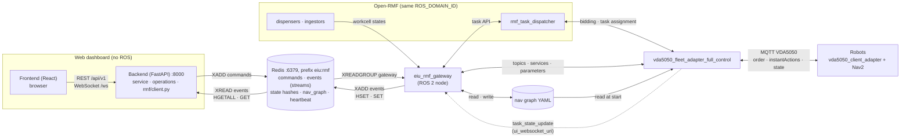
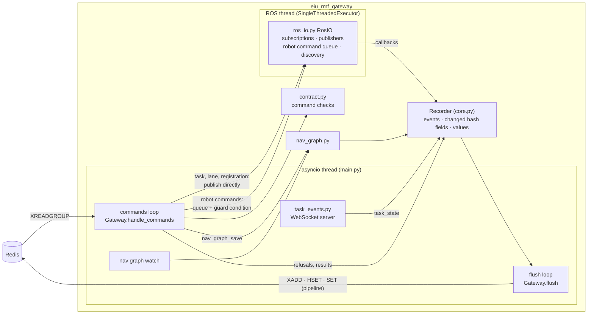
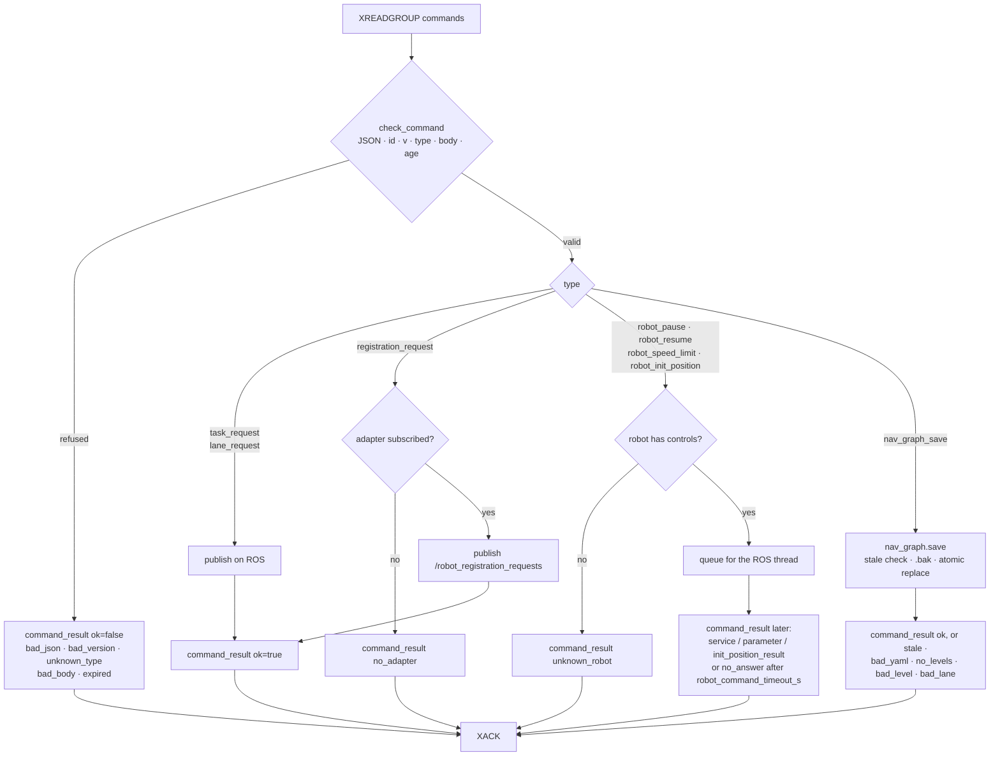
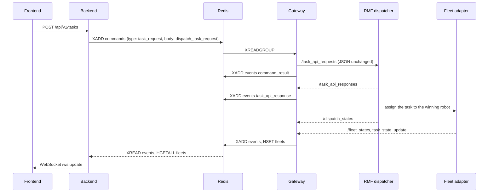
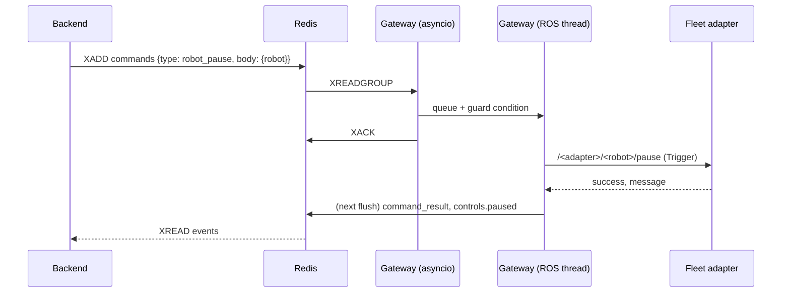
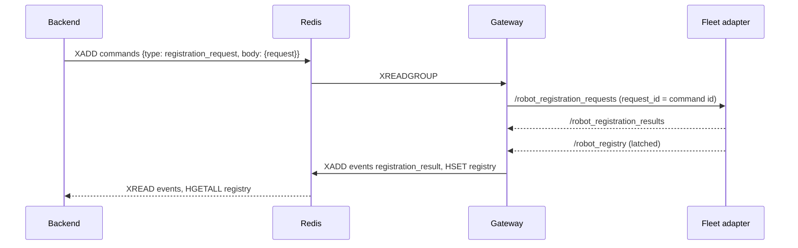
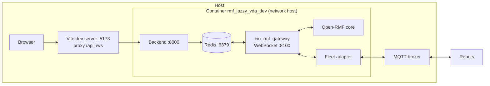

# EIU RMF Gateway — Architecture

This document describes how `eiu_rmf_gateway` connects the EIU web dashboard to Open-RMF and the VDA5050 fleet adapters. The message formats and Redis keys are defined in [contract.md](contract.md); the parameters and ROS 2 interfaces are listed in the [README](../README.md).

## System context

The gateway is the only ROS 2 node of the web stack. The web backend has no ROS dependency: it writes commands to Redis and reads events and state from Redis. The gateway carries the commands to Open-RMF and the fleet adapters, and writes their answers and states back to Redis.

| Layer | Component | Transport to the next layer |
|---|---|---|
| Presentation | Frontend (React) | REST and WebSocket to the backend |
| Application | `eiu_web_backend` (users, permissions, task records, audit) | Redis streams and keys |
| Integration | `eiu_rmf_gateway` | ROS 2 topics, services, parameters; WebSocket for task events; nav graph file |
| Orchestration | Open-RMF task dispatcher, traffic schedule, fleet adapter | MQTT (VDA5050) |
| Robot | `vda5050_client_adapter`, `tb3_vda5050_bridge`, Nav2 | — |

Redis decouples the backend from ROS 2: the backend and the gateway restart independently, and a command written while the gateway is down is executed when it comes back, unless it is older than `command_max_age_s`.

## Gateway internals

| Module | Thread | Role |
|---|---|---|
| `main.py` | both | Starts the ROS executor on its own thread and the asyncio loops: commands, flushes, nav graph watch, task events server |
| `contract.py` | asyncio | Keys, message version, command types and body checks; no ROS |
| `core.py` | asyncio | `Gateway` reads, checks, executes and acknowledges commands, and flushes; `Recorder` holds data between flushes |
| `ros_io.py` | ROS | Subscriptions, publishers, discovery of adapters and robot controls, service and parameter calls of the robot commands |
| `task_events.py` | asyncio | WebSocket server that receives `task_state_update` from the fleet adapters |
| `nav_graph.py` | asyncio | Reads the nav graph with its SHA-256, checks an edited graph, saves it with a stale check, a `.bak` copy and an atomic replace |

ROS callbacks only record data in the `Recorder`. Every `flush_period_s` the flush loop writes, in one Redis pipeline, the events in arrival order, the hash fields that changed since the last flush, the changed values (`nav_graph`) and the heartbeat with expiry `heartbeat_ttl_s`.

## Command path

Every command is read from the stream with the consumer group `gateway`, checked, executed and acknowledged (`XACK`). After a restart the gateway first reads its pending entries, then new ones.

| Command | ROS 2 interface used | Answer to the backend |
|---|---|---|
| `task_request` (`dispatch_task_request`, `robot_task_request`, `cancel_task_request`, `interrupt_task_request`, `resume_task_request`) | publish `/task_api_requests`, `request_id` = command id | `command_result` on publish, then `task_api_response` from `/task_api_responses` |
| `robot_pause`, `robot_resume` | service `/<adapter>/<robot>/pause` or `resume` (`std_srvs/Trigger`) | `command_result` with the service response |
| `robot_speed_limit` | parameter `speed_limit.<robot>` of the adapter node | `command_result` with the parameter result |
| `robot_init_position` | publish `/<adapter>/<robot>/init_position` | `command_result` from `/<adapter>/<robot>/init_position_result` |
| `registration_request` | publish `/robot_registration_requests` | `registration_result` from `/robot_registration_results` |
| `lane_request` | publish `/lane_closure_requests` | `command_result`; new state in the `lanes` hash from `/lane_states` |
| `nav_graph_save` | none (file) | `command_result`; new `nav_graph` value |

The fleet adapter decides every operator request (registration rules, lane validity, control limits). The gateway checks only the message shape and forwards the adapter's verdict.

## State path

| Source (ROS 2 or WebSocket) | Redis key | Write |
|---|---|---|
| `/fleet_states` | `fleets` | hash field per fleet |
| `/dispenser_states`, `/ingestor_states` | `workcells` | hash field per guid |
| ROS graph scan (`/<node>/<robot>/pause`) | `adapters`, `controls` | hash field per adapter node, per robot |
| `/<adapter>/metrics` | `metrics` | hash field per adapter node |
| `/lane_states` | `lanes` | hash field per fleet |
| `/robot_registry` | `registry` | hash field per fleet |
| `/robot_discovery` | `discovery` | hash field per reporter |
| `/task_api_responses` | `events` | `task_api_response` |
| `/dispatch_states` | `events` | `dispatch_states` |
| `task_state_update` on the WebSocket | `events` | `task_state` |
| `/robot_registration_results` | `events` | `registration_result` |
| nav graph file (watched every 2 s) | `nav_graph` | value |
| gateway | `gateway` | heartbeat with expiry |

The backend reads the events with `XREAD` from its own saved cursor and the state with `HGETALL` and `GET`. It reports the link as `online` (heartbeat and at least one fleet), `offline` (heartbeat, no fleet) or `unavailable` (no heartbeat or no Redis); new tasks are refused while it is `unavailable`.

## Sequences

### Create a task

Cancelling, pausing (interrupt) and resuming a task follow the same path with `cancel_task_request`, `interrupt_task_request` and `resume_task_request`.

### Pause a robot

The adapter does not publish the pause state on ROS 2, so the gateway stores the result of the last successful pause or resume in `controls.paused`.

### Register a robot at runtime

## Deployment

All ROS 2 processes run in the Jazzy container `rmf_jazzy_vda_dev` with the same `ROS_DOMAIN_ID`. Redis and the backend run in the same container or on the same host and listen on `127.0.0.1`.

| Setting | Where | Value to match |
|---|---|---|
| Redis address and prefix | gateway `redis_url`, `redis_prefix`; backend `settings.yaml` | same server and prefix |
| Task events | adapter `vda5050.ui_websocket_uri`; gateway `task_events_host`, `task_events_port` | `ws://127.0.0.1:8100` |
| Nav graph | gateway `nav_graph_path`; adapter `nav_graph` launch argument; backend `map.nav_graph` | same file |
| ROS domain | `ROS_DOMAIN_ID` of the gateway, RMF and the adapters | same value |

Without `ui_websocket_uri` in the adapter config, the backend still receives `dispatch_states` and `task_api_response`, but no `task_state` events with the phase progress of a task. A fleet adapter sends task events to one address only.

Run one gateway per ROS domain and Redis prefix. The ROS 2 topics and services of the adapter and RMF's task API are open to every node in the same domain; use a private network or SROS2.
