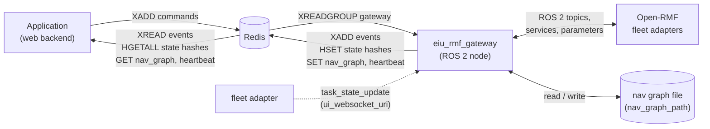

# EIU RMF Gateway — Contract v1

The gateway is the only process of the web stack with a ROS 2 node. Applications reach Open-RMF and the fleet adapters through Redis, with the keys and messages below. Every message carries `"v": 1`; a change that breaks a reader increments it.

The system context, command and state paths and sequences are described in [architecture.md](architecture.md).

The task payloads are the JSON of Open-RMF's own API (`rmf_api_msgs` schemas, as carried by `rmf_task_msgs/ApiRequest.json_msg`): the gateway forwards them, it does not translate them.



## Keys

`<p>` is the key prefix, `eiu:rmf` by default (gateway parameter `redis_prefix`).

| Key | Type | Written by | Read by | Content |
|---|---|---|---|---|
| `<p>:commands` | Stream | application | gateway (group `gateway`) | Commands |
| `<p>:events` | Stream, capped (`events_maxlen`) | gateway | application | Events, in arrival order |
| `<p>:fleets` | Hash: fleet name → JSON | gateway | application | Latest state of each fleet |
| `<p>:workcells` | Hash: guid → JSON | gateway | application | Latest state of each dispenser and ingestor |
| `<p>:adapters` | Hash: adapter node → JSON | gateway | application | Fleet adapter nodes found on the ROS graph |
| `<p>:controls` | Hash: robot → JSON | gateway | application | Operator controls of each robot |
| `<p>:metrics` | Hash: adapter node → JSON | gateway | application | Latest health report of each adapter |
| `<p>:lanes` | Hash: fleet → JSON | gateway | application | Closed lanes of each fleet |
| `<p>:registry` | Hash: fleet → JSON | gateway | application | Registered robots and chargers of each fleet |
| `<p>:discovery` | Hash: reporter → JSON | gateway | application | Robots on the broker that no fleet has registered |
| `<p>:nav_graph` | String | gateway | application | Nav graph file the gateway may edit |
| `<p>:gateway` | String with expiry (`heartbeat_ttl_s`) | gateway | application | Heartbeat; missing = gateway down |

All times are epoch milliseconds (UTC). Positions are metres in the RMF level frame.

## Commands (`<p>:commands`)

Each stream entry has one field, `msg`, holding a JSON object:

```json
{"v": 1, "id": "eiu-web-3e64a6ce0bcb", "type": "task_request", "sent_ms": 1790920420000, "body": {...}}
```

| Field | Meaning |
|---|---|
| `id` | Unique id chosen by the application; RMF answers with the same id |
| `type` | One of the command types below |
| `sent_ms` | When the application sent it; the gateway drops a command older than `command_max_age_s` |
| `body` | Type-specific |

| `type` | `body` | Gateway action |
|---|---|---|
| `task_request` | An Open-RMF task API request whose `type` is `dispatch_task_request`, `robot_task_request`, `cancel_task_request`, `interrupt_task_request` or `resume_task_request` | Publishes `ApiRequest{request_id: id, json_msg: body}` on `/task_api_requests` |
| `robot_pause` | `{"robot"}` | Calls the `std_srvs/Trigger` service `/<adapter>/<robot>/pause` |
| `robot_resume` | `{"robot"}` | Calls `/<adapter>/<robot>/resume` |
| `robot_speed_limit` | `{"robot", "mps"}`, `mps ≥ 0`, 0 = no limit | Sets the parameter `speed_limit.<robot>` of the adapter node |
| `robot_init_position` | `{"robot", "x", "y", "yaw"}` in the robot's map frame | Publishes `PoseWithCovarianceStamped` on `/<adapter>/<robot>/init_position` and waits for `/<adapter>/<robot>/init_position_result` |
| `registration_request` | `{"request": {"action": "add" \| "remove", "fleet", "name", ...}}`; `add` also takes `manufacturer`, `serial`, `charger`, `responsive_wait`, `confirm_unverified`, `dry_run` | Publishes the request with `request_id: id` as JSON on `/robot_registration_requests` |
| `lane_request` | `{"fleet", "close_lanes": [int], "open_lanes": [int]}`, at least one index | Publishes `rmf_fleet_msgs/LaneRequest` on `/lane_closure_requests` |
| `nav_graph_save` | `{"yaml", "base_sha256"}` | Writes the nav graph file (`nav_graph_path`) |

Any other command type, or a body that fails the checks above, is refused with a `command_result` event (`ok: false`). The gateway acknowledges (`XACK`) every command it has handled or refused.

The robot commands go to the adapter node that offers the robot's `pause` service; the gateway finds these nodes every `discovery_period_s` (see `<p>:adapters`). Lane indices are the lane numbers of RMF: the lanes of the nav graph, level after level in file order, each direction counted separately.

### Command results

Every command gets one `command_result` event with its `id`:

| Command | `ok: true` when | Errors |
|---|---|---|
| `task_request` | Published | `bad_body`, `expired`, `publish_failed` |
| `lane_request` | Published; the effect shows in `<p>:lanes` | `bad_body`, `expired`, `publish_failed` |
| `registration_request` | Published; the adapter's verdict follows as a `registration_result` event | `no_adapter` (nothing subscribes to `/robot_registration_requests`) |
| `robot_pause`, `robot_resume` | The service answered `success` | `unknown_robot`, `service_unavailable`, `call_failed`, `refused`, `no_answer` |
| `robot_speed_limit` | The adapter accepted the parameter | `unknown_robot`, `service_unavailable`, `call_failed`, `refused`, `no_answer` |
| `robot_init_position` | The adapter reported success | `unknown_robot`, `service_unavailable`, `refused`, `superseded` (a newer position for the same robot was sent), `no_answer` |
| `nav_graph_save` | The file was written; `message` is its new SHA-256 | `no_nav_graph` (`nav_graph_path` is empty), `stale` (the file no longer matches `base_sha256`), `bad_yaml`, `no_levels`, `bad_level`, `bad_lane`, `publish_failed` (the file could not be written) |

`no_answer` is sent when the adapter has not answered within `robot_command_timeout_s`. `message` carries the adapter's text when it gives one.

### Task request bodies

```json
{"type": "dispatch_task_request", "request": {
  "category": "delivery",
  "description": {
    "pickup":  {"place": "Patrol_A2", "handler": "mock_dispenser_1", "payload": {"sku": "documents", "quantity": 1}},
    "dropoff": {"place": "Patrol_F3", "handler": "mock_ingestor_1",  "payload": {"sku": "documents", "quantity": 1}}},
  "unix_millis_earliest_start_time": 0,
  "requester": "eiu_web_dashboard"}}

{"type": "dispatch_task_request", "request": {
  "category": "patrol",
  "description": {"places": ["Patrol_B1", "Patrol_E1"], "rounds": 2},
  "unix_millis_earliest_start_time": 0,
  "requester": "eiu_web_dashboard"}}

{"type": "cancel_task_request", "task_id": "delivery.dispatch-0", "requester": "eiu_web_dashboard", "labels": []}
```

## Events (`<p>:events`)

Each stream entry has one field, `msg`, holding:

```json
{"v": 1, "type": "<event type>", "at_ms": 1790920421000, "body": {...}}
```

| `type` | Source | `body` |
|---|---|---|
| `command_result` | Gateway | `{"id", "ok", "error", "message"}`; see [Command results](#command-results) |
| `registration_result` | `/robot_registration_results` | `{"id", "result"}`; `result` is the adapter's verdict: `ok`, `dry_run`, `persisted`, `needs_confirmation`, `errors`, `warnings` (lists of `{"code", "message"}`) |
| `task_api_response` | `/task_api_responses` | `{"request_id", "response"}`; `response` is RMF's JSON answer |
| `dispatch_states` | `/dispatch_states` | `{"states": [{"task_id", "status", "robot", "fleet", "errors"}]}`; `status` as in `rmf_task_msgs/DispatchState` |
| `task_state` | Fleet adapter task events WebSocket | `{"state": <task_state_update data>}` |

## Fleet state (`<p>:fleets`)

Field = fleet name, value = JSON, rewritten at most every `fleet_period_s` while `/fleet_states` changes:

```json
{"v": 1, "fleet": "tb3_fleet", "received_ms": 1790920421500,
 "robots": [{"name": "tb3_1", "level": "tb3_world", "x": 5.37, "y": -6.65, "yaw": 0.0,
             "battery": 100.0, "mode": 0, "task_id": "", "path": [[10.4, -6.5]], "path_end_ms": null}]}
```

`received_ms` is the time of the last `/fleet_states` of that fleet, also when nothing changed, so a reader can tell a silent fleet from a still one. `mode` is `rmf_fleet_msgs/RobotMode.mode`.

## Workcell state (`<p>:workcells`)

Field = guid, value = JSON:

```json
{"v": 1, "guid": "mock_dispenser_1", "kind": "dispenser", "busy": false, "seconds_remaining": 0.0, "received_ms": 1790920421500}
```

## Operations state

Each hash field is rewritten when its content changes (`received_ms` and `at_ms` are not compared), except `<p>:metrics`, which is rewritten on every report.

### Adapters (`<p>:adapters`)

Field = adapter node. A node is an adapter when it offers `/<node>/<robot>/pause` services or publishes `/<node>/metrics`.

```json
{"v": 1, "node": "vda5050_fleet_adapter_full_control", "robots": ["tb3_1", "tb3_2"], "metrics_topic": true}
```

### Controls (`<p>:controls`)

Field = robot name.

```json
{"v": 1, "robot": "tb3_1", "node": "vda5050_fleet_adapter_full_control", "speed_limit": 0.0, "paused": false, "available": true}
```

`speed_limit` is the adapter's `speed_limit.<robot>` parameter (m/s, 0 = none, `null` = not read yet). `paused` is the result of the last successful `robot_pause` (`true`) or `robot_resume` (`false`) through this gateway, `null` when none was sent since the robot's controls were found: the fleet adapter does not report the pause state on ROS 2, so a pause from another tool (the desktop dashboard) is not seen. `available: false` means the robot's services are gone, for example after the robot was removed.

### Metrics (`<p>:metrics`)

Field = adapter node; `report` is the adapter's `/<node>/metrics` JSON as published.

```json
{"v": 1, "node": "vda5050_fleet_adapter_full_control", "received_ms": 1790920421500, "report": {...}}
```

### Lanes (`<p>:lanes`)

Field = fleet; from `/lane_states`.

```json
{"v": 1, "fleet": "tb3_fleet", "closed_lanes": [0, 1], "received_ms": 1790920421500}
```

### Registry (`<p>:registry`) and discovery (`<p>:discovery`)

`<p>:registry`, field = fleet: `{"v": 1, "fleet", "registry": <the adapter's /robot_registry JSON>}` with the fleet's robots (name, manufacturer, serial, charger, source), chargers (`name`, `used_by`, `used_by_removed`), series and limits.

`<p>:discovery`, field = reporter: `{"v": 1, "reporter", "snapshot": <the adapter's /robot_discovery JSON>}` with the robots seen on the broker that no fleet has registered (manufacturer, serial, series, pose, `removed_as` for a robot removed earlier in the adapter's session).

### Nav graph (`<p>:nav_graph`)

Present when the gateway parameter `nav_graph_path` is set. The gateway reads the file at start, after every `nav_graph_save` and whenever its modification time changes (checked every 2 s).

```json
{"v": 1, "path": "/ros2_ws/src/.../maps/nav_graph.yaml", "sha256": "f595abe3...", "yaml": "building_name: ...", "mtime_ms": 1790920421500}
```

`nav_graph_save` checks that the file still has `base_sha256`, that the text is YAML with `levels` whose `vertices` and `lanes` are consistent, copies the old file to `<file>.bak` and replaces the file atomically. The fleet adapter reads the nav graph at start, so a saved graph takes effect after the adapter restarts.

## Heartbeat (`<p>:gateway`)

Set every `heartbeat_period_s` with an expiry of `heartbeat_ttl_s`:

```json
{"v": 1, "started_ms": 1790920000000, "at_ms": 1790920421000, "ros_domain_id": "7", "task_events": true,
 "nav_graph_path": "/ros2_ws/src/.../maps/nav_graph.yaml"}
```

## Delivery guarantees

| Item | Guarantee |
|---|---|
| Commands | At most once to ROS: acknowledged after publishing; a gateway restart does not replay acknowledged commands. Pending entries of a crashed gateway are dropped when older than `command_max_age_s` |
| Events | In order; kept up to `events_maxlen` entries. A reader keeps its last stream id to resume after a restart |
| Robot commands | Each gets one `command_result`; a command whose adapter does not answer gets `no_answer` |
| State hashes and nav graph | Latest value only |
| Gateway instances | One. Two gateways would publish every command twice |
