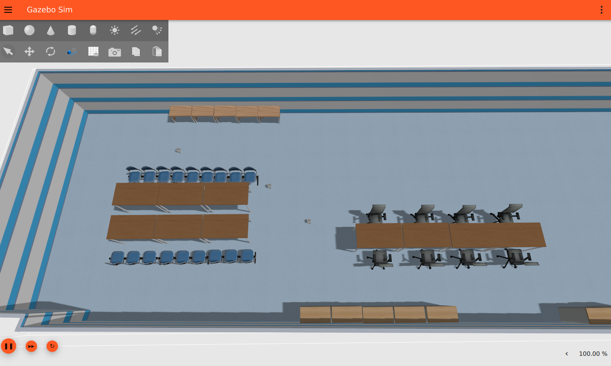

# tb3_simulation

Simulates up to three TurtleBot3 Burgers in Gazebo Harmonic with a full Nav2 stack each, on ROS 2 Jazzy. Every robot runs in its own namespace behind its own VDA5050 client, so the fleet adapter talks to the simulation exactly as it would to real AGVs.

<p align="center">
  
</p>

The node graph and startup order are documented in [docs/architecture.md](docs/architecture.md).

## Package structure

```
tb3_simulation/
├── launch/
│   ├── tb3_simulation_nav2.launch.py    Gazebo, /clock bridge, spawning, Nav2, RViz
│   └── vda5050_bridge_fleet.launch.py   VDA5050 bridge + client, per robot
├── config/
│   ├── nav2_params.yaml                 Nav2 tuning, shared by all robots
│   ├── vda5050_bridge_sim*.yaml         Bridge topics, Nav2 action, pose thresholds
│   ├── vda5050_client_params_tb3_*.yaml VDA5050 identity, MQTT, factsheet
│   └── cyclonedds_sim.xml               DDS profile
├── maps/tb3_world/                      Map, world file, models
├── docker/                              Dockerfile, compose file, launcher script
└── scripts/patch_world.py               traffic-editor → Gazebo world generation
```

The map is 660×272 cells at 0.05 m, roughly 33 × 14 m. Robots `tb3_1..3` spawn at `charger_1..3`; those coordinates live in `ROBOT_POSES` in the sim launch file and were copied from the fleet adapter's `nav_graph.yaml`. Waypoint names come from that graph too, but this package never reads it — the bridge simply drives to the absolute coordinates carried in each VDA5050 order.

## Running it

The simulation runs in the `tb3-simulation` container, which uses host networking, `ROS_DOMAIN_ID=1` and NVIDIA passthrough for Gazebo rendering. The launcher script handles the X11 permissions and drops you into a shell; leaving that shell stops the container.

```bash
cd ~/ros2_ws/src/tb3_simulation/docker
./launch_docker.sh
```

To keep it up in the background instead:

```bash
docker compose -f ~/ros2_ws/src/tb3_simulation/docker/docker-compose.yaml up -d --force-recreate
docker exec -it tb3-simulation bash
```

`~/ros2_ws` is bind-mounted at `/home/eiu/sim_ws`, while `build/`, `install/` and `log/` are named volumes, so a rebuilt container keeps its previous build. You only need to rebuild after changing sources:

```bash
source /opt/ros/jazzy/setup.bash
cd /home/eiu/sim_ws
colcon build --packages-select tb3_simulation \
  --build-base /home/eiu/build --install-base /home/eiu/install
source /home/eiu/install/setup.bash
```

Start the simulation and navigation stacks first. Bringup is staggered across robots, so give it about 40 seconds before every lifecycle node reports `active`:

```bash
ros2 launch tb3_simulation tb3_simulation_nav2.launch.py robot_count:=3 use_gz_gui:=True
```

Then bring up the VDA5050 layer from a second shell in the same container. Until this runs, nothing publishes AGV state to MQTT and the fleet adapter sees no robots at all:

```bash
docker exec -it tb3-simulation bash
source /home/eiu/sim_ws/install/setup.bash
ros2 launch tb3_simulation vda5050_bridge_fleet.launch.py broker_url:=tcp://localhost:1883
```

## Launch arguments

`tb3_simulation_nav2.launch.py` takes `robot_count` (1–3, default 3), `use_gz_gui` (default `False` — the GUI costs roughly 70 % of a core), `use_rviz` (default `True`, follows `tb3_1`), `slam` (default `False`, otherwise AMCL localises against `maps/tb3_world`), and `use_sim_time` (default `True`). `map` and `params_file` can be overridden to test alternative maps or Nav2 tuning.

`vda5050_bridge_fleet.launch.py` takes `broker_url` (default `tcp://localhost:1883`) and `robot_count`.

## Checking a run

```bash
ros2 topic info /clock      # expect exactly one publisher
ros2 topic hz /clock        # ~100 Hz
ros2 topic echo /tb3_1/amcl_pose --once
```

`/clock` is worth checking first. With `use_sim_time` enabled and nothing publishing it, every Nav2 node holds a clock frozen at zero, so none of the timeouts that normally recover a stuck goal can expire — the robot simply stops and logs nothing. Hardware runs on the wall clock and never reproduces this.
