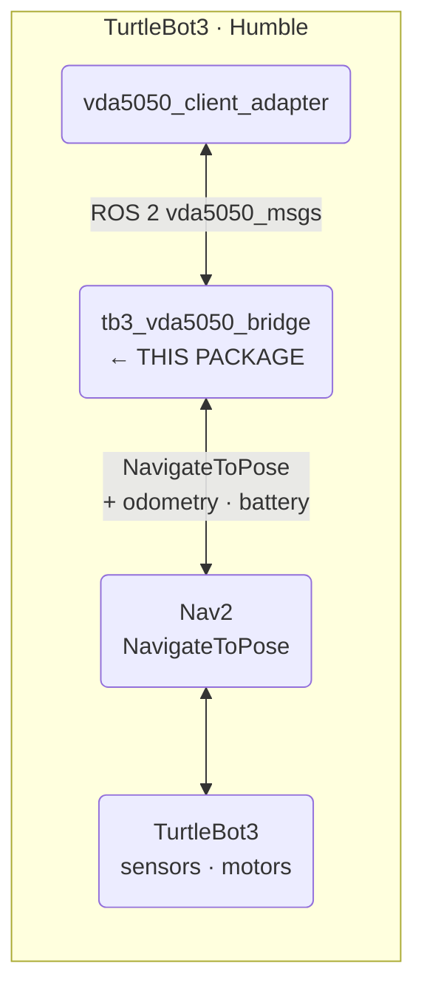
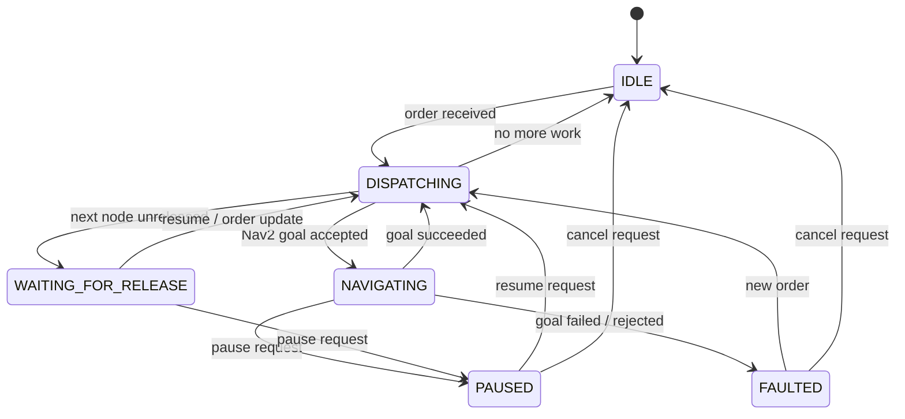

# tb3_vda5050_bridge

ROS 2 bridge node that connects `vda5050_client_adapter` to the TurtleBot3 / Nav2 stack. Converts VDA5050 orders into `NavigateToPose` goals and feeds odometry, battery, and traversal events back to the adapter.

## Overview

The bridge is the southbound robot driver for the VDA5050 stack. It receives validated `vda5050_msgs/Order` topics from the client adapter, plans the traversal node-by-node, dispatches Nav2 goals, and emits `node_reached` / `edge_entered` / `edge_completed` events that drive the adapter's `OrderManager`. A stale-callback token prevents old canceled goals from corrupting the current order state.

## System Context



## Architecture

```mermaid
flowchart TB
    subgraph Bridge["tb3_vda5050_bridge"]
        Node["BridgeNode\nROS orchestration\npublishers · subscribers · Nav2 client"]
        Session["OrderSession\norder cursor · traversal planning\nbase/horizon rules"]
        SM["BridgeStateMachine\nmode · driving/paused flags"]
    end

    Node --> Session & SM
    Node <-->|"vda5050_msgs topics"| Adapter["vda5050_client_adapter"]
    Node <-->|"NavigateToPose goal/result"| Nav2["Nav2"]
    Node <--|"odom · battery_state"| TB3["TurtleBot3 sensors"]
```

### State machine



| Mode | driving | paused | Meaning |
|---|---|---|---|
| `IDLE` | false | false | No active work |
| `DISPATCHING` | false | false | Planning or sending next step |
| `NAVIGATING` | true | false | Active Nav2 goal in flight |
| `WAITING_FOR_RELEASE` | false | false | Next node is horizon / unreleased |
| `PAUSED` | false | true | Navigation intentionally paused |
| `FAULTED` | false | false | Nav2 goal failed or unavailable |

## Package Structure

| File | Role |
|---|---|
| `src/bridge_node.cpp` | ROS orchestration: owns all publishers/subscribers and the Nav2 action client. Translates between the ROS interface and the session/state-machine. |
| `src/order_session.cpp` | `plan_next_work()` traversal algorithm: released action-only nodes are consumed immediately; navigable nodes are sent to Nav2; unreleased nodes trigger WAITING_FOR_RELEASE. |
| `include/.../bridge_state_machine.hpp` | Centralizes mode transitions and derives `driving` / `paused` flags. Prevents contradictory states. |
| `config/bridge_params.yaml` | ROS parameters (adapter namespace, topic names, Nav2 action name). |

## Data Flow

**Downlink (adapter → Nav2)**

```
vda5050_client_adapter ~/order
  → BridgeNode → OrderSession::plan_next_work()
  → NavigateToPose::async_send_goal(pose)
  → on success: emit node_reached / edge_completed → plan_next_work()
```

**Uplink (TurtleBot3 → adapter)**

```
/odom → BridgeNode → ~/agv_position · ~/velocity
/battery_state → BridgeNode → ~/battery_state
BridgeStateMachine → ~/driving · ~/paused
```

## ROS Interface

> Topic prefix is parameterized by `adapter_ns` (default: `/vda5050_client_adapter`).

### Subscribed

| Topic | Type | Purpose |
|---|---|---|
| `${odom_topic}` | `nav_msgs/Odometry` | Robot position and velocity |
| `${battery_topic}` | `sensor_msgs/BatteryState` | Battery charge |
| `${adapter_ns}/order` | `vda5050_msgs/Order` | Active order from adapter |
| `${adapter_ns}/action_cancel` | `std_msgs/String` | `pause:*` · `resume:*` · `cancel:*` |
| `${adapter_ns}/action_execute` | `vda5050_msgs/Action` | External action request |

### Published

| Topic | Type | Purpose |
|---|---|---|
| `${adapter_ns}/agv_position` | `vda5050_msgs/AgvPosition` | Robot position |
| `${adapter_ns}/velocity` | `vda5050_msgs/Velocity` | Robot velocity |
| `${adapter_ns}/battery_state` | `vda5050_msgs/BatteryState` | Battery feedback |
| `${adapter_ns}/driving` | `std_msgs/Bool` | Derived from state machine |
| `${adapter_ns}/paused` | `std_msgs/Bool` | Derived from state machine |
| `${adapter_ns}/node_reached` | `vda5050_msgs/NodeState` | Traversal event |
| `${adapter_ns}/edge_entered` | `vda5050_msgs/EdgeState` | Edge activation event |
| `${adapter_ns}/edge_completed` | `vda5050_msgs/EdgeState` | Edge completion event |
| `${adapter_ns}/action_state_feedback` | `vda5050_msgs/ActionState` | Action progress |
| `${adapter_ns}/error` | `vda5050_msgs/Error` | Navigation or bridge errors |

## Configuration

Config file: [`config/bridge_params.yaml`](config/bridge_params.yaml)

| Parameter | Default | Description |
|---|---|---|
| `adapter_ns` | `/vda5050_client_adapter` | Adapter topic prefix |
| `odom_topic` | `/odom` | Odometry input |
| `battery_topic` | `/battery_state` | Battery input |
| `nav2_action_name` | `navigate_to_pose` | Nav2 action server name |
| `map_id` | `map` | Default map frame |
| `position_covariance_threshold` | `0.5` | Threshold for `position_initialized` flag |

## Build & Run

```bash
# Build (on TurtleBot3 or cross-compiled)
colcon build --packages-select vda5050_msgs tb3_vda5050_bridge
source install/setup.bash

# Run
ros2 launch tb3_vda5050_bridge bridge.launch.py
```

Make sure `vda5050_client_adapter` and Nav2 are running before starting the bridge.

## Related

- [Root README — system overview](../README.md)
- [Detailed Architecture](docs/architecture.md)
- [VDA5050 Client Adapter](../vda5050_client_adapter/README.md)
