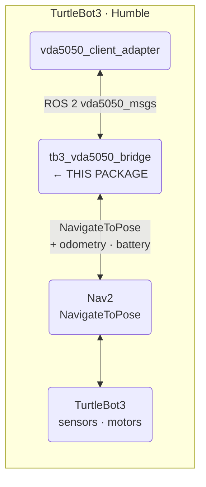
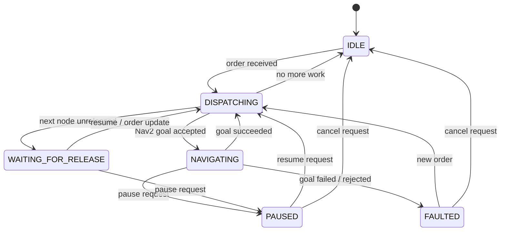

# tb3_vda5050_bridge

ROS 2 bridge node that connects `vda5050_client_adapter` to the TurtleBot3 / Nav2 stack. Converts VDA5050 orders into `NavigateToPose` goals and feeds odometry, battery, and traversal events back to the adapter.

## Overview

The bridge is the southbound robot driver for the VDA5050 stack. It receives validated `vda5050_msgs/Order` topics from the client adapter, plans the traversal node-by-node, dispatches Nav2 goals, and emits `node_reached` / `edge_entered` / `edge_completed` events that drive the adapter's `OrderManager`. A stale-callback token prevents old canceled goals from corrupting the current order state.

## System Context


```mermaid
flowchart LR
    subgraph robot ["TurtleBot3 · Humble"]
        ca("vda5050_client_adapter")
        br("tb3_vda5050_bridge\n← THIS PACKAGE")
        nav2("Nav2\nNavigateToPose")
        tb3("TurtleBot3\nsensors · motors")

        ca  <-->|"ROS 2 vda5050_msgs"| br
        br  <-->|"NavigateToPose\n+ odometry · battery"| nav2
        nav2 <--> tb3
    end
```

## Architecture

```mermaid
flowchart TB
    subgraph Bridge["tb3_vda5050_bridge"]
        Node["BridgeNode\nROS orchestration\npublishers · subscribers · Nav2 client"]
        Session["OrderSession\norder cursor · traversal planning\nbase/horizon rules"]
        SM["BridgeStateMachine\nmode · driving/paused flags"]
    end

    Node --> Session & SM
    Node <-->|"vda5050_msgs topics"| Adapter["vda5050_client_adapter"]
    Node <-->|"NavigateToPose goal/result"| Nav2["Nav2"]
    Node <--|"odom · battery_state"| TB3["TurtleBot3 sensors"]
```

### State machine


```mermaid
stateDiagram-v2
    [*] --> IDLE
    IDLE --> DISPATCHING : order received
    DISPATCHING --> NAVIGATING : Nav2 goal accepted
    DISPATCHING --> WAITING_FOR_RELEASE : next node unreleased
    DISPATCHING --> IDLE : no more work
    NAVIGATING --> DISPATCHING : goal succeeded
    NAVIGATING --> PAUSED : pause request
    NAVIGATING --> FAULTED : goal failed / rejected
    WAITING_FOR_RELEASE --> PAUSED : pause request
    WAITING_FOR_RELEASE --> DISPATCHING : resume / order update
    PAUSED --> DISPATCHING : resume request
    PAUSED --> IDLE : cancel request
    FAULTED --> DISPATCHING : new order
    FAULTED --> IDLE : cancel request
```

| Mode | driving | paused | Meaning |
|---|---|---|---|
| `IDLE` | false | false | No active work |
| `DISPATCHING` | false | false | Planning or sending next step |
| `NAVIGATING` | true | false | Active Nav2 goal in flight |
| `WAITING_FOR_RELEASE` | false | false | Next node is horizon / unreleased |
| `PAUSED` | false | true | Navigation intentionally paused |
| `FAULTED` | false | false | Nav2 goal failed or unavailable |

## Package Structure

| File | Role |
|---|---|
| `src/bridge_node.cpp` | ROS orchestration: owns all publishers/subscribers and the Nav2 action client. Translates between the ROS interface and the session/state-machine. |
| `src/order_session.cpp` | `plan_next_work()` traversal algorithm: released action-only nodes are consumed immediately; navigable nodes are sent to Nav2; unreleased nodes trigger WAITING_FOR_RELEASE. |
| `include/.../bridge_state_machine.hpp` | Centralizes mode transitions and derives `driving` / `paused` flags. Prevents contradictory states. |
| `config/bridge_params.yaml` | ROS parameters (adapter namespace, topic names, Nav2 action name). |

## Data Flow

**Downlink (adapter → Nav2)**

```
vda5050_client_adapter ~/order
  → BridgeNode → OrderSession::plan_next_work()
  → NavigateToPose::async_send_goal(pose)
  → on success: emit node_reached / edge_completed → plan_next_work()
```

**Uplink (TurtleBot3 → adapter)**

```
/odom → BridgeNode → ~/agv_position · ~/velocity
/battery_state → BridgeNode → ~/battery_state
BridgeStateMachine → ~/driving · ~/paused
```

## Startup & Robustness

The bridge is designed so that **startup order does not matter**:

- **Bridge starts before Nav2** — a navigation goal is not failed if the Nav2 action
  server is not up yet. The order is held and re-attempted on a 2 s timer; the goal goes
  out as soon as Nav2 appears. Bounded by `nav2_dispatch_timeout_sec` (120s default) —
  past that, the order fails with a `navigationError` instead of retrying forever.
- **New order replaces an active one** — the bridge lets Nav2 **preempt** the active goal
  (sends the replacement, bumps the navigation token) instead of cancelling and re-sending
  in the same tick, which on a single-goal server races and can make Nav2 silently drop
  the new goal.
- **Stale callbacks** — each goal carries a monotonic token; results from superseded goals
  are ignored.
- **Restart doesn't replay a finished order** — order progress (`order_id`, node cursor,
  terminal flag) is persisted to disk (`order_state_path`) and checked before acting on
  what looks like a new order, so a `transient_local` order retained by a still-running
  publisher (e.g. `robot_local_ui`'s panel, a separate systemd unit from bringup) can't make
  a restarted bridge re-drive a route it already completed or that was cancelled. An order
  still genuinely in progress resumes at its last cursor instead of restarting from node 0.
- **A failed navigation is retried, not given up on immediately** — Nav2 reporting a goal
  as failed (obstacle, transient AMCL/planner hiccup) re-attempts the same node on the same
  2 s timer/`nav2_dispatch_timeout_sec` budget as the "Nav2 not ready yet" case above, instead
  of stalling the order on the first hiccup. Only once that budget is exhausted does the order
  actually fail (`navigationError`, order cleared and persisted as terminal).

See [docs/architecture.md §6, §6b, §10.5, §10.20](docs/architecture.md) for details.

## ROS Interface

> Topic prefix is parameterized by `adapter_ns` (default: `/vda5050_client_adapter`).

### Subscribed

| Topic | Type | Purpose |
|---|---|---|
| `${odom_topic}` | `nav_msgs/Odometry` | Robot position and velocity |
| `${battery_topic}` | `sensor_msgs/BatteryState` | Battery charge |
| `${adapter_ns}/order` | `vda5050_msgs/Order` | Active order from adapter |
| `${adapter_ns}/action_cancel` | `std_msgs/String` | `pause:*` · `resume:*` · `cancel:*` |
| `${adapter_ns}/action_execute` | `vda5050_msgs/Action` | External action request |

### Published

| Topic | Type | Purpose |
|---|---|---|
| `${adapter_ns}/agv_position` | `vda5050_msgs/AgvPosition` | Robot position |
| `${adapter_ns}/velocity` | `vda5050_msgs/Velocity` | Robot velocity |
| `${adapter_ns}/battery_state` | `vda5050_msgs/BatteryState` | Battery feedback — an unusable `/battery_state` reading (no percentage or voltage) republishes the last known-good value instead of fabricating one |
| `${adapter_ns}/driving` | `std_msgs/Bool` | Derived from state machine. `transient_local`, depth 1 — a subscriber joining after the bridge started still gets the current value immediately |
| `${adapter_ns}/paused` | `std_msgs/Bool` | Derived from state machine. `transient_local`, depth 1 — same as `driving` above |
| `${adapter_ns}/node_reached` | `vda5050_msgs/NodeState` | Traversal event |
| `${adapter_ns}/edge_entered` | `vda5050_msgs/EdgeState` | Edge activation event |
| `${adapter_ns}/edge_completed` | `vda5050_msgs/EdgeState` | Edge completion event |
| `${adapter_ns}/action_state_feedback` | `vda5050_msgs/ActionState` | Action progress |
| `${adapter_ns}/error` | `vda5050_msgs/Error` | Navigation or bridge errors |

## Configuration

Config file: [`config/bridge_params.yaml`](config/bridge_params.yaml)

| Parameter | Default | Description |
|---|---|---|
| `adapter_ns` | `/vda5050_client_adapter` | Adapter topic prefix |
| `odom_topic` | `/odom` | Odometry input |
| `battery_topic` | `/battery_state` | Battery input |
| `nav2_action_name` | `navigate_to_pose` | Nav2 action server name |
| `map_id` | `map` | Default map frame |
| `position_covariance_threshold` | `0.5` | Threshold for `position_initialized` flag |
| `order_state_path` | `$HOME/.ros/tb3_vda5050_bridge_order_state.txt` | Order progress persisted across restarts |
| `nav2_dispatch_timeout_sec` | `120.0` | Max wait for Nav2 before failing a stuck order |
| `initial_pose_topic` | `/initialpose` | Where `initPosition` publishes AMCL's new pose. Refused (`FAILED`) while an order is active, same reasoning as `robot_local_ui`'s own `setInitialPose()` guard — see [docs/architecture.md §10.21](docs/architecture.md) |
| `supported_action_types` | `[]` | VDA5050 action types actually implemented (e.g. `initPosition`) |
| `amcl_pose_timeout_sec` | `10.0` | Max age of the last AMCL pose before it stops being trusted — unless the robot hasn't moved since, see `pose_stale_move_tolerance_m` |
| `pose_stale_move_tolerance_m` | `0.15` | Only checked at all once the robot has actually driven since the last AMCL confirmation — a robot never told to drive is trusted outright, however stale. For that narrower case, a stale (past `amcl_pose_timeout_sec`) AMCL pose is still trusted as long as odometry shows it hasn't moved more than this since. See [docs/architecture.md §10.22](docs/architecture.md) and [§10.23](docs/architecture.md) |
| `speed_limit_topic` | `/speed_limit` | Nav2's speed-override input; an edge's `maxSpeed` is applied here before dispatch |

## Build & Run

```bash
# Build (on TurtleBot3 or cross-compiled)
colcon build --packages-select vda5050_msgs tb3_vda5050_bridge
source install/setup.bash

# Run
ros2 launch tb3_vda5050_bridge bridge.launch.py
```

Make sure `vda5050_client_adapter` and Nav2 are running before starting the bridge.

## Related

- [Root README — system overview](../README.md)
- [Detailed Architecture](docs/architecture.md)
- [VDA5050 Client Adapter](../vda5050_client_adapter/README.md)
