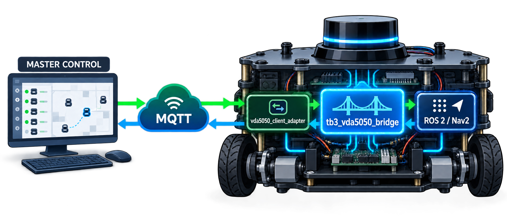

# tb3_vda5050_bridge

`tb3_vda5050_bridge` is a ROS 2 bridge node that integrates `vda5050_client_adapter` with the TurtleBot3 and Nav2 stack.

Its purpose is to convert each `NavigateToNode` step into a Nav2 `NavigateToPose` goal and publish odometry, battery, and driver status to the adapter. Order management remains in `vda5050_client_adapter`.

<p align="center">
  
</p>

<p align="center"><em>Functional flow between the VDA5050 client adapter, the bridge, and Nav2.</em></p>

System boundaries, navigation flows, and recovery behavior are described in [docs/architecture.md](docs/architecture.md).

## Key Features

| Feature | Description |
|---|---|
| Navigation | Converts each `NavigateToNode` step into a Nav2 `NavigateToPose` goal. The final step status is reported as `REACHED`, `FAILED`, `DROPPED`, `CANCELED`, or `PREEMPTED`. |
| Direct completion | Completes the step without Nav2 when the robot is already at the target or the node does not define a position. |
| Telemetry | Publishes the robot position, velocity, battery level, driving state, and traveled distance. The `driver_status` message includes a unique session ID for step recovery after a bridge restart. |
| Manual override | Detects manual control through `twist_mux` diagnostics and reports the current mode through `operating_mode`. |
| Nav2 recovery | Allows the bridge to start before Nav2 is available. A failed Nav2 goal is retried until `nav2_dispatch_timeout_sec` expires. |
| Re-localization | Applies `initPosition` through AMCL. The request is rejected while the robot is navigating from a valid pose. |
| Charging | Processes `startCharging` and `stopCharging` through the simulated charger when `simulate_charging` is enabled. Otherwise, the charging state is read from the battery message. |

## Package Structure

The package separates the bridge logic, configuration, launch files, test utilities, and documentation.

| Path | Description |
|---|---|
| `include/tb3_vda5050_bridge/bridge_node.hpp` | Declares the bridge node, ROS interfaces, parameters, and runtime state. |
| `include/tb3_vda5050_bridge/odom_distance_tracker.hpp` | Declares the distance tracker used for VDA5050 telemetry. |
| `src/bridge_node.cpp` | Implements navigation, instant actions, telemetry, and driver-state handling. |
| `src/main.cpp` | Creates and runs the bridge node. |
| `src/odom_distance_tracker.cpp` | Calculates traveled distance from consecutive odometry positions. |
| `config/bridge_params.yaml` | Defines the ROS 2 parameters loaded by the default launch file. |
| `launch/bridge.launch.py` | Starts the bridge and optionally starts the mock load publisher. |
| `mock/mock_load_publisher.py` | Publishes simulated load data for tests without a load sensor. |
| `test/` | Contains unit, node-level, and end-to-end tests. |
| `docs/architecture.md` | Describes system boundaries, navigation flows, and recovery behavior. |

## Prerequisites

The package requires ROS 2 Jazzy and `vda5050_msgs` in the same workspace. An active Nav2 stack and `vda5050_client_adapter` are required at runtime.

Install the dependencies declared by the bridge and message packages:

```bash
source /opt/ros/jazzy/setup.bash
cd ~/ros2_ws
rosdep install --from-paths src/tb3_vda5050_bridge src/vda5050_msgs --ignore-src --rosdistro jazzy -r -y
```

## Build & Run

Build the message package and bridge from the workspace root:

```bash
cd ~/ros2_ws
source /opt/ros/jazzy/setup.bash
colcon build --packages-select vda5050_msgs tb3_vda5050_bridge
source install/setup.bash
```

Start the bridge with the mock load publisher enabled:

```bash
ros2 launch tb3_vda5050_bridge bridge.launch.py
```

Disable the mock publisher when the robot provides load data from a sensor:

```bash
ros2 launch tb3_vda5050_bridge bridge.launch.py use_mock_load:=false
```

The components may start in any order. The client adapter waits for the `NavigateToNode` server, and the bridge retries navigation until Nav2 becomes available. The bridge and client adapter must use the same `vda5050_msgs` version.

## ROS Interface

The bridge uses the `adapter_ns` parameter as the topic prefix. Its configured value is `/vda5050_client_adapter`.

**Subscribed topics**

The bridge subscribes to robot data and commands from the client adapter.

| Topic | Type | Description |
|---|---|---|
| `${odom_topic}` | `nav_msgs/msg/Odometry` | Provides the robot position and velocity. |
| `${amcl_pose_topic}` | `geometry_msgs/msg/PoseWithCovarianceStamped` | Provides the robot pose estimated by AMCL. |
| `${battery_topic}` | `sensor_msgs/msg/BatteryState` | Provides the battery level and charging state. |
| `${diagnostics_topic}` | `diagnostic_msgs/msg/DiagnosticArray` | Provides the `twist_mux` state for manual-control detection. |
| `${adapter_ns}/action_execute` | `vda5050_msgs/msg/Action` | Provides an instant action for bridge execution. |
| `${adapter_ns}/action_command` | `vda5050_msgs/msg/ActionCommand` | Provides pause, resume, or cancel commands for an action. The bridge ignores these commands because its actions complete immediately. |
| `${adapter_ns}/action_cancel` | `std_msgs/msg/String` | Drops the active step when the value matches `cancel:*`. Other values are ignored. |

**Published topics**

The bridge publishes robot telemetry and state information to the client adapter. It also publishes localization and speed commands to Nav2.

| Topic | Type | Description |
|---|---|---|
| `${adapter_ns}/agv_position` | `vda5050_msgs/msg/AgvPosition` | Publishes the robot position in VDA5050 format. |
| `${adapter_ns}/velocity` | `vda5050_msgs/msg/Velocity` | Publishes the robot velocity at the configured interval. |
| `${adapter_ns}/battery_state` | `vda5050_msgs/msg/BatteryState` | Publishes the battery level and charging state. An invalid sensor reading is ignored. If a valid value was received earlier, that value is published again. |
| `${adapter_ns}/driver_status` | `vda5050_msgs/msg/DriverStatus` | Publishes the session ID and driving state. The topic uses transient-local durability and manual liveliness. |
| `${adapter_ns}/operating_mode` | `std_msgs/msg/String` | Publishes `AUTOMATIC` or `MANUAL` from the `twist_mux` state. |
| `${adapter_ns}/action_state_feedback` | `vda5050_msgs/msg/ActionState` | Publishes the current state of an instant action. |
| `${adapter_ns}/distance_since_last_node` | `std_msgs/msg/Float64` | Publishes the traveled distance since the previous node. |
| `${initial_pose_topic}` | `geometry_msgs/msg/PoseWithCovarianceStamped` | Publishes the AMCL initial pose from an `initPosition` action. |
| `${speed_limit_topic}` | `nav2_msgs/msg/SpeedLimit` | Publishes the edge speed limit for the Nav2 controller. |

**Action interfaces**

The bridge receives navigation steps from the client adapter and sends navigation goals to Nav2.

| Action | Type | Role | Description |
|---|---|---|---|
| `${adapter_ns}/navigate_to_node` | `vda5050_msgs/action/NavigateToNode` | Server | Executes one route node and reports its result to the client adapter. |
| `${nav2_action_name}` | `nav2_msgs/action/NavigateToPose` | Client | Sends the target pose to Nav2 and receives the goal response and final result. |

## Configuration

The default launch file loads [`config/bridge_params.yaml`](config/bridge_params.yaml). The table lists the values used by this configuration.

| Parameter | Configured value | Description |
|---|---|---|
| `adapter_ns` | `/vda5050_client_adapter` | Defines the topic prefix used to communicate with the client adapter. |
| `odom_topic` | `/diff_drive_controller/odom` | Defines the odometry input topic. |
| `amcl_pose_topic` | `/amcl_pose` | Defines the AMCL pose input topic. |
| `battery_topic` | `/battery_state` | Defines the battery input topic. |
| `nav2_action_name` | `navigate_to_pose` | Defines the Nav2 action used for navigation goals. |
| `map_id` | `tb3_world` | Defines the VDA5050 map identifier reported with the robot position. |
| `nav2_frame_id` | `map` | Defines the global frame used for Nav2 goals. |
| `position_covariance_threshold` | `0.5` | Sets the maximum AMCL position variance accepted as valid. |
| `supported_action_types` | `initPosition`, `startCharging`, `stopCharging` | Defines the VDA5050 instant actions implemented by the bridge. |
| `simulate_charging` | `false` | Uses a simulated charger when enabled. When disabled, charging is read from the battery state. |
| `initial_pose_topic` | `/initialpose` | Defines the topic used to publish an `initPosition` pose to AMCL. |
| `nav2_dispatch_timeout_sec` | `120.0` s | Sets the retry timeout when Nav2 is unavailable, rejects a goal, or ends a goal early. The timeout pauses in `MANUAL` mode. |
| `amcl_pose_timeout_sec` | `10.0` s | Sets the maximum age of the latest AMCL pose. A stationary robot may continue to use a stale pose. |
| `pose_stale_move_tolerance_m` | `0.15` m | Sets the maximum odometry movement allowed when a stale AMCL pose is reused. |
| `speed_limit_topic` | `/speed_limit` | Defines the Nav2 topic used to apply an edge speed limit. |
| `nav2_retry_period_sec` | `2.0` s | Sets the interval between Nav2 dispatch retries. |
| `odom_publish_min_interval_sec` | `0.1` s | Sets the minimum interval for velocity and distance messages. A value of `0` publishes every odometry update. |
| `driver_status_lease_sec` | `1.0` s | Sets the liveliness lease for `driver_status`. The value must not exceed the adapter lease limit. |
| `default_allowed_deviation_xy` | `0.5` m | Sets the node-position tolerance when the order does not define `allowedDeviationXY`. |
| `unconstrained_theta_rad` | `3.0` rad | Ignores the target heading when `allowedDeviationTheta` is equal to or greater than this value. |
| `battery_voltage_full` | `12.6` V | Defines the voltage used as a full-battery reference. |
| `battery_voltage_empty` | `9.0` V | Defines the voltage used as an empty-battery reference. |
| `initial_pose_covariance_xy` | `0.25` m² | Defines the position covariance of an `initPosition` pose. |
| `initial_pose_covariance_yaw` | `0.06853891945200942` rad² | Defines the heading covariance of an `initPosition` pose. |
| `diagnostics_topic` | `/diagnostics` | Defines the diagnostic input topic used to monitor `twist_mux`. |
| `twist_mux_status_name` | `twist_mux: Twist mux status` | Defines the diagnostic status selected for manual-control detection. |
| `navigation_velocity_source` | `navigation` | Defines the `twist_mux` input used by Nav2. Another active input changes the operating mode to `MANUAL`. |

The node validates numeric parameters during startup. An invalid value stops the node and identifies the affected parameter.

## Testing Without Hardware

The mock load publisher sends a fixed `vda5050_msgs/msg/Load` message once per second. Its default topic is `/vda5050_client_adapter/load`. The `--topic` option selects a different topic.

The client adapter adds the load data to `state.loads` for the fleet adapter and user interface. A physical robot can replace the mock publisher with a load-sensor node on the same topic.

Run the mock publisher with the required load values:

```bash
ros2 run tb3_vda5050_bridge mock_load_publisher.py \
    --load-id box-01 --load-type box --weight 20
```

## Tests

Run the package tests after building the workspace:

```bash
colcon test --packages-select tb3_vda5050_bridge
```

The end-to-end test requires `vda5050_client_adapter`, the `vda5050_fleet_adapter_full_control` source package, and an MQTT broker. Run it with an isolated ROS domain:

```bash
VDA5050_TEST_BROKER=tcp://127.0.0.1:18830 ROS_DOMAIN_ID=77 ROS_AUTOMATIC_DISCOVERY_RANGE=LOCALHOST \
  build/tb3_vda5050_bridge/test_system_e2e
```

| Suite | Tests | Description |
|---|---:|---|
| `test_odom_distance_tracker` | 6 | Verifies traveled-distance accumulation and reset behavior. |
| `test_bridge_node` | 26 | Verifies navigation, preemption, cancellation, retries, driver status, actions, charging, and telemetry with simulated interfaces. |
| `test_system_e2e` | 10 | Verifies the MQTT navigation path in default and strict modes. The tests cover route updates, cancellation, pause, bridge restart, and driver loss. |

## Related

The following documents provide the system context and related component details:

- [System overview](../README.md)
- [Bridge architecture](docs/architecture.md)
- [VDA5050 client adapter](../vda5050_client_adapter/README.md)
