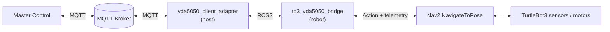
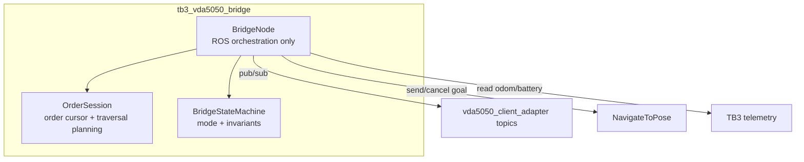
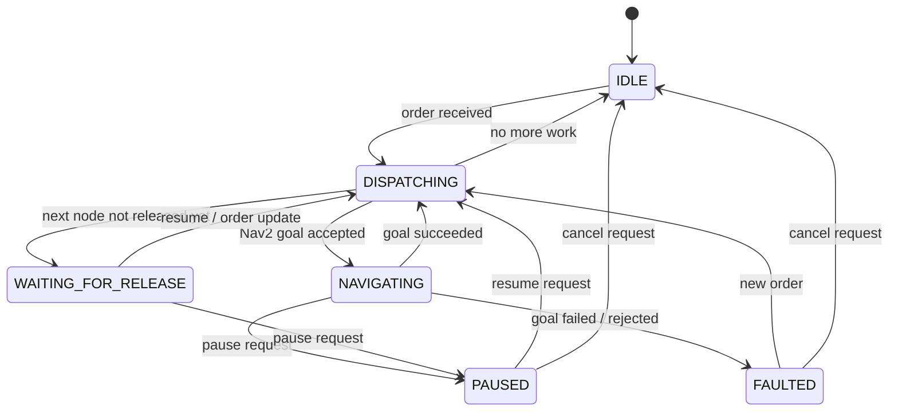
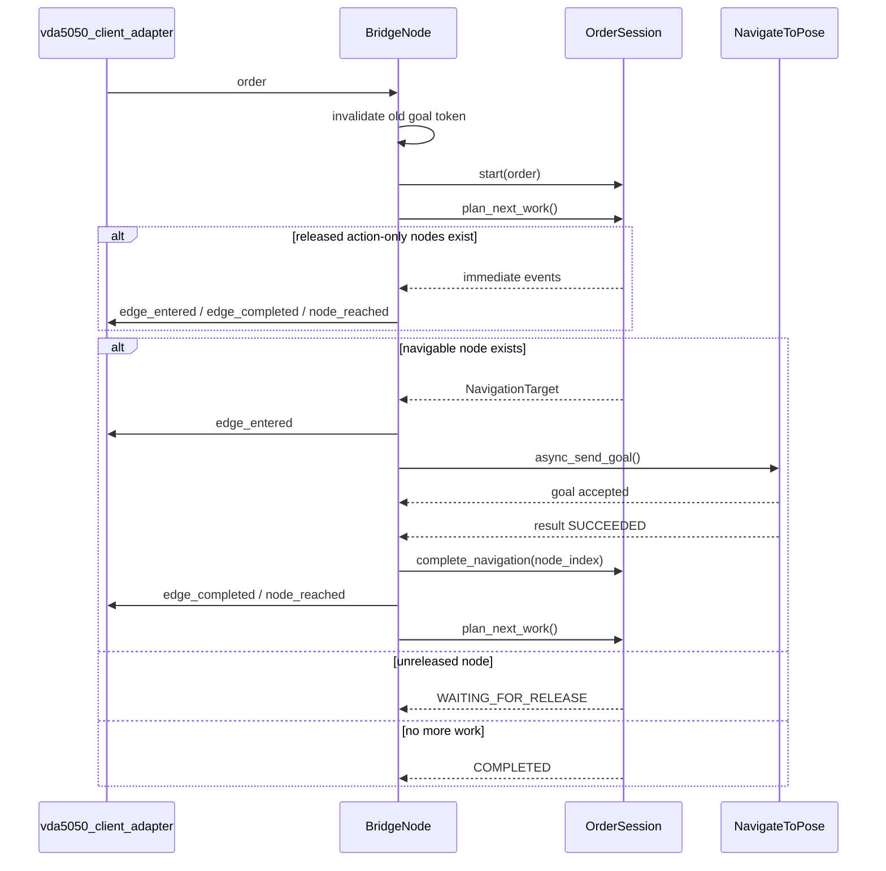

# TB3 VDA5050 Bridge — Architecture

Architecture documentation for the `tb3_vda5050_bridge` package after the module/state-machine refactor.

---

## 1. Role in the System

`tb3_vda5050_bridge` runs on the TurtleBot3 side and converts:

- `vda5050_client_adapter` ROS topics into Nav2 navigation requests
- TurtleBot3 telemetry into VDA5050 feedback topics

---

## 2. Module Layout

The package is now split into three maintenance units:

### `BridgeNode`

Responsibilities:

- Own ROS publishers/subscribers
- Own Nav2 action client
- Convert odometry/battery telemetry
- Dispatch Nav2 goals
- Ignore stale goal callbacks using a navigation token

### `OrderSession`

Responsibilities:

- Store active `vda5050_msgs/Order`
- Track next unconsumed node index
- Stop at the first unreleased node
- Immediately consume released action-only nodes
- Generate `edge_entered`, `edge_completed`, `node_reached` events in sequence order

### `BridgeStateMachine`

Responsibilities:

- Centralize bridge mode transitions
- Derive `driving` and `paused` flags from mode
- Prevent contradictory states like `driving=true` and `paused=true`

---

## 3. State Machine

### Mode semantics

| Mode | driving | paused | Meaning |
|---|---|---|---|
| `IDLE` | false | false | No active work |
| `DISPATCHING` | false | false | Planning or sending next step |
| `NAVIGATING` | true | false | Active Nav2 goal |
| `WAITING_FOR_RELEASE` | false | false | Order exists, but next node is horizon/unreleased |
| `PAUSED` | false | true | Navigation intentionally paused |
| `FAULTED` | false | false | Goal failed or Nav2 unavailable |

---

## 4. Order Traversal Model

`OrderSession::plan_next_work()` is the core traversal algorithm.

### Rules

1. If the next node is unreleased, stop and wait.
2. If the next node is released but has no `node_position`, consume it immediately.
3. If the next node is released and has a `node_position`, send it to Nav2.
4. Never skip ahead past an unreleased node.

### Action-only node handling

Released nodes without a position are treated as immediate logical traversal points:

- publish incoming `edge_entered` if applicable
- publish incoming `edge_completed` if applicable
- publish `node_reached`
- advance cursor without sending a Nav2 goal

This keeps the bridge compatible with the adapter's `OrderManager` and `ActionManager`.

---

## 5. Navigation Lifecycle

---

## 6. Stale Callback Protection

Each dispatched Nav2 goal gets a monotonically increasing navigation token.

- sending a new goal increments the token
- canceling or preempting a goal also increments the token
- `goal_response_callback` and `result_callback` ignore any token that is no longer current

This prevents an old canceled goal from mutating the current order state.

---

## 6b. Order Replacement & Nav2 Readiness

### Replacing an active order (Nav2 preemption, not explicit cancel)

When a brand-new order arrives while the robot is navigating, the bridge does **not**
call `async_cancel_goal` on the active goal and then immediately send the replacement in
the same tick. On the single-goal `NavigateToPose` server those two async calls race, and
Nav2 can silently drop the new goal (accepted, but the result callback never fires) —
stranding the order forever because its route is never consumed.

Instead, `on_order` for a new order:

1. Bumps the navigation token (`invalidate_navigation_context`) so the old goal's
   preemption result is ignored.
2. Sends the replacement goal and lets Nav2 **preempt** the old one (standard single-goal
   behavior — no race).
3. Only if the new order needs no navigation (robot already at target, mode is not
   `DISPATCHING`/`NAVIGATING`) does it explicitly `async_cancel_goal` the previous goal to
   stop the robot.

The explicit `cancel:` instant action (a true cancel with no replacement) still calls
`cancel_navigation()` to stop the robot.

### Nav2 not ready yet (startup order independence)

`send_navigation_goal` checks `action_server_is_ready()` (non-blocking). If Nav2 is not up
yet — e.g. the bridge started before Nav2 — the order is **held, not failed**: the bridge
stays in `DISPATCHING` and arms a 2 s retry timer that re-attempts the dispatch. The goal
goes out as soon as Nav2 appears. The timer is cancelled once a goal is sent, the order
completes, or it is cancelled. This makes robot-side startup order irrelevant.

---

## 7. ROS Interface

The adapter-facing namespace is parameterized by `adapter_ns`.
Default: `/vda5050_client_adapter`

### Subscribed

| Topic | Type | Purpose |
|---|---|---|
| `${odom_topic}` | `nav_msgs/Odometry` | Publish `AgvPosition` and `Velocity` |
| `${battery_topic}` | `sensor_msgs/BatteryState` | Publish VDA5050 battery state |
| `${adapter_ns}/order` | `vda5050_msgs/Order` | Active order from adapter |
| `${adapter_ns}/action_cancel` | `std_msgs/String` | `pause:*`, `resume:*`, `cancel:*` |
| `${adapter_ns}/action_execute` | `vda5050_msgs/Action` | Robot-side action execution request |

### Published

| Topic | Type | Purpose |
|---|---|---|
| `${adapter_ns}/agv_position` | `vda5050_msgs/AgvPosition` | Robot position |
| `${adapter_ns}/velocity` | `vda5050_msgs/Velocity` | Robot velocity |
| `${adapter_ns}/battery_state` | `vda5050_msgs/BatteryState` | Battery feedback |
| `${adapter_ns}/driving` | `std_msgs/Bool` | Derived from state machine |
| `${adapter_ns}/paused` | `std_msgs/Bool` | Derived from state machine |
| `${adapter_ns}/node_reached` | `vda5050_msgs/NodeState` | Traversed node |
| `${adapter_ns}/edge_entered` | `vda5050_msgs/EdgeState` | Edge activation |
| `${adapter_ns}/edge_completed` | `vda5050_msgs/EdgeState` | Edge completion |
| `${adapter_ns}/action_state_feedback` | `vda5050_msgs/ActionState` | Action ack / progress |
| `${adapter_ns}/error` | `vda5050_msgs/Error` | Navigation or bridge errors |

---

## 8. Parameters

| Parameter | Type | Default | Description |
|---|---|---|---|
| `adapter_ns` | `string` | `"/vda5050_client_adapter"` | Adapter topic prefix |
| `odom_topic` | `string` | `"/odom"` | Odometry input topic |
| `battery_topic` | `string` | `"/battery_state"` | Battery input topic |
| `nav2_action_name` | `string` | `"navigate_to_pose"` | Nav2 action server name |
| `map_id` | `string` | `"map"` | Default map frame |
| `position_covariance_threshold` | `double` | `0.5` | Marks `AgvPosition.position_initialized` |

Config file: [`config/bridge_params.yaml`](../config/bridge_params.yaml)

---

## 9. Reading Order

1. [`include/tb3_vda5050_bridge/bridge_state_machine.hpp`](../include/tb3_vda5050_bridge/bridge_state_machine.hpp)
2. [`include/tb3_vda5050_bridge/order_session.hpp`](../include/tb3_vda5050_bridge/order_session.hpp)
3. [`include/tb3_vda5050_bridge/bridge_node.hpp`](../include/tb3_vda5050_bridge/bridge_node.hpp)
4. [`src/order_session.cpp`](../src/order_session.cpp)
5. [`src/bridge_node.cpp`](../src/bridge_node.cpp)
