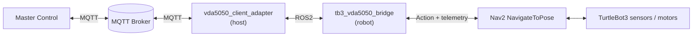
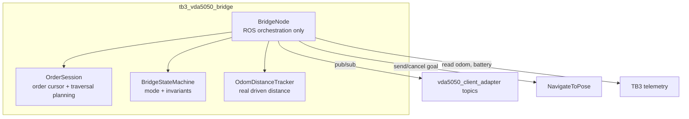
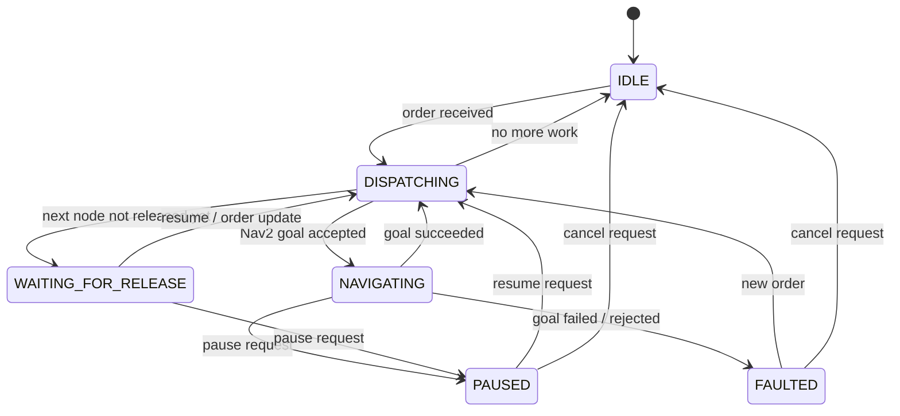
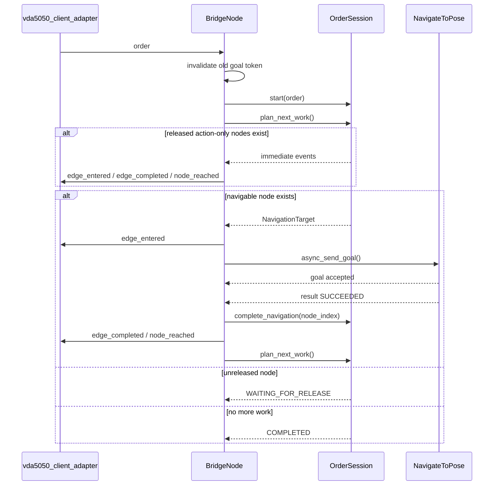

# TB3 VDA5050 Bridge — Architecture

Architecture documentation for the `tb3_vda5050_bridge` package after the module/state-machine refactor.

---

## 1. Role in the System

`tb3_vda5050_bridge` runs on the TurtleBot3 side and converts:

- `vda5050_client_adapter` ROS topics into Nav2 navigation requests
- TurtleBot3 telemetry into VDA5050 feedback topics

```mermaid
flowchart LR
    MC["Master Control"]
    Broker[("MQTT Broker")]
    Adapter["vda5050_client_adapter\n(host)"]
    Bridge["tb3_vda5050_bridge\n(robot)"]
    Nav2["Nav2 NavigateToPose"]
    TB3["TurtleBot3 sensors / motors"]

    MC <-->|MQTT| Broker
    Broker <-->|MQTT| Adapter
    Adapter <-->|ROS2| Bridge
    Bridge <-->|Action + telemetry| Nav2
    Nav2 <--> TB3
```

---

## 2. Module Layout

The package is now split into three maintenance units:

```mermaid
flowchart TB
    subgraph Bridge["tb3_vda5050_bridge"]
        Node["BridgeNode\nROS orchestration only"]
        Session["OrderSession\norder cursor + traversal planning"]
        SM["BridgeStateMachine\nmode + invariants"]
        Dist["OdomDistanceTracker\nreal driven distance"]
    end

    Node --> Session
    Node --> SM
    Node --> Dist
    Node -->|pub/sub| Adapter["vda5050_client_adapter topics"]
    Node -->|send/cancel goal| Nav2["NavigateToPose"]
    Node -->|read odom, battery| Robot["TB3 telemetry"]
```

### `BridgeNode`

Responsibilities:

- Own ROS publishers/subscribers
- Own Nav2 action client
- Convert odometry/battery telemetry
- Dispatch Nav2 goals
- Ignore stale goal callbacks using a navigation token
- Re-localize via `initPosition` and notify the adapter when an order is dropped outside `cancelOrder`

### `OrderSession`

Responsibilities:

- Store active `vda5050_msgs/Order`
- Track next unconsumed node index
- Stop at the first unreleased node
- Immediately consume released action-only nodes
- Generate `edge_entered`, `edge_completed`, `node_reached` events in sequence order

### `BridgeStateMachine`

Responsibilities:

- Centralize bridge mode transitions
- Derive `driving` and `paused` flags from mode
- Prevent contradictory states like `driving=true` and `paused=true`

### `OdomDistanceTracker`

Responsibilities:

- Accumulate real driven distance from consecutive `/odom` positions (not straight-line distance to the target)
- Reset each time a node is reached; also streamed live via `~/distance_since_last_node` between nodes

---

## 3. State Machine

```mermaid
stateDiagram-v2
    [*] --> IDLE
    IDLE --> DISPATCHING: order received
    DISPATCHING --> NAVIGATING: Nav2 goal accepted
    DISPATCHING --> WAITING_FOR_RELEASE: next node not released yet
    DISPATCHING --> IDLE: no more work
    NAVIGATING --> DISPATCHING: goal succeeded
    NAVIGATING --> PAUSED: pause request
    NAVIGATING --> FAULTED: goal failed / rejected
    WAITING_FOR_RELEASE --> PAUSED: pause request
    WAITING_FOR_RELEASE --> DISPATCHING: resume / order update
    PAUSED --> DISPATCHING: resume request
    PAUSED --> IDLE: cancel request
    FAULTED --> DISPATCHING: new order
    FAULTED --> IDLE: cancel request
```

### Mode semantics

| Mode | driving | paused | Meaning |
|:---:|:---:|:---:|---|
| `IDLE` | false | false | No active work |
| `DISPATCHING` | false | false | Planning or sending next step |
| `NAVIGATING` | true | false | Active Nav2 goal |
| `WAITING_FOR_RELEASE` | false | false | Order exists, but next node is horizon/unreleased |
| `PAUSED` | false | true | Navigation intentionally paused |
| `FAULTED` | false | false | Goal failed or Nav2 unavailable |

---

## 4. Order Traversal Model

`OrderSession::plan_next_work()` is the core traversal algorithm.

### Rules

1. If the next node is unreleased, stop and wait.
2. If the next node is released but has no `node_position`, consume it immediately.
3. If the next node is released and has a `node_position`, send it to Nav2.
4. Never skip ahead past an unreleased node.

### Order updates (`OrderSession::update`)

An order update (same `orderId`, higher `orderUpdateId`) restates the route from the
stitch node onward, not necessarily repeating every node/edge or in the same order.
`update()` upserts incoming nodes/edges by `sequence_id`, re-sorts, and drops an
already-known **unreleased** node/edge absent from the update (VDA5050 lets Master
Control reshape the horizon this way); a **released** node/edge is never dropped.

### Action-only node handling

Released nodes without a position are treated as immediate logical traversal points:

- publish incoming `edge_entered` if applicable
- publish incoming `edge_completed` if applicable
- publish `node_reached`
- advance cursor without sending a Nav2 goal

This keeps the bridge compatible with the adapter's `OrderManager` and `ActionManager`.

### Skipping Nav2 when already at the target (`try_complete_in_place`)

Before sending a navigable node to Nav2, `dispatch_next_work()` calls
`try_complete_in_place()`. If the AMCL pose is already within the node's
`allowedDeviationXy` (default 0.5 m), and within `allowedDeviationTheta` too
when heading is actually constrained, the node is marked reached without
going through Nav2 — this skips a pointless rotate-in-place. If the
position is in tolerance but the heading isn't, it falls through to Nav2,
which does the in-place rotation instead.

### Real driven distance (`OdomDistanceTracker`)

Tracks the actual path walked between consecutive `/odom` positions, not
the straight-line distance to the target, and resets it each time a node
is reached. This goes into `node_reached`'s `distance_driven` field and is
also streamed live on `~/distance_since_last_node`, so a curved or
obstacle-avoiding leg reports its real length instead of undercounting it.

---

## 5. Navigation Lifecycle

```mermaid
sequenceDiagram
    participant Adapter as vda5050_client_adapter
    participant Bridge as BridgeNode
    participant Session as OrderSession
    participant Nav2 as NavigateToPose

    Adapter->>Bridge: order
    Bridge->>Bridge: invalidate old goal token
    Bridge->>Session: start(order)
    Bridge->>Session: plan_next_work()

    alt released action-only nodes exist
        Session-->>Bridge: immediate events
        Bridge->>Adapter: edge_entered / edge_completed / node_reached
    end

    alt navigable node exists
        Session-->>Bridge: NavigationTarget
        Bridge->>Adapter: edge_entered
        Bridge->>Nav2: async_send_goal()
        Nav2-->>Bridge: goal accepted
        Nav2-->>Bridge: result SUCCEEDED
        Bridge->>Session: complete_navigation(node_index)
        Bridge->>Adapter: edge_completed / node_reached
        Bridge->>Session: plan_next_work()
    else unreleased node
        Session-->>Bridge: WAITING_FOR_RELEASE
    else no more work
        Session-->>Bridge: COMPLETED
    end
```

---

## 6. Stale Callback Protection

Each dispatched Nav2 goal gets a monotonically increasing navigation token.

- sending a new goal increments the token
- canceling or preempting a goal also increments the token
- `goal_response_callback` and `result_callback` ignore any token that is no longer current

This prevents an old canceled goal from mutating the current order state.

---

## 6b. Order Replacement & Nav2 Readiness

### Replacing an active order

A new order while navigating does not `async_cancel_goal` then send the
replacement — those two calls race on the single-goal `NavigateToPose`
server. Instead `on_order` bumps
the navigation token and sends the replacement, letting Nav2 preempt the
old goal; it only cancels explicitly if no replacement goal actually went
out. An explicit `cancel:` instant action still calls `cancel_navigation()`.

### Re-localization (`initPosition`)

See [README § Configuration](../README.md#configuration),
`initial_pose_topic` — refused only while a goal drives from a still-valid
pose; a lost pose cancels the goal first. A dropped order is cleared and
reported via `order_dropped`.

### Nav2 not ready yet, and failed goals are retried

`send_navigation_goal` checks `action_server_is_ready()`; if Nav2 isn't up
yet, or a goal fails, the order is held (not failed) and a 2 s timer
retries dispatch until `nav2_dispatch_timeout_sec` runs out — so bridge/Nav2
startup order doesn't matter and one bad goal doesn't fail the order.

### Restart doesn't replay a finished order

Order progress (`order_id`, node cursor, terminal flag) is persisted to
`order_state_path` and checked before acting on what looks like a new
order, so a retained order message can't make a restarted bridge re-drive
a route already completed or cancelled; a genuinely unfinished order
resumes at its last cursor.

---

## 7. ROS Interface

The adapter-facing namespace is parameterized by `adapter_ns`.
Default: `/vda5050_client_adapter`

### Subscribed

| Topic | Type | Purpose |
|:---:|:---:|---|
| `${odom_topic}` | `nav_msgs/Odometry` | Publish `AgvPosition` and `Velocity` |
| `${amcl_pose_topic}` | `geometry_msgs/PoseWithCovarianceStamped` | AMCL localization pose (staleness/trust checks, §7b) |
| `${battery_topic}` | `sensor_msgs/BatteryState` | Publish VDA5050 battery state |
| `/diagnostics` | `diagnostic_msgs/DiagnosticArray` | `twist_mux` arbitration, for manual-override detection (§7b) |
| `${adapter_ns}/order` | `vda5050_msgs/Order` | Active order from adapter |
| `${adapter_ns}/action_cancel` | `std_msgs/String` | `pause:*`, `resume:*`, `cancel:*` |
| `${adapter_ns}/action_execute` | `vda5050_msgs/Action` | Robot-side action execution request |

### Published

| Topic | Type | Purpose |
|:---:|:---:|---|
| `${adapter_ns}/agv_position` | `vda5050_msgs/AgvPosition` | Robot position |
| `${adapter_ns}/velocity` | `vda5050_msgs/Velocity` | Robot velocity |
| `${adapter_ns}/battery_state` | `vda5050_msgs/BatteryState` | Battery feedback |
| `${adapter_ns}/driving` | `std_msgs/Bool` | Derived from state machine |
| `${adapter_ns}/paused` | `std_msgs/Bool` | Derived from state machine |
| `${adapter_ns}/operating_mode` | `std_msgs/String` | `AUTOMATIC` or `MANUAL`, from `twist_mux`'s own arbitration (see below) |
| `${adapter_ns}/node_reached` | `vda5050_msgs/NodeState` | Traversed node |
| `${adapter_ns}/edge_entered` | `vda5050_msgs/EdgeState` | Edge activation |
| `${adapter_ns}/edge_completed` | `vda5050_msgs/EdgeState` | Edge completion |
| `${adapter_ns}/action_state_feedback` | `vda5050_msgs/ActionState` | Action ack / progress |
| `${adapter_ns}/error` | `vda5050_msgs/Error` | Navigation or bridge errors |
| `${adapter_ns}/order_dropped` | `std_msgs/String` | `orderId` this bridge gave up on outside `cancelOrder` (stuck timeout, rejected action, `initPosition` invalidating the route) — lets the adapter clear its own tracking instead of staying desynced |
| `${adapter_ns}/distance_since_last_node` | `std_msgs/Float64` | Real driven distance since the last reached node, streamed live from odometry (not just at arrival) |

---

## 7b. Manual Override Detection (`operating_mode`)

`twist_mux` arbitrates joystick/keyboard/Nav2 by priority and reports each
source's masked/unmasked state via `/diagnostics`. Any non-`navigation`
source reporting `unmasked` is a human takeover: `operating_mode` publishes
`MANUAL` (else `AUTOMATIC`), only on change. `AgvPosition`/`Velocity` stay
accurate either way (real odometry/AMCL, not what Nav2 commanded).
`SEMIAUTOMATIC`/`SERVICE`/`TEACHIN` are never used — no such state on this robot.

---

## 8. Parameters

Full parameter table (defaults, types, descriptions) lives in
[README.md § Configuration](../README.md#configuration) — kept in one place
to avoid the two drifting apart. Config file:
[`config/bridge_params.yaml`](../config/bridge_params.yaml)

---

## 9. Reading Order

1. [`include/tb3_vda5050_bridge/bridge_state_machine.hpp`](../include/tb3_vda5050_bridge/bridge_state_machine.hpp)
2. [`include/tb3_vda5050_bridge/order_session.hpp`](../include/tb3_vda5050_bridge/order_session.hpp)
3. [`include/tb3_vda5050_bridge/odom_distance_tracker.hpp`](../include/tb3_vda5050_bridge/odom_distance_tracker.hpp)
4. [`include/tb3_vda5050_bridge/bridge_node.hpp`](../include/tb3_vda5050_bridge/bridge_node.hpp)
5. [`src/order_session.cpp`](../src/order_session.cpp)
6. [`src/bridge_node.cpp`](../src/bridge_node.cpp)
