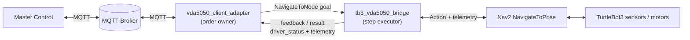
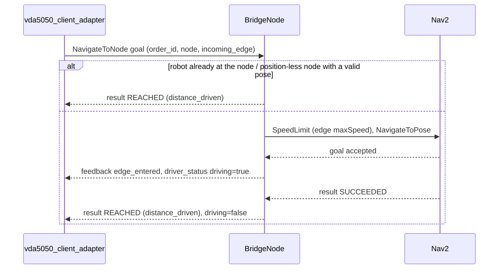

# TB3 VDA5050 Bridge — Architecture

Architecture of `tb3_vda5050_bridge`: a step executor for `vda5050_client_adapter`, which owns the order.

---

## 1. Role in the System

`tb3_vda5050_bridge` runs on the TurtleBot3 side and:

- executes `NavigateToNode` goals (one route node each) as Nav2 `NavigateToPose` goals
- turns TurtleBot3 telemetry into the adapter's feedback topics
- runs the instant actions it supports (`initPosition`)

It keeps no order: route, stitching, progress and errors toward the master are the adapter's.

```mermaid
flowchart LR
    MC["Master Control"]
    Broker[("MQTT Broker")]
    Adapter["vda5050_client_adapter\n(order owner)"]
    Bridge["tb3_vda5050_bridge\n(step executor)"]
    Nav2["Nav2 NavigateToPose"]
    TB3["TurtleBot3 sensors / motors"]

    MC <-->|MQTT| Broker
    Broker <-->|MQTT| Adapter
    Adapter -->|NavigateToNode goal| Bridge
    Bridge -->|feedback / result\ndriver_status + telemetry| Adapter
    Bridge <-->|Action + telemetry| Nav2
    Nav2 <--> TB3
```

---

## 2. Module Layout

| Module | Responsibility |
|---|---|
| `BridgeNode` | `NavigateToNode` server, Nav2 client and retry window, telemetry, driver status, instant actions |
| `OdomDistanceTracker` | Real driven distance between nodes from consecutive `/odom` positions |

---

## 3. Step Lifecycle

```mermaid
sequenceDiagram
    participant Adapter as vda5050_client_adapter
    participant Bridge as BridgeNode
    participant Nav2

    Adapter->>Bridge: NavigateToNode goal (order_id, node, incoming_edge)
    alt robot already at the node / position-less node with a valid pose
        Bridge-->>Adapter: result REACHED (distance_driven)
    else
        Bridge->>Nav2: SpeedLimit (edge maxSpeed), NavigateToPose
        Nav2-->>Bridge: goal accepted
        Bridge-->>Adapter: feedback edge_entered, driver_status driving=true
        Nav2-->>Bridge: result SUCCEEDED
        Bridge-->>Adapter: result REACHED (distance_driven), driving=false
    end
```

| Outcome | Result code | When |
|---|---|---|
| `REACHED` | `SUCCEEDED` | Nav2 succeeded, the robot is already within the node's tolerance, or a position-less node with a valid pose |
| `FAILED` | `ABORTED` | The node was not reached within `nav2_dispatch_timeout_sec` (Nav2 unavailable, rejecting or ending goals early, pose not valid) |
| `DROPPED` | `ABORTED` | `cancel:*` on `~/action_cancel` from a local tool, or `initPosition` invalidated the pose the step was planned from |
| `PREEMPTED` | `ABORTED` | A newer goal arrived; Nav2 is preempted by the new goal, or cancelled when the new step needs no Nav2 goal |
| `CANCELED` | `CANCELED` | The adapter cancelled the goal (pause, cancelOrder, blocking action); Nav2 is cancelled first |

Only one step is active. Every step bumps `step_token_`; Nav2 goal-response and result callbacks of
an older token or step are ignored (a late acceptance is cancelled at once).

### Skipping Nav2 when already at the target

If the AMCL pose is within the node's `allowedDeviationXY` (`default_allowed_deviation_xy` when
unset) and, when heading is constrained (`allowedDeviationTheta` below `unconstrained_theta_rad`),
within `allowedDeviationTheta`, the step is `REACHED` without Nav2. In position but not in heading
falls through to Nav2 for the rotation. Without a heading constraint the Nav2 goal yaw points along
the bearing to the node to avoid a rotate-in-place.

### Nav2 not ready yet, and failed goals are retried

Nav2 unavailable, a rejected goal (often transient: AMCL not converged, costmap not ready) or a goal
ended without success (e.g. cancelled by another Nav2 client) arms a retry every
`nav2_retry_period_sec`. The step fails only when the node is still not reached after
`nav2_dispatch_timeout_sec`; the window restarts with each step. While `operating_mode` is `MANUAL`
the window is extended by every retry period.

### Real driven distance (`OdomDistanceTracker`)

Tracks the actual path walked between consecutive `/odom` positions, not the straight-line
distance to the target. `REACHED` carries the distance since the previous node and resets it;
a step of a new `order_id` resets it too. It is streamed live on `~/distance_since_last_node`.

---

## 4. Driver Status and Restarts

`~/driver_status` (`transient_local`, depth 1) carries `session_id`, 16 random hex digits per
process, and `driving`, true while a Nav2 goal of the active step is accepted. A client that sees a
new `session_id` knows the step goal in flight was lost and sends it again; the bridge needs no
persisted state. Stopping re-anchors the stale-pose odometry baseline.

The publisher offers manual-by-topic liveliness with lease `driver_status_lease_sec` and a timer
republishes the status every lease / 3. A dead process or a stalled executor lets the lease expire;
the adapter then drops the step and reports `driverConnectionError` until the heartbeat is back.
At start the adapter cancels every goal still on the server, so a step of a previous adapter
process ends `CANCELED`.

---

## 5. Re-localization (`initPosition`)

Refused (`FAILED`) while a Nav2 goal is active and the pose is confident. Otherwise the active step
(planned from the old pose) ends `DROPPED`, Nav2 is cancelled, and the pose is published on
`initial_pose_topic` with `initial_pose_covariance_xy/yaw`.

---

## 6. Manual Override Detection (`operating_mode`)

`twist_mux` arbitrates joystick/keyboard/Nav2 by priority and reports each
source's masked/unmasked state via `diagnostics_topic` (status `twist_mux_status_name`). Any source
other than `navigation_velocity_source` reporting `unmasked` is a human takeover: `operating_mode` publishes
`MANUAL` (else `AUTOMATIC`), only on change. `AgvPosition`/`Velocity` stay
accurate either way (real odometry/AMCL, not what Nav2 commanded).
`SEMIAUTOMATIC`/`SERVICE`/`TEACHIN` are never used — no such state on this robot.

---

## 7. ROS Interface and Parameters

Topic, action and parameter tables (defaults, descriptions) live in
[README.md](../README.md#ros-interface) — kept in one place to avoid the two drifting apart.
Config file: [`config/bridge_params.yaml`](../config/bridge_params.yaml)

---

## 8. Reading Order

1. [`vda5050_msgs/action/NavigateToNode.action`](../../vda5050_msgs/action/NavigateToNode.action)
2. [`include/tb3_vda5050_bridge/bridge_node.hpp`](../include/tb3_vda5050_bridge/bridge_node.hpp)
3. [`src/bridge_node.cpp`](../src/bridge_node.cpp)
4. [`include/tb3_vda5050_bridge/odom_distance_tracker.hpp`](../include/tb3_vda5050_bridge/odom_distance_tracker.hpp)
