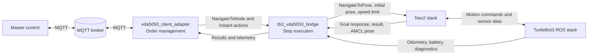
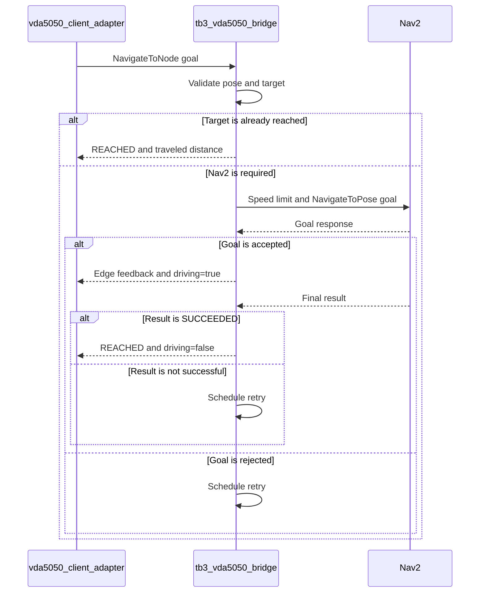

# TB3 VDA5050 Bridge — Architecture

`tb3_vda5050_bridge` is the robot-side ROS 2 bridge between `vda5050_client_adapter` and the TurtleBot3 Nav2 stack. It executes one VDA5050 route step at a time and publishes robot feedback to the client adapter. Order management remains in `vda5050_client_adapter`.

This document summarizes the system boundary, navigation flow, recovery behavior, and supported actions.

## System architecture

The client adapter receives VDA5050 orders over MQTT and sends individual navigation steps to the bridge. The bridge converts each step into a Nav2 goal and returns its result with robot telemetry.

```mermaid
flowchart LR
    MC["Master control"]
    Broker[("MQTT broker")]
    Adapter["vda5050_client_adapter<br/>Order management"]
    Bridge["tb3_vda5050_bridge<br/>Step execution"]
    Nav2["Nav2 stack"]
    Robot["TurtleBot3 ROS stack"]

    MC <-->|MQTT| Broker
    Broker <-->|MQTT| Adapter
    Adapter -->|NavigateToNode and instant actions| Bridge
    Bridge -->|Results and telemetry| Adapter
    Bridge -->|NavigateToPose, initial pose, speed limit| Nav2
    Nav2 -->|Goal response, result, AMCL pose| Bridge
    Robot -->|Odometry, battery, diagnostics| Bridge
    Nav2 <-->|Motion commands and sensor data| Robot
```

## Key flows

The bridge processes one active navigation step and reports each state change to the client adapter.

### Navigation step

A navigation step contains one target node and its incoming edge. The bridge validates the robot pose, completes an already reached target directly, or sends a `NavigateToPose` goal to Nav2.

```mermaid
sequenceDiagram
    participant Adapter as vda5050_client_adapter
    participant Bridge as tb3_vda5050_bridge
    participant Nav2

    Adapter->>Bridge: NavigateToNode goal
    Bridge->>Bridge: Validate pose and target
    alt Target is already reached
        Bridge-->>Adapter: REACHED and traveled distance
    else Nav2 is required
        Bridge->>Nav2: Speed limit and NavigateToPose goal
        Nav2-->>Bridge: Goal response
        alt Goal is accepted
            Bridge-->>Adapter: Edge feedback and driving=true
            Nav2-->>Bridge: Final result
            alt Result is SUCCEEDED
                Bridge-->>Adapter: REACHED and driving=false
            else Result is not successful
                Bridge->>Bridge: Schedule retry
            end
        else Goal is rejected
            Bridge->>Bridge: Schedule retry
        end
    end
```

| Step outcome | ROS action state | Condition |
|---|---|---|
| `REACHED` | `SUCCEEDED` | Nav2 reaches the target, the robot already satisfies the node tolerance, or a node without a position is accepted from a valid pose. |
| `FAILED` | `ABORTED` | The pose remains invalid, or Nav2 remains unavailable or unsuccessful until `nav2_dispatch_timeout_sec` expires. |
| `DROPPED` | `ABORTED` | A local `cancel:*` command drops the step, or `initPosition` invalidates the pose used to plan it. |
| `PREEMPTED` | `ABORTED` | A newer navigation step replaces the active step. |
| `CANCELED` | `CANCELED` | The client adapter cancels the active step. The bridge cancels the Nav2 goal first. |

Only one step is active at a time. A step token invalidates late Nav2 callbacks from an older goal.

**Direct completion.** The bridge returns `REACHED` without Nav2 when the robot already satisfies the node tolerance. A node without a position is also completed when the robot pose is valid.

**Retry behavior.** An unavailable server, rejected goal, or unsuccessful result starts retries at intervals of `nav2_retry_period_sec`. The retry ends when the node is reached or the dispatch timeout expires. The timeout pauses while the robot is in `MANUAL` mode.

**Distance tracking.** `OdomDistanceTracker` accumulates the traveled path from `odom_topic`. A `REACHED` result includes the distance since the previous node and then resets the accumulator.

### Driver status and restart recovery

The bridge publishes `driver_status` with a random session ID and the current driving state. A new process creates a new session ID, which allows the client adapter to resend an interrupted step.

The topic uses transient-local durability and manual liveliness. The bridge republishes the status every third of `driver_status_lease_sec`. A stopped process or blocked executor causes the lease to expire and allows the client adapter to report a driver connection error.

### Instant actions

The bridge supports the instant actions listed in `supported_action_types`.

**Re-localization.** `initPosition` publishes a new AMCL pose. The action returns `FAILED` while navigation is active with a valid pose. Otherwise, the active step is dropped before the new pose is published.

**Charging.** Charging actions use either the simulated charger or the charging state reported by the battery.

| Condition | Behavior |
|---|---|
| `startCharging` while a step is active | The action returns `FAILED`. |
| `simulate_charging: true` | `startCharging` enables the simulated charger, and `stopCharging` disables it. Both actions return `FINISHED`. |
| `simulate_charging: false` | `startCharging` returns `FINISHED` only when the battery reports `CHARGING`. `stopCharging` returns `FINISHED` without changing the hardware state. |
| A new navigation step | The simulated charger is disabled before navigation starts. |

The published charging state is true when the battery reports `CHARGING` or the simulated charger is enabled. A simulated-state change republishes the latest valid battery state.

### Manual override

The bridge reads `twist_mux` diagnostics to identify the active velocity source. An unmasked source other than `navigation_velocity_source` changes `operating_mode` to `MANUAL`. Otherwise, the mode is `AUTOMATIC`. The bridge publishes the mode only when it changes.

## Interfaces

ROS interfaces and configuration values are maintained in the README as a single reference.

- [ROS topics and actions](../README.md#ros-interface)
- [Configuration parameters](../README.md#configuration)
- [NavigateToNode action definition](../../vda5050_msgs/action/NavigateToNode.action)
