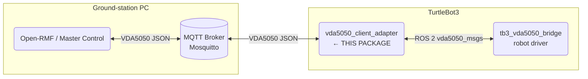
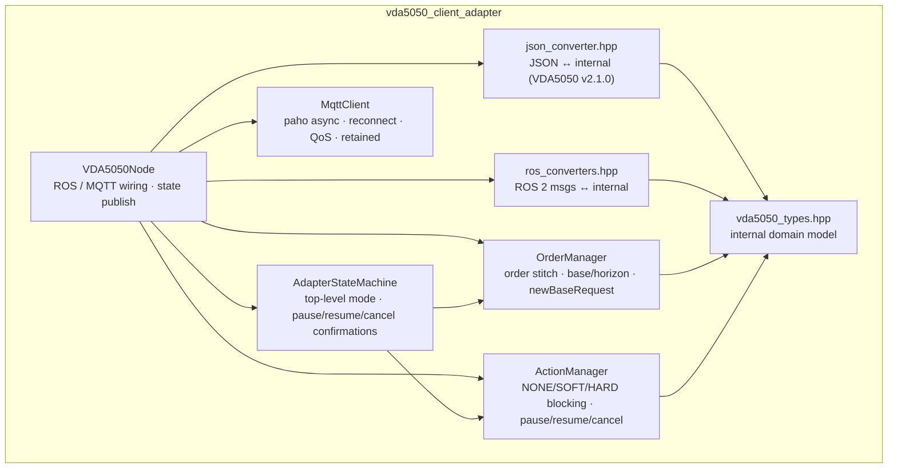
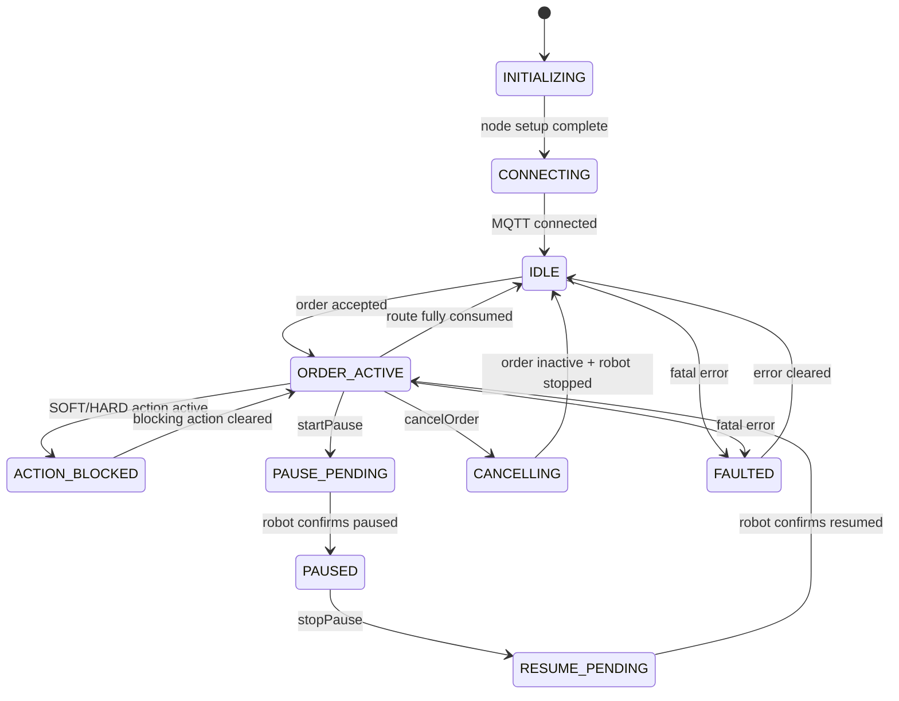

# vda5050_client_adapter

ROS 2 adapter node that connects a VDA5050 master control (or Open-RMF fleet adapter) to the robot driver stack. Receives `order` and `instantActions` over MQTT, exposes them as ROS 2 topics, and publishes robot `state`, `visualization`, `connection`, and `factsheet` back to MQTT.

## Overview

The adapter sits between the MQTT world (VDA5050 JSON) and the ROS 2 world (`vda5050_msgs` topics). It implements all six VDA5050 v2.1.0 topics, a full order stitch/update protocol, NONE/SOFT/HARD action blocking semantics, and built-in instant actions (startPause, stopPause, cancelOrder, stateRequest). The robot driver only needs to handle ROS 2 topics — all VDA5050 protocol complexity is contained here.

## System Context



## Architecture



### State machine



## Package Structure

| File | Role |
|---|---|
| `src/vda5050_node.cpp` | Main ROS node: owns publishers/subscribers, wires MQTT callbacks to logic managers, publishes all outbound VDA5050 messages |
| `src/adapter_state_machine.cpp` | Top-level adapter mode, connectivity state, control-action confirmation, fault handling |
| `src/order_manager.cpp` | VDA5050 order stitch validation, base/horizon tracking, `newBaseRequest` trigger |
| `src/action_manager.cpp` | Per-action lifecycle with NONE/SOFT/HARD blocking semantics |
| `src/mqtt_client.cpp` | Paho MQTT C++ async client with reconnect and QoS support |
| `include/.../vda5050_types.hpp` | Internal domain model — no external dependencies |
| `include/.../json_converter.hpp` | JSON ↔ internal model (VDA5050 v2.1.0 schema compliant) |
| `include/.../ros_converters.hpp` | ROS 2 messages ↔ internal model (bidirectional) |
| `config/vda5050_params.yaml` | MQTT broker, VDA5050 identity, topic prefix, timing |
| `docker/` · `docker-compose.yml` | Build environment and compose stack for the robot side |

## Data Flow

**Downlink (Master Control → Robot)**

```
MQTT .../order → VDA5050Node → OrderManager (stitch validate)
  → AdapterStateMachine → ~/order (ROS 2) → robot driver
```

**Uplink (Robot → Master Control)**

```
~/agv_position · ~/battery_state · ~/driving · ~/node_reached · …
  → VDA5050Node → state assembly → MQTT .../state · .../visualization
```

## ROS Interface

> Topic prefix is parameterized by `adapter_ns` (default: `/vda5050_client_adapter`).

### Subscribed

| Topic | Type | Purpose |
|---|---|---|
| `${odom_topic}` | `nav_msgs/Odometry` | Robot position and velocity |
| `${battery_topic}` | `sensor_msgs/BatteryState` | Battery charge |
| `${adapter_ns}/agv_position` | `vda5050_msgs/AgvPosition` | Position from bridge |
| `${adapter_ns}/driving` | `std_msgs/Bool` | Motion state |
| `${adapter_ns}/paused` | `std_msgs/Bool` | Pause state |
| `${adapter_ns}/node_reached` | `vda5050_msgs/NodeState` | Traversal feedback |
| `${adapter_ns}/edge_entered` | `vda5050_msgs/EdgeState` | Edge feedback |
| `${adapter_ns}/edge_completed` | `vda5050_msgs/EdgeState` | Edge feedback |
| `${adapter_ns}/action_state_feedback` | `vda5050_msgs/ActionState` | Action progress |

### Published

| Topic | Type | Purpose |
|---|---|---|
| `${adapter_ns}/order` | `vda5050_msgs/Order` | Validated order to robot driver |
| `${adapter_ns}/action_execute` | `vda5050_msgs/Action` | External action request |
| `${adapter_ns}/action_cancel` | `std_msgs/String` | pause / resume / cancel signal |

## Configuration

Config file: [`config/vda5050_params.yaml`](config/vda5050_params.yaml)

| Parameter | Default | Description |
|---|---|---|
| `mqtt.broker_url` | `tcp://localhost:1883` | MQTT broker address |
| `vda5050.interface_name` | `TB3` | Must match fleet adapter |
| `vda5050.manufacturer` | `ROBOTIS` | Must match fleet adapter |
| `vda5050.serial_number` | `0001` | Must match fleet adapter |

## Build & Run

```bash
# Using Docker Compose (recommended on TurtleBot3)
cd src/vda5050_client_adapter
docker compose up -d --build

# Or build from source (Humble)
colcon build --packages-select vda5050_msgs vda5050_client_adapter
source install/setup.bash
ros2 launch vda5050_client_adapter vda5050_client_adapter.launch.py
```

## Testing

```bash
# 103 unit tests (all pass)
colcon test --packages-select vda5050_client_adapter
colcon test-result --verbose
```

| Suite | Tests | Coverage |
|---|---|---|
| `test_adapter_state_machine` | 3 | Mode transitions, confirmations, fault/shutdown |
| `test_order_manager` | 29 | Accept, stitch, newBaseRequest, cancel, reject |
| `test_action_manager` | 25 | NONE/SOFT/HARD blocking, pause/resume/cancel |
| `test_converters` | 46 | JSON round-trips, schema compliance, ROS↔internal |

## Related

- [Root README — system overview](../README.md)
- [Detailed Architecture](docs/architecture.md)
- [MQTT Test Guide](docs/mqtt_test_guide.md)
- [Docker Guide](docs/docker_guide.md)
- [TB3 VDA5050 Bridge](../tb3_vda5050_bridge/README.md)
