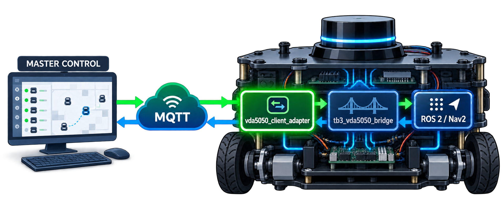

# vda5050_client_adapter

`vda5050_client_adapter` is a ROS 2 node that connects a VDA5050 master control, such as Open-RMF's fleet adapter, to the robot's driver stack.
It receives orders and instant actions over MQTT, drives the robot one node at a time through the `NavigateToNode` action, and publishes the robot's state, visualization, connection and factsheet back to MQTT.

<p align="center">
  
</p>
<p align="center"><em>The adapter runs on the robot. It turns MQTT orders from the master control into ROS 2 commands for Nav2, and reports the robot's state back over MQTT.</em></p>

> See [docs/architecture.md](docs/architecture.md) for module design, the state machine, and sequence diagrams.

## Key features

| Feature | What it does |
|:---:|---|
| VDA5050 topics | Implements all six VDA5050 2.1 MQTT topics: `order`, `instantActions`, `state`, `visualization`, `connection`, `factsheet` |
| Order stitching | Tracks the base and horizon of an order, raises `newBaseRequest`, and applies order updates and replacements |
| Single order owner | Drives the order one released node at a time through `NavigateToNode`, and resends the goal if the driver restarts |
| Action blocking | Runs NONE, SOFT and HARD blocking actions; `startPause`, `stopPause`, `cancelOrder` and `stateRequest` are handled by the adapter itself |
| Charging | `startCharging` and `stopCharging` are declared in the factsheet and run by the driver; `batteryState.charging` comes from `~/battery_state` |
| State publishing | Publishes `state` on a timer and on every change, coalescing changes within one executor tick |
| Strict mode | `vda5050.strict_mode` follows VDA5050 2.1 order and action handling; turning it off keeps the legacy behavior (see [Strict mode](#strict-mode)) |
| Thin driver interface | MQTT callbacks only queue work for the ROS executor thread; the robot driver only executes single-node steps and reports telemetry |

## Package layout

```
src/, include/   C++ node: ROS/MQTT wiring, the order and action managers, the MQTT client, and JSON/ROS conversion
config/          vda5050_params.yaml
launch/          vda5050_adapter.launch.py
docker/          Dockerfile, docker-compose.yml, entrypoint and Mosquitto config for the robot side
test/            gtest suites, including wire-compatibility with vda5050_fleet_adapter_full_control
docs/            architecture.md, MQTT and Docker guides, the VDA5050 2.1 spec
```

## Prerequisites

| Dependency | Version | Notes |
|:---:|:---:|---|
| ROS 2 | Humble or Jazzy | `colcon build` |
| Paho MQTT C++ | any | `apt install libpaho-mqttpp-dev libpaho-mqtt-dev` |
| nlohmann-json3 | any | Optional, but recommended (see note below); `apt install nlohmann-json3-dev` |

Installing `nlohmann-json3-dev` is recommended, though not required. Without it, CMake downloads `nlohmann/json` from GitHub while configuring the build, which needs network access and fails on an offline or air-gapped machine.

## Build & Run

```bash
# Using Docker Compose (recommended on TurtleBot3, optional; see docs/docker_guide.md)
cd src/vda5050_client_adapter
docker compose up -d --build

# Or build from source (Humble/Jazzy)
colcon build --packages-select vda5050_msgs vda5050_client_adapter
source install/setup.bash
ros2 launch vda5050_client_adapter vda5050_adapter.launch.py
# Non-empty arguments override the params file: broker_url, client_id, manufacturer, serial_number
ros2 launch vda5050_client_adapter vda5050_adapter.launch.py broker_url:=tcp://192.168.1.10:1883 serial_number:=0002
```

## ROS Interface

The adapter has a separate ROS 2 interface to the robot driver, in addition to its MQTT interface to the master control. All topics and the action are relative to the node's own name (`~/...`), and match the `adapter_ns`-prefixed names that `tb3_vda5050_bridge` uses on the driver side. The client and the bridge must be built from the same `vda5050_msgs` version. Orders reach the robot only through MQTT: this ROS interface never carries an order directly to the driver.

### Subscribed (robot driver → adapter)

These topics carry the robot driver's own telemetry into the adapter, which folds them into the VDA5050 `state` and `error` messages sent to the master control.

| Topic | Type | Purpose |
|:---:|:---:|---|
| `~/agv_position` | `vda5050_msgs/AgvPosition` | The robot's current position, published in `state.agvPosition` |
| `~/velocity` | `vda5050_msgs/Velocity` | The robot's current velocity, published in `state.velocity` |
| `~/battery_state` | `vda5050_msgs/BatteryState` | Battery charge, published in `state.batteryState` |
| `~/safety_state` | `vda5050_msgs/SafetyState` | eStop and protective field state, published in `state.safetyState` |
| `~/driver_status` | `vda5050_msgs/DriverStatus` | `session_id` and `driving`, `transient_local` with depth 1. A new `session_id` means the driver restarted, so the adapter resends the step goal in flight. If the driver's liveliness lease expires, the adapter drops the step and raises `driverConnectionError` (FATAL) until the driver is back |
| `~/operating_mode` | `std_msgs/String` | `AUTOMATIC` or `MANUAL`, from the bridge's manual-override detection. `transient_local` with depth 1; an unknown value keeps the current mode |
| `~/load` | `vda5050_msgs/Load` | The load currently carried, published in `state.loads` |
| `~/action_state_feedback` | `vda5050_msgs/ActionState` | Progress of an action the driver is executing |
| `~/error` | `vda5050_msgs/Error` | Errors reported by the driver |
| `~/distance_since_last_node` | `std_msgs/Float64` | Distance driven since the last node, streamed live and published in `state.distanceSinceLastNode` |

### Published / action client (adapter → robot driver)

These interfaces send the adapter's parsed order and instant actions down to the robot driver, one route step and one action at a time.

| Name | Type | Purpose |
|:---:|:---:|---|
| `~/navigate_to_node` | `vda5050_msgs/action/NavigateToNode` (client) | Sends one goal per route node: `order_id`, `order_update_id`, `node` and `incoming_edge`. Reports `edge_entered` as feedback and `REACHED` (with `distance_driven`), `FAILED`, `DROPPED`, `CANCELED` or `PREEMPTED` as the result |
| `~/action_execute` | `vda5050_msgs/Action` | An action for the driver to execute; the adapter does not handle it itself |
| `~/action_command` | `vda5050_msgs/ActionCommand` | `PAUSE`, `RESUME` or `CANCEL` of one running action |

### Published (local status)

These topics report the same status that MQTT carries to the master control, for any local tool on the robot that reads ROS 2 directly instead of MQTT.

| Topic | Type | Purpose |
|:---:|:---:|---|
| `~/driving` / `~/paused` | `std_msgs/Bool` | The driver's driving flag and the adapter's paused flag. `transient_local` with depth 1 |
| `~/node_reached` | `vda5050_msgs/NodeState` | Each node the robot reaches, with `distance_driven` |
| `~/error` | `vda5050_msgs/Error` | A `navigationError` (FATAL) for a failed step, with `orderId` and `nodeId`. The adapter also subscribes to this same topic for driver errors, and ignores a `navigationError` that names an order no longer active, so it does not read back its own message |

The table below shows how the adapter reacts to each event during a route step.

| Event | Adapter |
|---|---|
| Released node not yet reached, driving allowed | Sends its goal; a newer order's step preempts the goal in flight |
| Feedback `edge_entered` | Incoming edge entered, its actions start |
| `REACHED` (result code `SUCCEEDED`) | Edge completed, node reached with `distance_driven`, node actions start, next step |
| `FAILED` | `navigationError` (FATAL, `orderId` + `nodeId`) published once, then the order is dropped and the error cleared |
| `DROPPED` (local cancel on the robot, `initPosition`) | Order dropped, no error |
| `startPause` / `cancelOrder` / strict mode HARD or SOFT action running | Goal cancelled; `paused` / cancel completion wait for its result |
| Goal ended without `SUCCEEDED`/`ABORTED` (driver shut down) | No progress; the step is sent again |
| `~/driver_status` liveliness lost | Step dropped, `driving` false, `driverConnectionError` (FATAL); pause / cancel complete; no new step until the driver is back, then the error is cleared and the step sent again |
| Adapter start | Every goal left on the driver by a previous adapter process is cancelled before the first step |

## Configuration

The node reads its settings from one file, [`config/vda5050_params.yaml`](config/vda5050_params.yaml). The file has three sections: `mqtt` for the broker connection, `vda5050` for the AGV's identity and timing, and `factsheet` for the AGV's declared capabilities. At startup, the node checks every timing and limit parameter; an out-of-range value stops the node, and the error names the offending key.

**MQTT connection** (`mqtt`)

| Parameter | Default | Description |
|:---:|:---:|---|
| `broker_url` | `tcp://localhost:1883` | Address of the MQTT broker |
| `client_id` | `""` | Must be unique among the AGVs connected to the broker; a duplicate disconnects the other one. When empty, the node derives it from the AGV identity: `vda5050_<interface_name>_<manufacturer>_<serial_number>` |
| `username`, `password` | `""` | Broker credentials, if the broker requires them. `${VAR}` reads the value from the environment variable `VAR`. A password sent without TLS is logged as a warning |
| `tls.enabled` | `false` | Connects over TLS. Needs an `ssl://` or `mqtts://` `broker_url`; a plain `tcp://` broker_url is required when TLS is off |
| `tls.ca_file` | `""` | PEM file with the broker's CA certificates. When empty, the node uses the system's certificate store |
| `tls.client_cert`, `tls.client_key` | `""` | PEM client certificate and key, set together, for a broker that requires one |
| `tls.verify_hostname` | `true` | Requires the broker's certificate to name the host in `broker_url` |

**AGV identity and timing** (`vda5050`)

| Parameter | Default | Description |
|:---:|:---:|---|
| `interface_name`, `manufacturer`, `serial_number` | `TB3`, `ROBOTIS`, `0001` | The AGV's identity. These must match the fleet adapter's configuration for this robot |
| `state_publish_interval` | `30.0` s | How often the node publishes `state` on its own, besides publishing it on every change |
| `visualization_interval` | `1.0` s | How often the node publishes `visualization` |
| `position_publish_min_interval` | `1.0` s | Minimum time between the extra `state` publishes that a new position triggers |
| `hard_action_pause_timeout` | `30.0` s | In default mode, how long a HARD-blocking action waits for another action to confirm it paused, before the node fails it |
| `event_loop_period` | `0.01` s | How often the executor tick runs queued MQTT work and publishes a changed `state`, at most once per tick. Must be in `(0, 1]` |
| `new_base_request_min_base_nodes` | `2` | The node raises `newBaseRequest` once fewer released nodes than this remain and a horizon exists |
| `max_finished_instant_actions` | `50` | Finished or failed instant actions kept in `actionStates`, oldest dropped first. `0` keeps all of them until the next order |
| `strict_mode` | `true` | Follows VDA5050 2.1 order and action handling. Setting it to `false` keeps the legacy behavior; see [Strict mode](#strict-mode) |
| `driver_status_max_lease` | `10.0` s | Liveliness lease the node requests on `~/driver_status`. The driver's offered lease must not exceed it, or the node logs a mismatch and does not track it. `0` turns off driver-lost detection. A finite value is required for Fast DDS to report liveliness |

**Factsheet** (`factsheet`)

| Parameter | Default | Description |
|:---:|:---:|---|
| `type_specification.*`, `physical_parameters.*`, `supported_action_types` | — | The AGV's type, kinematics, load capacity, speed, acceleration, dimensions and supported VDA5050 actions. The node publishes them once, retained, as the `factsheet` message. `physical_parameters.height_max` must be greater than 0, as the schema requires. See the yaml file for the full list of fields |

## Strict mode

The `vda5050.strict_mode` parameter chooses how strictly the node follows the VDA5050 2.1 order and action rules (§6.6, §6.12). The default, `true`, follows them; setting it to `false` keeps the adapter's legacy, more permissive handling.

| | Legacy (`false`) | Strict (`true`, default) |
|---|---|---|
| New `orderId` while an order is active | Replaces it (first node must be the last traversed node) | `orderError`, order kept |
| Lower `orderUpdateId` | `orderError` | `orderUpdateError` |
| Node/edge structure (sequence ids, edge endpoints, base/horizon split, unique `actionId`) | Not checked | `validationError` |
| Update stitched at the horizon end | Accepted | `orderUpdateError` |
| `orderId`/`orderUpdateId` after `cancelOrder` | Cleared | Kept |
| HARD action | Pauses running actions, then runs | Waits for running actions to end; later actions wait for it |
| `state.driving` | Masked while paused, action-blocked or faulted | Driver value |
| Running HARD/SOFT action | Route keeps going | Route waits (step goal cancelled) until it ends |

Both modes share this behavior:
- An order or instantActions message that fails to parse, for example bad JSON or an unknown enum, is rejected with `validationError` and not executed.
- An order that repeats the current `orderId` and `orderUpdateId` is ignored, per VDA5050 6.6.4.3.
- A `factsheetRequest` republishes the factsheet.

## Testing

Run the unit test suites with colcon, then the live wire-compatibility suite against a private broker.

```bash
colcon test --packages-select vda5050_client_adapter
colcon test-result --verbose

# Live wire-compatibility cases need a private broker
mosquitto -p 18830 &
VDA5050_TEST_BROKER=tcp://127.0.0.1:18830 ROS_DOMAIN_ID=77 ROS_AUTOMATIC_DISCOVERY_RANGE=LOCALHOST \
  build/vda5050_client_adapter/test_full_control_compat
```

| Suite | Coverage |
|:---:|---|
| `test_adapter_state_machine` | Mode transitions, confirmations, fault and shutdown handling, pending-action supersede, driving flag |
| `test_order_manager` | Accept, stitch, `newBaseRequest`, cancel, reject, order replacement, next step and progress, strict mode |
| `test_action_manager` | NONE/SOFT/HARD blocking, control actions, sequential HARD, pause/resume/cancel, HARD-wait timeout, instant action cap |
| `test_converters` | JSON round-trips, schema compliance, strict enums, ROS 2 to internal conversion |
| `test_full_control_compat` | The client against `full_control`'s own builders and parsers: a live node with a fake `NavigateToNode` server and MQTT, in both modes. Some cases need `VDA5050_TEST_BROKER`; `TlsCompat` needs a TLS broker from `fleet_bringup/broker`. Also checks TLS and credential parameters, and a node destroyed during its first connect |
| `test_schema_samples` + `test_vda5050_schemas` | `state`, `connection`, `visualization` and the factsheet built from `config/vda5050_params.yaml`, validated against the official VDA5050 2.1 JSON schemas (`../vda5050_fleet_adapter_full_control/test/schemas`). Skipped without `python3-jsonschema` |

`test_full_control_compat` compiles sources from `../vda5050_fleet_adapter_full_control`, found through the CMake cache variable `VDA5050_FULL_CONTROL_SOURCE_DIR`. The test is skipped when that source is not available.

## Related

- [Root README — system overview](../README.md)
- [Detailed Architecture](docs/architecture.md)
- [MQTT Test Guide](docs/mqtt_test_guide.md)
- [Docker Guide](docs/docker_guide.md)
- [TB3 VDA5050 Bridge](../tb3_vda5050_bridge/README.md)
