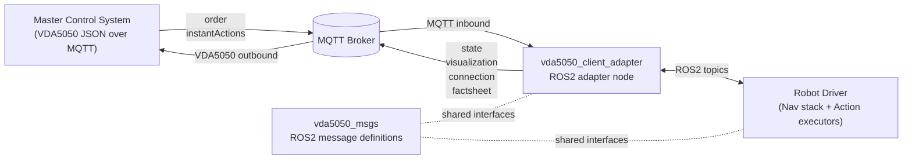
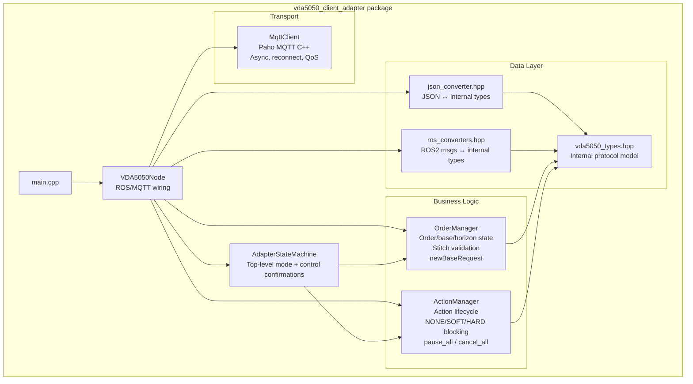
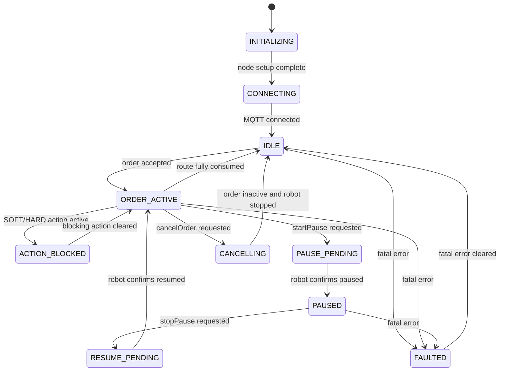
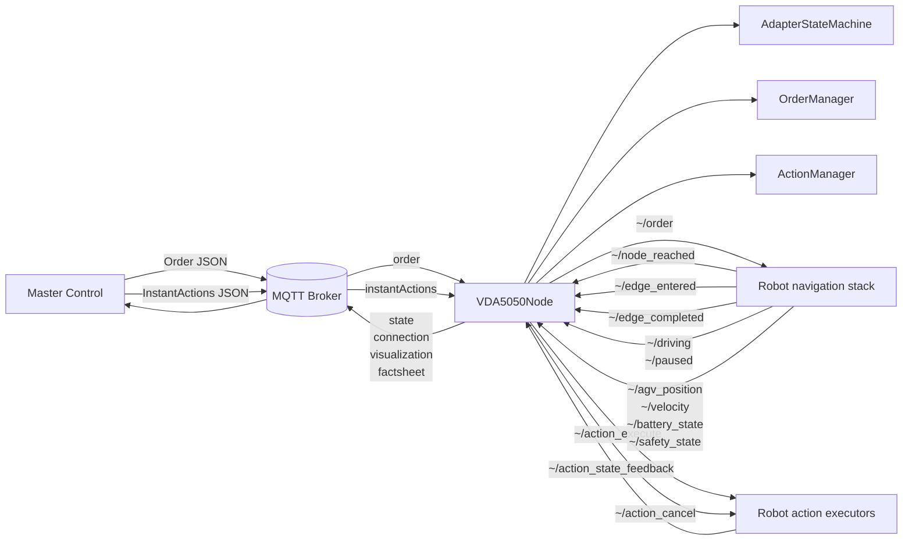
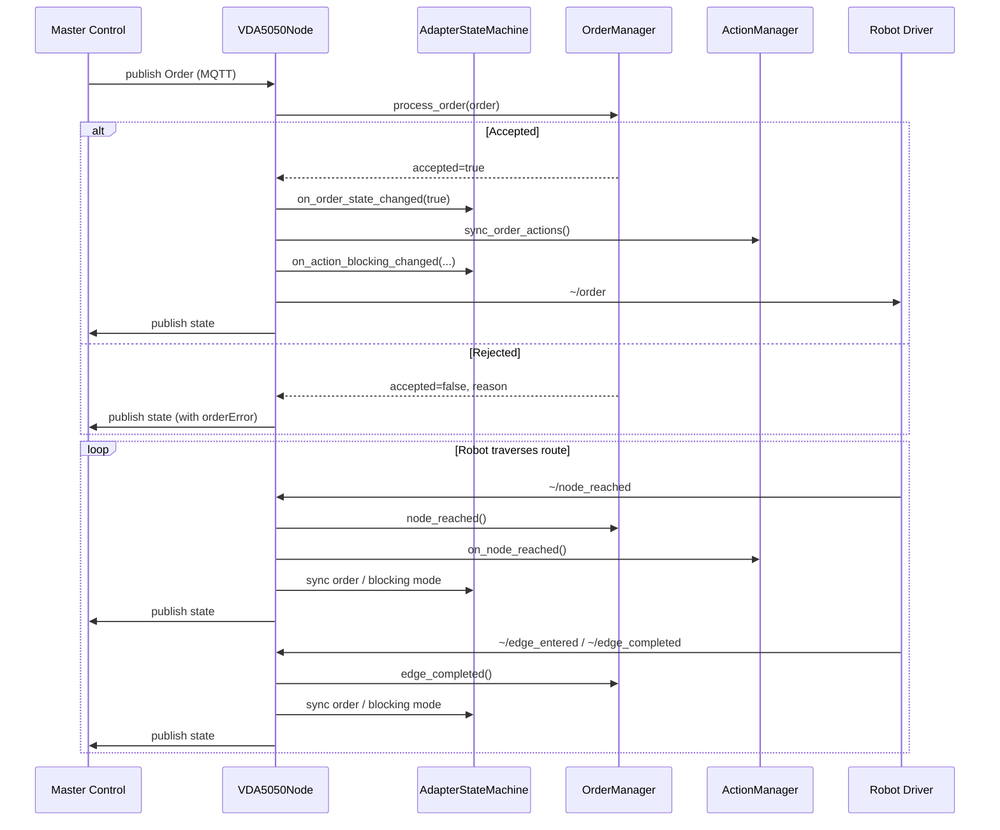
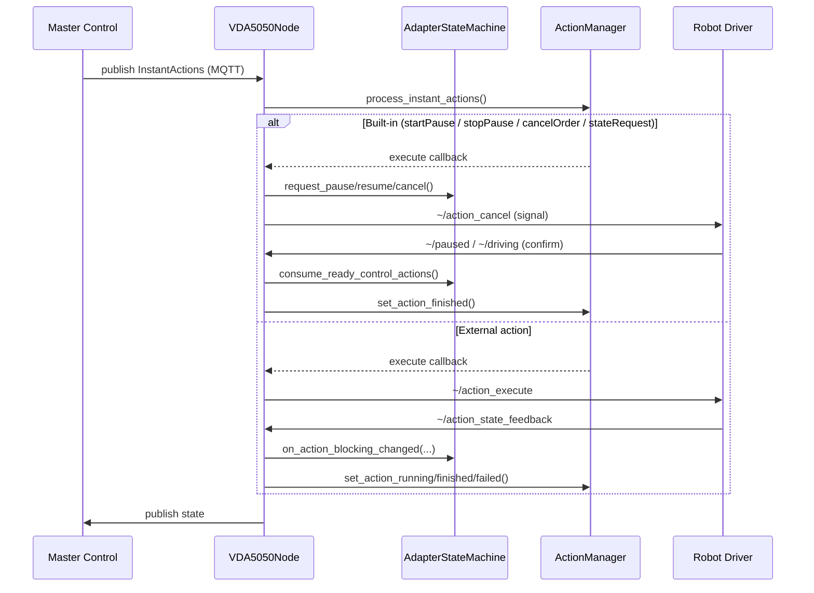
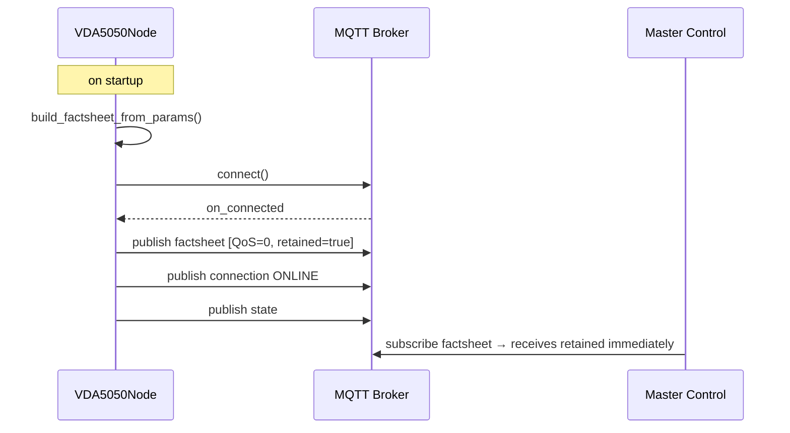

# VDA5050 Client Adapter — Architecture

Architecture documentation for the `vda5050_client_adapter` package.

---

## 1. Package-Level View

---

## 2. MQTT Topics (VDA5050 §9) — 6/6 Implemented

| Topic | Direction | QoS | Retained |
|---|---|---|---|
| `.../order` | MC → AGV | 0 | No |
| `.../instantActions` | MC → AGV | 0 | No |
| `.../state` | AGV → MC | 0 | No |
| `.../visualization` | AGV → MC | 0 | No |
| `.../connection` | AGV → MC | 1 | Yes |
| `.../factsheet` | AGV → MC | 0 | Yes |

Topic pattern: `{interface_name}/v2/{manufacturer}/{serial_number}/{topic}`

---

## 3. Internal Module Structure

---

## 4. State Machine

`AdapterStateMachine` is intentionally narrow:
- It owns top-level adapter mode, MQTT connectivity, effective driving suppression, fatal-error mode, and built-in pause/resume/cancel confirmations.
- `OrderManager` still owns route semantics and base/horizon progression.
- `ActionManager` still owns per-action lifecycle and blocking semantics.
- `VDA5050Node` translates ROS/MQTT callbacks into state-machine events and publish side effects.

---

## 5. Runtime Integration View

---

## 6. Order Flow

---

## 7. Instant Action Flow

---

## 8. Factsheet Flow (VDA5050 §9.4)

---

## 9. Data Model (vda5050_types.hpp)

| Struct | Description |
|---|---|
| `Header` | headerId, timestamp, version, manufacturer, serialNumber |
| `Order` | Navigation order: nodes, edges, actions |
| `InstantActions` | Set of immediately executed actions |
| `State` | Full robot state published to MC |
| `Visualization` | Real-time telemetry (position + velocity) |
| `Connection` | MQTT connection state |
| `Factsheet` | AGV technical specification |
| `Node` / `Edge` | Route graph elements with positions and actions |
| `Action` / `ActionState` | Action with NONE/SOFT/HARD blocking, lifecycle status |
| `TypeSpecification` | AGV kinematic, class, load capacity, navigation types |
| `PhysicalParameters` | Speed, acceleration, dimensions |
| `ProtocolFeatures` | Supported actions with scopes and blocking types |

---

## 10. JSON Schema Compliance (VDA5050 v2.1.0)

| Schema | Status |
|---|---|
| `order.schema.json` | ✅ Compliant |
| `instantActions.schema.json` | ✅ Compliant |
| `state.schema.json` | ✅ Compliant |
| `visualization.schema.json` | ✅ Compliant |
| `connection.schema.json` | ✅ Compliant |
| `factsheet.schema.json` | ✅ Compliant |

Key implementation notes:
- `maxArrayLens` uses dot-notation keys per §9.4: `"order.nodes"`, `"state.errors"`
- `std::optional<T>` custom serializer — absent fields are omitted from JSON output
- `agvActions` includes required `resultDescription` and `blockingTypes` array fields

---

## 11. OrderManager — Stitch Validation

When an order update is received, the stitch node is validated in priority order:

1. Must match the **last horizon node** (if horizon exists)
2. Must match the **last remaining base node** (if no horizon)
3. Must match the **last traversed node** (when both base and horizon are empty)

`newBaseRequest` is fired when remaining base nodes ≤ 1 AND horizon is not empty.

---

## 12. ActionManager — Blocking Semantics

| Blocking Type | Behavior |
|---|---|
| `NONE` | Runs concurrently with all other actions |
| `SOFT` | Stops driving; NONE actions still run in parallel |
| `HARD` | Pauses all running actions, runs alone; resumes others when finished |

Dispatch rules:
- HARD action running → no new actions dispatched
- `dispatch_paused_` = true → only instant actions dispatched
- Order actions → not dispatched until node/edge trigger is ready

---

## 13. Test Coverage — 103 Tests (all pass)

| Suite | Tests | Coverage |
|---|---|---|
| `test_adapter_state_machine` | 3 | Top-level mode transitions, control confirmations, fault/shutdown |
| `test_order_manager` | 29 | Accept, stitch, newBaseRequest, cancel, reject cases |
| `test_action_manager` | 25 | NONE/SOFT/HARD blocking, pause/resume/cancel, sync |
| `test_converters` | 46 | JSON round-trips, schema compliance, ROS↔internal |

---

## 14. Component Responsibilities

| Component | Responsibility |
|---|---|
| `VDA5050Node` | ROS/MQTT wiring, state publish, side effects |
| `AdapterStateMachine` | Top-level runtime mode, control-action confirmation, fault/connectivity state |
| `MqttClient` | Transport: connect, publish/subscribe, reconnect, QoS, retained |
| `OrderManager` | Protocol state: validate/stitch orders, track base/horizon |
| `ActionManager` | Action lifecycle: NONE/SOFT/HARD blocking, pause/resume/cancel |
| `json_converter.hpp` | JSON ↔ internal model (VDA5050 v2.1.0 compliant) |
| `ros_converters.hpp` | ROS2 msg ↔ internal model (bidirectional) |
| `vda5050_types.hpp` | Internal domain model (no external dependencies) |

---

## 15. Reading Order

1. [config/vda5050_params.yaml](../config/vda5050_params.yaml)
2. [include/vda5050_client_adapter/vda5050_types.hpp](../include/vda5050_client_adapter/vda5050_types.hpp)
3. [include/vda5050_client_adapter/adapter_state_machine.hpp](../include/vda5050_client_adapter/adapter_state_machine.hpp)
4. [src/vda5050_node.cpp](../src/vda5050_node.cpp)
5. [src/order_manager.cpp](../src/order_manager.cpp)
6. [src/action_manager.cpp](../src/action_manager.cpp)
7. [src/mqtt_client.cpp](../src/mqtt_client.cpp)
8. [include/vda5050_client_adapter/json_converter.hpp](../include/vda5050_client_adapter/json_converter.hpp)
9. [include/vda5050_client_adapter/ros_converters.hpp](../include/vda5050_client_adapter/ros_converters.hpp)
