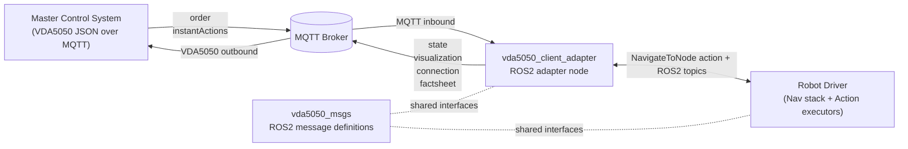
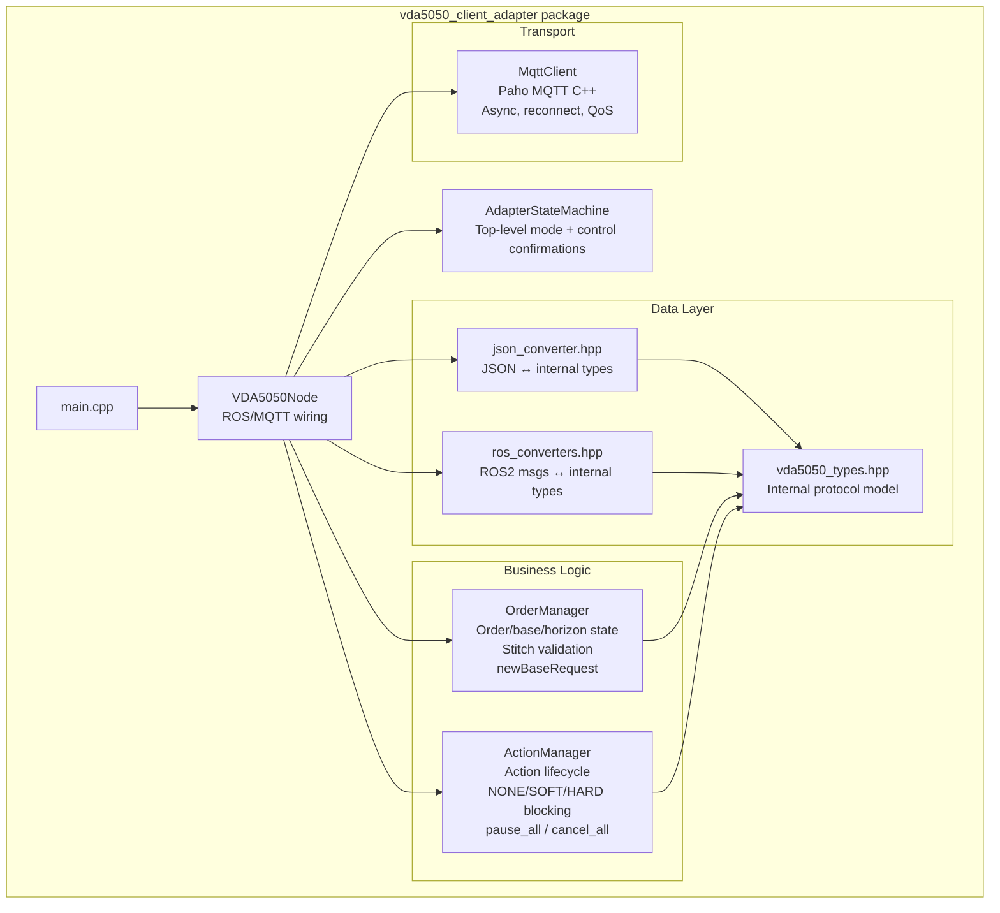
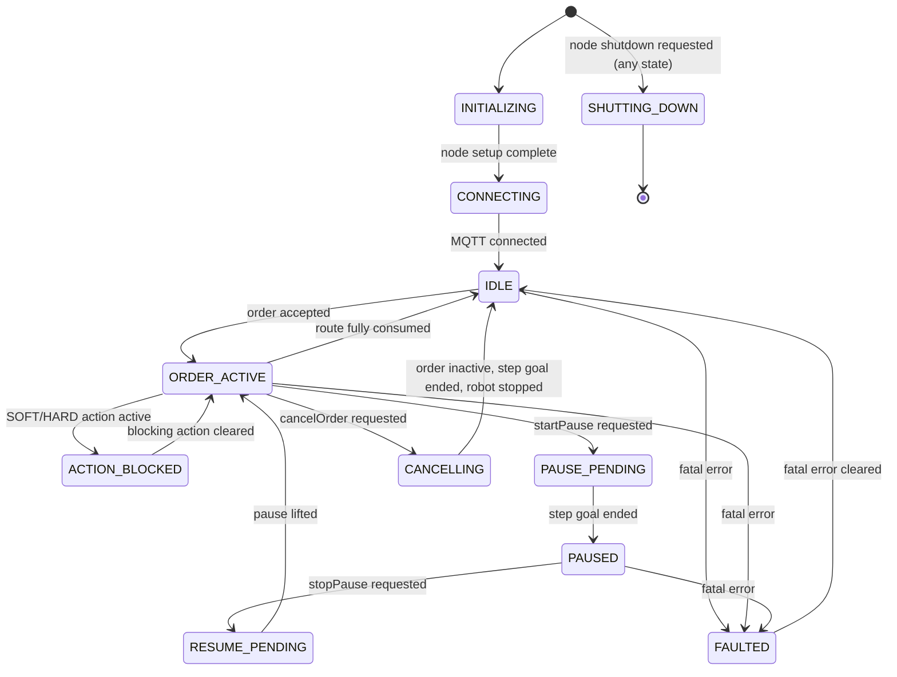
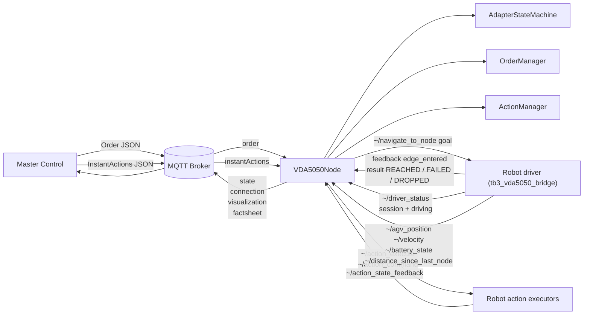
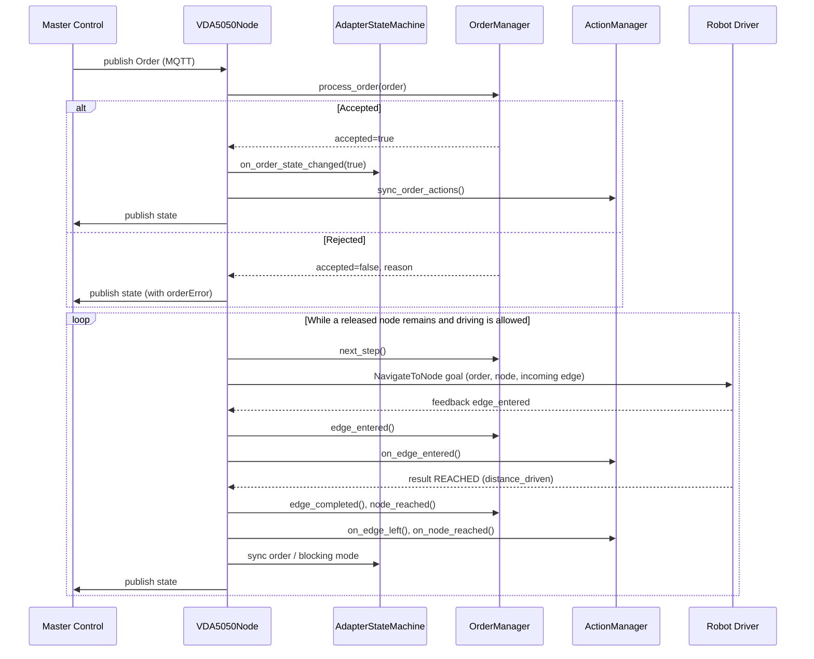
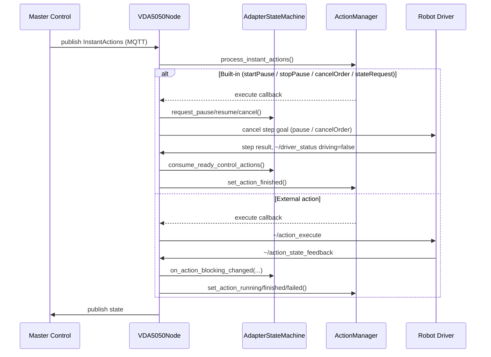
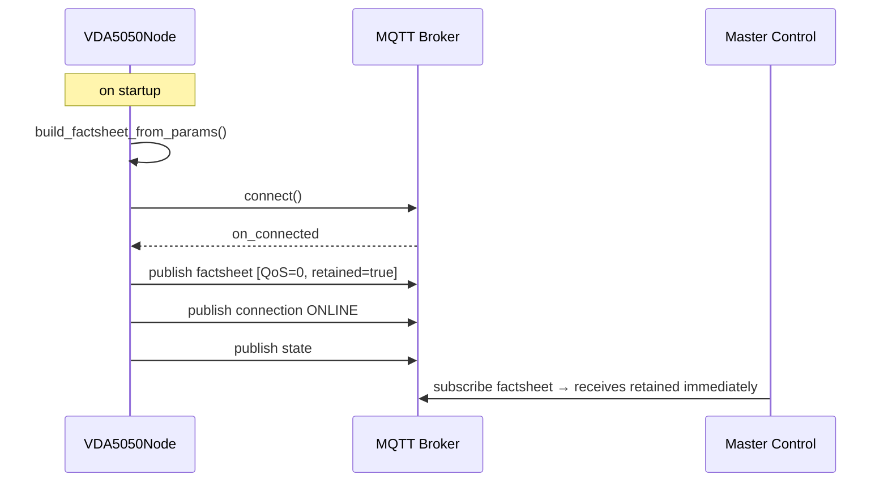

# VDA5050 Client Adapter — Architecture

Architecture documentation for the `vda5050_client_adapter` package.

---

## 1. Package-Level View

```mermaid
flowchart LR
    MC["Master Control System\n(VDA5050 JSON over MQTT)"]
    Broker[("MQTT Broker")]
    Adapter["vda5050_client_adapter\nROS2 adapter node"]
    Msgs["vda5050_msgs\nROS2 message definitions"]
    Robot["Robot Driver\n(Nav stack + Action executors)"]

    MC -->|order\ninstantActions| Broker
    Broker -->|MQTT inbound| Adapter
    Adapter -->|state\nvisualization\nconnection\nfactsheet| Broker
    Broker -->|VDA5050 outbound| MC

    Adapter <-->|NavigateToNode action + ROS2 topics| Robot
    Msgs -.-|shared interfaces| Adapter
    Msgs -.-|shared interfaces| Robot
```

---

## 2. MQTT Topics (VDA5050 §9) — 6/6 Implemented

| Topic | Direction | QoS | Retained |
|:---:|:---:|:---:|:---:|
| `.../order` | MC → AGV | 0 | No |
| `.../instantActions` | MC → AGV | 0 | No |
| `.../state` | AGV → MC | 0 | No |
| `.../visualization` | AGV → MC | 0 | No |
| `.../connection` | AGV → MC | 1 | Yes |
| `.../factsheet` | AGV → MC | 0 | Yes |

Topic pattern: `{interface_name}/v2/{manufacturer}/{serial_number}/{topic}`

`state` is published on a `vda5050.state_publish_interval` timer **and** on
every fresh `~/agv_position` update, throttled to at least
`vda5050.position_publish_min_interval` apart, so Master Control tracks the
position live between timer ticks.

---

## 3. Internal Module Structure

```mermaid
flowchart TB
    subgraph Adapter["vda5050_client_adapter package"]
        Main["main.cpp"]
        Node["VDA5050Node\nROS/MQTT wiring"]
        SM["AdapterStateMachine\nTop-level mode + control confirmations"]

        subgraph Logic["Business Logic"]
            Order["OrderManager\nOrder/base/horizon state\nStitch validation\nnewBaseRequest"]
            Action["ActionManager\nAction lifecycle\nNONE/SOFT/HARD blocking\npause_all / cancel_all"]
        end

        subgraph Data["Data Layer"]
            Types["vda5050_types.hpp\nInternal protocol model"]
            Json["json_converter.hpp\nJSON ↔ internal types"]
            Ros["ros_converters.hpp\nROS2 msgs ↔ internal types"]
        end

        subgraph Transport["Transport"]
            Mqtt["MqttClient\nPaho MQTT C++\nAsync, reconnect, QoS"]
        end

        Main --> Node
        Node --> SM
        Node --> Mqtt
        Node --> Order
        Node --> Action
        Node --> Json
        Node --> Ros
        Json --> Types
        Ros --> Types
        Order --> Types
        Action --> Types
    end
```

`SM`, `Order`, and `Action` are siblings coordinated by `Node` — `AdapterStateMachine`
does not call into `OrderManager`/`ActionManager` itself (no such reference exists in
`adapter_state_machine.cpp`); `VDA5050Node` reads/drives all three independently
(e.g. `take_pending_cancel()` on `SM` when `OrderManager` accepts a new order).

---

## 4. State Machine

```mermaid
stateDiagram-v2
    [*] --> INITIALIZING
    INITIALIZING --> CONNECTING: node setup complete
    CONNECTING --> IDLE: MQTT connected
    IDLE --> ORDER_ACTIVE: order accepted
    ORDER_ACTIVE --> ACTION_BLOCKED: SOFT/HARD action active
    ACTION_BLOCKED --> ORDER_ACTIVE: blocking action cleared
    ORDER_ACTIVE --> PAUSE_PENDING: startPause requested
    PAUSE_PENDING --> PAUSED: step goal ended
    PAUSED --> RESUME_PENDING: stopPause requested
    RESUME_PENDING --> ORDER_ACTIVE: pause lifted
    ORDER_ACTIVE --> CANCELLING: cancelOrder requested
    CANCELLING --> IDLE: order inactive, step goal ended, robot stopped
    ORDER_ACTIVE --> IDLE: route fully consumed
    IDLE --> FAULTED: fatal error
    ORDER_ACTIVE --> FAULTED: fatal error
    PAUSED --> FAULTED: fatal error
    FAULTED --> IDLE: fatal error cleared
    [*] --> SHUTTING_DOWN: node shutdown requested (any state)
    SHUTTING_DOWN --> [*]
```

`recompute_mode_locked()` checks `shutting_down_` first, before every other
flag — so `SHUTTING_DOWN` overrides whatever mode the adapter was in the
moment `start_shutdown()` is called (node destructor), not just a mode
reachable from a specific state.

`AdapterStateMachine` is intentionally narrow:
- It owns top-level adapter mode, MQTT connectivity, effective driving suppression, fatal-error mode, and built-in pause/resume/cancel confirmations.
- `OrderManager` still owns route semantics and base/horizon progression.
- `ActionManager` still owns per-action lifecycle and blocking semantics.
- `VDA5050Node` translates ROS/MQTT callbacks into state-machine events and publish side effects.

**Superseded cancel:** a `cancelOrder` normally completes only once `!driving && !order_active` (order activity includes a step goal still in flight). When `vda5050_fleet_adapter_full_control` supersedes an order still in progress, `follow_new_path()` issues `cancelOrder` and immediately follows it with the replacement order while the robot is still driving (see that package's `robot_command_handle.cpp`), so that condition never holds and the adapter would stay stuck in `CANCELLING`. When a new order is accepted, `take_pending_cancel()` resolves the still-pending cancel (marks the `cancelOrder` action FINISHED, "superseded by new order") and the mode recomputes to `ORDER_ACTIVE`.

---

## 5. Runtime Integration View

```mermaid
flowchart LR
    MC["Master Control"]
    Broker[("MQTT Broker")]
    Node["VDA5050Node"]
    SM["AdapterStateMachine"]
    OM["OrderManager"]
    AM["ActionManager"]
    Nav["Robot driver (tb3_vda5050_bridge)"]
    Act["Robot action executors"]

    MC -->|Order JSON| Broker
    MC -->|InstantActions JSON| Broker
    Broker -->|order| Node
    Broker -->|instantActions| Node

    Node --> SM
    Node --> OM
    Node --> AM

    Node -->|~/navigate_to_node goal| Nav
    Nav -->|feedback edge_entered\nresult REACHED / FAILED / DROPPED| Node
    Node -->|~/action_execute\n~/action_command| Act
    Act -->|~/action_state_feedback| Node

    Nav -->|~/driver_status\nsession + driving| Node
    Nav -->|~/agv_position\n~/velocity\n~/battery_state\n~/distance_since_last_node| Node

    Node -->|state\nconnection\nvisualization\nfactsheet| Broker
    Broker --> MC
```

---

## 5b. Threading and State Publishing

- Paho delivers `order`, `instantActions` and connection events on its own thread. The
  callbacks only queue the work (`VDA5050Node::post`); `event_timer_`
  (`vda5050.event_loop_period`, default 10 ms) runs it on the executor thread.
- Every handler therefore runs on the single executor thread: `OrderManager`,
  `ActionManager`, `AdapterStateMachine` and the robot state are never changed concurrently,
  and a `state` snapshot is always consistent.
- `publish_state()` only marks the state as changed; the event tick publishes it once. A
  `cancelOrder` that touches order, actions and errors produces one `state` message.
- The periodic `state_timer_` and `visualization_timer_` publish directly.
- Shutdown: `connection` `OFFLINE` is published, the MQTT client disconnects and is destroyed
  before any other member, so no Paho callback can reach a destroyed object.

## 5c. Route Execution (`~/navigate_to_node`)

The adapter is the only owner of the order. `drive()` runs after every executor tick and step
result and keeps at most one `NavigateToNode` goal in flight:

| Condition | Action |
|---|---|
| Next released node exists, no pause, (strict) no HARD/SOFT action running | Send its goal unless the goal in flight already targets it; a different node or order preempts |
| No next node, or driving not allowed | Cancel the goal in flight; it stays in flight until its result |

`OrderManager::next_step()` gives the first released node not yet reached with its incoming edge.
Results are matched by a per-goal token; results of preempted goals are ignored.

| Result | Effect |
|---|---|
| Feedback `edge_entered` | `edge_entered()` + edge actions, once per edge |
| `SUCCEEDED` / `REACHED` | Edge entered (if not yet) and completed, `node_reached(distance_driven)`, node actions, next step |
| `ABORTED` / `FAILED` | `navigationError` FATAL (`orderId`, `nodeId`) published at once, then order dropped and error cleared |
| `ABORTED` / `DROPPED` | Order dropped (local cancel on the robot, `initPosition`), no error |
| `ABORTED` / `PREEMPTED`, `CANCELED`, other codes | No progress |

`paused` = pause requested and no goal in flight, so `startPause` finishes once the driver has
stopped. `~/driver_status` is latched; a new `session_id` means the driver restarted and lost
the goal, which is sent again (a goal sent to the new session is kept).

Driver liveness: the driver offers `~/driver_status` with a manual-by-topic liveliness lease and
republishes it every lease / 3. When the liveliness expires (driver gone or its executor stalled)
the goal in flight is dropped, `driving` goes false and `driverConnectionError` (FATAL) is raised;
no step is sent until the liveliness is back, which clears the error. Before the first step the
adapter cancels all goals on the driver (`async_cancel_all_goals`), so a goal of a previous
adapter process does not keep driving the robot.

The subscription requests liveliness `AUTOMATIC` with lease `vda5050.driver_status_max_lease`: Fast DDS
reports liveliness changes only with a finite requested lease, and DDS matching needs the driver's
offered lease to be no longer. Fast DDS does not report the loss of a writer in the same process, so
detection relies on the driver running as its own process (the normal deployment).

Per-action commands (`PAUSE` / `RESUME` / `CANCEL` of one action: HARD dispatch, edge left,
`cancel_all`) go on `~/action_command` (`vda5050_msgs/ActionCommand`).

Local status for on-robot tools (`robot_local_ui`): `~/driving`, `~/paused` (latched `Bool`),
`~/node_reached` (`NodeState`) and the failed step's `navigationError` on `~/error`. A driver
`navigationError` naming an order that is not active is ignored, which also drops the adapter's own copy.

---

## 6. Order Flow

```mermaid
sequenceDiagram
    participant MC as Master Control
    participant Node as VDA5050Node
    participant SM as AdapterStateMachine
    participant OM as OrderManager
    participant AM as ActionManager
    participant Robot as Robot Driver

    MC->>Node: publish Order (MQTT)
    Node->>OM: process_order(order)

    alt Accepted
        OM-->>Node: accepted=true
        Node->>SM: on_order_state_changed(true)
        Node->>AM: sync_order_actions()
        Node->>MC: publish state
    else Rejected
        OM-->>Node: accepted=false, reason
        Node->>MC: publish state (with orderError)
    end

    loop While a released node remains and driving is allowed
        Node->>OM: next_step()
        Node->>Robot: NavigateToNode goal (order, node, incoming edge)
        Robot-->>Node: feedback edge_entered
        Node->>OM: edge_entered()
        Node->>AM: on_edge_entered()
        Robot-->>Node: result REACHED (distance_driven)
        Node->>OM: edge_completed(), node_reached()
        Node->>AM: on_edge_left(), on_node_reached()
        Node->>SM: sync order / blocking mode
        Node->>MC: publish state
    end
```

---

## 7. Instant Action Flow

```mermaid
sequenceDiagram
    participant MC as Master Control
    participant Node as VDA5050Node
    participant SM as AdapterStateMachine
    participant AM as ActionManager
    participant Robot as Robot Driver

    MC->>Node: publish InstantActions (MQTT)
    Node->>AM: process_instant_actions()

    alt Built-in (startPause / stopPause / cancelOrder / stateRequest)
        AM-->>Node: execute callback
        Node->>SM: request_pause/resume/cancel()
        Node->>Robot: cancel step goal (pause / cancelOrder)
        Robot->>Node: step result, ~/driver_status driving=false
        Node->>SM: consume_ready_control_actions()
        Node->>AM: set_action_finished()
    else External action
        AM-->>Node: execute callback
        Node->>Robot: ~/action_execute
        Robot->>Node: ~/action_state_feedback
        Node->>SM: on_action_blocking_changed(...)
        Node->>AM: set_action_running/finished/failed()
    end

    Node->>MC: publish state
```

---

## 8. Factsheet Flow (VDA5050 §9.4)

```mermaid
sequenceDiagram
    participant Node as VDA5050Node
    participant MQTT as MQTT Broker
    participant MC as Master Control

    Note over Node: on startup
    Node->>Node: build_factsheet_from_params()
    Node->>MQTT: connect()
    MQTT-->>Node: on_connected
    Node->>MQTT: publish factsheet [QoS=0, retained=true]
    Node->>MQTT: publish connection ONLINE
    Node->>MQTT: publish state
    MC->>MQTT: subscribe factsheet → receives retained immediately
```

---

## 9. Data Model (vda5050_types.hpp)

| Struct | Description |
|:---:|---|
| `Header` | headerId, timestamp, version, manufacturer, serialNumber |
| `Order` | Navigation order: nodes, edges, actions |
| `InstantActions` | Set of immediately executed actions |
| `State` | Full robot state published to MC |
| `Visualization` | Real-time telemetry (position + velocity) |
| `Connection` | MQTT connection state |
| `Factsheet` | AGV technical specification |
| `Node` / `Edge` | Route graph elements with positions and actions |
| `Action` / `ActionState` | Action with NONE/SOFT/HARD blocking, lifecycle status |
| `TypeSpecification` | AGV kinematic, class, load capacity, navigation types |
| `PhysicalParameters` | Speed, acceleration, dimensions |
| `ProtocolFeatures` | Supported actions with scopes and blocking types |

---

## 10. JSON Schema Compliance (VDA5050 v2.1.0)

| Schema | Status |
|:---:|:---:|
| `order.schema.json` | ✅ Compliant |
| `instantActions.schema.json` | ✅ Compliant |
| `state.schema.json` | ✅ Compliant |
| `visualization.schema.json` | ✅ Compliant |
| `connection.schema.json` | ✅ Compliant |
| `factsheet.schema.json` | ✅ Compliant |

Key implementation notes:
- `maxArrayLens` uses dot-notation keys per §9.4: `"order.nodes"`, `"state.errors"`
- `std::optional<T>` custom serializer — absent fields are omitted from JSON output
- `agvActions` includes required `resultDescription` and `blockingTypes` array fields

---

## 11. OrderManager — Order Updates

An update (same `orderId`, higher `orderUpdateId`) must start at the **base end**:

1. the last remaining released node, or
2. the last traversed node once the base is used up (the horizon may still hold nodes).

Outside strict mode an update starting at the **last horizon node** is also accepted; the
horizon before it is kept. An update of a finished order makes it active again.

`newBaseRequest` is raised when fewer than `vda5050.new_base_request_min_base_nodes` released
nodes remain and the horizon is not empty.

Strict mode (`vda5050.strict_mode`) adds structure validation (`validationError`), ignores a
repeated `orderUpdateId`, reports a lower one as `orderUpdateError`, refuses a new `orderId`
while an order is active and keeps `orderId`/`orderUpdateId` after `cancelOrder`.

---

## 11b. OrderManager — Order Replacement

A **new** `orderId` (not an update to the active one) supersedes whatever is
active regardless of remaining route (legacy mode) — this fleet issues one fresh order
per leg rather than one long stitched order, so that's the normal case, not
a reason to reject it. The only continuity check kept is that the new
order's first node matches the AGV's actual last-traversed node **by name**
(`sequence_id` isn't comparable across orders — each order's base restarts
at 0). The new order's first step preempts the goal in flight, so no progress of the
replaced order can reach the new one.

---

## 11c. Driver Telemetry

`~/distance_since_last_node` (`std_msgs/Float64`) streams the AGV's real
driven distance live; `REACHED` sets the exact value at the node.

`~/operating_mode` (`std_msgs/String`, latched) comes from the bridge's `twist_mux`
diagnostics: `AUTOMATIC` while Nav2/RMF drives, `MANUAL` while a joystick or keyboard
override outranks it.

---

## 12. ActionManager — Blocking Semantics

| Blocking Type | Behavior |
|:---:|---|
| `NONE` | Runs concurrently with all other actions |
| `SOFT` | Runs concurrently with other actions; driving stops (strict: the step goal is cancelled until it ends) |
| `HARD` | Default: pauses running actions, runs alone, resumes them when finished. Strict: waits for running actions to end; later actions wait for it; no step goal while it runs |

Dispatch rules:
- Control actions (`cancelOrder`, `startPause`, `stopPause`, `stateRequest`, `factsheetRequest`) run at once and neither block nor get blocked
- HARD action running → no other action dispatched
- `dispatch_paused_` = true → only instant actions dispatched
- Order actions → not dispatched until node/edge trigger is ready
- At most `vda5050.max_finished_instant_actions` finished instant actions stay in `actionStates`

---

## 13. Test Coverage — 217 Tests

| Suite | Tests | Coverage |
|:---:|:---:|---|
| `test_adapter_state_machine` | 5 | Top-level mode transitions, control confirmations, fault/shutdown, pending-action supersede, driving flag |
| `test_order_manager` | 59 | Accept, stitch, newBaseRequest, cancel, reject cases, order replacement, next step and progress, strict mode |
| `test_action_manager` | 39 | NONE/SOFT/HARD blocking, control actions, sequential HARD, pause/resume/cancel, HARD-wait timeout, instant action cap |
| `test_converters` | 50 | JSON round-trips, schema compliance, strict enums, ROS↔internal |
| `test_full_control_compat` | 64 | Wire compatibility with `vda5050_fleet_adapter_full_control` (its builders/parsers), live node + fake `NavigateToNode` server over MQTT in both modes |

---

## 14. Component Responsibilities

| Component | Responsibility |
|:---:|---|
| `VDA5050Node` | ROS/MQTT wiring, route execution (`NavigateToNode` client), state publish, side effects |
| `AdapterStateMachine` | Top-level runtime mode, control-action confirmation, fault/connectivity state |
| `MqttClient` | Transport: connect, publish/subscribe, reconnect, QoS, retained |
| `OrderManager` | Protocol state: validate/stitch orders, track base/horizon, next route step |
| `ActionManager` | Action lifecycle: NONE/SOFT/HARD blocking, pause/resume/cancel |
| `json_converter.hpp` | JSON ↔ internal model (VDA5050 v2.1.0 compliant) |
| `ros_converters.hpp` | ROS2 msg ↔ internal model (bidirectional) |
| `vda5050_types.hpp` | Internal domain model (no external dependencies) |

---

## 15. Reading Order

1. [config/vda5050_params.yaml](../config/vda5050_params.yaml)
2. [include/vda5050_client_adapter/vda5050_types.hpp](../include/vda5050_client_adapter/vda5050_types.hpp)
3. [include/vda5050_client_adapter/adapter_state_machine.hpp](../include/vda5050_client_adapter/adapter_state_machine.hpp)
4. [src/vda5050_node.cpp](../src/vda5050_node.cpp)
5. [src/order_manager.cpp](../src/order_manager.cpp)
6. [src/action_manager.cpp](../src/action_manager.cpp)
7. [src/mqtt_client.cpp](../src/mqtt_client.cpp)
8. [include/vda5050_client_adapter/json_converter.hpp](../include/vda5050_client_adapter/json_converter.hpp)
9. [include/vda5050_client_adapter/ros_converters.hpp](../include/vda5050_client_adapter/ros_converters.hpp)

---

