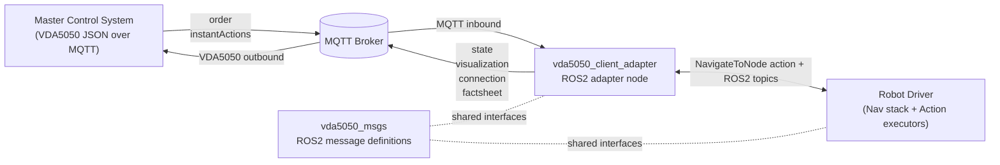
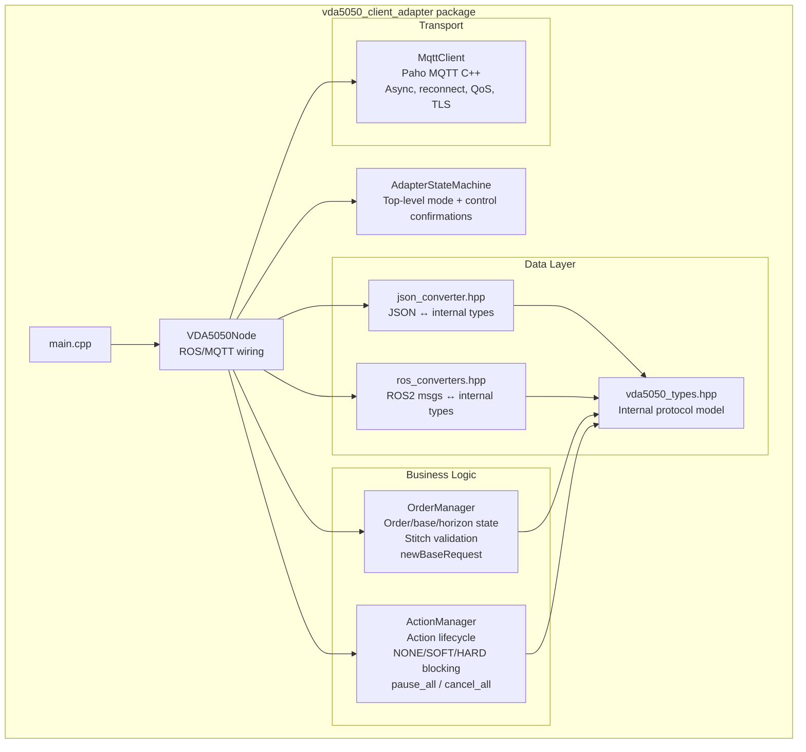
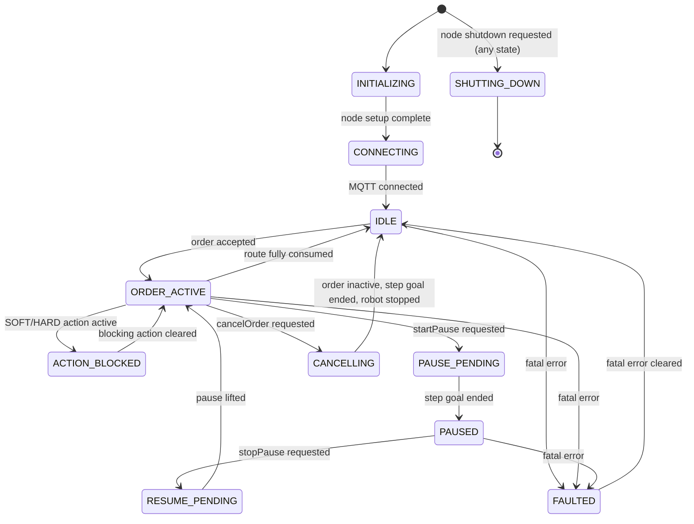
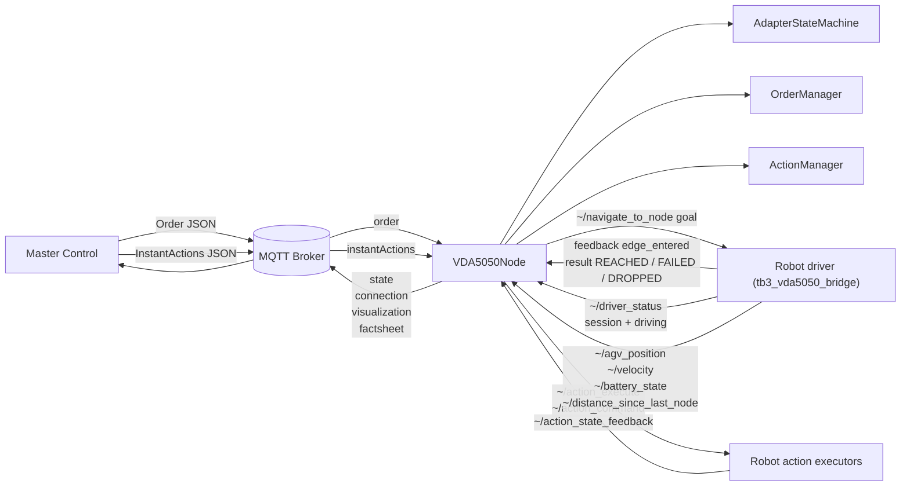
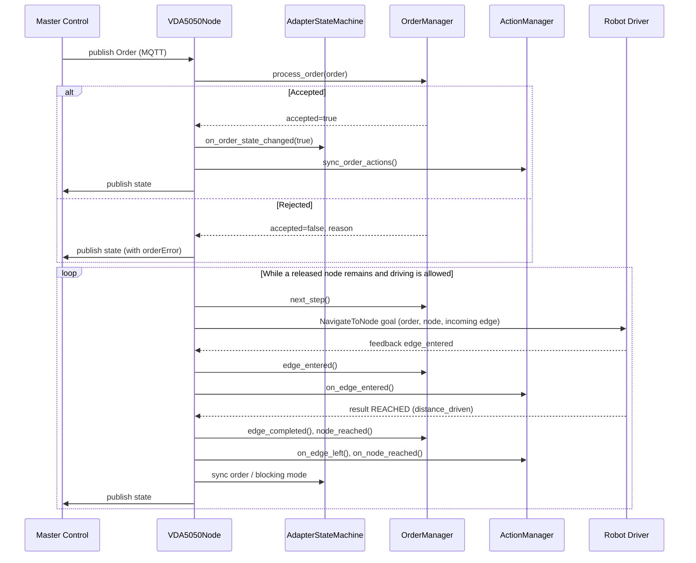
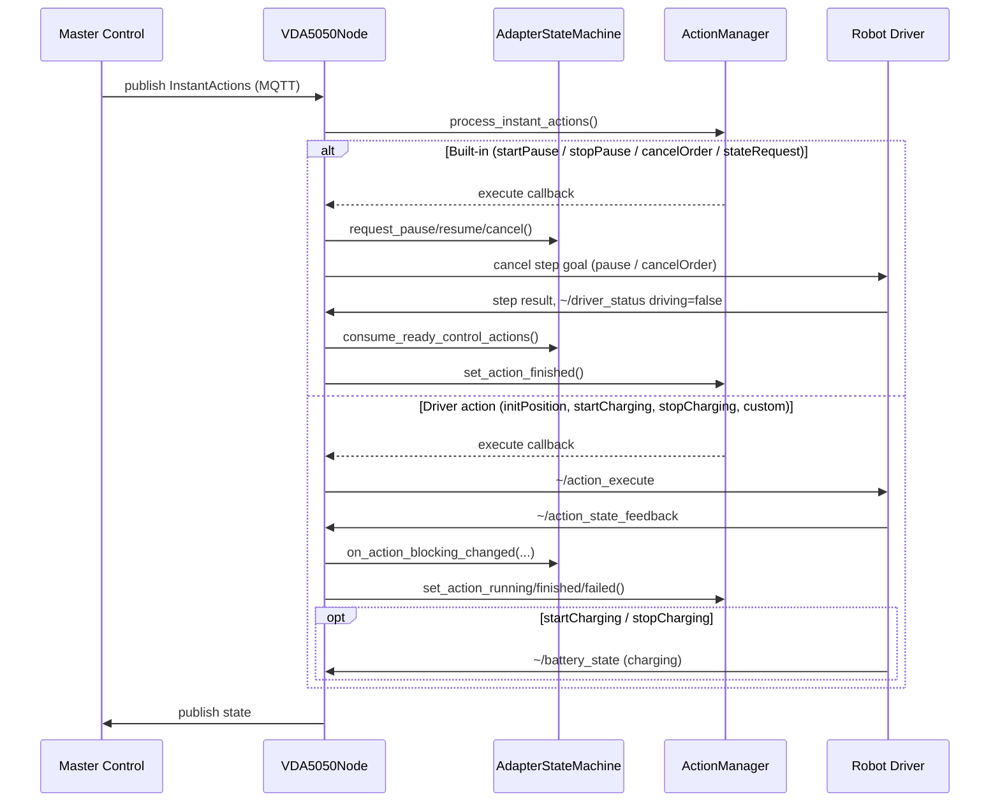
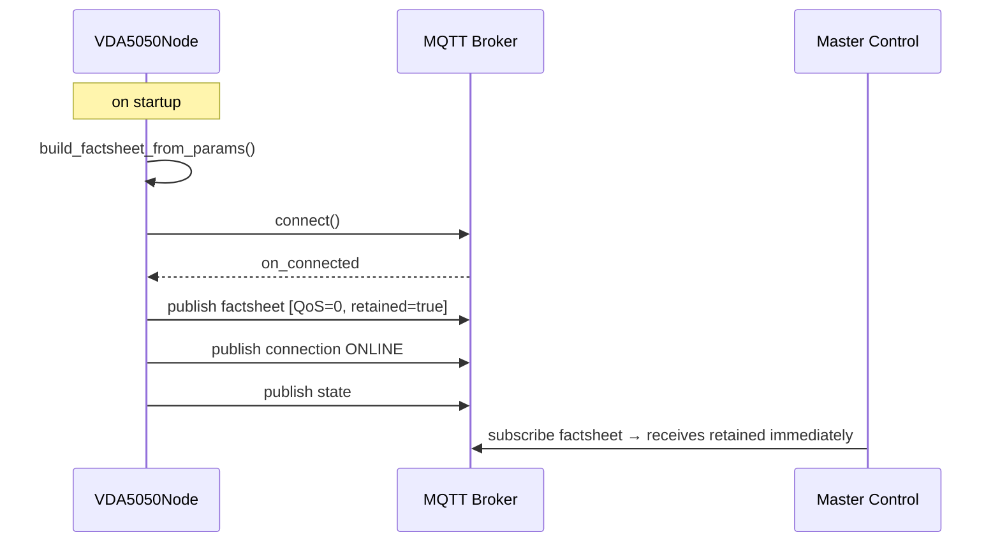

# VDA5050 Client Adapter — Architecture

This document describes the architecture of `vda5050_client_adapter`, the ROS 2 node that connects a VDA5050 master control to the robot's driver stack. It complements the package [README](../README.md), which covers the features, configuration and how to build and run it.

---

## 1. System Architecture

This section shows where the adapter sits between the master control and the robot, and which messages cross each boundary.

```mermaid
flowchart LR
    MC["Master Control System\n(VDA5050 JSON over MQTT)"]
    Broker[("MQTT Broker")]
    Adapter["vda5050_client_adapter\nROS2 adapter node"]
    Msgs["vda5050_msgs\nROS2 message definitions"]
    Robot["Robot Driver\n(Nav stack + Action executors)"]

    MC -->|order\ninstantActions| Broker
    Broker -->|MQTT inbound| Adapter
    Adapter -->|state\nvisualization\nconnection\nfactsheet| Broker
    Broker -->|VDA5050 outbound| MC

    Adapter <-->|NavigateToNode action + ROS2 topics| Robot
    Msgs -.-|shared interfaces| Adapter
    Msgs -.-|shared interfaces| Robot
```

---

## 2. MQTT Topics (VDA5050 §6.2)

The adapter implements all six VDA5050 MQTT topics. The table lists the QoS and retained flag the node actually uses for each one.

| Topic | Direction | QoS | Retained |
|:---:|:---:|:---:|:---:|
| `.../order` | MC → AGV | 0 | No |
| `.../instantActions` | MC → AGV | 0 | No |
| `.../state` | AGV → MC | 0 | No |
| `.../visualization` | AGV → MC | 0 | No |
| `.../connection` | AGV → MC | 1 | Yes |
| `.../factsheet` | AGV → MC | 0 | Yes |

Topic pattern: `{interface_name}/v2/{manufacturer}/{serial_number}/{topic}`

`state` is published on a `vda5050.state_publish_interval` timer **and** on
every fresh `~/agv_position` update, throttled to at least
`vda5050.position_publish_min_interval` apart, so Master Control tracks the
position live between timer ticks.

---

## 3. Component View

This section shows the source files inside the package and which one uses which.

```mermaid
flowchart TB
    subgraph Adapter["vda5050_client_adapter package"]
        Main["main.cpp"]
        Node["VDA5050Node\nROS/MQTT wiring"]
        SM["AdapterStateMachine\nTop-level mode + control confirmations"]

        subgraph Logic["Business Logic"]
            Order["OrderManager\nOrder/base/horizon state\nStitch validation\nnewBaseRequest"]
            Action["ActionManager\nAction lifecycle\nNONE/SOFT/HARD blocking\npause_all / cancel_all"]
        end

        subgraph Data["Data Layer"]
            Types["vda5050_types.hpp\nInternal protocol model"]
            Json["json_converter.hpp\nJSON ↔ internal types"]
            Ros["ros_converters.hpp\nROS2 msgs ↔ internal types"]
        end

        subgraph Transport["Transport"]
            Mqtt["MqttClient\nPaho MQTT C++\nAsync, reconnect, QoS, TLS"]
        end

        Main --> Node
        Node --> SM
        Node --> Mqtt
        Node --> Order
        Node --> Action
        Node --> Json
        Node --> Ros
        Json --> Types
        Ros --> Types
        Order --> Types
        Action --> Types
    end
```

`AdapterStateMachine`, `OrderManager` and `ActionManager` are independent of each other; `AdapterStateMachine` never calls into the other two. `VDA5050Node` reads and drives all three on its own, and connects them where a change in one must affect another. For example, when `OrderManager` accepts a new order, `VDA5050Node` calls `take_pending_cancel()` on `AdapterStateMachine` to resolve any cancel that was still pending.

---

## 4. State Machine

This section shows the adapter's top-level runtime mode and what moves it from one mode to another.

```mermaid
stateDiagram-v2
    [*] --> INITIALIZING
    INITIALIZING --> CONNECTING: node setup complete
    CONNECTING --> IDLE: MQTT connected
    IDLE --> ORDER_ACTIVE: order accepted
    ORDER_ACTIVE --> ACTION_BLOCKED: SOFT/HARD action active
    ACTION_BLOCKED --> ORDER_ACTIVE: blocking action cleared
    ORDER_ACTIVE --> PAUSE_PENDING: startPause requested
    PAUSE_PENDING --> PAUSED: step goal ended
    PAUSED --> RESUME_PENDING: stopPause requested
    RESUME_PENDING --> ORDER_ACTIVE: pause lifted
    ORDER_ACTIVE --> CANCELLING: cancelOrder requested
    CANCELLING --> IDLE: order inactive, step goal ended, robot stopped
    ORDER_ACTIVE --> IDLE: route fully consumed
    IDLE --> FAULTED: fatal error
    ORDER_ACTIVE --> FAULTED: fatal error
    PAUSED --> FAULTED: fatal error
    FAULTED --> IDLE: fatal error cleared
    [*] --> SHUTTING_DOWN: node shutdown requested (any state)
    SHUTTING_DOWN --> [*]
```

`SHUTTING_DOWN` has priority over every other flag: `start_shutdown()` (node destructor) enters it from any mode.

| Component | Owns |
|---|---|
| `AdapterStateMachine` | Adapter mode, MQTT connectivity, driving mask, fatal-error mode, pause/resume/cancel confirmation |
| `OrderManager` | Route, base/horizon progress |
| `ActionManager` | Action lifecycle, blocking |
| `VDA5050Node` | ROS/MQTT callbacks → state-machine events, publishing |

A pending `cancelOrder` normally finishes once the robot is no longer driving and has no active order; a step goal still in flight counts as an active order. If a new order is accepted while that cancel is still pending, the adapter finishes the cancel at once instead of waiting, because a master control may send `cancelOrder` and its replacement order back to back while the robot is still driving.

---

## 5. Runtime Data Flow

This section shows the messages and ROS 2 interfaces the running node uses at once: MQTT to the master control, and topics and an action to the robot driver.

```mermaid
flowchart LR
    MC["Master Control"]
    Broker[("MQTT Broker")]
    Node["VDA5050Node"]
    SM["AdapterStateMachine"]
    OM["OrderManager"]
    AM["ActionManager"]
    Nav["Robot driver (tb3_vda5050_bridge)"]
    Act["Robot action executors"]

    MC -->|Order JSON| Broker
    MC -->|InstantActions JSON| Broker
    Broker -->|order| Node
    Broker -->|instantActions| Node

    Node --> SM
    Node --> OM
    Node --> AM

    Node -->|~/navigate_to_node goal| Nav
    Nav -->|feedback edge_entered\nresult REACHED / FAILED / DROPPED| Node
    Node -->|~/action_execute\n~/action_command| Act
    Act -->|~/action_state_feedback| Node

    Nav -->|~/driver_status\nsession + driving| Node
    Nav -->|~/agv_position\n~/velocity\n~/battery_state\n~/distance_since_last_node| Node

    Node -->|state\nconnection\nvisualization\nfactsheet| Broker
    Broker --> MC
```

---

## 5b. Threading and State Publishing

This section explains which thread runs each part of the node, and when a `state` message is actually published.

Paho delivers `order`, `instantActions` and connection events on its own thread, but that thread does not process them. Each callback only queues the work through `VDA5050Node::post`, and `event_timer_` runs the queued work on the executor thread, on a period set by `vda5050.event_loop_period` (10 ms by default).

Because of this, every handler runs on the same single executor thread. `OrderManager`, `ActionManager`, `AdapterStateMachine` and the robot's own state are never changed by two threads at once, so a `state` snapshot is always consistent.

`publish_state()` does not publish anything by itself. It only marks the state as changed, and the next event tick publishes it once. A `cancelOrder` that changes the order, its actions and its errors in the same tick still produces a single `state` message.

The periodic `state_timer_` and `visualization_timer_` are the exception: they publish directly, on their own schedule, instead of going through this queue.

On shutdown, the node publishes `connection` `OFFLINE`, then disconnects the MQTT client and destroys it before any other member is destroyed. This order guarantees that no Paho callback can run against an object that no longer exists.

## 5c. Route Execution (`~/navigate_to_node`)

This section explains how the adapter drives the accepted route one node at a time, and how it reacts to the driver's result.

The adapter is the only owner of the order. `drive()` runs after every executor tick and step
result and keeps at most one `NavigateToNode` goal in flight:

| Condition | Action |
|---|---|
| Next released node exists, no pause, (strict) no HARD/SOFT action running | Send its goal unless the goal in flight already targets it; a different node or order preempts |
| No next node, or driving not allowed | Cancel the goal in flight; it stays in flight until its result |

`OrderManager::next_step()` gives the first released node not yet reached with its incoming edge.
Results are matched by a per-goal token; results of preempted goals are ignored.

| Result | Effect |
|---|---|
| Feedback `edge_entered` | `edge_entered()` + edge actions, once per edge |
| `SUCCEEDED` / `REACHED` | Edge entered (if not yet) and completed, `node_reached(distance_driven)`, node actions, next step |
| `ABORTED` / `FAILED` | `navigationError` FATAL (`orderId`, `nodeId`) published at once, then order dropped and error cleared |
| `ABORTED` / `DROPPED` | Order dropped (local cancel on the robot, `initPosition`), no error |
| `ABORTED` / `PREEMPTED`, `CANCELED`, other codes | No progress |

The adapter considers the robot paused once it has requested a pause and no goal is in flight, so `startPause` finishes only after the driver has actually stopped.

`~/driver_status` is a latched topic. A new `session_id` on it means the driver restarted and lost the step goal that was in flight, so the adapter sends that goal again to the new session.

The driver publishes `~/driver_status` with a manual liveliness lease, and republishes it every third of that lease. If the lease expires, meaning the driver is gone or its executor stalled, the adapter drops the goal in flight, sets `driving` to false, and raises `driverConnectionError` as a FATAL error. No new step is sent until the liveliness comes back, at which point the adapter clears the error. Before sending its first step, the adapter also cancels every goal left on the driver, so a goal from a previous adapter process cannot keep driving the robot.

The adapter subscribes to `~/driver_status` with automatic liveliness and a lease of `vda5050.driver_status_max_lease`. A finite requested lease is required because Fast DDS only reports liveliness changes when one is set, and DDS matching requires the driver's offered lease to be no longer than this one. Fast DDS also cannot detect the loss of a writer in the same process, so this detection only works when the driver runs as its own process, which is the normal deployment.

Per-action commands, meaning `PAUSE`, `RESUME` or `CANCEL` of one action, are published on `~/action_command` (`vda5050_msgs/ActionCommand`). The adapter sends them for a HARD action dispatch, when an edge is left, and for `cancel_all`.

The adapter also publishes local status that mirrors what MQTT carries to the master control: `~/driving` and `~/paused` as latched `Bool` topics, `~/node_reached` as `NodeState`, and the `navigationError` of a failed step on `~/error`. The adapter also subscribes to `~/error` for driver errors, and ignores a `navigationError` that names an order that is no longer active, so it does not read back its own message.

---

## 6. Order Flow

This sequence shows what happens from the moment the master control publishes an order to the robot completing its route.

```mermaid
sequenceDiagram
    participant MC as Master Control
    participant Node as VDA5050Node
    participant SM as AdapterStateMachine
    participant OM as OrderManager
    participant AM as ActionManager
    participant Robot as Robot Driver

    MC->>Node: publish Order (MQTT)
    Node->>OM: process_order(order)

    alt Accepted
        OM-->>Node: accepted=true
        Node->>SM: on_order_state_changed(true)
        Node->>AM: sync_order_actions()
        Node->>MC: publish state
    else Rejected
        OM-->>Node: accepted=false, reason
        Node->>MC: publish state (with orderError)
    end

    loop While a released node remains and driving is allowed
        Node->>OM: next_step()
        Node->>Robot: NavigateToNode goal (order, node, incoming edge)
        Robot-->>Node: feedback edge_entered
        Node->>OM: edge_entered()
        Node->>AM: on_edge_entered()
        Robot-->>Node: result REACHED (distance_driven)
        Node->>OM: edge_completed(), node_reached()
        Node->>AM: on_edge_left(), on_node_reached()
        Node->>SM: sync order / blocking mode
        Node->>MC: publish state
    end
```

---

## 7. Instant Action Flow

This sequence shows how the adapter tells apart the instant actions it executes itself from the ones it forwards to the robot driver.

```mermaid
sequenceDiagram
    participant MC as Master Control
    participant Node as VDA5050Node
    participant SM as AdapterStateMachine
    participant AM as ActionManager
    participant Robot as Robot Driver

    MC->>Node: publish InstantActions (MQTT)
    Node->>AM: process_instant_actions()

    alt Built-in (startPause / stopPause / cancelOrder / stateRequest)
        AM-->>Node: execute callback
        Node->>SM: request_pause/resume/cancel()
        Node->>Robot: cancel step goal (pause / cancelOrder)
        Robot->>Node: step result, ~/driver_status driving=false
        Node->>SM: consume_ready_control_actions()
        Node->>AM: set_action_finished()
    else Driver action (initPosition, startCharging, stopCharging, custom)
        AM-->>Node: execute callback
        Node->>Robot: ~/action_execute
        Robot->>Node: ~/action_state_feedback
        Node->>SM: on_action_blocking_changed(...)
        Node->>AM: set_action_running/finished/failed()
        opt startCharging / stopCharging
            Robot->>Node: ~/battery_state (charging)
        end
    end

    Node->>MC: publish state
```

---

## 8. Factsheet Flow (VDA5050 §9.4)

This sequence shows when the adapter builds and publishes its factsheet, so the master control has it as soon as it subscribes.

```mermaid
sequenceDiagram
    participant Node as VDA5050Node
    participant MQTT as MQTT Broker
    participant MC as Master Control

    Note over Node: on startup
    Node->>Node: build_factsheet_from_params()
    Node->>MQTT: connect()
    MQTT-->>Node: on_connected
    Node->>MQTT: publish factsheet [QoS=0, retained=true]
    Node->>MQTT: publish connection ONLINE
    Node->>MQTT: publish state
    MC->>MQTT: subscribe factsheet → receives retained immediately
```

`protocolFeatures.agvActions` lists the types in `factsheet.supported_action_types`:

| Action type | Scope | Blocking type | Executed by |
|:---:|:---:|:---:|:---:|
| `startPause`, `stopPause`, `cancelOrder`, `stateRequest`, `factsheetRequest` | INSTANT | NONE | adapter |
| `initPosition` | INSTANT | NONE | driver |
| `startCharging`, `stopCharging` | INSTANT | HARD | driver |
| other types | INSTANT, NODE, EDGE | NONE, SOFT, HARD | driver |

---

## 9. Data Model (vda5050_types.hpp)

This section lists the internal structs the adapter uses to represent the VDA5050 protocol, independent of JSON and ROS 2.

| Struct | Description |
|:---:|---|
| `Header` | headerId, timestamp, version, manufacturer, serialNumber |
| `Order` | Navigation order: nodes, edges, actions |
| `InstantActions` | Set of immediately executed actions |
| `State` | Full robot state published to MC |
| `Visualization` | Real-time telemetry (position + velocity) |
| `Connection` | MQTT connection state |
| `Factsheet` | AGV technical specification |
| `Node` / `Edge` | Route graph elements with positions and actions |
| `Action` / `ActionState` | Action with NONE/SOFT/HARD blocking, lifecycle status |
| `TypeSpecification` | AGV kinematic, class, load capacity, navigation types |
| `PhysicalParameters` | Speed, acceleration, dimensions |
| `ProtocolFeatures` | Supported actions with scopes and blocking types |

---

## 10. JSON Schema Compliance (VDA5050 v2.1.0)

`test_vda5050_schemas` validates the messages this adapter publishes against the official schemas
(`../vda5050_fleet_adapter_full_control/test/schemas/vda5050_2.1`):

| Message | Checked cases |
|:---:|---|
| `state` | idle; driving with node, edge and action states, errors, information and loads; manual mode with eStop and no position |
| `connection` | `ONLINE`, `OFFLINE`, `CONNECTIONBROKEN` |
| `visualization` | position and velocity; header only |
| `factsheet` | built by `build_factsheet_from_params()` from `config/vda5050_params.yaml` |

A few implementation details matter for schema compliance:
- `maxArrayLens` uses the dot-notation keys of §9.4, such as `"order.nodes"` and `"state.errors"`, as literal JSON keys.
- A custom serializer for `std::optional<T>` omits an absent field from the JSON output instead of writing `null`.
- `agvGeometry` and `loadSpecification` are required objects whose members are all optional, so the adapter sends them as empty objects.
- `timing.minOrderInterval` and `timing.minStateInterval` are both set to `vda5050.event_loop_period`, since the adapter takes an order and publishes a changed state at most once per event tick.
- The published 2.1.0 `factsheet.schema` puts the `blockingTypes` enum on the array instead of on its items; the validator corrects this before checking a factsheet against it.

---

## 11. OrderManager — Order Updates

This section explains where an order update may start, and what strict mode adds to accepting one.

An order update, meaning the same `orderId` with a higher `orderUpdateId`, must start at the base end: either the last remaining released node, or the last traversed node once the base is used up. Outside strict mode, the adapter also accepts an update that starts at the last horizon node, keeping the horizon before it. An update also reactivates an order that had already finished.

The adapter raises `newBaseRequest` once fewer than `vda5050.new_base_request_min_base_nodes` released nodes remain and the horizon still has nodes.

Strict mode adds structure validation through `validationError`, ignores a repeated `orderUpdateId`, reports a lower one as `orderUpdateError`, refuses a new `orderId` while an order is active, and keeps `orderId` and `orderUpdateId` after `cancelOrder`.

---

## 11b. OrderManager — Order Replacement

This section explains how the adapter switches to a completely new order outside strict mode.

Outside strict mode, a new `orderId` replaces the active order, whatever route still remains. Its first node must be the last traversed node, compared by `nodeId`, because `sequenceId` restarts at 0 for each order. Its first step preempts the goal in flight, so no progress made on the replaced order carries over. Strict mode refuses a new `orderId` while an order is still active, so this replacement never happens there.

---

## 11c. Driver Telemetry

This section covers two driver topics that fall outside the request and response flows above.

`~/distance_since_last_node` streams the AGV's driven distance live, and `REACHED` sets its exact value once the robot reaches the node.

`~/operating_mode` comes from the bridge's `twist_mux` diagnostics: `AUTOMATIC` while Nav2 or RMF drives the robot, `MANUAL` while a joystick or keyboard override takes priority.

---

## 12. ActionManager — Blocking Semantics

This section explains how the three VDA5050 blocking types affect other actions and the route.

| Blocking Type | Behavior |
|:---:|---|
| `NONE` | Runs concurrently with all other actions |
| `SOFT` | Runs concurrently with other actions; driving stops (strict: the step goal is cancelled until it ends) |
| `HARD` | Default: pauses running actions, runs alone, resumes them when finished. Strict: waits for running actions to end; later actions wait for it; no step goal while it runs |

Dispatch rules:
- Control actions (`cancelOrder`, `startPause`, `stopPause`, `stateRequest`, `factsheetRequest`) run at once; they neither block other actions nor get blocked by them.
- While a HARD action is running, no other action is dispatched.
- While `dispatch_paused_` is set, only instant actions are dispatched.
- An order action is not dispatched until its node or edge trigger is ready.
- `actionStates` keeps at most `vda5050.max_finished_instant_actions` finished instant actions.

---

## 13. Test Coverage

This section lists the gtest suites and what each one checks; see the package [README § Testing](../README.md#testing) for how to run them.

| Suite | Coverage |
|:---:|---|
| `test_adapter_state_machine` | Top-level mode transitions, control confirmations, fault and shutdown handling, pending-action supersede, driving flag |
| `test_order_manager` | Accept, stitch, `newBaseRequest`, cancel, reject cases, order replacement, next step and progress, strict mode |
| `test_action_manager` | NONE/SOFT/HARD blocking, control actions, sequential HARD, pause/resume/cancel, HARD-wait timeout, instant action cap |
| `test_converters` | JSON round-trips, schema compliance, strict enums, ROS 2 to internal conversion |
| `test_full_control_compat` | Wire compatibility with `vda5050_fleet_adapter_full_control`'s own builders and parsers, a live node with a fake `NavigateToNode` server over MQTT in both modes, TLS with per-AGV accounts, and startup parameter checks |
| `test_schema_samples` | Publishes sample messages for `test_vda5050_schemas` to check against the official VDA5050 2.1 JSON schemas |

---

## 14. Component Responsibilities

This section is a quick reference for what each class or header owns, without repeating the diagrams above.

| Component | Responsibility |
|:---:|---|
| `VDA5050Node` | ROS/MQTT wiring, route execution (`NavigateToNode` client), state publish, side effects |
| `AdapterStateMachine` | Top-level runtime mode, control-action confirmation, fault/connectivity state |
| `MqttClient` | Transport: connect, publish/subscribe, reconnect, QoS, retained |
| `OrderManager` | Protocol state: validate/stitch orders, track base/horizon, next route step |
| `ActionManager` | Action lifecycle: NONE/SOFT/HARD blocking, pause/resume/cancel |
| `json_converter.hpp` | JSON ↔ internal model (VDA5050 v2.1.0 compliant) |
| `ros_converters.hpp` | ROS2 msg ↔ internal model (bidirectional) |
| `vda5050_types.hpp` | Internal domain model (no external dependencies) |

---

## 15. Reading Order

A suggested order for reading the source, from the data it works with to the code that wires everything together.

1. [config/vda5050_params.yaml](../config/vda5050_params.yaml)
2. [include/vda5050_client_adapter/vda5050_types.hpp](../include/vda5050_client_adapter/vda5050_types.hpp)
3. [include/vda5050_client_adapter/adapter_state_machine.hpp](../include/vda5050_client_adapter/adapter_state_machine.hpp)
4. [src/vda5050_node.cpp](../src/vda5050_node.cpp)
5. [src/order_manager.cpp](../src/order_manager.cpp)
6. [src/action_manager.cpp](../src/action_manager.cpp)
7. [src/mqtt_client.cpp](../src/mqtt_client.cpp)
8. [include/vda5050_client_adapter/json_converter.hpp](../include/vda5050_client_adapter/json_converter.hpp)
9. [include/vda5050_client_adapter/ros_converters.hpp](../include/vda5050_client_adapter/ros_converters.hpp)

---

