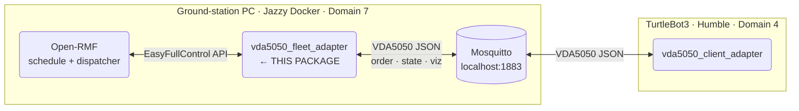
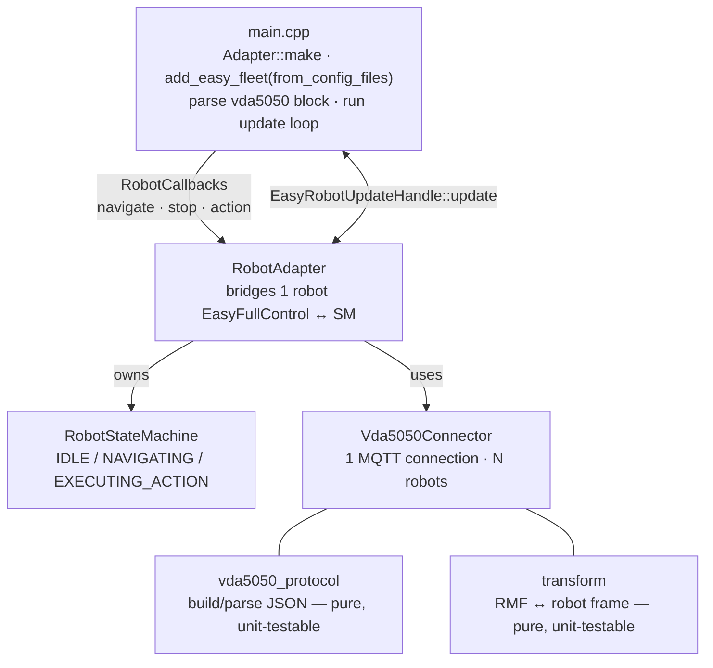

# vda5050_fleet_adapter

Open-RMF **EasyFullControl** fleet adapter that drives VDA5050 AGVs over MQTT. Acts as the VDA5050 master control: receives tasks from Open-RMF, converts each navigation goal into a VDA5050 `order`, and feeds robot `state` back into RMF.

## Overview

EasyFullControl issues navigation **one destination at a time** — RMF hands the adapter a single `Destination` and waits for `execution.finished()` before the next. This means **one VDA5050 order = one destination** (base node = current pose, end node = destination), with a fresh `orderId` each time and no overlapping orders. It removes multi-node order / stitch / order-update machinery entirely and eliminates the class of deadlock bugs that multi-node orders produce.

## System Context



## Architecture



### State machine

| State | Trigger in | Trigger out |
|---|---|---|
| `IDLE` | startup / `finished()` / cancel | `on_navigate` → NAVIGATING, `on_action` → EXECUTING_ACTION |
| `NAVIGATING` | `on_navigate` | `is_command_completed` fires `finished()` → IDLE |
| `EXECUTING_ACTION` | `on_action` | action FINISHED/FAILED → IDLE |

## Package Structure

| File | Role |
|---|---|
| `src/main.cpp` | Entry point: parse config, create Adapter + fleet, build robots, run update loop |
| `include/.../vda5050_protocol.hpp` · `src/vda5050_protocol.cpp` | Pure VDA5050 message layer: build `order` / `instantActions`, parse `state` into `ParsedState`. No MQTT, no RMF. |
| `include/.../transform.hpp` | 2D affine transform between RMF nav-graph frame and robot map frame. Header-only, pure. |
| `include/.../vda5050_connector.hpp` · `src/vda5050_connector.cpp` | Owns one paho MQTT connection, one `RobotContext` per robot. Downlink: `navigate`, `stop`, `execute_instant_action`. Uplink: `get_data`, `is_command_completed`, `get_action_state`, `is_online`. Thread-safe. |
| `include/.../robot_state_machine.hpp` · `src/robot_state_machine.cpp` | Explicit per-robot lifecycle. Holds active `CommandExecution`, fires `finished()` on completion. |
| `include/.../robot_adapter.hpp` · `src/robot_adapter.cpp` | Bridges one EasyFullControl robot to the connector + state machine. |
| `config/config.yaml` | Two blocks: `rmf_fleet:` (EasyFullControl schema) + `vda5050:` (adapter-specific: MQTT, identity, transform per robot). |
| `maps/nav_graph.yaml` | RMF nav graph — waypoint names become VDA5050 nodeIds. |
| `launch/fleet_adapter.launch.py` | Launches the `fleet_adapter` node. |
| `docker/Dockerfile` · `docker/run.sh` | Jazzy + RMF + paho-mqtt-cpp build environment. |
| `scripts/dispatch_patrol.py` | Publishes a patrol task to the RMF task API. |
| `scripts/cancel_task.py` | Cancels a task by id. |
| `scripts/mock_mqtt_robot.py` | Simulates a VDA5050 AGV over MQTT — runs the full stack without hardware. |
| `test/test_protocol.cpp` | Order / state JSON shape, ParsedState parsing, completion logic. |
| `test/test_transform.cpp` | `to_robot` / `to_rmf` round-trip. |
| `test/test_state_machine.cpp` | State transitions and `finished()` firing. |

## Data Flow

**Downlink (RMF → AGV)**

```
RMF navigate callback
  → RobotStateMachine::on_navigate
  → Vda5050Connector::navigate
  → build 2-node order (current pose → destination, transformed to robot frame)
  → publish on MQTT .../order
```

**Uplink (AGV → RMF)**

```
MQTT .../state received
  → Vda5050Connector caches ParsedState
  → update loop: get_data (position + battery in RMF frame)
  → RobotAdapter::update → EasyRobotUpdateHandle::update
  → state machine checks is_command_completed → fires finished()
```

## Configuration

Config file: [`config/config.yaml`](config/config.yaml)

Key parameters under `vda5050:`:

| Parameter | Description |
|---|---|
| `interface_name` | VDA5050 interface name — must match client adapter |
| `update_rate_hz` | How often to push state into RMF |
| `mqtt.host` / `mqtt.port` | MQTT broker address |
| `robots[].manufacturer` / `serial` | VDA5050 robot identity |
| `robots[].transform` | RMF frame → robot map frame offset |

> `interface_name`, `manufacturer`, and `serial` must match `vda5050_client_adapter` exactly so both ends share the same MQTT topics.

## Build & Run

```bash
# 1. Build Docker image and open a shell (first time only)
src/vda5050_fleet_adapter/docker/run.sh

# 2. Inside the container — build
colcon build --packages-select vda5050_fleet_adapter
source install/setup.bash

# 3. Start RMF core
ros2 run rmf_traffic_ros2 rmf_traffic_schedule &
ros2 run rmf_task_ros2 rmf_task_dispatcher &

# 4. Start fleet adapter
ros2 launch vda5050_fleet_adapter fleet_adapter.launch.py

# 5. Dispatch a patrol task
python3 src/vda5050_fleet_adapter/scripts/dispatch_patrol.py wp6

# Inspect MQTT traffic
mosquitto_sub -t 'TB3/v2/ROBOTIS/0001/#'
```

## Testing

```bash
# Unit tests (no hardware, no MQTT)
colcon test --packages-select vda5050_fleet_adapter

# End-to-end with simulated robot (no hardware)
python3 src/vda5050_fleet_adapter/scripts/test_dispatch_e2e.py --target wp6

# Run simulated robot only (dispatch manually)
python3 src/vda5050_fleet_adapter/scripts/mock_mqtt_robot.py
```

## Multi-robot

1. Add an `is_charger` waypoint per robot in `maps/nav_graph.yaml`.
2. Add the robot under both `rmf_fleet.robots` and `vda5050.robots` in `config/config.yaml`.

The connector and update loop are already multi-robot — one MQTT connection serves every robot, keyed by `manufacturer/serial`.

## Related

- [Root README — system overview](../README.md)
- [VDA5050 Client Adapter](../vda5050_client_adapter/README.md)
