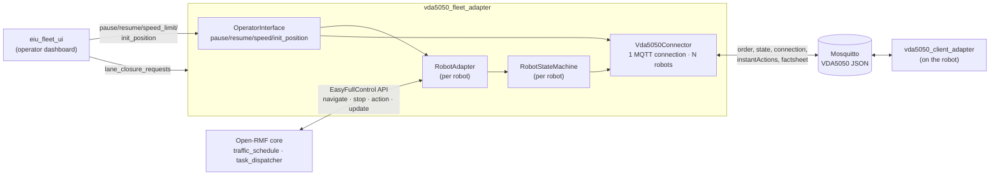
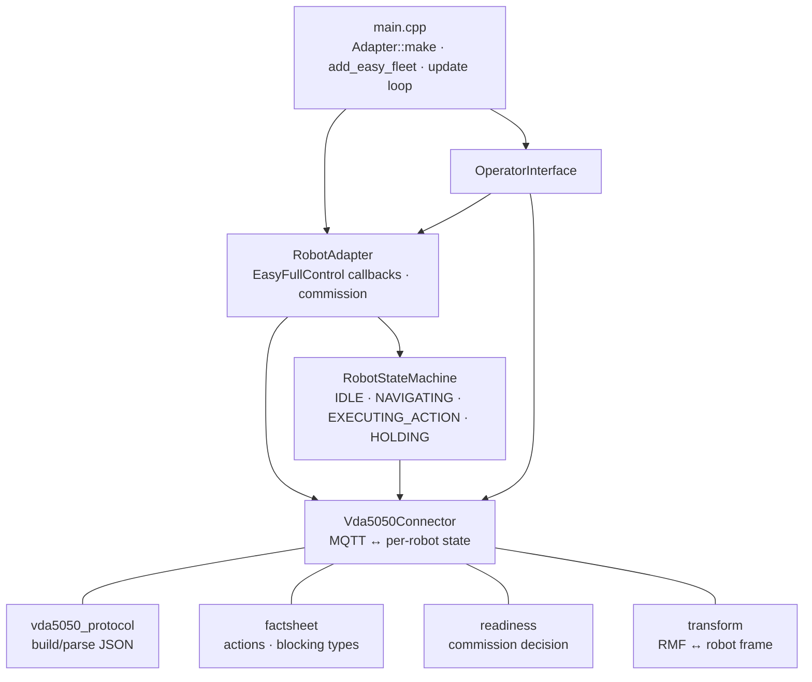
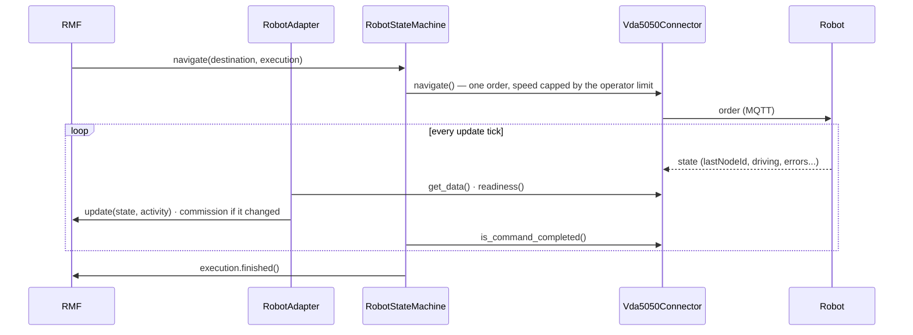

# vda5050_fleet_adapter — Architecture

Bridges Open-RMF to VDA5050 AGVs over MQTT through the EasyFullControl
API. RMF sees a normal EasyFullControl fleet adapter; the robots see a
normal VDA5050 master controller.

See [README.md § Features](../README.md#features) for the feature list —
kept in one place to avoid the two drifting apart.

## System architecture

RMF never talks MQTT and the robot never talks ROS — this process is the
only thing that understands both.

EasyFullControl hands the adapter **one destination at a time**: one
VDA5050 order per destination (base node = current pose, end node =
destination), each with a fresh `orderId`. Multi-node orders, horizon
release and stitching belong to `vda5050_fleet_adapter_full_control`.

## Component view

| File | Role |
|---|---|
| `src/main.cpp` | Entry point: parse config, create the Adapter and fleet, build the robots, lane closures, run the update loop |
| `vda5050_protocol.*` | Pure message layer: build `order` / `instantActions`, parse `state` into `ParsedState` (pose, order progress, safety, operating mode, errors). No MQTT, no RMF |
| `factsheet.*` | Pure: factsheet parser (actions, blocking types, speed), custom-action check, action conflict check |
| `readiness.*` | Pure: whether an AGV can take tasks, from connectivity and state |
| `transform.hpp` | 2D affine transform between the RMF frame and the robot map frame |
| `vda5050_connector.*` | Owns one paho MQTT connection and one `RobotContext` per robot. Downlink: `navigate`, `stop`, `pause`, `resume`, `init_position`, `execute_instant_action`, `poll` (factsheetRequest). Uplink: `get_data`, `readiness`, `is_command_completed`, `get_action_state` |
| `robot_state_machine.*` | Per-robot lifecycle; holds the active `CommandExecution`, fires `finished()`, runs the hold |
| `robot_adapter.*` | Bridges one EasyFullControl robot to the connector and state machine; applies commission changes |
| `operator_interface.*` | ROS topics, services and parameters for `init_position`, pause, resume and speed limit |
| `config/` · `maps/` · `launch/` · `docker/` | Fleet configs, RMF nav graph (waypoint names become VDA5050 nodeIds), launch files, Jazzy build image |
| `scripts/` | `dispatch_patrol.py`, `cancel_task.py`, `mock_mqtt_robot.py`, `run_mock_fleets.py`, `test_dispatch_e2e.py` |
| `test/` | Unit tests: `test_protocol`, `test_factsheet`, `test_readiness`, `test_connector` (no broker), `test_transform`, `test_state_machine` |

## Key flows

### Navigation dispatch and completion

### Hold instead of cancel

RMF's `stop` does not cancel the order. The robot is paused and the order
kept, so a replan that keeps the destination costs nothing.

| State | Trigger in | Trigger out |
|---|---|---|
| `IDLE` | startup / `finished()` / cancel | `on_navigate` → NAVIGATING, `on_action` → EXECUTING_ACTION |
| `NAVIGATING` | `on_navigate` | `is_command_completed` fires `finished()` → IDLE; `on_stop` → HOLDING |
| `EXECUTING_ACTION` | `on_action` | action FINISHED/FAILED → IDLE |
| `HOLDING` | `on_stop` (`startPause` sent) | `on_navigate` to the same destination → `stopPause`; to another → new order + `stopPause`; no command within `kHoldTimeoutSec` (10 s) → `cancelOrder` + `stopPause` → IDLE |

- A pause requested by the operator is never released by the hold logic.
- For a few seconds after the adapter's own `stopPause`, a pause still
  reported by the AGV does not decommission it.

### Commission state

`evaluate_readiness(online, state, tolerate_pause)` decides whether the AGV
can take tasks; the conditions are listed under Commissioning in the
[README](../README.md#features). `RobotAdapter::apply_readiness` turns a
change into `set_commission(...)`. RMF registers a robot asynchronously, so
the call is retried on the next tick until its handle exists.

## Configuration (`config_tb3.yaml` / `config_amr.yaml`)

One `rmf_fleet:` block applies its `profile`/`limits` to every robot listed
under it, so each robot type gets its own config file and its own adapter
process (`config_tb3.yaml` → `tb3_fleet`, `config_amr.yaml` → `amr_fleet`) —
see [README.md](../README.md#multiple-fleets). The keys below apply to either file.

| Key | Default | Effect |
|---|---|---|
| `rmf_fleet.name` | — | RMF fleet name |
| `rmf_fleet.robots.<name>.charger` | — | Charger waypoint name for the robot |
| `vda5050.interface_name` | `uagv` | VDA5050 topic prefix segment |
| `vda5050.mqtt.host/port/username/password` | `localhost:1883` | Broker connection |
| `vda5050.robots.<name>.manufacturer/serial` | `unknown` / robot name | Robot identity in the topics |
| `vda5050.robots.<name>.transform` | identity | RMF frame → robot map frame (`rotation`, `scale`, `translation`) |
| `vda5050.update_rate_hz` | 10 | RMF update-loop frequency; must be > 0 |
| `vda5050.strict_validation` | true | Reject custom actions missing from the factsheet |
| `rmf_fleet.account_for_battery_drain` | false | Off = report SoC 1.0 to RMF regardless of the real battery |

## Process boundaries

| Boundary | Crossed by | Protocol |
|---|---|---|
| This adapter ↔ RMF core | `RobotCallbacks` / `EasyRobotUpdateHandle` (EasyFullControl) | In-process RMF API |
| This adapter ↔ robot | `order`, `state`, `connection`, `instantActions`, `factsheet`, `visualization` | MQTT |
| This adapter ← operator / UI | `<node>/<robot>/pause`, `resume`, `init_position`, parameter `speed_limit.<robot>` | ROS 2, same domain |
| This adapter ← operator / UI | `/lane_closure_requests` (fleet-wide) | ROS 2, same domain |

Threads: RMF callbacks arrive on RMF's executor, MQTT callbacks on paho's
thread, and the update loop runs on its own thread. `Vda5050Connector` guards
its per-robot state with one mutex and calls paho outside it;
`RobotStateMachine` has its own mutex.

Traffic negotiation is handled entirely by stock RMF
(`rmf_traffic_schedule`) — this adapter just executes each destination RMF
hands it.
