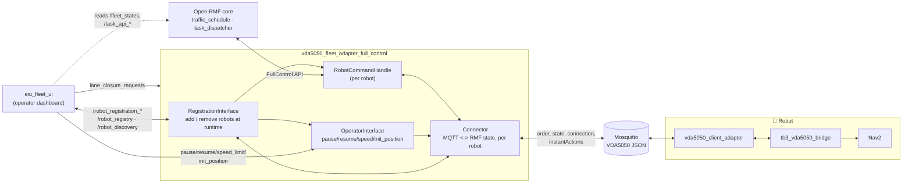
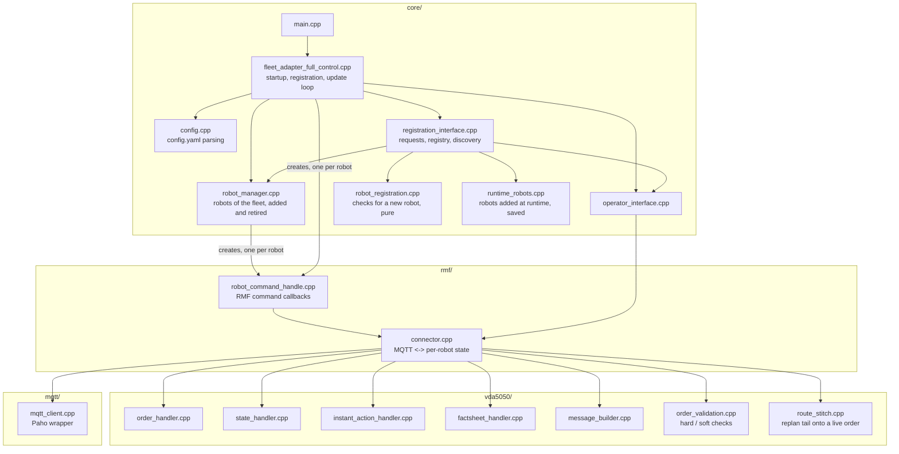
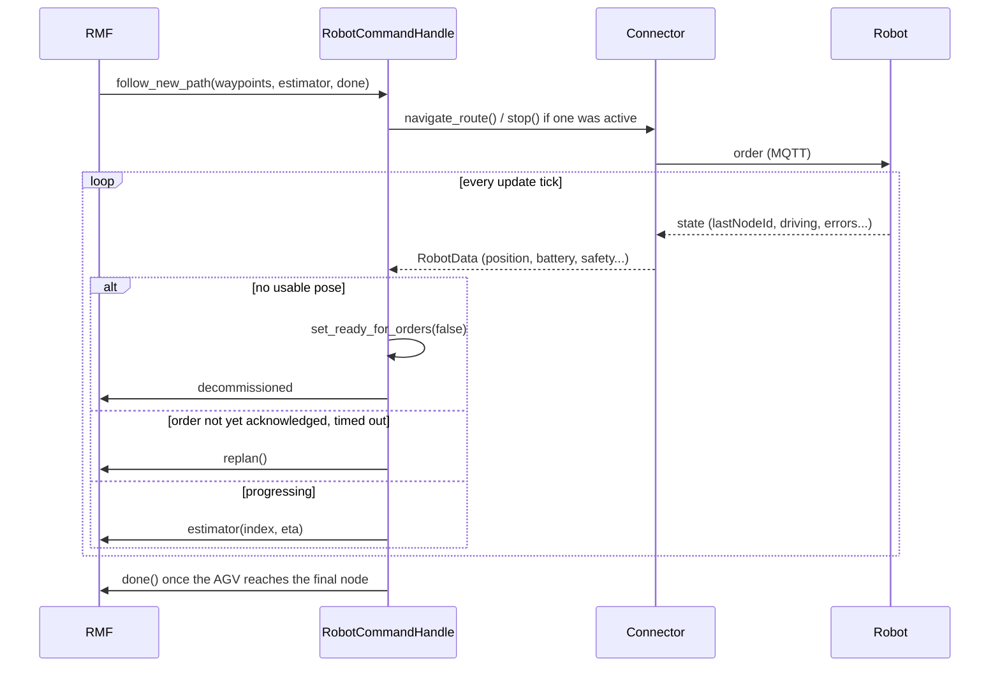
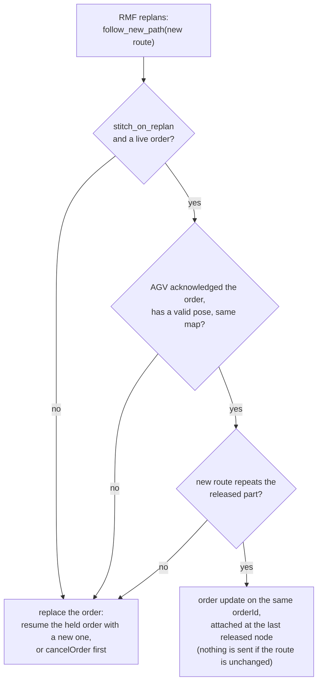
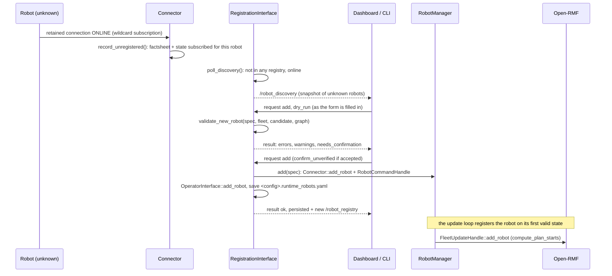

# vda5050_fleet_adapter_full_control — Architecture

Bridges Open-RMF to a VDA5050 fleet over MQTT. RMF sees a normal fleet
adapter (`RobotCommandHandle`, `RobotUpdateHandle`); the robots see a
normal VDA5050 master controller.

See [README.md § Features](../README.md#features) for the full features
list — kept in one place to avoid the two drifting apart.

## System architecture

RMF never talks MQTT and the robot never talks ROS — this process is the
only thing that understands both.

## Component view

## Key flows

### Order dispatch and progress tracking

### Replanning a live order

`Connector::replan_route` does the check with `plan_stitch`. The new route
matches when its start repeats the released nodes the AGV has not reached
yet; up to three leading points on the lane the AGV is on, repeated turns
in place, and released nodes the new route passes straight through are
tolerated. VDA5050 cannot withdraw released nodes, so a route that changes
that part is refused with a `not stitching (<reason>)` log line and the
order is replaced instead. Nothing more is released while the AGV is held
for the replan.

### Traffic hold

An RMF `stop` does not cancel the order: `startPause` is sent and a
10 s deadline starts. A new path before the deadline is stitched onto the
order or replaces it, followed by `stopPause`. Without one, `cancelOrder`
is sent and the AGV is unpaused, unless the operator paused it. A repeated
`stop` keeps the first deadline. The deadline is also checked for a robot
without a valid pose, and no order goes out to such a robot; RMF keeps
replanning until it localizes. A pause from this hold does not decommission
the robot.

### Factsheet and validation

The retained `factsheet` is parsed into `ParsedFactsheet`. When none
arrives, `Connector::poll` sends `factsheetRequest` (after 5 s, then every
20 s, up to 3 times). Before an order or instant action is published:

| Severity | Condition | Effect |
|:---:|---|:---:|
| Hard | a pose is not finite | order rejected |
| Hard | `mapId` is not among the maps the AGV reports | order rejected |
| Hard | more nodes or edges than `maxArrayLens` allows | order rejected |
| Hard | a custom action is missing from the factsheet | action not sent |
| Soft | order sent inside `minOrderInterval`; a core action (`cancelOrder`, `startPause`, `stopPause`, `stateRequest`, `initPosition`, `factsheetRequest`) missing from the factsheet | warning only |

`strict_validation: false` turns the hard rejections into warnings.

### Adding a robot at runtime

Discovery (`<interface>/v2/+/+/connection`) and the registry
(`/robot_registry`, `/robot_discovery`, latched) work as shown in the
sequence diagram above. `validate_new_robot()` takes the request, the
fleet's known robots, the broker's facts about the candidate and the nav
graph, and returns a verdict — nothing global, so every rule has a unit
test with no broker or RMF involved. A check it can't run (no factsheet,
robot never seen) doesn't pass silently: it becomes an `unverified` error
that needs `confirm_unverified`. Each adapter also reads the other fleets'
registries, which is how names, identities and chargers stay unique across
fleets. Full check list: [README § Add a robot at
runtime](../README.md#add-a-robot-at-runtime). Message routing lives in
`Connector::handle_message`, state-freshness in `vda5050::StateSequence`,
cancel confirmation in `vda5050::CancelTracker` — all in `src/rmf/connector.cpp`
and `src/vda5050/`.

Thresholds come from the `vda5050:` section with validated ranges: offline,
stuck-order and factsheet timeouts as `rmf::LinkPolicy`, route-following
distances and times as `rmf::RoutePolicy`. `RobotManager` hands the same
policy to every robot, whether it came from the config or was added at
runtime.

**Metrics.** `Connector::metrics()` counts and times the message path.
`core::MetricsReporter` publishes it as JSON on `~/metrics` every
`vda5050.metrics_period_s` and logs one `[metrics]` line. `eiu_fleet_ui`'s
System view charts it, and surfaces the problems it shows — a lost broker,
drops, a slow update loop, reports that stopped — under Needs Attention.

| Report field | Meaning | What to watch |
|:---:|---|---|
| `robots.online` / `registered` | Robots that are connected and sent a state within `state_timeout_s` | Fewer online than registered |
| `robots.state_age_max_s`, `oldest_state_robot`, `state_timeout_s` | Age of the oldest last state, whose it is, and the adapter's own offline limit | Age approaching the limit |
| `fleet` | The RMF fleet name of the adapter (added by the adapter node) | |
| `rx.*` | Messages of registered robots by kind; `rx.unregistered` are messages of other fleets' robots | Silence on `state` for a robot that should be sending |
| `dropped.*` | `bad_payload`, `bad_topic`, `invalid_state`, `stale_state`, `oversize` | Anything above zero deserves a look |
| `log_suppressed` | Log lines the repeat throttle held back | A large count points at one noisy source |
| `published.failed` | Publishes Paho refused (not connected) | Above zero |
| `mqtt.connections_lost`, `errors` | Reconnects and error-callback reports (oversize drops are included) | Growth |
| `latency_us.handle_state` / `handle_other` | Time in `handle_message` per message | p99 far above the per-message cost |
| `latency_us.mutex_wait` | Time waiting for `_mutex` | p99 in the hundreds of microseconds or more |
| `state_transit_us` | Age of a state when handled (needs synchronized clocks) | Values growing from one report to the next mean messages are queueing |
| `update_loop.pass_us`, `overruns` | Duration of an update pass; passes over their slot | p99 near `period_ms`; any overrun |

**Update loop.** `util::LoopPacer` starts each pass at a fixed time. A slow
pass skips the slots it missed, and a throttled warning logs the pass time
and overrun count.

**Transport security** and **input limits** are `MqttClient`/`Config`
settings (`vda5050.mqtt.tls`, `vda5050.mqtt.max_payload_bytes` and its log
throttling) — see the README's rows for what they actually do.

**Threading.** ROS callbacks, the discovery timer and the MQTT thread meet
in `RegistrationInterface`, `RobotManager`, `OperatorInterface` and
`Connector`, each behind its own mutex. `Connector` also has a per-robot
`order_mutex`, held while an order, an update or a `cancelOrder` is built,
published and recorded. It's taken before `_mutex`, the innermost lock —
nothing runs a callback while holding it, and nothing calls back into MQTT
from a message callback either.

**Removing and restoring a robot.** `remove` (`RobotManager::retire`)
decommissions the robot and reserves its name, identity and charger until
the adapter restarts. Registering it again unchanged
(`RobotManager::reinstate`, `same_robot`) brings it back. See [README §
Removing a robot](../README.md#removing-a-robot).

### Commission state

`RobotCommandHandle` commissions a robot only while it is fresh, has a
usable pose, and `RobotData::ready_for_orders` holds (operating mode,
safety state, FATAL errors, pause) — the conditions are listed under
Commission tracking in the [README](../README.md#features). Any of them
failing decommissions it immediately through `apply_commission()`; all must
hold again before it is offered work.

## Configuration (`config_tb3.yaml` / `config_amr.yaml`)

One `rmf_fleet:` block applies its `profile`/`limits` to every robot listed
under it, so each robot type gets its own config file and its own fleet
adapter process (`config_tb3.yaml` → `tb3_fleet`, `config_amr.yaml` →
`amr_fleet`) — see [README.md](../README.md#multiple-robot-types-heterogeneous-fleets).
The keys below apply to either file.

| Key | Default | Effect |
|:---:|:---:|---|
| `vda5050.interface_name` | — | VDA5050 topic prefix segment |
| `vda5050.mqtt.host/port/username/password` | `localhost:1883` | Broker connection |
| `vda5050.mqtt.tls.enabled` | false | Connect to the broker over TLS (`ssl://`, default port 8883) |
| `vda5050.mqtt.tls.ca_file` | system store | PEM file with the CA certificates that sign the broker's certificate |
| `vda5050.mqtt.tls.client_cert` / `client_key` | — | PEM files of the client's certificate and private key, for a broker that asks for one; set both or neither |
| `vda5050.mqtt.tls.verify_hostname` | true | Check that the broker's certificate names the host being connected to |
| `vda5050.mqtt.max_payload_bytes` | 1048576 | Largest message payload handled, in bytes (1024–268435456); a larger message is dropped unread |
| `vda5050.mqtt.keep_alive_s` | 60 | Seconds between keep-alive packets, which let the broker and the adapter notice a dead connection (1–3600) |
| `vda5050.mqtt.connect_timeout_s` | 10 | Seconds one connect attempt may take (1–120) |
| `vda5050.mqtt.reconnect_min_s` / `reconnect_max_s` | 1 / 30 | Wait before the first reconnect attempt, doubling up to the maximum (1–60 / 1–600) |
| `vda5050.robots.<name>.manufacturer/serial` | — | Required per robot; missing entry fails startup; must not be empty or contain `/`, `+` or `#` |
| `vda5050.update_rate_hz` | 10 | RMF update-loop frequency |
| `vda5050.honor_waypoint_timing` | false | Horizon release paced by schedule instead of all-at-once |
| `vda5050.stitch_on_replan` | false | Attach a replanned route to the live order as an update instead of replacing the order |
| `vda5050.strict_validation` | true | Reject hard violations before publishing; off only warns |
| `vda5050.cancel_confirm_timeout_s` | 5 | Seconds to wait for an AGV to answer a `cancelOrder` before judging it (0–120); 0 turns the watch off |
| `vda5050.cancel_attempts` | 3 | Times a `cancelOrder` may be sent for one order, counting the first (1–10) |
| `vda5050.stale_state_streak` | 3 | Consecutive stale state messages dropped before the sender counts as restarted (0–100); 0 keeps every message |
| `vda5050.state_timeout_s` | 10 | Seconds without a state message after which an AGV counts as offline (1–3600) |
| `vda5050.order_stuck_timeout_s` | 15 | Seconds an order may stay unacknowledged by the AGV before RMF is asked to replan (1–3600) |
| `vda5050.traffic_pause_timeout_s` | 10 | Seconds a traffic hold (`startPause`) may last before the order is cancelled (0–3600) |
| `vda5050.factsheet_first_wait_s` / `factsheet_retry_wait_s` | 5 / 20 | Seconds to wait for the retained factsheet before the first `factsheetRequest`, and between further requests (0–3600 / 1–3600) |
| `vda5050.factsheet_request_attempts` | 3 | `factsheetRequest`s sent to one AGV before giving up (0–10); 0 turns the requests off |
| `vda5050.waypoint_reached_m` | 0.5 | Metres from a waypoint within which it counts as reached when the AGV reports no `nodeId` (0.01–10) |
| `vda5050.same_pose_m` / `same_pose_rad` | 0.05 / 0.05 | Poses this close in position and heading count as the same waypoint (0.001–1 each) |
| `vda5050.usable_speed_mps` | 0.05 | Measured speeds below this are replaced by the fleet's nominal speed in arrival estimates (0–1) |
| `vda5050.metrics_period_s` | 60 | Seconds between metrics reports, a log line plus a JSON message on `~/metrics` (0–3600); 0 turns them off |
| `vda5050.early_arrival_warn_s` | 2 | Seconds ahead of RMF's plan beyond which an early arrival is logged (0–3600) |
| `vda5050.registration.discovery_grace_s` | 8 | Wait after startup before unknown robots are reported |
| `vda5050.registration.discovery_period_s` | 2 | Seconds between checks of the broker and of the registry |
| `vda5050.registration.timeout_s` | 30 | Seconds RMF may take to complete a robot's registration before it is tried again (1–600) |
| `vda5050.registration.limit_tolerance` | 0.05 | Relative margin for a new robot's speed and acceleration |
| `vda5050.registration.runtime_robots_file` | `<config>.runtime_robots.yaml` | Where robots added at runtime are kept |
| `vda5050.ui_websocket_uri` | — | Optional task-event broadcast to a UI |
| `account_for_battery_drain` | false | Off = report SoC 1.0 to RMF regardless of real battery |

## Process boundaries

| Boundary | Crossed by | Protocol |
|:---:|---|:---:|
| This adapter ↔ RMF core | `RobotCommandHandle` / `RobotUpdateHandle` (FullControl) | In-process RMF API |
| This adapter ↔ robot | `order`, `state`, `connection`, `instantActions`, `factsheet` | MQTT |
| This adapter ↔ eiu_fleet_ui | `<robot>/pause`, `<robot>/resume`, `speed_limit.<robot>`, `<robot>/init_position` | ROS 2, same domain |
| This adapter ← eiu_fleet_ui | `/lane_closure_requests` (fleet-wide, not per-robot) | ROS 2, same domain |
| This adapter ↔ eiu_fleet_ui, `scripts/register_robot.py` | `/robot_registration_requests` / `_results`, `/robot_registry`, `/robot_discovery` (JSON in `std_msgs/String`) | ROS 2, same domain |
| This adapter ↔ other fleet adapters | `/robot_registry` (each reads the others'), `/robot_discovery` | ROS 2, same domain |
| This adapter → eiu_fleet_ui | `task_state_update`, `task_log_update` | WebSocket, optional |
| Bridge ↔ Nav2 | `NavigateToPose`, `/odom` | ROS 2, on-robot |

Traffic negotiation and mutex-group locking (e.g. one-lane corridors) are
handled entirely by stock RMF (`rmf_traffic_schedule`,
`mutex_group_supervisor`) — this adapter just executes whatever route RMF
hands it.
