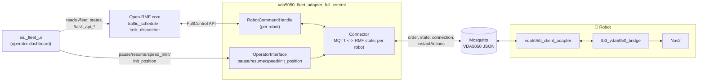
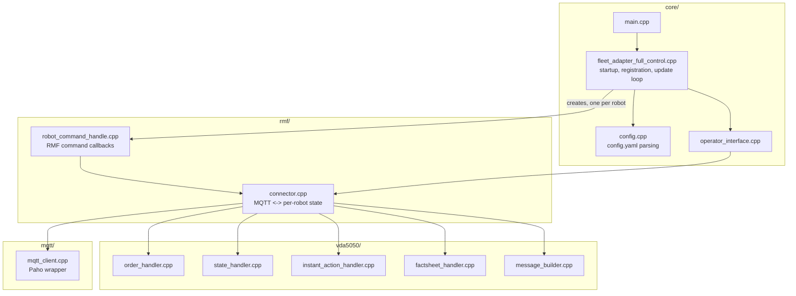
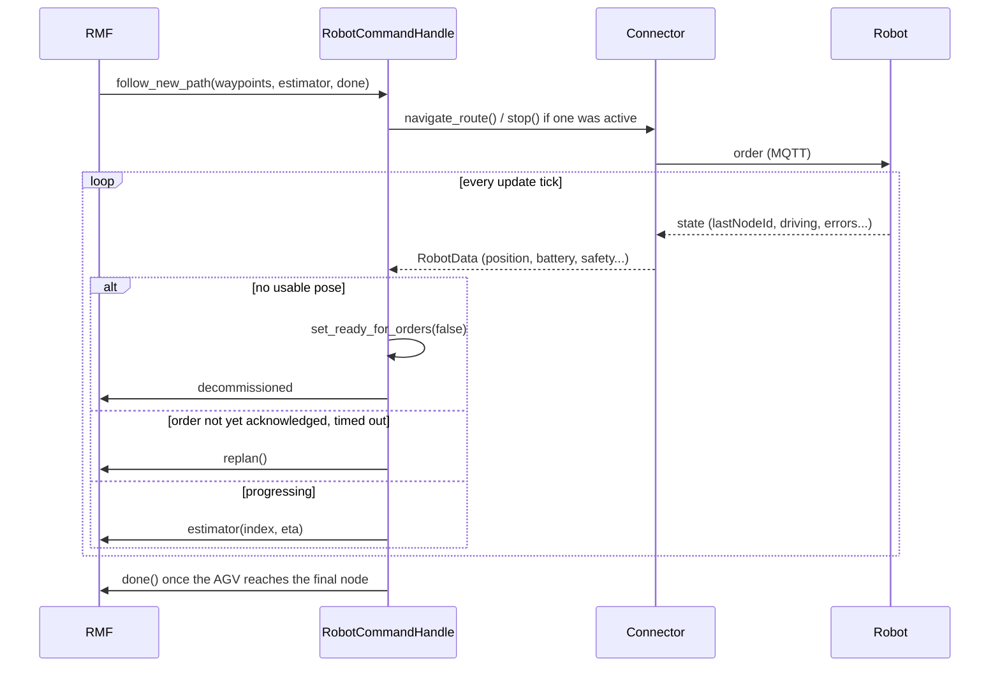

# vda5050_fleet_adapter_full_control — Architecture

Bridges Open-RMF to a VDA5050 fleet over MQTT. RMF sees a normal fleet
adapter (`RobotCommandHandle`, `RobotUpdateHandle`); the robots see a
normal VDA5050 master controller.

## Features

| Area | What it does |
|---|---|
| Multi-robot fleet | One process per fleet, one `Connector` state slot + one `RobotCommandHandle` per robot; rejects a duplicate manufacturer/serial pair at startup |
| Task execution | `follow_new_path` (patrol/delivery/go_to_place), `dock` (parking/charging spots), `PerformAction` (arbitrary instant actions) |
| Task capabilities | Advertised per fleet from config: patrol, delivery, clean, plus any named instant action (e.g. `dock`) |
| Commission tracking | A robot is only offered new tasks while its VDA5050 state is fresh *and* has a usable pose — either going stale decommissions it |
| Horizon release | Optional `honor_waypoint_timing`: releases route waypoints to the AGV only as their scheduled time approaches, instead of the whole order at once |
| Operator interface | ROS services/param/topic per robot: pause, resume, speed-limit override, re-localize (`init_position`) |
| Factsheet awareness | Reads the AGV's declared speed/array-length/order-interval limits and warns before exceeding them |
| Stuck-order detection | Replans if an AGV never acknowledges a dispatched order's `orderId` within a timeout |
| Config validation | Fails fast at startup on bad MQTT settings, duplicate identities, or a nav-graph robot missing from `vda5050.robots` |

## System architecture

RMF never talks MQTT and the robot never talks ROS — this process is the
only thing that understands both.

## Component view

## Key flows

### Order dispatch and progress tracking

### Commission state

A robot is only commissioned (eligible for new RMF tasks) while **both**
hold: its VDA5050 `state` arrived within `state_timeout_s`, and that state
carries a usable pose. Either one dropping decommissions it immediately;
both must return before it's offered work again.

## Configuration (`config.yaml`)

| Key | Default | Effect |
|---|---|---|
| `vda5050.interface_name` | — | VDA5050 topic prefix segment |
| `vda5050.mqtt.host/port/username/password` | `localhost:1883` | Broker connection |
| `vda5050.robots.<name>.manufacturer/serial` | — | Required per robot; missing entry fails startup |
| `vda5050.update_rate_hz` | 10 | RMF update-loop frequency |
| `vda5050.honor_waypoint_timing` | false | Horizon release paced by schedule instead of all-at-once |
| `vda5050.ui_websocket_uri` | — | Optional task-event broadcast to a UI |
| `account_for_battery_drain` | false | Off = report SoC 1.0 to RMF regardless of real battery |

## Process boundaries

| Boundary | Crossed by | Protocol |
|---|---|---|
| This adapter ↔ RMF core | `RobotCommandHandle` / `RobotUpdateHandle` (FullControl) | In-process RMF API |
| This adapter ↔ robot | `order`, `state`, `connection`, `instantActions`, `factsheet` | MQTT |
| This adapter ↔ eiu_fleet_ui | `<robot>/pause`, `<robot>/resume`, `speed_limit.<robot>`, `<robot>/init_position` | ROS 2, same domain |
| This adapter → eiu_fleet_ui | `task_state_update`, `task_log_update` | WebSocket, optional |
| Bridge ↔ Nav2 | `NavigateToPose`, `/odom` | ROS 2, on-robot |

Traffic negotiation and mutex-group locking (e.g. one-lane corridors) are
handled entirely by stock RMF (`rmf_traffic_schedule`,
`mutex_group_supervisor`) — this adapter just executes whatever route RMF
hands it.
