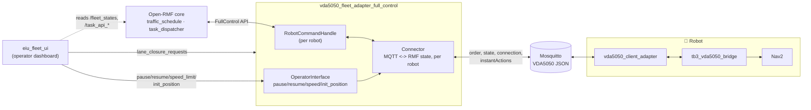
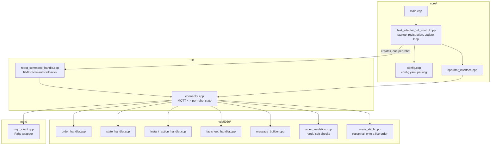
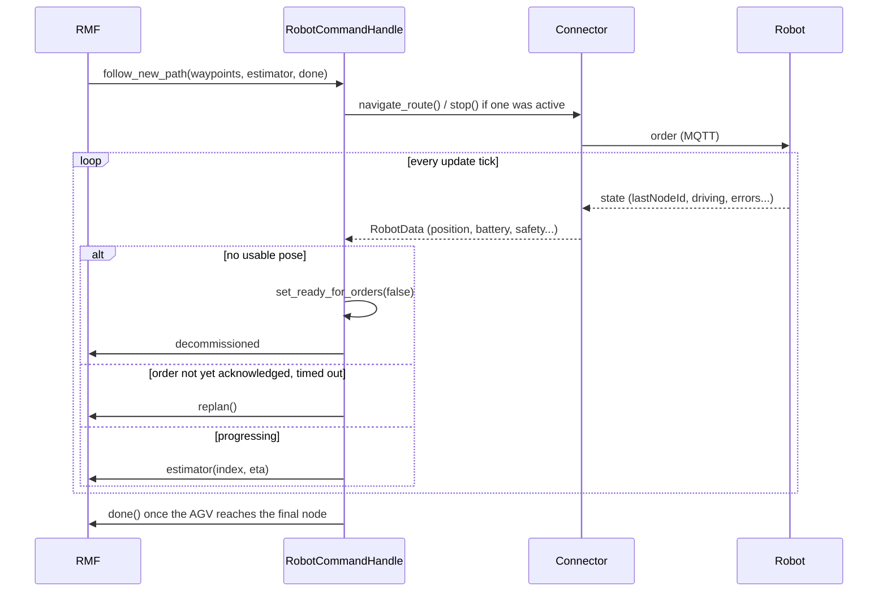
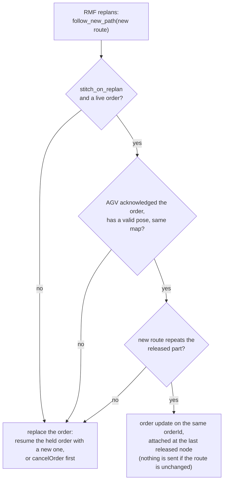

# vda5050_fleet_adapter_full_control — Architecture

Bridges Open-RMF to a VDA5050 fleet over MQTT. RMF sees a normal fleet
adapter (`RobotCommandHandle`, `RobotUpdateHandle`); the robots see a
normal VDA5050 master controller.

See [README.md § Features](../README.md#features) for the full features
list — kept in one place to avoid the two drifting apart.

## System architecture

RMF never talks MQTT and the robot never talks ROS — this process is the
only thing that understands both.

## Component view

## Key flows

### Order dispatch and progress tracking

### Replanning a live order

`Connector::replan_route` does the check with `plan_stitch`. The new route
matches when its start repeats the released nodes the AGV has not reached
yet; up to three leading points on the lane the AGV is on, repeated turns
in place, and released nodes the new route passes straight through are
tolerated. VDA5050 cannot withdraw released nodes, so a route that changes
that part is refused with a `not stitching (<reason>)` log line and the
order is replaced instead. Nothing more is released while the AGV is held
for the replan.

### Traffic hold

An RMF `stop` does not cancel the order: `startPause` is sent and a
10 s deadline starts. A new path before the deadline is stitched onto the
order or replaces it, followed by `stopPause`. Without one, `cancelOrder`
is sent and the AGV is unpaused, unless the operator paused it. A pause
from this hold does not decommission the robot.

### Factsheet and validation

The retained `factsheet` is parsed into `ParsedFactsheet`. When none
arrives, `Connector::poll` sends `factsheetRequest` (after 5 s, then every
20 s, up to 3 times). Before an order or instant action is published:

| Severity | Condition | Effect |
|---|---|---|
| Hard | a pose is not finite | order rejected |
| Hard | `mapId` is not among the maps the AGV reports | order rejected |
| Hard | more nodes or edges than `maxArrayLens` allows | order rejected |
| Hard | a custom action is missing from the factsheet | action not sent |
| Soft | order sent inside `minOrderInterval`; a core action (`cancelOrder`, `startPause`, `stopPause`, `stateRequest`, `initPosition`, `factsheetRequest`) missing from the factsheet | warning only |

`strict_validation: false` turns the hard rejections into warnings.

### Commission state

`RobotCommandHandle` commissions a robot only while it is fresh, has a
usable pose, and `RobotData::ready_for_orders` holds (operating mode,
safety state, FATAL errors, pause) — the conditions are listed under
Commission tracking in the [README](../README.md#features). Any of them
failing decommissions it immediately through `apply_commission()`; all must
hold again before it is offered work.

## Configuration (`config_tb3.yaml` / `config_amr.yaml`)

One `rmf_fleet:` block applies its `profile`/`limits` to every robot listed
under it, so each robot type gets its own config file and its own fleet
adapter process (`config_tb3.yaml` → `tb3_fleet`, `config_amr.yaml` →
`amr_fleet`) — see [README.md](../README.md#multiple-robot-types-heterogeneous-fleets).
The keys below apply to either file.

| Key | Default | Effect |
|---|---|---|
| `vda5050.interface_name` | — | VDA5050 topic prefix segment |
| `vda5050.mqtt.host/port/username/password` | `localhost:1883` | Broker connection |
| `vda5050.robots.<name>.manufacturer/serial` | — | Required per robot; missing entry fails startup |
| `vda5050.update_rate_hz` | 10 | RMF update-loop frequency |
| `vda5050.honor_waypoint_timing` | false | Horizon release paced by schedule instead of all-at-once |
| `vda5050.stitch_on_replan` | false | Attach a replanned route to the live order as an update instead of replacing the order |
| `vda5050.strict_validation` | true | Reject hard violations before publishing; off only warns |
| `vda5050.ui_websocket_uri` | — | Optional task-event broadcast to a UI |
| `account_for_battery_drain` | false | Off = report SoC 1.0 to RMF regardless of real battery |

## Process boundaries

| Boundary | Crossed by | Protocol |
|---|---|---|
| This adapter ↔ RMF core | `RobotCommandHandle` / `RobotUpdateHandle` (FullControl) | In-process RMF API |
| This adapter ↔ robot | `order`, `state`, `connection`, `instantActions`, `factsheet` | MQTT |
| This adapter ↔ eiu_fleet_ui | `<robot>/pause`, `<robot>/resume`, `speed_limit.<robot>`, `<robot>/init_position` | ROS 2, same domain |
| This adapter ← eiu_fleet_ui | `/lane_closure_requests` (fleet-wide, not per-robot) | ROS 2, same domain |
| This adapter → eiu_fleet_ui | `task_state_update`, `task_log_update` | WebSocket, optional |
| Bridge ↔ Nav2 | `NavigateToPose`, `/odom` | ROS 2, on-robot |

Traffic negotiation and mutex-group locking (e.g. one-lane corridors) are
handled entirely by stock RMF (`rmf_traffic_schedule`,
`mutex_group_supervisor`) — this adapter just executes whatever route RMF
hands it.
