# vda5050_fleet_adapter_full_control — Architecture

Bridges Open-RMF to a VDA5050 fleet over MQTT. RMF sees a normal fleet adapter (`RobotCommandHandle`, `RobotUpdateHandle`); the robots see a normal VDA5050 master controller.

The main features are listed in [README.md § Key features](../README.md#key-features); this document covers how they are built.

## System architecture

This section shows where the adapter sits in the whole system and which parts it talks to.

The system has five parts:
- Open-RMF plans routes, manages traffic and assigns tasks.
- This adapter turns RMF commands into VDA5050 orders and instant actions, and reports each robot's state back to RMF.
- An MQTT broker (Mosquitto) carries the VDA5050 messages.
- Each robot runs a VDA5050 client. On the TB3 robots this is `vda5050_client_adapter`, which drives Nav2 through `tb3_vda5050_bridge`; other vendors' AGVs bring their own client.
- The dashboard (`eiu_fleet_ui`) sends operator commands to RMF and the adapter, and reads robot state from the broker.

Stock RMF handles traffic negotiation and mutex-group locking, for example in one-lane corridors (`rmf_traffic_schedule`, `mutex_group_supervisor`). The adapter executes the routes RMF gives it.

Connections between the parts:

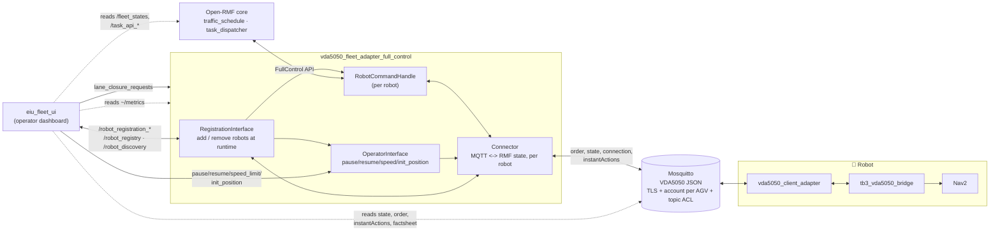

### Interfaces

The interfaces are the connections through which the adapter exchanges data with other processes. The adapter uses the RMF API inside its own process, MQTT to the AGVs, ROS 2 topics and services for the dashboard, the CLI tools and other fleet adapters, and an optional WebSocket for task events. The table lists them by the process on the other side, with the messages in each direction.

| Other side | Messages | Protocol |
|:---:|---|:---:|
| RMF core | `RobotCommandHandle` commands in, `RobotUpdateHandle` updates out (FullControl) | In-process RMF API |
| AGVs (via the broker) | `order`, `instantActions` out; `state`, `connection`, `factsheet`, `visualization` in | MQTT, TLS optional |
| `eiu_fleet_ui` | In: `<robot>/pause`, `<robot>/resume`, `speed_limit.<robot>`, `<robot>/init_position`, `/lane_closure_requests`. Out: `<robot>/init_position_result`, `~/metrics` | ROS 2 |
| `eiu_fleet_ui`, `register_robot.py` | `/robot_registration_requests` in; `/robot_registration_results`, `/robot_registry`, `/robot_discovery` out (JSON in `std_msgs/String`) | ROS 2 |
| Other fleet adapters | `/robot_registry` of each fleet, `/robot_discovery` | ROS 2 |
| `eiu_fleet_ui` (optional) | `task_state_update`, `task_log_update` from RMF's fleet adapter library | WebSocket |

The dashboard also reads the MQTT topics of every AGV directly. ROS 2 topics use the same `ROS_DOMAIN_ID` for all processes.

## Component view

The component view shows the source files of the adapter and which file uses which. The code has five layers:
- `core/` starts the adapter, reads the config, runs the update loop, and serves operator controls, robot registration and metrics.
- `rmf/` connects to RMF. `RobotCommandHandle` receives RMF commands for one robot; `Connector` keeps the VDA5050 state of every robot and sends their messages.
- `vda5050/` builds and reads VDA5050 messages: orders, instant actions, state, factsheet, validation and order stitching.
- `mqtt/` wraps the Paho MQTT client.
- `util/` holds small helpers: the loop timer, the log limiter and the metrics counters.

An arrow points from a file to a file it uses.

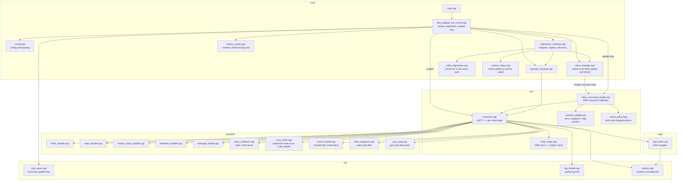

`config.cpp` fills header-only settings structs: `LinkPolicy` (offline, stuck-order and factsheet timeouts), `RoutePolicy` (route-following distances and times) and `Transform` in `rmf/`, `CancelPolicy` in `vda5050/`, and `MqttOptions` in `mqtt/`. `RobotManager` passes the same policies to every robot, whether it comes from the config or is added at runtime. The adapter reads the `rmf_fleet:` block of the config with RMF's parser `FleetConfiguration::from_config_files` and creates the fleet with `Adapter::add_fleet` (classic full control).

## Key flows

The key flows show, step by step, how the adapter handles its main situations:
- [Order dispatch and progress tracking](#order-dispatch-and-progress-tracking): sending an RMF route to the AGV and reporting progress.
- [Order update after a replan](#order-update-after-a-replan): updating the active order when RMF changes the route.
- [Replacing the active order](#replacing-the-active-order): cancelling the active order before a new one is sent.
- [Traffic hold](#traffic-hold): pausing the AGV when RMF asks it to stop.
- [Factsheet and validation](#factsheet-and-validation): checking orders and actions against the AGV's factsheet.
- [Adding a robot at runtime](#adding-a-robot-at-runtime): registering a new robot while the adapter runs.
- [Commission state](#commission-state): deciding whether RMF may give the robot tasks, and reporting AGV errors.
- [Charging](#charging-charge_at_chargers): starting and stopping charging at a charger.
- [Node actions](#node-actions-pick-and-drop) and [Levels and maps](#levels-and-maps): parts prepared for pick and drop and for several floors.

### Order dispatch and progress tracking

This flow is the main job of the adapter. RMF gives a robot a path; the adapter sends it to the AGV as one VDA5050 order, follows the AGV's progress in its state messages, and reports the progress and the arrival back to RMF. If the AGV refuses the order or does not acknowledge it in time, the adapter asks RMF for a new plan.

Steps:
1. RMF calls `follow_new_path` with the path. If an order is active, the adapter updates it or replaces it (see the next two sections).
2. The adapter sends the path as one order. With `honor_waypoint_timing`, it releases the nodes step by step, following RMF's schedule.
3. The AGV acknowledges the order in its state (`orderId` and `orderUpdateId`). Without an acknowledgement, the adapter sends the order again unchanged every `order_ack_timeout_s`, up to `order_resend_attempts` times.
4. On each pass of the update loop, the adapter reports the position and the remaining time to RMF.
5. When the AGV reaches the final node and its node actions have ended, the adapter tells RMF that the path is finished.

If the AGV refuses the order, the adapter raises the RMF issue `vda5050_order_refused` and asks RMF for a new plan. If the order is still unacknowledged after `order_stuck_timeout_s`, the adapter also asks RMF for a new plan.

Sequence:

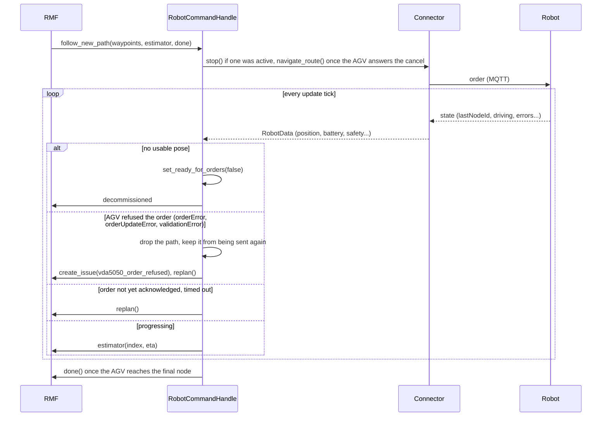

### Order update after a replan

RMF replans a robot's route while the robot drives, for example to resolve a traffic conflict or after a lane closes, and calls `follow_new_path` with the new route. With `stitch_on_replan`, the adapter sends the new route as an order update: same `orderId`, next `orderUpdateId`. The AGV continues without stopping. When an update is not possible, the adapter replaces the order (see [Replacing the active order](#replacing-the-active-order)).

Decision:

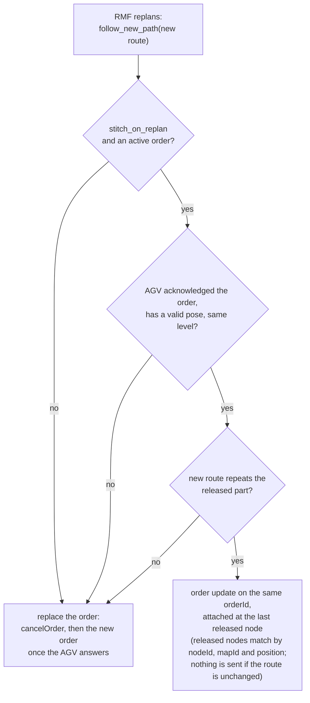

Rules (`Connector::replan_route` with `plan_stitch`):
- The new route is sent as an order update when it starts with the released nodes the AGV has not reached yet.
- Allowed differences: up to three leading points on the AGV's current lane, a different number of turns in place, and released nodes the new route passes straight through.
- Any other change to the released nodes replaces the order, and the log shows `not stitching (<reason>)`. VDA5050 does not allow an order update to change released nodes.
- No further nodes are released while the AGV is held for the replan.

### Replacing the active order

The adapter replaces the active order when a new path from RMF cannot be sent as an order update, for example when the route changes released nodes, the level changes, or `stitch_on_replan` is off. The adapter sends `cancelOrder` for the active order and keeps the new order pending. The new order goes out after the AGV answers the `cancelOrder`, because a VDA5050 AGV refuses a new order while another one runs. If the AGV does not answer within `cancel_attempts`, the adapter sends the new order anyway.

Sequence:

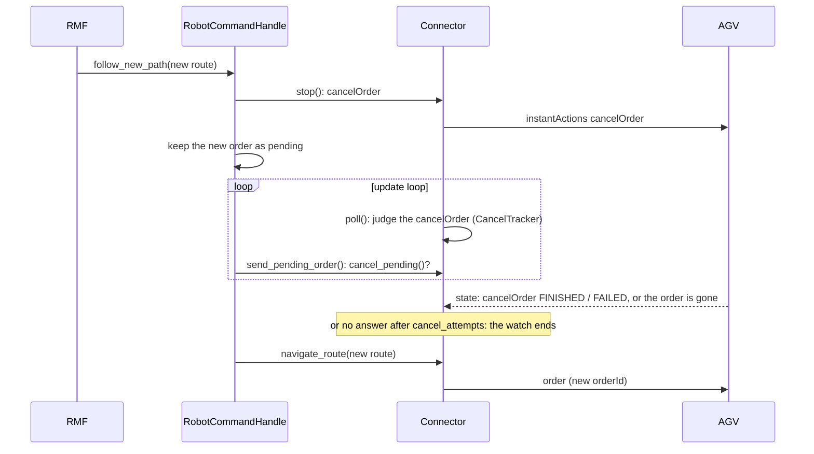

Events while the new order waits:

| Event | Effect |
|:---:|---|
| Another `follow_new_path` | Replaces the waiting order; no second `cancelOrder` |
| `stop()` | Drops the waiting order |
| `dock()`, `retire()` | Drop the waiting order |
| Traffic hold deadline | Does not expire while an order waits |
| `cancel_confirm_timeout_s: 0` | No waiting: the new order follows the `cancelOrder` at once |

### Traffic hold

RMF calls `stop` when a robot must wait for traffic. The adapter pauses the AGV with `startPause` instead of cancelling the order, so the AGV can continue the same order when the new path arrives. The pause is sent only while `Connector::order_in_progress` reports an order that may still run on the AGV: sent, and not reported finished at its final node. Otherwise `stop` sends nothing.

Steps:
1. `stop`: the adapter sends `startPause` and starts a deadline of `traffic_pause_timeout_s` (10 s).
2. A new path before the deadline: the adapter sends it as an order update, or replaces the order, and then sends `stopPause`.
3. No new path before the deadline: the adapter sends `cancelOrder` and unpauses the AGV.

Hold states:

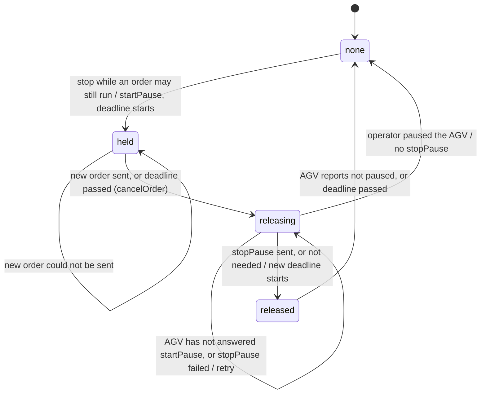

Rules:
- A repeated `stop` keeps the first deadline.
- The deadline does not end the hold while a new order waits for the AGV to answer a `cancelOrder`.
- An operator pause outlasts the hold. An operator resume during the hold leaves the AGV paused until the new path arrives.
- A pause from the hold does not decommission the robot.
- For a robot without a valid pose, the deadline is still checked, but no order goes out. A new path for such a robot cancels the order it replaces, and RMF is asked to replan after `order_stuck_timeout_s`.

### Factsheet and validation

The factsheet is the AGV's own description of its capabilities, published as a retained message on the `factsheet` topic. The adapter reads it into `ParsedFactsheet` and uses it to send only what the AGV supports.

Fields the adapter uses:

| Factsheet field | Used for |
|:---:|---|
| `protocolFeatures.agvActions` | The blocking type of each action and the actions the AGV accepts. An action declared only for the `NODE` or `EDGE` scope is still sent as an instant action, with a warning |
| `protocolLimits.maxArrayLens` | The largest number of nodes and edges in one order |
| `protocolLimits.timing.minOrderInterval` | The shortest time between two orders |
| `protocolLimits.timing.defaultStateInterval` | The offline limit (see `offline_state_intervals`) |
| `typeSpecification`, `physicalParameters` | The type, speed and size checks when a robot is added at runtime |

When no retained factsheet arrives, `Connector::poll` sends `factsheetRequest` after `factsheet_first_wait_s` (5 s), then every `factsheet_retry_wait_s` (20 s), up to `factsheet_request_attempts` (3) times. Without a factsheet, the adapter uses `HARD` as the blocking type and skips the factsheet checks; the pose and map checks still run.

Every order and instant action is checked before it is published:

| Severity | Condition | Effect |
|:---:|---|:---:|
| Hard | a pose is not finite | order rejected |
| Hard | a node `mapId` is not among the maps the AGV reports | order rejected |
| Hard | more nodes or edges than `maxArrayLens` allows | order rejected |
| Hard | a custom action is missing from the factsheet | action not sent |
| Soft | order sent inside `minOrderInterval`; a core action (`cancelOrder`, `startPause`, `stopPause`, `stateRequest`, `initPosition`, `factsheetRequest`) missing from the factsheet | warning only |

With `strict_validation: false`, hard violations are only logged as warnings.

Schema test: `test_vda5050_schemas` checks every message kind the adapter publishes against the official VDA5050 2.1 JSON schemas in `test/schemas/vda5050_2.1`. The published 2.1.0 `factsheet.schema` puts the `blockingTypes` enum on the array instead of its items, so no array matches it; `validate_schemas.py` corrects this one point before validating.

### Adding a robot at runtime

A robot that is not in any fleet config can join a running fleet. The adapter finds robots on the broker that no fleet lists and reports them. An operator then adds a robot from the dashboard or the CLI. The adapter checks the request, adds the robot to the fleet and saves it for the next start. No restart is needed.

Steps:
1. Discovery: the adapter subscribes to `<interface>/v2/+/+/connection`. A robot that is online and in no fleet's registry is published on `/robot_discovery`.
2. Checks: `validate_new_robot()` compares the request with the fleet's robots, the nav graph and what the broker shows about the robot (pose, factsheet). The dashboard runs the checks as a dry run while the form is filled in.
3. Registration: `RobotManager` adds the robot to the `Connector` and creates its `RobotCommandHandle`. The robot is saved to `<config>.runtime_robots.yaml`.
4. RMF: the update loop registers the robot with RMF once it reports a valid pose.

Sequence:

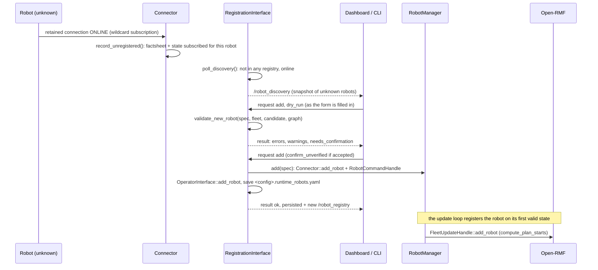

Rules:
- A check that cannot run, for example without a factsheet or when the robot was never seen, returns an `unverified` error. The request then needs `confirm_unverified`.
- Each adapter reads the registries of the other fleets (`/robot_registry`), so names, identities and chargers stay unique across fleets.
- `validate_new_robot()` uses no global state, so each check has a unit test without a broker or RMF. The check codes are defined in `src/core/robot_registration.cpp`.
- Removing a robot (`RobotManager::retire`) decommissions it and reserves its name, identity and charger until the adapter restarts. Registering the same robot again (`RobotManager::reinstate`) brings it back.

### Commission state

RMF gives tasks only to commissioned robots. `RobotCommandHandle` decides after each state whether the robot is commissioned, and applies a change at once through `apply_commission()`.

A robot is commissioned while all of these hold:
- Its VDA5050 state is fresh (see `state_timeout_s` and `offline_state_intervals`).
- It has a usable pose.
- Its operating mode is `AUTOMATIC` or `SEMIAUTOMATIC`.
- It reports no eStop, field violation or FATAL error.
- It is not paused by another party. A pause from its own traffic hold does not count; an operator pause does.

`RobotData::ready_for_orders` holds the AGV conditions. When one condition fails, the robot is decommissioned and the reason is logged.

AGV errors: each error in `state.errors` with level `WARNING` or `FATAL` opens one RMF issue in category `vda5050_agv_error`, with tier `Warning` or `Error` and the fields `error_type`, `error_level` and `description`. `report_agv_errors()` keeps one issue per level and `errorType`, and resolves it when the AGV no longer reports that error. RMF sends open issues with the fleet state to its API server.

### Charging (`charge_at_chargers`)

Charging is a demo, tested with simulated AGVs only. With `charge_at_chargers: true`, the adapter starts charging when a path ends at a charger waypoint of the nav graph, and stops charging before the next order.

Steps:
1. The AGV finishes an order at a charger waypoint.
2. The adapter sends `startCharging` and reports the path as finished to RMF.
3. The AGV reports `batteryState.charging = true`.
4. On the next path, the adapter sends `stopCharging` while the AGV reports charging, and keeps the new order pending.
5. The new order goes out once `stopCharging` has ended or the AGV no longer reports charging.

The AGV must declare `startCharging` and `stopCharging` in its factsheet; otherwise `strict_validation` blocks both actions. 
Sequence, with `vda5050_client_adapter` and `tb3_vda5050_bridge` on the robot:

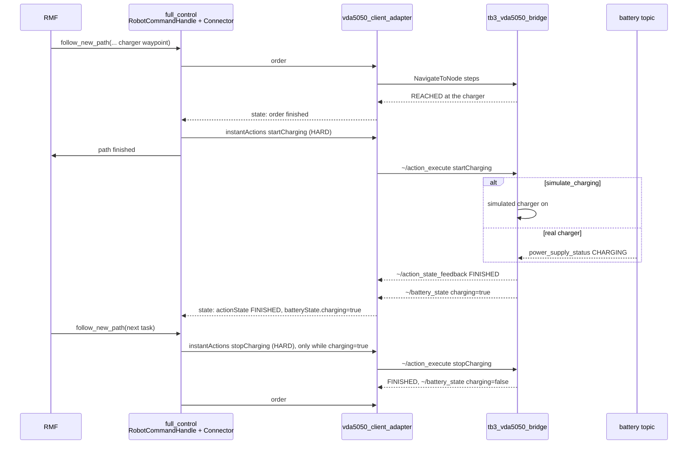

### Node actions (pick and drop)

Node actions are VDA5050 actions that the AGV runs when it reaches a node, for example `pick` and `drop`. The adapter can send and track them. RMF does not provide them yet, so the part that creates them from RMF tasks is still missing.

Current state:
- `Connector::RoutePoint::actions` holds actions built with `vda5050::make_action()`. They are sent in the `actions` array of the point's order node.
- The order counts as finished only after the AGV reports every node action as `FINISHED` or `FAILED` (`is_command_completed()`).
- `test_third_party_agv` runs a pick and a drop this way on a third-party AGV.

Parts required for pick and drop (not implemented):

| Part | Where |
|:---:|---|
| Actions per station (waypoint name → action type and parameters) | config, next to `dock_actions` in `ActionPolicy` |
| Adding a station's actions to its route point | `VdaRobotCommandHandle::follow_new_path()` |
| Serving RMF's dispenser and ingestor requests for this fleet's robots | a new component beside `OperatorInterface` |
| `loads` of the AGV state | `vda5050::ParsedState`, `RobotData` |

### Levels and maps

A building with several floors has one RMF level per floor. RMF names a map by the level name of the nav graph; VDA5050 names it by `mapId`. The adapter keeps the two apart so that it can serve several floors later. The current configuration has one level, `tb3_world`.

Each robot has a `LevelMaps` table ([level_maps.hpp](../include/vda5050_fleet_adapter_full_control/rmf/level_maps.hpp)) that maps a level to a `mapId` and a coordinate transform. `Connector` applies the table at its boundary: its public functions take RMF levels, and the VDA5050 messages it sends and reads carry `mapId`s. A level missing from the table keeps its name as `mapId` and uses the robot's `transform`. The current configuration has no table entries.

Data flow of levels and map IDs:

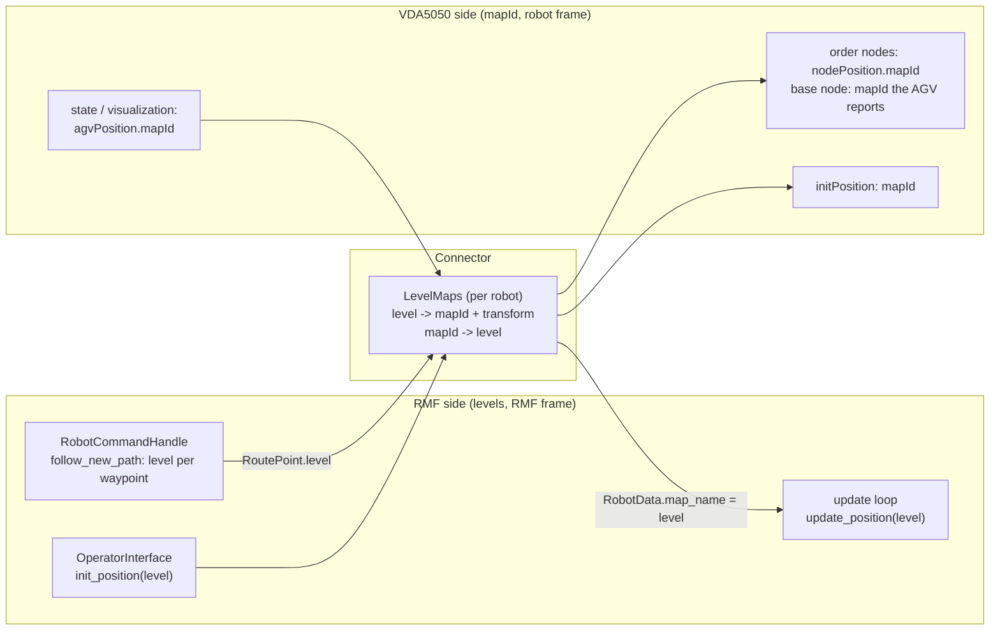

How each part handles levels:

| Where | Behavior |
|:---:|---|
| Order nodes | Each node carries the `mapId` and frame of its own level; the base node carries the `mapId` the AGV reports |
| Order validation | Every node `mapId` must be among the maps the AGV reports |
| Order updates | A released node matches only on the same map; a new path on another level is sent as a new order |
| AGV state | The reported `mapId` becomes its RMF level, and the pose uses that level's frame |
| `initPosition` | `mapId` and frame of the level given |
| Path across levels | Sent as one order, with a warning at each level change |

Parts required for a building with lifts (not implemented):

| Part | Where |
|:---:|---|
| Level list per robot (`mapId` + transform per level) | config → `RobotSpec` → `LevelMaps` in `RobotManager::add()` |
| Map switch after a lift ride: `initPosition` with the new `mapId` and the lift node, or the AGV's own map action, before the first order on the new level | `VdaRobotCommandHandle::follow_new_path()` |
| Registration checks (`map_unknown`, `off_graph`) through `LevelMaps` | `robot_registration.cpp` |
| Lift session | RMF drives the lift through the Lift API (`/lift_requests`, `/lift_states`) and gives the adapter the paths before and after the ride; the `rmf_fleet` lift emergency levels are already applied |

## Runtime behaviour

This section covers what the adapter does all the time, outside any single flow: the update loop, the handling of incoming messages, metrics and security. Message routing is in `Connector::handle_message`, state freshness in `vda5050::StateSequence`, and cancel confirmation in `vda5050::CancelTracker`.

### Update loop

The update loop keeps RMF in step with the robots. It reads the latest VDA5050 state of each robot and passes it to RMF: position, availability and progress.

The loop runs at `update_rate_hz`. `util::LoopPacer` starts each pass at a fixed time. A slow pass skips the slots it missed, and a throttled warning logs the pass time and the overrun count.

One pass of the loop, for each robot that is not removed:

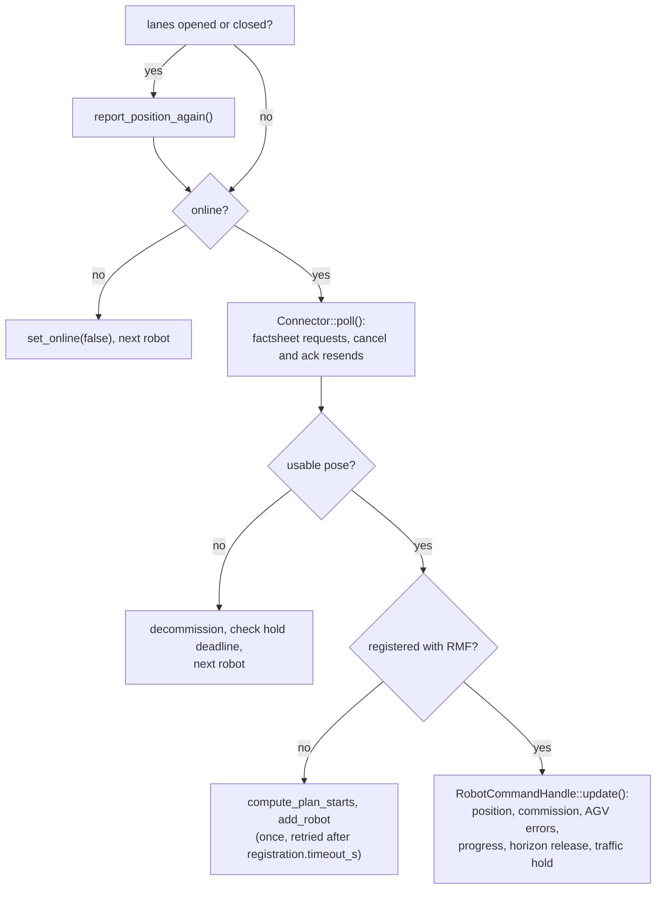

### Inbound messages

Messages from the AGVs can be too large, malformed, out of order or from unknown robots. The adapter checks every message first, so that only valid and current data reaches the robot state.

Checks, in order:

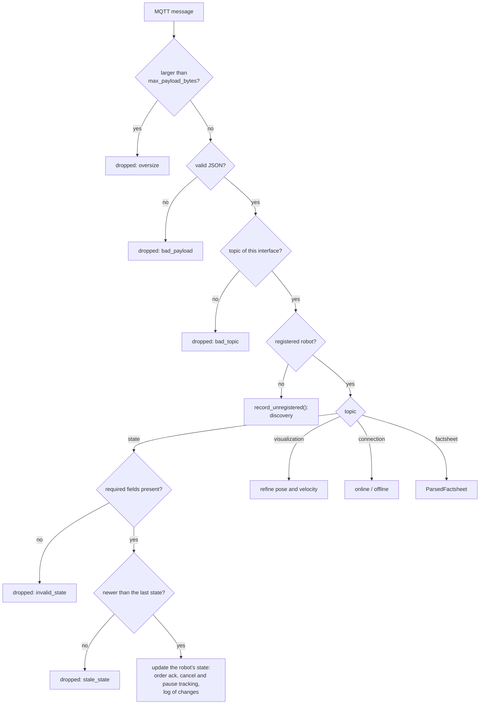

Details:
- `MqttClient` drops a payload above `vda5050.mqtt.max_payload_bytes` without parsing it.
- `vda5050::json_read` reads a field of the wrong JSON type as absent, drops array entries that are not objects, and ignores IDs outside 0–4294967295.
- `vda5050::StateSequence` drops a state whose `headerId` and `timestamp` are not newer than the last one. A `connection` `ONLINE`, or `stale_state_streak` drops in a row, starts a new sequence.
- A repeating problem is logged at most once per 30 s per source (`util::LogThrottle`) and counted in the metrics.

### Metrics

The metrics report shows the health of the message path: how many messages arrive, how many are dropped, and how long their handling takes. It helps find a lost broker, a noisy robot or a slow update loop without reading the logs.

`Connector::metrics()` counts and times the messages, and the update loop adds its pass times. Every `vda5050.metrics_period_s` (60 s), `core::MetricsReporter` publishes the report as JSON on `~/metrics` and logs a one-line summary starting with `[metrics]`. The System view of `eiu_fleet_ui` charts the report and lists its problems under Needs Attention.

Data flow:

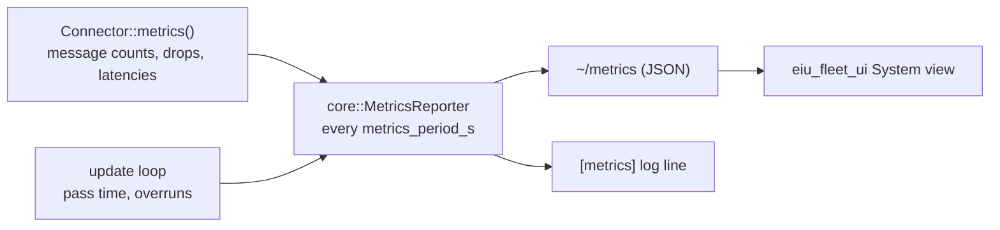

Report fields:

| Report field | Meaning | What to watch |
|:---:|---|---|
| `fleet`, `uptime_s`, `interval_s` | Fleet name, time since start, time covered by this report | |
| `robots.online` / `registered` | Robots connected with a state within the offline limit, and all registered robots | Fewer online than registered |
| `robots.state_age_max_s`, `oldest_state_robot`, `state_timeout_s` | Age of the oldest last state, the robot that sent it, and the offline limit | Age close to the limit |
| `rx.*` | Messages from registered robots, by topic; `rx.unregistered` counts messages from robots of other fleets | No `state` messages from a robot that should send them |
| `dropped.*` | Dropped messages: `bad_payload`, `bad_topic`, `invalid_state`, `stale_state`, `oversize` | Any value above zero |
| `log_suppressed` | Log lines held back by the repeat limit | A large count, usually from one noisy source |
| `published.failed` | Publishes that Paho refused because it was not connected | Any value above zero |
| `mqtt.connections_lost`, `errors` | Lost connections and reported MQTT errors, including oversize drops | A growing count |
| `latency_us.handle_state` / `handle_other` | Time to handle one message | A p99 much higher than usual |
| `latency_us.mutex_wait` | Time spent waiting for `_mutex` | A p99 of several hundred microseconds or more |
| `state_transit_us` | Age of a state when it is handled; needs synchronized clocks | Values that grow from one report to the next: messages are queueing |
| `update_loop.pass_us`, `overruns`, `period_ms` | Duration of one update pass, passes longer than their slot, and the slot length | A p99 close to `period_ms`; any overrun |

### Transport security

Transport security protects the MQTT connection between the adapter and the broker against eavesdropping and unauthorised clients. It covers two sides: the adapter's connection settings, and the broker setup in `fleet_bringup/broker`.

Connections:

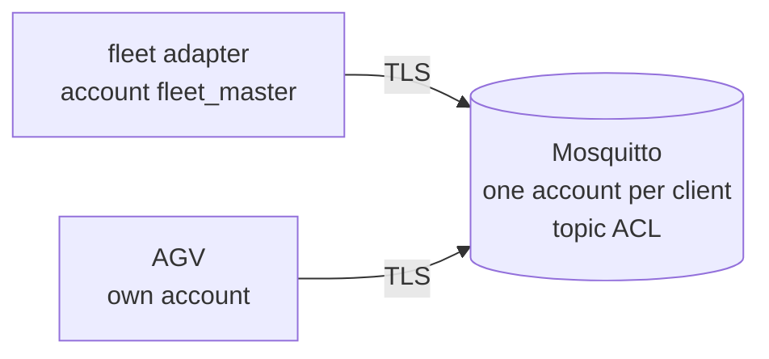

Adapter side (`vda5050.mqtt`):
- `tls.enabled` switches the connection to TLS (`ssl://`, default port 8883).
- `tls.ca_file` names the CA that signs the broker's certificate; `tls.verify_hostname` checks the broker's host name.
- `tls.client_cert` and `tls.client_key` provide a client certificate when the broker asks for one.
- A `${VARIABLE}` in `username` or `password` is read from the environment, so the config file holds no password.
- Credentials without TLS log a warning, because they would travel in clear text.

Broker side:
- `fleet_bringup/broker/setup_broker.py` creates the certificates, one account per AGV and per fleet adapter, and a topic ACL.
- With this ACL, an AGV can publish only its own `state`, `connection`, `factsheet` and `visualization`, and read only its own `order` and `instantActions`.
- The `MqttTls.*` test checks this setup.
