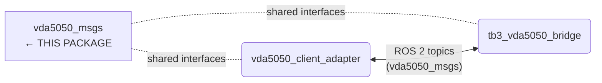

# vda5050_msgs

Shared ROS 2 message definitions for the VDA5050 v2.1.0 protocol. Used by both `vda5050_client_adapter` (northbound) and `tb3_vda5050_bridge` (southbound) to pass VDA5050 data structures over ROS 2 topics without JSON serialization.

## Overview

This package contains no nodes — it is a pure message library. All VDA5050 data structures that need to cross a ROS 2 topic boundary are defined here as `.msg` files. Both the adapter and the bridge depend on this package, so the message format is the contract between them.

## System Context



## Message Definitions

| Message | VDA5050 Object | Description |
|---|---|---|
| `Action` | Action | Action with id, type, parameters, and blocking type |
| `ActionParameter` | ActionParameter | Key/value parameter for an action |
| `ActionState` | ActionState | Action lifecycle status (WAITING / INITIALIZING / RUNNING / PAUSED / FINISHED / FAILED) |
| `AgvPosition` | AGVPosition | Robot pose (x, y, theta, map frame, `position_initialized` flag) |
| `BatteryState` | BatteryState | Battery charge (0–100 %), charging flag |
| `BoundingBoxReference` | BoundingBoxReference | Load bounding box reference point |
| `ControlPoint` | ControlPoint | Trajectory control point for curved edges |
| `Edge` | Edge | Route graph edge with actions and trajectory |
| `EdgeState` | EdgeState | Edge traversal state |
| `Error` | Error | Error with type, description, level, and references |
| `ErrorReference` | ErrorReference | Reference element for error context |
| `Factsheet` | Factsheet | AGV technical specification |
| `Header` | Header | VDA5050 message header (headerId, timestamp, version, manufacturer, serialNumber) |
| `Info` | Info | Informational message |
| `Load` | Load | Load currently carried by the AGV |
| `LoadDimensions` | LoadDimensions | Load physical dimensions |
| `Node` | Node | Route graph node with position and actions |
| `NodePosition` | NodePosition | Node x/y/theta coordinates and map frame |
| `NodeState` | NodeState | Node traversal state |
| `Order` | Order | Navigation order: orderId, updateId, nodes, edges |
| `SafetyState` | SafetyState | E-stop and field violation status |
| `Trajectory` | Trajectory | Trajectory definition with degree and control points |
| `TypeSpecification` | TypeSpecification | AGV kinematic class, load capacity, navigation types |
| `Velocity` | Velocity | Linear and angular velocity |

## Build

This package must be built before `vda5050_client_adapter` and `tb3_vda5050_bridge`:

```bash
colcon build --packages-select vda5050_msgs
source install/setup.bash
```

## Related

- [Root README — system overview](../README.md)
- [VDA5050 Client Adapter](../vda5050_client_adapter/README.md)
- [TB3 VDA5050 Bridge](../tb3_vda5050_bridge/README.md)
