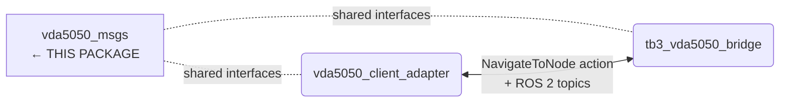

# vda5050_msgs

Shared ROS 2 message and action definitions for the VDA5050 v2.1.0 protocol. Used by both `vda5050_client_adapter` (northbound) and `tb3_vda5050_bridge` (southbound) to pass VDA5050 data structures over ROS 2 without JSON serialization.

## Overview

This package contains no nodes — it is a pure interface library. All VDA5050 data structures that need to cross a ROS 2 boundary are defined here as `.msg` files, plus the adapter ↔ driver interface (`NavigateToNode` action, `DriverStatus`, `ActionCommand`). Both the adapter and the bridge depend on this package, so it is the contract between them: deploy both from the same version.

## System Context


```mermaid
flowchart LR
    ca("vda5050_client_adapter")
    br("tb3_vda5050_bridge")
    msgs["vda5050_msgs\n← THIS PACKAGE"]

    msgs -.-|"shared interfaces"| ca
    msgs -.-|"shared interfaces"| br
    ca <-->|"NavigateToNode action\n+ ROS 2 topics"| br
```

## Message Definitions

31 messages and 1 action (see `CMakeLists.txt` for the authoritative list). Note:
`factsheet` is not one of the six VDA5050 messages that crosses a ROS 2 topic
boundary in this stack — it's built directly from ROS params and serialized
straight to MQTT JSON (`factsheet_handler.cpp`), so there's no `Factsheet.msg`.

### Top-level protocol messages

| Message | VDA5050 topic | Description |
|:---:|:---:|---|
| `Order` | order | Navigation order: orderId, updateId, nodes, edges |
| `InstantActions` | instantActions | Header + a set of actions to execute immediately |
| `State` | state | Full robot state: order/action progress, position, velocity, battery, safety, errors, operating mode, loads, maps |
| `Visualization` | visualization | Lightweight, high-frequency position + velocity for live tracking |
| `Connection` | connection | `connection_state`: ONLINE / OFFLINE / CONNECTIONBROKEN (LWT) |

### Adapter ↔ driver interface

| Interface | Description |
|:---:|---|
| `action/NavigateToNode` | One route step. Goal: `order_id`, `order_update_id`, `node`, `incoming_edge` (+ `incoming_edge_set`). Feedback: `edge_entered`. Result: `outcome` (`REACHED` / `FAILED` / `DROPPED` / `CANCELED` / `PREEMPTED`), `description`, `distance_driven`; `REACHED` only with result code `SUCCEEDED` |
| `DriverStatus` | `session_id` (new per driver process) and `driving`; latched |
| `ActionCommand` | `PAUSE` / `RESUME` / `CANCEL` of one running action (`action_id`) |

### Supporting / nested types

| Message | Description |
|:---:|---|
| `Action` | Action with id, type, parameters, and blocking type |
| `ActionParameter` | Key/value parameter for an action |
| `ActionState` | Action lifecycle status (WAITING / INITIALIZING / RUNNING / PAUSED / FINISHED / FAILED) |
| `AgvPosition` | Robot pose (x, y, theta, map frame, `position_initialized` flag) |
| `BatteryState` | Battery charge (0–100 %), charging flag |
| `BoundingBoxReference` | Load bounding box reference point |
| `ControlPoint` | Trajectory control point for curved edges |
| `Corridor` | Allowed deviation corridor around an edge (left/right width, reference point) |
| `Edge` | Route graph edge with actions and trajectory |
| `EdgeState` | Edge traversal state |
| `Error` | Error with type, description, level, and references |
| `ErrorReference` | Reference element for error context |
| `Header` | VDA5050 message header (headerId, timestamp, version, manufacturer, serialNumber) |
| `Info` | Informational message |
| `InfoReference` | Reference element for an `Info` entry |
| `Load` | Load currently carried by the AGV |
| `LoadDimensions` | Load physical dimensions |
| `MapInfo` | Map identity/version/status the AGV is currently using |
| `Node` | Route graph node with position and actions |
| `NodePosition` | Node x/y/theta coordinates and map frame |
| `NodeState` | Node traversal state |
| `SafetyState` | E-stop and field violation status |
| `Trajectory` | Trajectory definition with degree and control points |
| `Velocity` | Linear and angular velocity |

## Build

This package must be built before `vda5050_client_adapter` and `tb3_vda5050_bridge`:

```bash
colcon build --packages-select vda5050_msgs
source install/setup.bash
```

## Related

- [Root README — system overview](../README.md)
- [VDA5050 Client Adapter](../vda5050_client_adapter/README.md)
- [TB3 VDA5050 Bridge](../tb3_vda5050_bridge/README.md)
